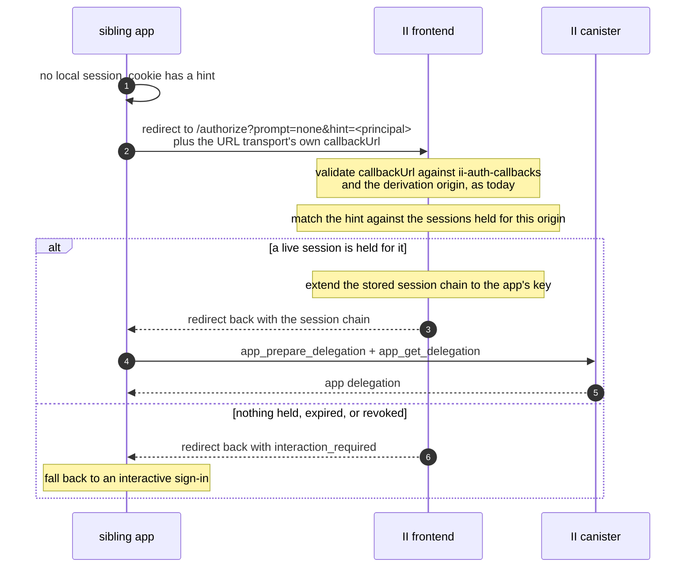

# Silent re-auth over the redirect transport — specification

**Authors:** sea-snake — **Date:** Aug 20, 2026

**Target audience:** implementers, and agents generating code from this document

**Design:** [silent-reauth-redirect.md](silent-reauth-redirect.md) covers what this builds and why. This document assumes it and does not repeat it.

**Depends on:** [revocable-app-sessions-spec.md](revocable-app-sessions-spec.md) for the session, its chain, and the caller-info bundle.

## The flow



The II frontend does not mint the app delegation here. It hands back the session chain and the app mints its own, exactly as on a first sign-in, so there is one path for that and not two.

### What actually reaches II, and what does not

Worth being exact, because two of these look like II parameters and are not.

| Value                   | Where it lives                                                                                                        | Does II see it                                                                                                               |
| ----------------------- | --------------------------------------------------------------------------------------------------------------------- | ---------------------------------------------------------------------------------------------------------------------------- |
| `prompt=none`           | Query param on the authorize URL, set by the client as an II extension                                                | Yes, below                                                                                                                   |
| `hint=<principal text>` | Query param on the authorize URL, likewise                                                                            | Yes, below                                                                                                                   |
| `callbackUrl`           | The ICRC-167 URL transport's own return address: a full, query-less URL of the form `https://chat.example.com/reauth` | Yes, and it is validated against that origin's `ii-auth-callbacks`. Unchanged by this design                                 |
| `next=/some/path`       | A query param the app puts on **its own** `/reauth` URL                                                               | No. Never sent to II                                                                                                         |
| `returnTo`              | An `AuthClient` option, which `/reauth` sets from `next`                                                              | No. The client journals it so it survives the round trip, then does `location.replace(returnTo)` once the flow has completed |

So the return address II is given is a whole URL and an allow-listed one, not a path. Where the user lands _within_ the app afterwards is the app's business, handled entirely on its side, and II has no part in it. That separation is what keeps the callback allow-list meaningful: it enumerates a small fixed set of pages, and it would be worthless if II accepted an arbitrary path or URL alongside it.

---

## `prompt=none` rules

**Renders nothing, ever.** No consent screen, no account picker, no error page. Either the redirect carries a session chain or it carries `interaction_required`.

**Never creates a session.** A session comes only from `prepare_account_session`, which requires an anchor access method. `prompt=none` has no ceremony and therefore no access method, so it can only ever re-issue from a session that already exists. This is the same rule that stops a stolen session chain spawning siblings, and it is what keeps `prompt=none` from being a way to obtain authority rather than exercise it.

**Resolves only sessions belonging to the requesting origin.** The `hint` selects _among_ the sessions II holds for the origin being authorized. It never names an origin. Without this, any page could redirect to II with someone else's principal as the hint and collect a delegation.

This is the same shape as the caveat carried through from `read_certified_sso_bundle`: a value that resolves to something valid is not thereby a value that describes the caller, so the origin is checked separately rather than inferred. Here the origin comes from the authorize request, which the callback allowlist and `ii-alternative-origins` have already validated.

**No new consent.** Silently re-issuing to a sibling is inside consent already given: the user signed in for this derivation origin, and the siblings are the ones that origin's `ii-alternative-origins` authorizes. The set of apps that can be silently signed in is exactly the set the user's own domain declared.

---

## `hint` rules

`hint` is a principal: the one an app resolves to for the account behind a session. That is `Principal.selfAuthenticating(user_key)`, where `user_key` is what `app_prepare_delegation` hands the app, and it is the same value `prepare_account_session` returns as `account_principal`. That is how it reaches the cookie a sibling reads it from.

It exists because one origin can hold more than one session: the user has signed in there under more than one identity, or under more than one account of one identity. Without a hint II would have to guess, and guessing wrong signs the user in as the wrong persona.

**Matching happens in the frontend, against the principal stored with each session.** The keypairs the re-issue needs are the frontend's, so the candidates are the records it holds for the origin, and `prepare_account_session` returns `account_principal` for exactly this.

**A held record is not proof the session still exists.** Revoking from II settings or from another app deletes the canister record and leaves this browser's copy in place. Answering from the record alone would hand the app a chain that cannot mint, and the failure would surface at the app's first refresh as something the client cannot tell apart from a real error.

So the frontend checks first:

```candid
// Whether the calling session is still usable.
check_session : () -> (bool) query;
```

The call is signed by the session chain with the caller-info bundle attached, so it authenticates exactly as a refresh does and names no identity. A `false` answer discards the local record and denies with `interaction_required`.

It is a query, so a single node could forge the reply. That is acceptable here because the answer is advisory: every mint enforces the same conditions regardless, so a forged `true` costs one failed refresh and a forged `false` costs one unnecessary ceremony.

| Case                                                | Outcome                                                           |
| --------------------------------------------------- | ----------------------------------------------------------------- |
| Absent, exactly one session held for the origin     | Use it                                                            |
| Absent, several held                                | `interaction_required`. Picking for the user is worse than asking |
| Present, resolves to a session held for this origin | Use it                                                            |
| Present, resolves elsewhere or nowhere              | `interaction_required`                                            |

A hint is a preference, not a credential. It is safe for it to come from a cookie the app can read and write, because it can only select from what II already holds for that origin, and holding the session is what confers anything.

---

## Why siblings share one session

This falls out of the previous designs rather than needing anything:

- A shared `derivationOrigin` means every sibling derives the same principal, so they resolve to one **application** in the reference list.
- Sessions live on the account reference at `(anchor, application)`, so all siblings of one derivation origin share the same session records.
- The device id is per browser, so one browser has one session across the whole set.

So "sign in on one and the others are signed in" is not a copy between apps. There is one session and the siblings take turns re-issuing from it.

The same fact makes the client doc's other promise true. "Sign out of one and the others follow" holds because `app_revoke_session` removes the record they all share, not merely because the cookie was cleared. A sibling that ignored the cookie would still find nothing to re-issue from.

---

## Failure modes

| Situation                                                        | Outcome                                          |
| ---------------------------------------------------------------- | ------------------------------------------------ |
| No session held                                                  | `interaction_required`                           |
| Session expired, or revoked from another app or from II settings | `interaction_required`                           |
| Hint resolves to another origin's session                        | `interaction_required`                           |
| Several sessions and no hint                                     | `interaction_required`                           |
| Callback or derivation origin fails validation                   | The existing redirect-transport error, unchanged |

One outcome for every session-related case, so a client's fallback is a single branch. That is not to hide anything: the `prompt=none` rules above already bound what it can be used to learn, since it only ever answers for the requesting origin.

`prompt=login`, and an absent `prompt`, run the interactive flow exactly as today.

---

## Requirements

| #   | Requirement                                                                                                                                                                                                                              | Where               |
| --- | ---------------------------------------------------------------------------------------------------------------------------------------------------------------------------------------------------------------------------------------- | ------------------- |
| R1  | `prompt` and `hint` travel as authorize-URL parameters, not in the ICRC request, matching how the client already sends them                                                                                                              | Solution            |
| R1a | They are the only new values II receives. `next` and `returnTo` are app-side and never reach it, and the return address stays the URL transport's allow-listed `callbackUrl`                                                             | The flow            |
| R2  | `prompt=none` renders nothing and returns either a session chain or `interaction_required`                                                                                                                                               | `prompt=none` rules |
| R3  | `prompt=none` never creates a session, since it has no access method to authorize one                                                                                                                                                    | `prompt=none` rules |
| R4  | `hint` selects among the requesting origin's sessions and can never name another origin's                                                                                                                                                | `prompt=none` rules |
| R4a | The frontend matches a `hint` against the `account_principal` stored with each session, then confirms with `check_session` that the canister still holds it                                                                              | `hint` rules        |
| R5  | The II frontend returns the session chain and lets the app mint its own delegation, as on first sign-in                                                                                                                                  | The flow            |
| R6  | Several sessions with no hint is `interaction_required`, not a guess                                                                                                                                                                     | `hint` rules        |
| R7  | Every session-related failure is one JSON-RPC code, `interaction_required`. The payload carries a `reason` — `login_required` or `account_selection_required` — which a client may use to word its prompt but does not need to branch on | Failure modes       |
| R8  | The only canister change this design needs is `check_session`; the `account_principal` R4a matches on is specified in [revocable-app-sessions-spec.md](revocable-app-sessions-spec.md)                                                   | `hint` rules        |
