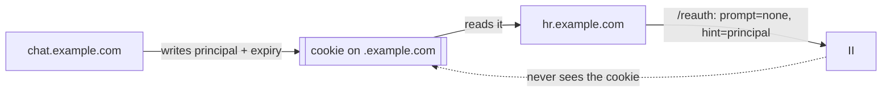
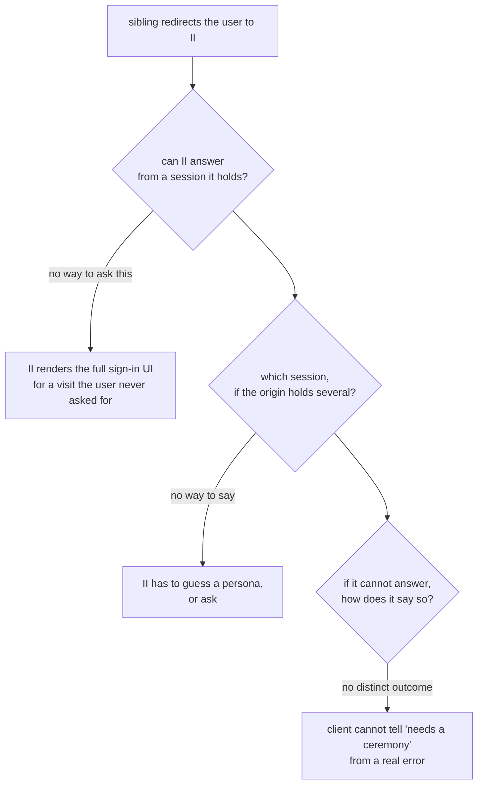
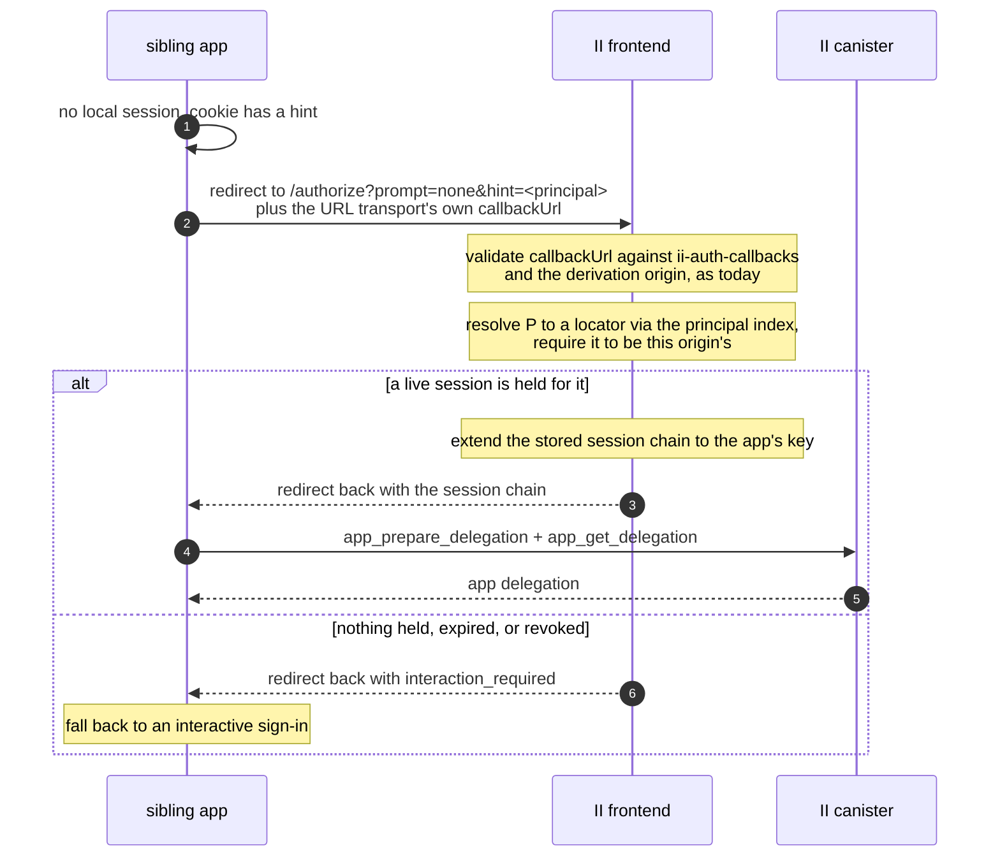

# Silent re-auth over the redirect transport

**Author:** sea-snake — **Date:** 2026-08-19 — **Status:** Draft, RFC for review. No code yet.

**Depends on:** `revocable-app-sessions.md` for the session this re-issues from, and through it `tracked-default-accounts.md` for the principal index.

## Context

Sibling subdomains of one domain should share a sign-in: sign in on `chat.example.com` and `hr.example.com` is signed in too; sign out of one and the others follow.

The client half of that already exists, specified in `@icp-sdk/auth` ([shared-sessions.md](https://github.com/dfinity/icp-js-auth/blob/5aa78d5f64714d6e8e7781e256562035c09018c6/docs/src/content/docs/shared-sessions.md)). It puts three pieces in place:

| Piece | Effect |
| ----- | ------ |
| A shared `derivationOrigin`, authorized by `ii-alternative-origins` | Every sibling resolves to the same principal |
| A cookie scoped to the parent domain, holding only a principal and an expiry — never key material | Siblings can see *that* a session exists |
| A `/reauth` page using `transport: 'redirect'`, `prompt: 'none'`, `hint: <principal from the cookie>` | Re-issues this app's own delegation, then returns the user to its own `?next=` |

The cookie is not II's mechanism and II never sees it. It is how the *siblings* discover that a session is worth asking for. All II sees is the `hint`.

## Problem

A sibling arriving at II has no local session, only a hint that one exists. For the flow to feel like a shared sign-in, II has to answer **without rendering anything** — no consent screen, no account picker, no spinner — because the user did not ask to visit II and should never see it.

II cannot do that today.

Three gaps: no way to be told "answer only if you already can", no way to be told which session to answer from, and no way to fail that a client can distinguish from a real error.

Answering silently also must not become a way to get something for free. A page that can send a user to II must not be able to collect a delegation for a session it does not own.

## Solution

Two new authorize-URL parameters and a path through the authorize flow that renders nothing.

| Item | Change |
| ---- | ------ |
| `prompt` | New. `none` answers from a held session or fails; `login` forces a ceremony; absent behaves as today |
| `hint` | New. A principal in text form, selecting which of the origin's sessions to re-issue from |
| A no-UI path through the authorize flow | Resolves the session, extends its chain, delivers the redirect response, renders nothing |
| `interaction_required` | A failure outcome distinguishable from every other, so the client falls back to a ceremony |

The safety property is that **a hint can only select, never confer.** It picks among the sessions II already holds for the origin being authorized, and holding the session is what grants anything — so a hint from a cookie an app can write is safe.

This design adds no canister change of its own. It is the II frontend using the methods `revocable-app-sessions.md` already specifies, plus one field from it: `prepare_account_session` returns `account_principal`, which is what a hint is matched against.

An earlier attempt at `prompt` and `hint` predates sessions and re-issued by extending a stored delegation chain offline, which nothing could revoke. This specifies them on top of sessions instead, so a silent re-issue is a canister-checked mint like any other.

---

## The flow

The II frontend does not mint the app delegation here. It hands back the session chain and the app mints its own, exactly as on a first sign-in, so there is one path for that and not two.

### 3.1 What actually reaches II, and what does not

Worth being exact, because two of these look like II parameters and are not.

| Value | Where it lives | Does II see it |
| ----- | -------------- | -------------- |
| `prompt=none` | Query param on the authorize URL, set by the client as an II extension | Yes, below |
| `hint=<principal text>` | Query param on the authorize URL, likewise | Yes, below |
| `callbackUrl` | The ICRC-167 URL transport's own return address: a full, query-less URL of the form `https://chat.example.com/reauth` | Yes, and it is validated against that origin's `ii-auth-callbacks`. Unchanged by this design |
| `next=/some/path` | A query param the app puts on **its own** `/reauth` URL | No. Never sent to II |
| `returnTo` | An `AuthClient` option, which `/reauth` sets from `next` | No. The client journals it so it survives the round trip, then does `location.replace(returnTo)` once the flow has completed |

So the return address II is given is a whole URL and an allow-listed one, not a path. Where the user lands *within* the app afterwards is the app's business, handled entirely on its side, and II has no part in it. That separation is what keeps the callback allow-list meaningful: it enumerates a small fixed set of pages, and it would be worthless if II accepted an arbitrary path or URL alongside it.

---

## `prompt=none` rules

**Renders nothing, ever.** No consent screen, no account picker, no error page. Either the redirect carries a session chain or it carries `interaction_required`.

**Never creates a session.** A session comes only from `prepare_account_session`, which requires an anchor access method. `prompt=none` has no ceremony and therefore no access method, so it can only ever re-issue from a session that already exists. This is the same rule that stops a stolen session chain spawning siblings, and it is what keeps `prompt=none` from being a way to obtain authority rather than exercise it.

**Resolves only sessions belonging to the requesting origin.** The `hint` selects *among* the sessions II holds for the origin being authorized. It never names an origin. Without this, any page could redirect to II with someone else's principal as the hint and collect a delegation.

This is the same shape as the caveat carried through from `read_certified_sso_bundle`: a value that resolves to something valid is not thereby a value that describes the caller, so the origin is checked separately rather than inferred. Here the origin comes from the authorize request, which the callback allowlist and `ii-alternative-origins` have already validated.

**No new consent.** Silently re-issuing to a sibling is inside consent already given: the user signed in for this derivation origin, and the siblings are the ones that origin's `ii-alternative-origins` authorizes. The set of apps that can be silently signed in is exactly the set the user's own domain declared.

---

## `hint` rules

`hint` is a principal: the one an app resolves to for the account behind a session, which is the same value `app_prepare_delegation` hands the app as `user_key`. That is how it reaches the cookie a sibling reads it from.

It exists because one origin can hold more than one session: the user has signed in there under more than one identity, or under more than one account of one identity. Without a hint II would have to guess, and guessing wrong signs the user in as the wrong persona.

**Matching happens in the frontend, against the principal stored with each session.** The keypairs the re-issue needs are the frontend's, so the candidates are the records it holds for the origin, and `prepare_account_session` returns `account_principal` for exactly this (see the session-creation interface in `revocable-app-sessions.md`). The alternative would be to resolve the hint canister-side through the principal index in `tracked-default-accounts.md`, which needs a method that does not exist and a call on the one path that has to answer without rendering.

| Case | Outcome |
| ---- | ------- |
| Absent, exactly one session held for the origin | Use it |
| Absent, several held | `interaction_required`. Picking for the user is worse than asking |
| Present, resolves to a session held for this origin | Use it |
| Present, resolves elsewhere or nowhere | `interaction_required` |

A hint is a preference, not a credential. It is safe for it to come from a cookie the app can read and write, because it can only select from what II already holds for that origin, and holding the session is what confers anything.

---

## Why siblings share one session

This falls out of the previous designs rather than needing anything:

- A shared `derivationOrigin` means every sibling derives the same principal, so they resolve to one **application** in the reference list.
- Sessions live on the account reference at `(anchor, application)`, so all siblings of one derivation origin share the same session records.
- The device id is per browser, so one browser has one session across the whole set.

So "sign in on one and the others are signed in" is not a copy between apps. There is one session and the siblings take turns re-issuing from it.

The same fact makes the client doc's other promise true. "Sign out of one and the others follow" holds because `app_revoke_session` removes the record they all share, not merely because the cookie was cleared. A sibling that ignored the cookie would still find nothing to re-issue from.

---

## Failure modes

| Situation | Outcome |
| --------- | ------- |
| No session held | `interaction_required` |
| Session expired, or revoked from another app or from II settings | `interaction_required` |
| Hint resolves to another origin's session | `interaction_required` |
| Several sessions and no hint | `interaction_required` |
| Callback or derivation origin fails validation | The existing redirect-transport error, unchanged |

One outcome for every session-related case, so a client's fallback is a single branch. That is not to hide anything: the `prompt=none` rules above already bound what it can be used to learn, since it only ever answers for the requesting origin.

`prompt=login`, and an absent `prompt`, run the interactive flow exactly as today.

---

## Requirements

| # | Requirement | Where |
| - | ----------- | ----- |
| R1 | `prompt` and `hint` travel as authorize-URL parameters, not in the ICRC request, matching how the client already sends them | Solution |
| R1a | They are the only new values II receives. `next` and `returnTo` are app-side and never reach it, and the return address stays the URL transport's allow-listed `callbackUrl` | The flow |
| R2 | `prompt=none` renders nothing and returns either a session chain or `interaction_required` | `prompt=none` rules |
| R3 | `prompt=none` never creates a session, since it has no access method to authorize one | `prompt=none` rules |
| R4 | `hint` selects among the requesting origin's sessions and can never name another origin's | `prompt=none` rules |
| R4a | The frontend matches a `hint` against the `account_principal` stored with each session, rather than resolving it canister-side | `hint` rules |
| R5 | The II frontend returns the session chain and lets the app mint its own delegation, as on first sign-in | The flow |
| R6 | Several sessions with no hint is `interaction_required`, not a guess | `hint` rules |
| R7 | Every session-related failure is one outcome, so the client fallback is one branch | Failure modes |
| R8 | This design adds no canister change of its own; the `account_principal` R4a matches on is specified in `revocable-app-sessions.md` | Solution |
