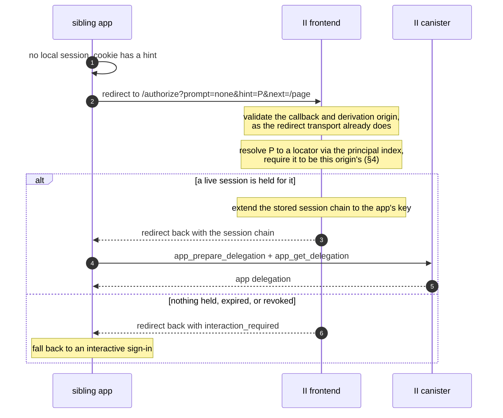

# Silent re-auth over the redirect transport

**Status:** Draft, RFC for review. No code yet.
**Depends on:** `revocable-app-sessions.md` for the session it re-issues from, and through it `tracked-default-accounts.md` for the principal index.
**Client side:** Specified already in `@icp-sdk/auth`, [shared-sessions.md](https://github.com/dfinity/icp-js-auth/blob/5aa78d5f64714d6e8e7781e256562035c09018c6/docs/src/content/docs/shared-sessions.md). This doc is only what II has to supply for that to work.
**Last updated:** 2026-08-18

Sibling subdomains of one domain share a sign-in: sign in on `chat.example.com` and `hr.example.com` is signed in too, sign out of one and the others follow. The client half exists. On II's side it needs two authorize-URL parameters and a path through the authorize flow that renders nothing.

---

## 1. What the client already does

From the client doc, the three pieces it puts in place:

| Piece | Effect |
| ----- | ------ |
| A shared `derivationOrigin`, authorized by `ii-alternative-origins` on that origin | Every sibling resolves to the same principal |
| A `CookieDelegationStorage` scoped to the parent domain | Siblings can see *that* a session exists. The cookie holds only the principal and the expiry, never key material |
| A `/reauth` page running `transport: 'redirect'`, `prompt: 'none'`, `hint: <principal from the cookie>` | Re-issues this app's own delegation and returns to `?next=` |

So II is handed a redirect authorize request naming an origin, a derivation origin, a `prompt` and a `hint`, and is expected either to answer without rendering anything or to fail in a way the client can tell apart from a real error.

Note the cookie is not II's mechanism and II never sees it. It is how the *siblings* discover that a session is worth asking for. All II sees is `hint`.

---

## 2. What is new on II's side

| Item | Change |
| ---- | ------ |
| `prompt` authorize-URL parameter | New. `none` answers from a held session or fails; `login` and absent behave as today |
| `hint` authorize-URL parameter | New. A principal, selecting which of the origin's sessions to re-issue from |
| A no-UI path through the authorize flow | New. Resolves the session, extends its chain, delivers the redirect response, renders nothing |
| `interaction_required` outcome | New. Distinguishable from every other failure, so the client can fall back to a ceremony |

Nothing in the canister changes. Everything here is the II frontend using the methods `revocable-app-sessions.md` already specifies.

An earlier attempt at `prompt` and `hint` predates sessions and re-issued by extending a stored delegation chain offline, which nothing could revoke. This specifies them on top of sessions instead, so a silent re-issue is a canister-checked mint like any other.

---

## 3. The flow

The II frontend does not mint the app delegation here. It hands back the session chain and the app mints its own, exactly as on a first sign-in, so there is one path for that and not two.

---

## 4. `prompt=none` rules

**Renders nothing, ever.** No consent screen, no account picker, no error page. Either the redirect carries a session chain or it carries `interaction_required`.

**Never creates a session.** A session comes only from `prepare_account_session`, which requires an anchor access method. `prompt=none` has no ceremony and therefore no access method, so it can only ever re-issue from a session that already exists. This is the same rule that stops a stolen session chain spawning siblings, and it is what keeps `prompt=none` from being a way to obtain authority rather than exercise it.

**Resolves only sessions belonging to the requesting origin.** The `hint` selects *among* the sessions II holds for the origin being authorized. It never names an origin. Without this, any page could redirect to II with someone else's principal as the hint and collect a delegation.

This is the same shape as the caveat carried through from `read_certified_sso_bundle`: a value that resolves to something valid is not thereby a value that describes the caller, so the origin is checked separately rather than inferred. Here the origin comes from the authorize request, which the callback allowlist and `ii-alternative-origins` have already validated.

**No new consent.** Silently re-issuing to a sibling is inside consent already given: the user signed in for this derivation origin, and the siblings are the ones that origin's `ii-alternative-origins` authorizes. The set of apps that can be silently signed in is exactly the set the user's own domain declared.

---

## 5. `hint` rules

`hint` is a principal, resolved through the principal index of `tracked-default-accounts.md` §9 to a locator.

It exists because one origin can hold more than one session: the user has signed in there under more than one identity, or under more than one account of one identity. Without a hint II would have to guess, and guessing wrong signs the user in as the wrong persona.

| Case | Outcome |
| ---- | ------- |
| Absent, exactly one session held for the origin | Use it |
| Absent, several held | `interaction_required`. Picking for the user is worse than asking |
| Present, resolves to a session held for this origin | Use it |
| Present, resolves elsewhere or nowhere | `interaction_required` |

A hint is a preference, not a credential. It is safe for it to come from a cookie the app can read and write, because it can only select from what II already holds for that origin, and holding the session is what confers anything.

---

## 6. Why siblings share one session

This falls out of the previous designs rather than needing anything:

- A shared `derivationOrigin` means every sibling derives the same principal, so they resolve to one **application** in the reference list.
- Sessions live on the account reference at `(anchor, application)`, so all siblings of one derivation origin share the same session records.
- The device id is per browser, so one browser has one session across the whole set.

So "sign in on one and the others are signed in" is not a copy between apps. There is one session and the siblings take turns re-issuing from it.

The same fact makes the client doc's other promise true. "Sign out of one and the others follow" holds because `app_revoke_session` removes the record they all share, not merely because the cookie was cleared. A sibling that ignored the cookie would still find nothing to re-issue from.

---

## 7. Failure modes

| Situation | Outcome |
| --------- | ------- |
| No session held | `interaction_required` |
| Session expired, or revoked from another app or from II settings | `interaction_required` |
| Hint resolves to another origin's session | `interaction_required` |
| Several sessions and no hint | `interaction_required` |
| Callback or derivation origin fails validation | The existing redirect-transport error, unchanged |

One outcome for every session-related case, so a client's fallback is a single branch. That is not to hide anything: §4 already bounds what `prompt=none` can be used to learn, since it only ever answers for the requesting origin.

`prompt=login`, and an absent `prompt`, run the interactive flow exactly as today.

---

## 8. Decisions

| # | Decision | § |
| - | -------- | - |
| R1 | `prompt` and `hint` travel as authorize-URL parameters, not in the ICRC request, matching how the client already sends them | 2 |
| R2 | `prompt=none` renders nothing and returns either a session chain or `interaction_required` | 4 |
| R3 | `prompt=none` never creates a session, since it has no access method to authorize one | 4 |
| R4 | `hint` selects among the requesting origin's sessions and can never name another origin's | 4 |
| R5 | The II frontend returns the session chain and lets the app mint its own delegation, as on first sign-in | 3 |
| R6 | Several sessions with no hint is `interaction_required`, not a guess | 5 |
| R7 | Every session-related failure is one outcome, so the client fallback is one branch | 7 |
| R8 | Nothing in the canister changes. Sibling sharing and sign-out propagation fall out of one session per `(anchor, application)` | 2, 6 |
