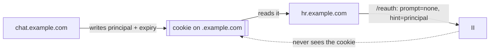
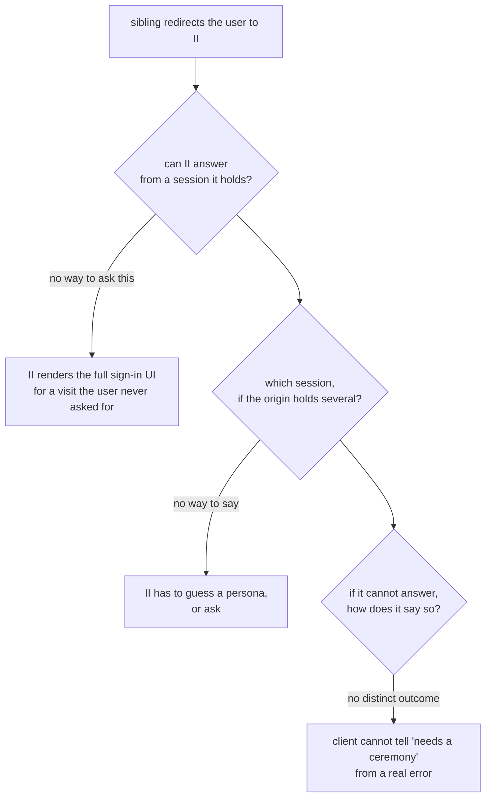

# Silent re-auth over the redirect transport

**Authors:** sea-snake — **Date:** Aug 20, 2026

**Target audience:** Engineers, Security Reviewers, Community Developers

**Status:** Implementation

**Depends on:** [revocable-app-sessions.md](revocable-app-sessions.md) for the session this re-issues from.

## Summary

Sibling subdomains of one domain should share a sign-in: sign in on `chat.example.com` and `hr.example.com` is signed in too, and signing out of one signs out the others.

The client half of this already exists in `@icp-sdk/auth`. A cookie scoped to the parent domain tells a sibling that a session exists and which account it belongs to, and the sibling sends the user to II to have a delegation issued for its own key. What is missing is II's half: it has no way to answer such a request without showing the user a screen, no way to be told which session to answer from when an identity has several at one origin, and no way to fail that the client can tell apart from a real error.

This adds two parameters to the authorize URL and a path through the authorize flow that renders nothing. `prompt=none` means answer only if you already can. `hint` carries the account principal from the cookie and selects among the sessions II holds for the requesting origin. If neither can be satisfied, II returns `interaction_required` and the client falls back to a normal sign-in.

The cookie never holds key material, and a hint can only pick from sessions II already has for that origin, so a page cannot use one to acquire authority it was not given.

## Context

Sibling subdomains of one domain should share a sign-in: sign in on `chat.example.com` and `hr.example.com` is signed in too; sign out of one and the others follow.

The client half of that already exists, specified in `@icp-sdk/auth` ([shared-sessions.md](https://github.com/dfinity/icp-js-auth/blob/5aa78d5f64714d6e8e7781e256562035c09018c6/docs/src/content/docs/shared-sessions.md)). It puts three pieces in place:

| Piece                                                                                                 | Effect                                                                         |
| ----------------------------------------------------------------------------------------------------- | ------------------------------------------------------------------------------ |
| A shared `derivationOrigin`, authorized by `ii-alternative-origins`                                   | Every sibling resolves to the same principal                                   |
| A cookie scoped to the parent domain, holding only a principal and an expiry — never key material     | Siblings can see _that_ a session exists                                       |
| A `/reauth` page using `transport: 'redirect'`, `prompt: 'none'`, `hint: <principal from the cookie>` | Re-issues this app's own delegation, then returns the user to its own `?next=` |

The cookie is not II's mechanism and II never sees it. It is how the _siblings_ discover that a session is worth asking for. All II sees is the `hint`.

## Problem

A sibling arriving at II has no local session, only a hint that one exists. For the flow to feel like a shared sign-in, II has to answer **without rendering anything** — no consent screen, no account picker, no spinner — because the user did not ask to visit II and should never see it.

II cannot do that today.

Three gaps: no way to be told "answer only if you already can", no way to be told which session to answer from, and no way to fail that a client can distinguish from a real error.

Answering silently also must not become a way to get something for free. A page that can send a user to II must not be able to collect a delegation for a session it does not own.

## Out of scope

- **Anything the client already specifies.** The cookie, the `derivationOrigin` setup and the `/reauth` page belong to `@icp-sdk/auth`; II never sees the cookie.
- **Sharing across unrelated domains.** Only siblings that already resolve to the same principal through a shared `derivationOrigin` can share a session.
- **Creating a session silently.** `prompt=none` can only re-issue from one that exists; it has no access method with which to authorise a new one.

## Approach

Two new authorize-URL parameters and a path through the authorize flow that renders nothing.

| Item                                    | Change                                                                                               |
| --------------------------------------- | ---------------------------------------------------------------------------------------------------- |
| `prompt`                                | New. `none` answers from a held session or fails; `login` forces a ceremony; absent behaves as today |
| `hint`                                  | New. A principal in text form, selecting which of the origin's sessions to re-issue from             |
| A no-UI path through the authorize flow | Resolves the session, extends its chain, delivers the redirect response, renders nothing             |
| `interaction_required`                  | A failure outcome distinguishable from every other, so the client falls back to a ceremony           |

A hint selects; it does not grant. It can only pick from the sessions II already holds for the origin being authorized, and it is holding the session that confers anything, so a hint read out of a cookie an app can write is safe. `prompt=none` also cannot create a session, because creating one needs an access method and a silent request has none.

Almost all of this is the II frontend using methods `revocable-app-sessions.md` already specifies. It needs one addition, `check_session`: a query that confirms the canister still holds the session the frontend's local record names. Without it a session revoked from settings or from another app would still be answered from the local copy, and the app would fail at its first mint with an error it could not tell apart from a real one.

---

---

## Specification

The flow, the `prompt=none` and `hint` rules, failure modes and the requirement checklist are in [silent-reauth-redirect-spec.md](silent-reauth-redirect-spec.md).

## Implementation stages

| PR    | Stage                                                                       |
| ----- | --------------------------------------------------------------------------- |
| #4248 | `prompt` and `hint`, the no-UI path, and the `check_session` liveness query |

Sibling sharing and sign-out propagation need no work of their own: they follow from siblings resolving to one account, and therefore one session.
