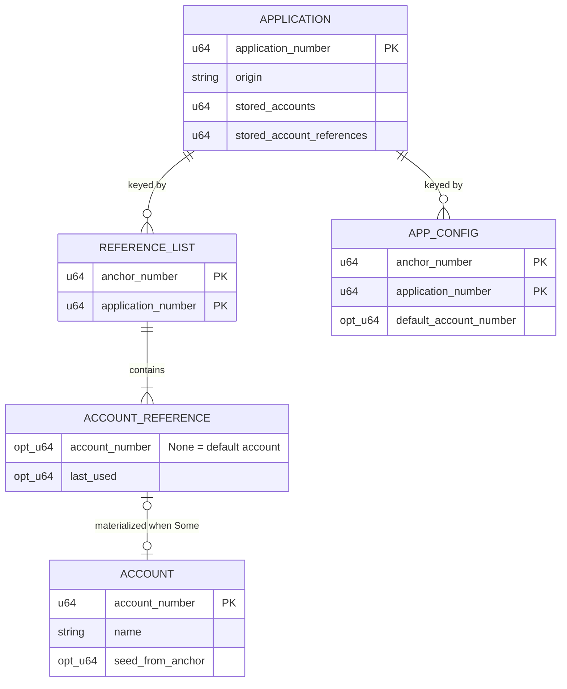
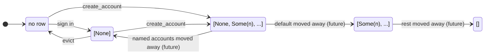
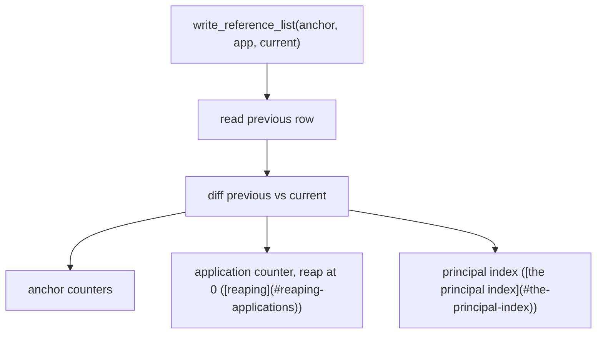
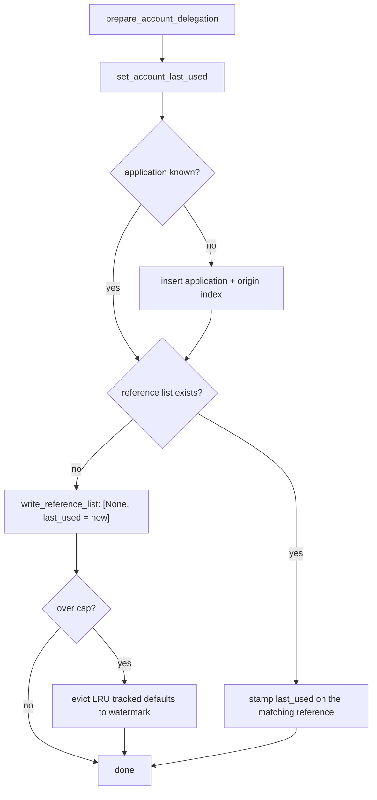
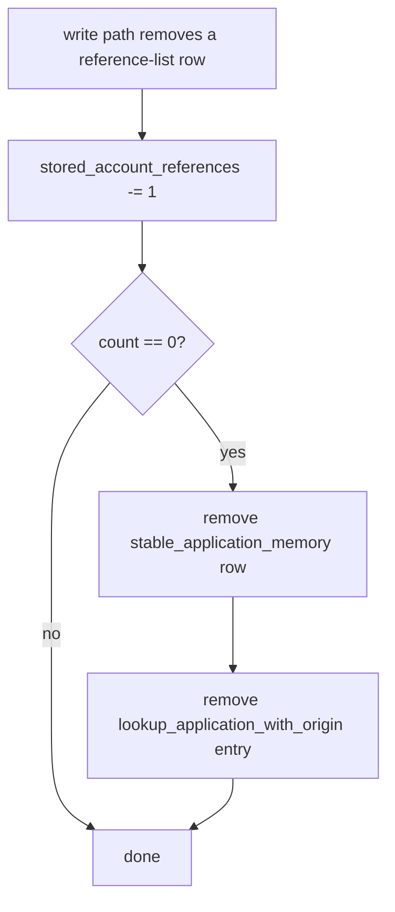

# Account tracking — specification

**Authors:** sea-snake — **Date:** Aug 20, 2026

**Target audience:** implementers, and agents generating code from this document

**Design:** [tracked-default-accounts.md](tracked-default-accounts.md) covers what this builds and why. This document assumes it and does not repeat it.

**Consumers:** the principal index specified here is read by the session refresh path in [revocable-app-sessions-spec.md](revocable-app-sessions-spec.md).

## The records II keeps today

Everything above is deliberately free of storage vocabulary. The rest of this document needs it, so here it is once.



`StorableAccount` holds neither an anchor nor an origin. Ownership lives entirely in the reference list, which is what makes accounts relocatable in principle.

Seed derivation (`storage/account.rs:166`):

| Account | Seed |
| ------- | ---- |
| Default, not materialized | `anchor_seed(anchor_number, origin)` |
| Default, materialized | `anchor_seed(seed_from_anchor, origin)` |
| Named | `account_seed(account_number, origin)` |

The first two are byte identical. A default account's principal is a pure function of `(anchor, origin)`, both permanent, so the account is reconstructible from nothing and safe to delete. A named account's principal depends on an `AccountNumber` drawn from a never-reissued allocator, so deleting one destroys its principal.

### Default accounts are not tracked

`set_account_last_used` (`storage.rs:1652`) resolves the application with the non-inserting lookup, then calls `with_account_mut`, which returns early when no reference list exists for `(anchor, app)`. Its `Option<()>` is discarded at the only call site.

Result: signing in with the synthetic default, at an origin where the anchor holds no account, persists nothing. No timestamp, no reference list, no application row. That is the common case, so the canister currently tracks materialized accounts only.

### Nothing is ever removed

There is no `remove` call on `stable_account_memory`, `stable_application_memory`, `lookup_application_with_origin_memory`, `stable_account_reference_list_memory`, or `stable_anchor_application_config_memory`, and no counter is ever decremented. Applications therefore accumulate for the lifetime of the canister.

The per-application counters are accurate for what exists, since increments have never been offset by removals. What they lack is a decrement, so they can never fall back to zero and mark an application as unreferenced.

### There is no reverse index from a principal

Anchors are reverse-indexed by OpenID credential, passkey credential, passkey public key, recovery phrase principal, and email recovery address. Accounts have no such index. Given the principal a dapp sees, the canister cannot determine which anchor, application, or account produced it, because the seed is hashed.

---
## Glossary

| Term | Meaning |
| ---- | ------- |
| **Application** | Internal record for a dapp origin, addressed by `ApplicationNumber`. Never exposed in Candid. |
| **Materialized account** | Account with a row in `stable_account_memory`, i.e. one carrying a name. Consumes an `AccountNumber`. |
| **Default account** | The account an anchor gets at an origin without doing anything. Seed derives from `(anchor, origin)`. |
| **Synthetic default** | Default account with no stored state at all, conjured on read. |
| **Tracked default** | Default account with an `AccountReference` but no `StorableAccount`. Introduced here. |
| **Reference list** | `Vec<AccountReference>` stored at `(anchor, app)`. The only record of which accounts an anchor holds at an application. |
| **Evictable default** | Tracked default that is the only entry in its row, so deleting the whole row costs the anchor nothing. The unit the new cap counts ([the two caps](#two-independent-caps)). A default sharing its row with named accounts is not evictable ([the eviction predicate](#predicate)). |
| **Derived principal** | What a dapp sees as the caller: `self_authenticating(der_encode_canister_sig_key(seed))`. |

---

## The reference list becomes a three-state encoding

For a given `(anchor, app)`:

| Row state | Meaning | Default account |
| --------- | ------- | --------------- |
| Absent | Nothing ever happened here | Reconstructible, reads return a synthetic default |
| Present, contains a `None` reference | Anchor holds a tracked default | Live, `last_used` on the reference |
| Present, no `None` reference | Default was moved away | Not reconstructible, reads return `None` |
| Present, empty | Everything here was moved away | Not reconstructible, permanent tombstone |

Absence and emptiness are now opposites. Absence means nothing ever happened; emptiness means everything that was here left. That distinction is what lets a future move feature tell "you never had this" from "you gave this away". Without it, a moved-away default could be re-minted at the same principal by its former owner.



### `read_account` must stop special casing the empty list

`read_account` (`storage.rs:1961`) currently returns a synthetic default for the empty list (`storage.rs:1995`), the inverse of the table above. Its own comment flags it:

> `XXX WARNING: ... if we implement account transfers at some point, and default accounts can be transferred, this would allow a user to regain access to their transferred default account.`

**Change:** delete that branch. The empty list then falls through to the existing `.find(|r| r.account_number.is_none())`, which yields `None`.

**Accepted consequence:** an anchor that moves its default away and sits at the materialized cap can no longer use that origin's default account. That is correct, the account is no longer theirs, and should be stated in the code so it is not "fixed" later.

---

## One write path for the reference list

Everything below hangs off state derived from the reference list: two anchor counters, one application counter, and the principal index. Today the list is written at six sites, and this design adds two more.

| Site | Effect |
| ---- | ------ |
| `storage.rs:1622`, `1643` (`with_account_mut`) | Rewrites the list on every sign-in and rename, adds no entries |
| `storage.rs:1897` (`create_additional_account`, new list) | Two entries |
| `storage.rs:1910` (`create_additional_account`, push) | One entry |
| `storage.rs:2193` (`create_default_account`, new list) | One entry |
| `storage.rs:2222` (`create_default_account`, existing list) | Mutates the `None` reference in place |
| New in [tracking default accounts](#tracking-default-accounts) (`set_account_last_used`) | One entry |
| New in [Invariant A](#invariant-a) (`set_default_account_for_origin`) | One entry |

Keeping three kinds of derived state correct at eight call sites is a convention, not a guarantee. The anchor indexes already solved this: `write()` (`storage.rs:855-864`) is the single place a `StorableAnchor` is stored, so it holds previous and current side by side and calls each `sync_*` function itself. No caller has to remember.

**Change:** funnel every reference-list write through one function that reads the previous value, diffs, and applies all derived state.



Deletion is the same path with no current row, used by eviction ([remove the row, never empty it](#remove-the-row-never-empty-it)).

| Delta | Anchor counters | Application counter | Principal index |
| ----- | --------------- | ------------------- | --------------- |
| Reference added | `references += 1`, `accounts += 1` if `Some` | `+= 1` | insert |
| Row removed by eviction | `references -= 1` | `-= 1`, reap at 0 | remove |
| Reference removed by a move (future) | no change | no change ([tombstones must not decrement](#tombstones-must-not-decrement)) | update to the new owner |
| Reference mutated in place | no change | no change | re-insert if the value changed ([index maintenance](#maintenance-and-the-case-the-credential-indexes-do-not-have)) |

Two guards belong here rather than at the call sites:

- **Writing an empty list is rejected.** Under [the three-state encoding](#the-reference-list-becomes-a-three-state-encoding) an empty row is a tombstone, and no path in this design should ever produce one. Only the future move path may, so until then it is a programming error and must fail rather than silently deny an anchor its default account.
- **The salt must be present.** Index entries need `calculate_seed`, and `state::salt()` traps when unset (`state.rs:273-280`). See [the salt check](#the-salt-is-checked-not-awaited).

---

## Tracking default accounts

No new stable structure or storable type for this part. A tracked default is an existing shape:

```rust
AccountReference { account_number: None, last_used: Some(t) }
```

`create_additional_account` (`storage.rs:1851`) already writes exactly this when backfilling a default alongside a new named account. Only the timing changes: eagerly on delegation issuance, rather than as a side effect of creating a named account.



`set_account_last_used` (`storage.rs:1652`) uses the inserting application lookup, and creates the reference list in the not-found case instead of returning `None`.

### Invariant A

`set_default_account_for_origin` (`account_management.rs:157`) today creates an `AnchorApplicationConfig` row through the inserting application lookup, touching neither the reference list nor any counter. That leaves a class of relationship invisible to every counter.

**Change:** it also ensures a tracked default reference exists. For `account_number: None` that faithfully represents "use the synthetic default here"; for `Some(n)` a list necessarily already exists.

> **Invariant A:** a config row for `(anchor, app)` implies a reference-list row for `(anchor, app)`.

This makes the reference-list row the single canonical marker of a relationship, which is what [the reap predicate](#the-predicate-is-the-existing-reference-counter) counts. Without it, an application could be reaped while config rows survive, and those rows would be inherited by whatever claimed the number next.

---

## Eviction

### Predicate

```
evictable(anchor, app)  <=>  list.len() == 1 && list[0].account_number.is_none()
```

Deliberately not "contains no `Some` references", which would also match the empty tombstone of [the three-state encoding](#the-reference-list-becomes-a-three-state-encoding).

Two properties follow:

- **Defaults are never evicted while a materialized account exists at that key.** Removing a `None` reference from a list holding named accounts lands in the third row state of [the three-state encoding](#the-reference-list-becomes-a-three-state-encoding), and the anchor loses its default account at that origin.
- **Eviction is an exact round trip.** Removing the row restores the absent state, which [the three-state encoding](#the-reference-list-becomes-a-three-state-encoding) defines as reconstructible. The next sign-in recreates it with `last_used = now`, at the same principal.

### Remove the row, never empty it

Eviction deletes the row through the [the single write path](#one-write-path-for-the-reference-list) path. It must never write back an empty vector: under [the three-state encoding](#the-reference-list-becomes-a-three-state-encoding) those two operations have opposite meanings, and an empty vector denies the anchor `anchor_seed(anchor, origin)` at that origin permanently. The [the single write path](#one-write-path-for-the-reference-list) guard rejects empty writes so this cannot be expressed by accident, and it is still worth a dedicated test.

Eviction also removes the `AnchorApplicationConfig` row for the key. If the sole entry is the `None` reference then no materialized account exists there, so any config row must carry `default_account_number: None`, which is equivalent to absence.

### Selecting the victim

Range `(anchor, ApplicationNumber::MIN)..=(anchor, ApplicationNumber::MAX)`, the range `list_identity_account_references` (`storage.rs:1789`) already performs, and take the minimum `last_used` over rows satisfying [the eviction predicate](#predicate), with `None` sorting oldest. That function discards the key in its `flat_map`, so a key-preserving variant is needed.

Cost is O(anchor's applications) reads, bounded by [what an anchor can accumulate](#what-an-anchor-can-accumulate), paid only at the cap. Evicting a batch down to a watermark (90% of the cap) amortizes the scan across subsequent sign-ins.

Not stored in `AnchorApplicationConfig`: that map is keyed `(anchor, app)`, so a value there is per application, and finding the minimum across an anchor's applications would still require reading all of them. If an O(1) minimum is ever needed, the right home is `stable_anchor_account_counter_memory`, the only per-anchor row in this subsystem, or a dedicated `(anchor, last_used, app)` index, which costs a remove plus insert on every sign-in and adds a second source of truth.

### `last_used: None` means never used

The default reference backfilled by `create_additional_account` keeps `last_used: None`. Creating a named account is not usage of the default account, so it must not stamp one. The same applies to the reference that `set_default_account_for_origin` creates under Invariant A ([Invariant A](#invariant-a)): choosing a default is not signing in with it.

`None` therefore means "never used", sorts oldest, and is evicted first, which is the right order: a default that has never been used is the most harmless thing to drop.

Resolving a caller through the principal index also counts as usage and stamps `last_used` ([what it is used for](#what-it-is-used-for)), so an account actively making calls is never the victim.

---

## Caps and counters

### Two independent caps

| Cap | Counts | Behaviour on hit |
| --- | ------ | ---------------- |
| Materialized accounts, 500, existing (`account_management.rs:36`) | `stored_accounts` per anchor | Hard error. `create_account` and default materialization fail, as they do today |
| Evictable defaults, 500, new | Rows that are exactly `[None]` | Evict the LRU down to a watermark. Sign-in never fails |

The caps are isolated. A default sharing its row with named accounts is not counted by the second, because such a default exists only where a named account does and is therefore already paid for by the first.

**The second cap is advisory, not enforced.** The trigger is a cheap upper bound, while eviction operates on the exact evictable set, and the two can disagree: a row holding a live session is not evictable, so an anchor with many of those reaches the bound with no victims to take. When that happens eviction does nothing and the sign-in proceeds. So the guarantee is *"sign-in never fails on this cap"*, not *"an anchor never exceeds it"* — and the steady-state ceiling is the watermark, 450, rather than 500, because eviction stops there.

500 is an anti-abuse parameter, not a capacity plan. Expected footprint is driven by active anchors times mean distinct dapps per anchor, nowhere near the cap. Per reference the cost is a 16 byte fixed key plus a roughly 12 byte CBOR value (`account_number: None` is omitted, so only the timestamp is encoded) plus node overhead. 500 is chosen for symmetry with the existing cap.

### Gauging the second cap

Every reference list holds at most one `None` reference, and `rebuild_identity_account_counters` (`storage.rs:1804`) defines `stored_accounts` as "references where `account_number.is_some()`". So per anchor:

```
all tracked defaults = stored_account_references - stored_accounts
```

That counts every default, evictable or not, so it is a cheap **upper bound** on the evictable count, taken from two fields that already exist. When it reaches the cap, the eviction scan ([victim selection](#selecting-the-victim)) yields the exact evictable count and the victim in the same pass, so the authoritative check costs nothing beyond what eviction already does. This is the shape `check_or_rebuild_max_anchor_accounts` (`account_management.rs:428`) already uses: trust the counter, recount when it claims the cap is hit, then act.

The bound is loosest for an anchor holding 500 non-evictable defaults, whose upper bound sits at the cap permanently so every new-origin sign-in triggers a scan. Such an anchor is by definition already at the materialized cap, and the scan is bounded by [what an anchor can accumulate](#what-an-anchor-can-accumulate).

### What an anchor can accumulate

| Rows | Bound | Why |
| ---- | ----- | --- |
| Rows holding at least one named account | 500 | Each needs a named account at that application, and the materialized cap allows 500 per anchor |
| Rows that are exactly `[None]` | 500 | The new cap counts precisely these |
| **Total** | **1000** | |

References come out higher than rows, because a row can hold several:

| References | Bound | Why |
| ---------- | ----- | --- |
| Named-account references | 500 | One per materialized account, capped |
| Default references sharing a row with named accounts | 500 | At most one per row of the first kind above |
| Sole default references | 500 | The new cap |
| **Total** | **1500** | |

The gap between the two totals is the reason [gauging the second cap](#gauging-the-second-cap)'s subtraction is an upper bound rather than the evictable count: it can read as high as 1000 while only 500 of those defaults are actually evictable.

Without moves, creating an account and holding one are the same event, so the single materialized cap does both jobs. A move feature splits them and has to keep an equivalent bound; see [out of scope](#out-of-scope).

### Counter rules

| Counter | Rule |
| ------- | ---- |
| Anchor `stored_account_references` | Decrement on eviction, a real removal |
| Anchor `stored_accounts` | Never decremented |
| Global cell `stored_account_references` | Decrement on eviction, becomes a live gauge |
| Global cell `stored_accounts` | Never touched, it is the `AccountNumber` allocator |
| `StorableApplication.stored_account_references` | Decrement on eviction. This is the reap predicate ([the reap predicate](#the-predicate-is-the-existing-reference-counter)) |
| `StorableApplication.stored_accounts` | Never decremented. Cannot serve as a reap predicate: it is 0 for any application whose anchors hold only default accounts, which is the case this feature creates |

`rebuild_identity_account_counters` stays correct as written. With no move feature both anchor fields are still exactly derivable from the reference lists, so `check_or_rebuild_max_anchor_accounts` keeps self-healing for the materialized cap and for the [gauging the second cap](#gauging-the-second-cap) upper bound.

---

## Reaping applications

### The predicate is the existing reference counter

`StorableApplication.stored_account_references` is incremented once per reference created, in `update_counters`. Nothing has ever been removed, so its stored value is an accurate live count of references at that application today, not a historical sum ([nothing is ever removed](#nothing-is-ever-removed)). No new field and no migration are needed; it only has to start being decremented, which [the single write path](#one-write-path-for-the-reference-list) makes a property of one function rather than eight.

| Event | Effect |
| ----- | ------ |
| Reference created | `stored_account_references += 1` |
| Row removed by eviction ([remove the row, never empty it](#remove-the-row-never-empty-it)) | `stored_account_references -= 1` |
| Reaches 0 | Reap ([the reap sequence](#reap-sequence)) |

There is no rebuild path, because the reference-list map is keyed `(anchor, app)` and cannot be scanned application-major without walking every anchor. The counter is authoritative by construction, which is the main reason the write path is consolidated.

For the same reason, a missing application row must fail loudly rather than being skipped. Skipping is unreachable while every caller inserts first, but once reaping exists a stale reference-list row would make the counter drift invisibly. The write path returns `OriginNotFoundForApplicationNumber` instead.

### Tombstones must not decrement

A reference count and a row count agree everywhere except on the empty tombstone of [the three-state encoding](#the-reference-list-becomes-a-three-state-encoding), which holds zero references while its row is still alive. Left alone, that would let the counter reach 0 with a tombstone still present, and reaping would erase the tombstone and allow a moved-away default to be reconstructed at the same principal, which is precisely what the encoding exists to prevent.

The rule, which only takes effect once moves exist:

> A move that empties a row does not decrement. The last reference's count converts into the tombstone.

```
A creates [None, Some(5)] at X       references = 2
move 5 away                          references = 1     row = [None]
move the default away                references = 1     row = []       (retained for the tombstone)
```

against the eviction path:

```
A has [None] at X                    references = 1
evict                                references = 0     row removed -> reap
```

With two anchors at the same application, a tombstone held by one keeps the count above zero while the other evicts, so the application is not reaped ([tombstones keep applications alive](#tombstones-keep-applications-alive)).

### The allocator must become monotonic

`lookup_or_insert_application_number_with_origin` (`storage.rs:1481`) derives a new number from `lookup_application_with_origin_memory.len()`. That is correct only while nothing is ever removed. It does not merely reuse a reaped number, it collides with a live one:

```
applications {0, 1, 2} exist        len() == 3
reap 1                              len() == 2
next new origin is assigned 2       already owned by a live application
```

The two origins then share one account universe: every `(anchor, 2)` reference list and config row belongs to both.

**Change:** allocate from a monotonic `StableCell<u64>` at memory index 33 (next free), seeded on first use with the current `stable_application_memory.len()`, since existing numbers are dense from 0. Reaped numbers are retired, never reissued. The `u64` space makes exhaustion irrelevant.

An alternative is `last_key_value() + 1`, which needs no new memory and is safe given a correct count, but it reuses the number of a reaped highest application. Retiring numbers outright is the conservative choice and removes a class of future footgun where some later structure keys on `ApplicationNumber` and is forgotten here.

### Reap sequence



Nothing else is keyed by `ApplicationNumber`: reference-list rows are gone by definition at zero, config rows cannot outlive them by Invariant A, and principal index entries are removed by the same diff ([reaping leaves no dangling entries](#reaping-leaves-no-dangling-entries)). After a reap, `lookup_application_number_with_origin` returns `None` for the origin, so `read_account` returns a synthetic default, which is the correct answer for an anchor with no state there. A later sign-in at the same origin allocates a fresh number.

`ApplicationNumber` never appears in `internet_identity.did`, so reaping and renumbering are invisible to clients.

### Legacy applications reap on the same predicate

Because `stored_account_references` is already accurate for every existing application ([the reap predicate](#the-predicate-is-the-existing-reference-counter)), applications created before this change are reaped by the same rule as new ones, with no migration and no carve-out. The existing tail of origins is reclaimed as its anchors' defaults age out, rather than persisting forever.

### Tombstones keep applications alive

Empty-list rows ([the three-state encoding](#the-reference-list-becomes-a-three-state-encoding)) are never evicted and retain their count ([tombstones must not decrement](#tombstones-must-not-decrement)), so an application referenced only by tombstones stays above zero forever.

The set this covers is narrower than "any origin touched by a move". A tombstone is only created for an anchor whose own default account was materialized and then moved away, since that is the only anchor that could otherwise reproduce the principal ([out of scope](#out-of-scope)). Anchors that merely received an account and passed it on fall back to a plain default row and are reaped normally.

---

## The principal index

### Key and value

A new map at memory index 34:

```
StableBTreeMap<Principal, StorableAccountLocator>

StorableAccountLocator { anchor_number, application_number, account_number: Option<AccountNumber> }
```

keyed by the derived principal:

```
Principal::self_authenticating(der_encode_canister_sig_key(account.calculate_seed()))
```

`Principal` is already a key type in `lookup_anchor_with_passkey_pubkey_hash_memory` and `lookup_anchor_with_recovery_phrase_principal_memory`, bounded at 29 bytes. The value must carry the application number: for a default account the account number is `None`, so the triple is the only thing identifying which origin it belongs to.

One entry per reference, so the steady-state size is the reference count, bounded per anchor by [what an anchor can accumulate](#what-an-anchor-can-accumulate).

### The map is injective

| Reference | Seed | Unique because |
| --------- | ---- | -------------- |
| Named account | `account_seed(n, origin)` | `n` is globally unique and retired, never reissued |
| Default | `anchor_seed(anchor, origin)` | unique per `(anchor, origin)` |

Collision between the two families is prevented by the `ACCOUNT_SEED_PREFIX` domain separator in `calculate_account_seed`.

The one real risk is that a materialized default derives from `seed_from_anchor`, producing the same principal as the anchor's synthetic default at that origin. The two never coexist, because `create_default_account` replaces the `None` entry in place rather than appending. Once moves exist, what stops an anchor from acquiring a fresh `None` reference that collides with the account it gave away is the tombstone ([the three-state encoding](#the-reference-list-becomes-a-three-state-encoding)). So the empty-row rule is load-bearing for this index too, and any future "tidy up empty rows" would corrupt the lookup as well as re-mint principals.

### Maintenance, and the case the credential indexes do not have

The index is synced from the [the single write path](#one-write-path-for-the-reference-list) diff, in the same shape as `sync_anchor_with_openid_credential_index` (`storage.rs:939`).

One difference matters. The credential indexes diff **keys** only, because their value is always the same anchor. Here the value can change while the key stays the same: materializing a default rewrites `{None}` to `{Some(n)}` with `seed_from_anchor` set, so the seed and therefore the principal are unchanged while the locator gains an account number. A key-only set difference would see no change and leave a stale value.

So the diff builds `BTreeMap<Principal, StorableAccountLocator>` for previous and current, and applies:

| Case | Action |
| ---- | ------ |
| In previous, not in current | remove |
| In current, not in previous | insert |
| In both, value differs | insert, overwriting |

Computing a principal requires the account row, since only `stable_account_memory` says whether a `Some(n)` reference is a named account or a materialized default. The diff reads it for each changed reference.

A removal is **compare-and-delete**: only remove the entry if the stored locator still names this anchor. Nothing exercises it until moves exist, but the guard is cheap and its absence would be silent. A move is two writes on two different keys, and an unconditional removal applied after the recipient's insertion would delete a live entry.

### The salt is checked, not awaited

`calculate_seed` reads `state::salt()`, which traps when unset (`state.rs:273-280`). The salt is written exactly once — `update_salt` and `init_salt` both trap if it is already set, so it can never be unset or rotated — by `ensure_salt_set()` on a delegation path. On any live canister that happened long ago. On a freshly installed one it has not happened yet, which is not hypothetical: it is why `create_account` on a fresh canister failed 11 integration tests.

The index write therefore checks synchronously and returns a `StorageError` when the salt is missing, following `session_delegation.rs:85-91`, which does the same rather than trapping.

**Where the await goes matters.** `create_account` runs its cap check and its insert in one message, so the two are atomic; an await between them would open an interleaving where two concurrent calls both pass the same check before either write lands. So the await sits at the **endpoint**, ahead of the cap check rather than between check and write. The pair still lands in one message, and on a live canister the await resolves immediately because the salt is already set.

### Backfill

Existing references have no entries. A cursor-driven sweep fills them, 2,000 rows a batch, driven by an in-canister interval timer installed from both `init` and `post_upgrade` — the convention `migrate_sso_credentials_batch` established (removed in #4192 once complete). A batch that examines fewer keys than requested is the last one. A hidden query reports `(indexed, is_done)` so the rollout can be watched.

The size is measurable rather than estimated: `internet_identity_total_account_references_count` (`http/metrics.rs:57`) reports the exact number of references, which is exactly the number of entries to write. It is small today, because reference rows only exist where an account was created or a default materialized, not per sign-in.

A sweep is preferred over lazy fill because it makes a lookup miss unambiguous. With lazy fill a miss would mean "unknown principal or not yet indexed", and [what it is used for](#what-it-is-used-for) turns a miss into a denial.

### What it is used for

The index turns an account principal back into the account it was derived for. Its consumer is the session refresh path in `revocable-app-sessions.md`: an app calls with a canister-signed bundle naming its own account principal, and II resolves that to `(anchor, application, account)` in order to find the sessions to match the caller against. Without the index there is no way back from a principal, because the salt is hashed in.

Three rules that make this safe:

- **The index has no Candid surface.** No method takes a principal and returns anything about it. A caller-supplied variant would let anyone deanonymize any principal they observe on chain.
- **The anchor is never returned to a caller.** Per-origin derivation exists so that two dapps cannot correlate their users; handing an app the anchor number would defeat that. This is also why the session bundle names the account by principal rather than by the numbers behind it.
- **A miss and a resolved-but-not-permitted are indistinguishable** to the caller, in error shape and in anything else observable. Otherwise the API is an oracle for whether a principal is known to II. The session design collapses every such case into one error for exactly this reason.

A refresh stamps `last_used` on the reference it resolved, exactly as `prepare_account_delegation` does. This is what keeps [eviction](#eviction) and [the principal index](#the-principal-index) consistent: without it an evicted tracked default would deny a caller holding a perfectly valid delegation. With it, anything actively making calls is at the top of the LRU and never a victim, so only genuinely idle defaults are dropped, and recovery is one sign-in.

### Reaping leaves no dangling entries

An application is reaped only at zero references, and zero references means zero index entries, because both are maintained by the same diff. So a reaped application number can never be left with an index entry pointing at it. Worth asserting in a test, since it is the kind of invariant a later change can quietly break.

---

## Out of scope

**Account moves.** Not designed here. What this design constrains:

- **Creating and holding are separate quantities and each needs its own cap.** The creation cap bounds how many `stable_account_memory` rows an anchor can mint, so it must never be refunded, otherwise "create 500, move all away, create 500 more" is unbounded. The holding cap bounds an anchor's own reference lists, which is what [what an anchor can accumulate](#what-an-anchor-can-accumulate) rests on and what the eviction scan reads, so it must fall on a move out and rise on a move in. `stored_accounts` is the holding count and stays derivable from the reference lists, so `rebuild_identity_account_counters` keeps working unchanged. A move feature adds the creation count as a separate never-decremented field, which is not derivable and exists only to gate creation.

  An account bounced from A to B and back therefore returns every holding counter to its starting value and changes no creation counter: A created it once and is charged once, B created nothing and is charged nothing.

- **A move in must backfill the recipient's own default reference**, exactly as `create_additional_account` does. Otherwise the recipient's row is `[Some(n)]` with no `None` reference, which [the three-state encoding](#the-reference-list-becomes-a-three-state-encoding) reads as "the default was moved away", and the recipient loses its own default account at an origin it gave nothing away at.

- **A tombstone is only correct when the anchor's own default left.** With that backfill, a recipient's row falls back to `[None]` and then to absent once the received account moves on, so it stays reapable like any other. The unreapable case is narrow: an anchor that materialized its own default at an origin and then moved that account away. Only that anchor can reproduce the principal, since the seed derives from its `seed_from_anchor` (`storage/account.rs:172`), so only that anchor's row has to remember.

- A move that empties a row must not decrement the application counter ([tombstones must not decrement](#tombstones-must-not-decrement)), and its index removal must be compare-and-delete ([index maintenance](#maintenance-and-the-case-the-credential-indexes-do-not-have)).

---

## Consequences to accept

| Consequence | Detail |
| ----------- | ------ |
| Sign-in becomes a write path | First sign-in at an origin creates an application row, an origin index entry, a reference-list row, and an index entry |
| Application growth is bounded, existing applications included | Reaping applies to legacy applications on the same predicate, with no migration ([legacy applications](#legacy-applications-reap-on-the-same-predicate)). Only applications held alive by a tombstone persist ([tombstones keep applications alive](#tombstones-keep-applications-alive)) |
| The index roughly doubles the subsystem's footprint | One entry per reference, at a 29 byte key plus a small value, bounded per anchor by [what an anchor can accumulate](#what-an-anchor-can-accumulate) |
| Anchor to origin becomes joinable in stable memory | The canister records per anchor every origin signed into and when, the origin in cleartext on `StorableApplication`, joined through the reference-list key. This is the point of the feature, is a different scope from the browser-local last-used store, and is worth a changelog line. The per-anchor cap doubles as the retention bound |
| No upgrade cost | All of this lives in stable structures, not the Candid-serialized anchor blob. Only the index needs a backfill, and it is externally driven rather than run at upgrade |
| Not archived | Tracked-default creation, eviction, and reaping must not go through `post_account_operation_bookkeeping`, or every first sign-in at an origin becomes a permanent replicated archive entry. Sign-in does not touch the archive today and must not start |

---

## Requirements

| # | Requirement | Where |
| - | ----------- | ----- |
| D1 | Reference list is a three-state encoding, absent is not empty | Three-state encoding |
| D2 | Delete the `is_empty()` synthetic-default branch in `read_account` | Empty-list case |
| D3 | All reference-list writes go through one function that diffs previous against current and derives counters and index entries | Single write path |
| D4 | That function rejects writing an empty list, which is reserved for the future move path | Single write path |
| D5 | Eviction removes the row, never writes back an empty vector | Remove the row |
| D6 | Eviction predicate is `len() == 1 && [0].account_number.is_none()` | Eviction predicate |
| D7 | Defaults are never evicted while a materialized account exists at that key | Eviction predicate |
| D8 | The cap is 500 evictable defaults per anchor, isolated from the 500 materialized cap, and **advisory**: eviction runs down to the watermark and does nothing when it finds no victims, so an anchor holding non-evictable rows sits above the cap rather than being refused. Sign-in never fails on it | Two caps |
| D9 | `stored_account_references - stored_accounts` is the cheap upper bound on that cap; the eviction scan is authoritative | Gauging the cap |
| D10 | LRU victim found by on-demand scan with batch eviction to a watermark, not a stored pointer | Victim selection |
| D11 | `last_used: None` means never used and sorts oldest; neither creating a named account nor choosing a default stamps it | Never used |
| D12 | Eviction also removes the `AnchorApplicationConfig` row for the key | Remove the row |
| D13 | Tracked-default creation, eviction, and reaping are never archived | Consequences |
| D14 | `set_default_account_for_origin` ensures a reference-list row exists, Invariant A | Invariant A |
| D15 | The reap predicate is the existing `StorableApplication.stored_account_references`, which is accurate today and only needs decrementing. No new field, no migration | Reap predicate |
| D16 | A move that empties a row does not decrement; the count converts into the tombstone | Tombstones |
| D17 | Application numbers come from a monotonic cell at memory index 33 and are retired on reap, never reissued | Monotonic allocator |
| D18 | Reaching zero removes the application row and the origin index entry, for legacy and new applications alike | Reap sequence, Legacy applications |
| D19 | A missing application row on a reference-list write fails loudly instead of being skipped. `write_reference_list` and `remove_reference_list` return `OriginNotFoundForApplicationNumber`; the counter arithmetic moved into `apply_reference_counter_deltas` | Reap predicate |
| D20 | The principal index maps derived principal to `(anchor, application, account)` at memory index 34 | Key and value |
| D21 | The index diff compares values, not just keys, so materializing a default updates its entry in place | Index maintenance |
| D22 | Index writes check the salt synchronously and return a typed error when it is unset. The account-mutating **endpoints** await `ensure_salt_set` on entry, ahead of the cap check, so the check and the write it guards still land in one message | Salt check |
| D23 | The index is populated by a cursor-driven batched backfill, driven by an in-canister interval timer installed from `init` and `post_upgrade`, 2,000 rows a batch. A hidden query reports progress | Backfill |
| D24 | The index is read by the session refresh path in `revocable-app-sessions.md`, which resolves the account principal carried in a caller-info bundle. It has no Candid surface of its own and never returns the anchor to a caller | Use |
| D25 | A session refresh stamps `last_used` on the reference it resolves, so an account in active use is never evicted | Use, Never used |
