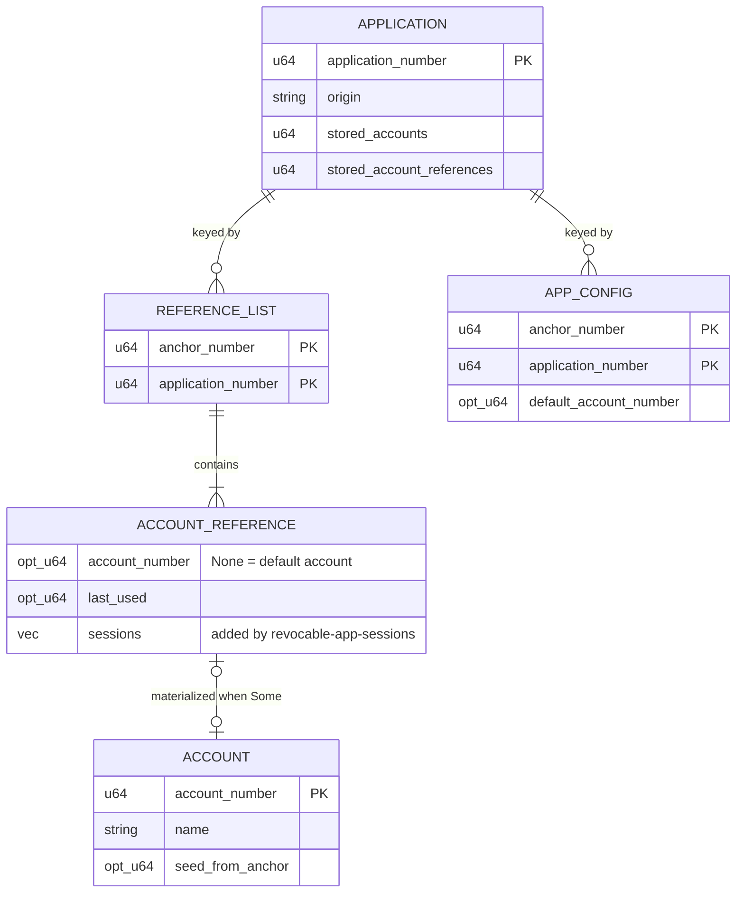
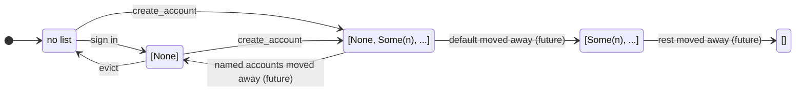
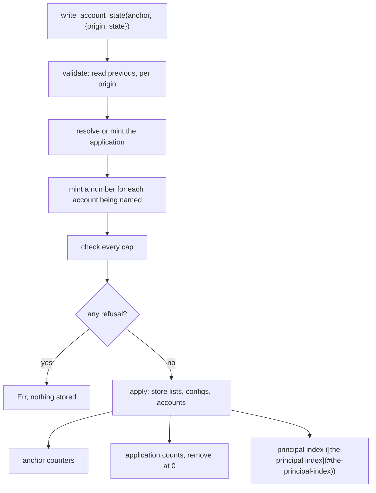
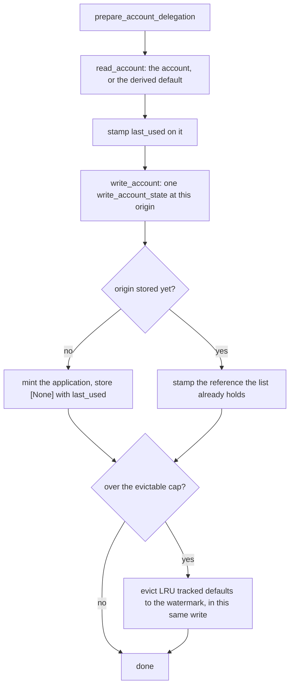

# Recording which apps an identity uses: specification

**Design:** [tracked-default-accounts.md](tracked-default-accounts.md) covers what this builds and why. This document assumes it and does not repeat it.

**Consumers:** the principal index specified here is read by the session refresh path in [revocable-app-sessions-spec.md](revocable-app-sessions-spec.md).

## The records II keeps today

The feature doc describes this without storage vocabulary. This document needs it, so here it is once.



`StorableAccount` holds neither an anchor nor an origin. Ownership lives entirely in the reference list, which is what makes accounts relocatable in principle.

Seed derivation (`storage/account.rs:166`):

| Account                   | Seed                                    |
| ------------------------- | --------------------------------------- |
| Default, not materialized | `anchor_seed(anchor_number, origin)`    |
| Default, materialized     | `anchor_seed(seed_from_anchor, origin)` |
| Named                     | `account_seed(account_number, origin)`  |

The first two are byte identical. A default account's principal is a pure function of `(anchor, origin)`, both permanent, so the account is reconstructible from nothing and safe to delete. A named account's principal depends on an `AccountNumber` drawn from a never-reissued allocator, so deleting one destroys its principal.

### Default accounts are not tracked

`set_account_last_used` (`storage.rs:1652`) resolves the application with the non-inserting lookup, then calls `with_account_mut`, which returns early when no reference list exists for `(anchor, app)`. Its `Option<()>` is discarded at the only call site.

Result: signing in with the synthetic default, at an origin where the anchor holds no account, persists nothing. No timestamp, no reference list, no application record. That is the common case, so the canister currently tracks materialized accounts only.

### Nothing is ever removed

There is no `remove` call on `stable_account_memory`, `stable_application_memory`, `lookup_application_with_origin_memory`, `stable_account_reference_list_memory`, or `stable_anchor_application_config_memory`, and no counter is ever decremented. Applications therefore accumulate for the lifetime of the canister.

The per-application counters are accurate for what exists, since increments have never been offset by removals. What they lack is a decrement, so they can never fall back to zero and mark an application as unreferenced.

### There is no reverse index from a principal

Anchors are reverse-indexed by OpenID credential, passkey credential, passkey public key, recovery phrase principal, and email recovery address. Accounts have no such index. Given the principal an app sees, the canister cannot determine which anchor, application, or account produced it, because the seed is hashed.

---

## Glossary

| Term                       | Meaning                                                                                                                                                                                                                                                                                        |
| -------------------------- | ---------------------------------------------------------------------------------------------------------------------------------------------------------------------------------------------------------------------------------------------------------------------------------------------- |
| **Application**            | Internal record for an app origin, addressed by `ApplicationNumber`. Never exposed in Candid.                                                                                                                                                                                                  |
| **Materialized account**   | Account with a record in `stable_account_memory`, i.e. one carrying a name. Consumes an `AccountNumber`.                                                                                                                                                                                       |
| **Default account**        | The account an anchor gets at an origin without doing anything. Seed derives from `(anchor, origin)`.                                                                                                                                                                                          |
| **Synthetic default**      | Default account with no stored state at all, conjured on read.                                                                                                                                                                                                                                 |
| **Tracked default**        | Default account with an `AccountReference` but no `StorableAccount`. Introduced here.                                                                                                                                                                                                          |
| **Account reference list** | `Vec<AccountReference>` stored at `(anchor, app)`. The only record of which accounts an anchor holds at an application. Shortened to "list" throughout.                                                                                                                                        |
| **Account state**          | Everything one identity holds, keyed by origin, in the shape [the one write path](#one-write-path-for-account-state) both returns and takes.                                                                                                                                                   |
| **Evictable default**      | Tracked default that is the only entry in its list, so deleting the whole list costs the anchor nothing. The unit the new cap counts ([the caps](#every-cap-is-the-write-paths-rule)). A default sharing its list with named accounts is not evictable ([the eviction predicate](#predicate)). |
| **Derived principal**      | What an app sees as the caller: `self_authenticating(der_encode_canister_sig_key(seed))`.                                                                                                                                                                                                      |

---

## The reference list becomes a three-state encoding

For a given `(anchor, app)`:

| List state                           | Meaning                                               | Default account                                   |
| ------------------------------------ | ----------------------------------------------------- | ------------------------------------------------- |
| Absent                               | Nothing ever happened here                            | Reconstructible, reads return a synthetic default |
| Present, contains a `None` reference | Anchor holds a tracked default                        | Live, `last_used` on the reference                |
| Present, no `None` reference         | The default was named, or moved away once moves exist | Not reconstructible from the origin alone         |
| Present, empty                       | Everything here was moved away                        | Not reconstructible, permanent tombstone          |

Absence and emptiness are now opposites. Absence means nothing ever happened; emptiness means everything that was here left. That distinction is what lets a future move feature tell "you never had this" from "you gave this away". Without it, a moved-away default could be re-minted at the same principal by its former owner.



### `read_account` must stop special casing the empty list

`read_account` (`storage.rs:1961`) currently returns a synthetic default for the empty list (`storage.rs:1995`), the inverse of the table above. Its own comment flags it:

> `XXX WARNING: ... if we implement account transfers at some point, and default accounts can be transferred, this would allow a user to regain access to their transferred default account.`

#### Change

Delete that branch. The empty list then falls through to the existing `.find(|r| r.account_number.is_none())`, which yields `None`.

#### Accepted consequence

An anchor that moves its default away and sits at the materialized cap can no longer use that origin's default account. That is correct: the account is not theirs any more, and should be stated in the code so it is not "fixed" later.

---

## One write path for account state

Everything below hangs off state derived from an identity's account reference lists: two
anchor counters, one application counter, and the principal index. Before this design the
lists were written at six sites, and it adds two more.

| Site                                                                                  | Effect                                                         |
| ------------------------------------------------------------------------------------- | -------------------------------------------------------------- |
| `storage.rs:1622`, `1643` (`with_account_mut`)                                        | Rewrites the list on every sign-in and rename, adds no entries |
| `storage.rs:1897` (`create_additional_account`, new list)                             | Two entries                                                    |
| `storage.rs:1910` (`create_additional_account`, push)                                 | One entry                                                      |
| `storage.rs:2193` (`create_default_account`, new list)                                | One entry                                                      |
| `storage.rs:2222` (`create_default_account`, existing list)                           | Mutates the `None` reference in place                          |
| New in [tracking default accounts](#tracking-default-accounts) (recording a use)      | One entry                                                      |
| New in [Invariant A](#invariant-a) (`set_default_account`)                            | One entry                                                      |

Keeping three kinds of derived state correct at eight call sites is a convention, not a guarantee. The anchor indexes already solved this: `write()` (`storage.rs:855-864`) is the single place a `StorableAnchor` is stored, so it holds previous and current side by side and calls each `sync_*` function itself. No caller has to remember.

#### Change

One function takes what an identity should hold afterwards and derives the rest:

```rust
fn write_account_state(
    &mut self,
    anchor: &mut Anchor,
    writes: BTreeMap<FrontendHostname, AccountReferenceListWrite>,
) -> Result<BTreeMap<FrontendHostname, AccountReferenceListWrite>, StorageError>
```

Five properties define it, and every rule in this document is stated against them.

**It speaks origins, not application numbers.**  
An application number is storage's handle for an origin and this owns that mapping, so a caller names the origin. An origin nothing has been stored under is created here — the application record, its origin index entry and its counters together — which is why no caller resolves or inserts an application first, and why a refusal cannot leave behind an application no counter will ever retire.

**It takes the state to end in, not a patch on the state it is in.**  
Each origin's list is diffed against what is stored, and every derived quantity falls out of that difference. No caller states a delta, so no caller can state a wrong one. `account_state` hands back everything an identity holds in exactly the shape a write takes it, and `account_state_for_origin` does the same for one origin, normalising an absent list to the derived default. Writing either back unchanged changes nothing.

**Everything that can refuse happens before anything is stored.**  
The write is `validate_account_state`, which reads, checks every rule for every origin and works out what would be minted without minting it, followed by `apply_account_state`, which cannot fail. On the IC returning `Err` commits every write that came before it and only a trap rolls back, so a write spanning origins that refused halfway would leave the earlier origins stored. There is deliberately no form of this that writes one origin at a time, because that is the shape that gets it wrong.

**It mints the numbers a person's names imply.**  
An account reference carrying a record but no number is an account being named. A name is what a person gives an account and the number is what storage keys it by, so the number is minted here, in validate, and a refusal mints nothing. The call returns the input with the minted numbers filled in, each list in the order it was given, so a caller reads its new account number out of the value it wrote.

**It takes the anchor, not the anchor number, and it stores it.**  
The session count lives on the anchor and the write moves it, so a caller holding its own copy across the write could put the old count back afterwards. Taking `&mut Anchor` also means a write refuses where there is no identity to read: the counters, the lists and the count all key on a record that would not be there.

Taking the anchor means owning the storing of it, unconditionally and once for the whole call. A caller is free to have changed the anchor before handing it over — registering a browser and rotating its key is exactly that ([revocable-app-sessions-spec.md](revocable-app-sessions-spec.md#registry)) — and storing it only where this function's own change to it landed would discard the caller's silently, on any write whose session count did not move. A sign-in from a browser that already holds a session at that account replaces it rather than adding one, so that is the ordinary case rather than a corner of one.

The value written per origin:

```rust
pub struct AccountReferenceWrite {
    pub account_reference: AccountReference,
    pub record: Option<StorableAccount>,
}

pub type AccountReferenceListWrite =
    Option<(Vec<AccountReferenceWrite>, Option<AnchorApplicationConfig>)>;
```

`None` for an origin removes that origin's list, its config and its index entries together, which is how eviction is expressed ([remove the list, never empty it](#remove-the-list-never-empty-it)). Within a list, an account number and a record encode four intents:

| `account_number` | `record` | Meaning                                                   |
| ---------------- | -------- | ---------------------------------------------------------- |
| `None`           | `None`   | The tracked default, and it stays one                     |
| `None`           | `Some`   | Name it. The write mints a number and stores the record   |
| `Some`           | `Some`   | Rename                                                    |
| `Some`           | `None`   | Leave the stored record alone                             |



The deltas apply and the index is maintained by the same diff:

| Delta                                | Anchor counters                              | Application counter                                                         | Principal index                                                                                                    |
| ------------------------------------ | -------------------------------------------- | --------------------------------------------------------------------------- | ------------------------------------------------------------------------------------------------------------------ |
| Reference added                      | `references += 1`, `accounts += 1` if `Some` | `+= 1`                                                                      | insert                                                                                                             |
| List removed by eviction             | `references -= 1`                            | `-= 1`, remove at 0                                                         | remove                                                                                                             |
| Reference removed by a move (future) | no change                                    | no change ([tombstones must not decrement](#tombstones-must-not-decrement)) | update to the new owner                                                                                            |
| Reference mutated in place           | no change                                    | no change                                                                   | re-insert if the value changed ([index maintenance](#maintenance-and-the-case-the-credential-indexes-do-not-have)) |

Three rules belong here rather than at the call sites:

- **Writing an empty list is rejected.**  
  Under [the three-state encoding](#the-reference-list-becomes-a-three-state-encoding) an empty list is a tombstone, and no path in this design should ever produce one. Only the future move path may, so until then it is a programming error and must fail rather than silently deny an anchor its default account.
- **Every cap is checked here.**  
  A caller that has to remember a cap is a caller that can forget one, and a cap checked outside the write is a cap checked against state the write is about to change. See [caps and counters](#caps-and-counters).
- **The salt must be present.**  
  Index entries need `calculate_seed`, and `state::salt()` traps when unset (`state.rs:273-280`). See [the salt check](#the-salt-is-checked-not-awaited).

#### What a caller looks like

Three callers reach storage, and each is one read followed by one write. Naming an account, renaming one and recording that one was used are the same read-modify-write, because the account is the state to store rather than a patch over it:

```rust
let mut anchor = self.read(anchor_number)?;
let (mut account_references, config) = self.account_state_for_origin(anchor_number, &origin);
// change what it means to change
let written = self.write_account_state(
    &mut anchor,
    BTreeMap::from([(origin.clone(), Some((account_references, config)))]),
)?;
```

`create_account` pushes a reference carrying a record and no number, and reads the minted number back out of `written`. `write_account` finds the reference the account names and rewrites it, which covers naming the tracked default, renaming a stored account, and stamping `last_used` on a sign-in. `set_default_account` writes the config beside the list it read, so a config naming a number no reference names cannot be left behind.

---

## Tracking default accounts

No new stable structure or storable type for this part. A tracked default is an existing shape:

```rust
AccountReference { account_number: None, last_used: Some(t) }
```

`create_additional_account` (`storage.rs:1851`) already writes this reference when backfilling a default alongside a new named account, and leaves `last_used` unset, which is correct there because creating a named account is not a use of the default. What changes is that a sign-in writes the reference eagerly and then stamps it, so the timestamp is set by the same step that sets it for every other account.



Recording a use is `write_account` with `last_used` set, which is the same read-modify-write that names and renames an account. Two cases turn on what the read handed back. A default at an origin nothing has been stored under reads as the derived default, and writing it back with a timestamp is what stores it — application and all, since the write mints one for an origin it does not know. A named account with no reference reads as nothing at all, so there is nothing to write back: a named account cannot be conjured from an origin alone. What decides the first case is whether _this_ identity holds a list at the origin, not whether the application is known, so a default at an origin another identity already registered is stored the same way.

Because eviction is part of the same write ([remove the list, never empty it](#remove-the-list-never-empty-it)), a sign-in that takes an identity over the cap is one atomic unit rather than two.

### Invariant A

`set_default_account_for_origin` (`account_management.rs:139`) sets an `AnchorApplicationConfig` for `(anchor, app)`. Written on its own it would touch neither the reference list nor any counter, and leave a class of relationship invisible to every counter.

#### Change

The config is written through the same call as the list it belongs to, so a config exists only where a list does. For `account_number: None` the list faithfully represents "use the derived default here"; for `Some(n)` a list necessarily already exists.

> **Invariant A:** a config for `(anchor, app)` implies an account reference list for `(anchor, app)`.

This makes the account reference list the single canonical marker of a relationship, which is what [the removal condition](#the-condition-is-the-existing-reference-count) counts. Without it, an application could be removed while configs survive, and those configs would be inherited by whatever claimed the number next.

---

## Eviction

### Predicate

```
evictable(identity, app)  <=>  list.len() == 1
                          && list[0].account_number.is_none()
```

Deliberately not "contains no `Some` references", which would also match the empty tombstone of [the three-state encoding](#the-reference-list-becomes-a-three-state-encoding).

Two properties follow:

- **Defaults are never evicted while a materialized account exists at that key.**  
  Removing a `None` reference from a list holding named accounts lands in the third state of [the three-state encoding](#the-reference-list-becomes-a-three-state-encoding), and the anchor loses its default account at that origin.
- **Eviction is an exact round trip.**  
  Removing the list restores the absent state, which [the three-state encoding](#the-reference-list-becomes-a-three-state-encoding) defines as reconstructible. The next sign-in recreates it with `last_used = now`, at the same principal.

### Remove the list, never empty it

Eviction is expressed as `None` for an origin in [the one write path](#one-write-path-for-account-state), which removes that origin's list, its config and its index entries together. It must never write back an empty vector instead: under [the three-state encoding](#the-reference-list-becomes-a-three-state-encoding) those two operations have opposite meanings, and an empty vector denies the anchor `anchor_seed(anchor, origin)` at that origin permanently. The write path rejects empty lists so this cannot be expressed by accident, and it is still worth a dedicated test.

Removing the `AnchorApplicationConfig` is part of the same removal. If the sole entry is the `None` reference then no materialized account exists there, so any config must carry `default_account_number: None`, which is equivalent to absence.

### Eviction is part of the write, not a call after it

Eviction runs inside the same `write_account_state` as whatever triggered it, and is chosen against the state that write is about to produce rather than the state on disk.

That placement is the point. Eviction used to be a second call made once the first had returned, which made a sign-in that crossed the cap two atomic units: an `Err` from the second committed the first. It is also not something a caller should have to remember, for the same reason the counters are not — a caller that has to remember it is a caller that can forget it.

Two consequences follow from choosing victims against the state the write produces:

- **An origin the write touches is never a victim of it.** The write is in the middle of changing that list, and the sign-in that triggered eviction wrote the very list that would otherwise sort youngest-but-one.
- **Housekeeping does not fail the write it rides on.** A candidate whose application record has gone is skipped rather than refused, because a repair opportunity is not a reason to reject a sign-in.

### Selecting the victim

The trigger is arithmetic on counters the write has already computed, so the common path costs no reads at all ([gauging the second cap](#gauging-the-second-cap)). Only when it fires does the exact set get read: range `(anchor, ApplicationNumber::MIN)..=(anchor, ApplicationNumber::MAX)` over the reference lists, keeping the key, and take those satisfying [the eviction predicate](#predicate).

Victims are the `(last_used, application_number)`-smallest of that set, with `None` sorting oldest, and at most `MAX_EVICTIONS_PER_CALL` of them. Ordering on the application number after the timestamp makes the choice total, so two lists last used in the same second are not separated by whichever the map happened to yield first.

Cost is O(anchor's applications) reads, bounded by [what an anchor can accumulate](#what-an-anchor-can-accumulate), paid only at the cap. Trimming to a watermark (90% of the cap) amortizes the scan across subsequent sign-ins.

Not stored in `AnchorApplicationConfig`: that map is keyed `(anchor, app)`, so a value there is per application, and finding the minimum across an anchor's applications would still require reading all of them. If an O(1) minimum is ever needed, the right home is `stable_anchor_account_counter_memory`, the only per-anchor entry in this subsystem, or a dedicated `(anchor, last_used, app)` index, which costs a remove plus insert on every sign-in and adds a second source of truth.

### `last_used: None` means never used

The default reference backfilled by `create_additional_account` keeps `last_used: None`. Creating a named account is not usage of the default account, so it must not stamp one. The same applies to the reference `set_default_account` writes under Invariant A ([Invariant A](#invariant-a)): choosing a default is not signing in with it.

`None` therefore means "never used", sorts oldest, and is evicted first, which is the right order: a default that has never been used is the most harmless thing to drop.

Resolving a caller through the principal index also counts as usage and stamps `last_used` ([what it is used for](#what-it-is-used-for)), so an account actively making calls is never the victim.

---

## Caps and counters

### Every cap is the write path's rule

Three caps bound what one identity can accumulate, and all three are enforced inside [the one write path](#one-write-path-for-account-state), against the state the write is about to leave behind rather than the state on disk.

| Cap                                          | Counts                                            | Behaviour on hit                                                                |
| -------------------------------------------- | ------------------------------------------------- | ------------------------------------------------------------------------------- |
| Named accounts, 500, existing                | `stored_accounts` per anchor                      | Hard error. `AccountLimitReached`, as `create_account` fails today              |
| Evictable defaults, 500, new                 | Lists that are exactly `[None]`                   | Evict the LRU down to a watermark. Sign-in never fails                          |
| Session records, 500, `revocable-app-sessions-spec.md` | Session entries across an identity's lists | Reclaim expired records first, and refuse only if that is not enough            |

Placing them here rather than in front of the callers is what makes them right. A cap asked about before a write is asked against state the write then changes, and a caller that has to remember a cap is a caller that can forget one — which is the whole reason this design has one write path. Refusing at the end of validation costs nothing precisely because nothing has been stored yet.

Two consequences are worth naming. Naming a tracked default reaches the account cap the same way creating a named account does, because naming one is what makes it a stored account, and neither caller asks first. And a caller that spans origins is checked on the total: deltas that each fit can still sum to one that does not, so they are applied to a running total rather than each against the same stored value.

The caps are isolated from one another. A default sharing its list with named accounts is not counted by the second, because such a default exists only where a named account does and is therefore already paid for by the first.

#### The second cap is advisory, not enforced

The trigger is a cheap upper bound, while eviction operates on the exact evictable set, and the two can disagree: a default sharing its list with named accounts is not evictable, so an anchor holding many of those reaches the bound with no victims to take. When that happens eviction does nothing and the sign-in proceeds. So the guarantee is _"sign-in never fails on this cap"_, not _"an anchor never exceeds it"_.

Nor is the watermark a ceiling. Eviction only triggers once the bound reaches 500, then trims towards 450, so an active anchor oscillates between the two rather than settling at either. And because one message evicts at most `MAX_EVICTIONS_PER_CALL` lists, a single sign-in may not reach the watermark at all; the remainder is taken by later sign-ins.

One write adding many new origins at once would also cross the cap and converge over the writes that follow, rather than being refused at the moment it crosses. No caller does that, and the type permits it.

500 is an anti-abuse parameter, not a capacity plan. Expected footprint is driven by active anchors times mean distinct apps per anchor, nowhere near the cap. Per reference the cost is a 16 byte fixed key plus a roughly 12 byte CBOR value (`account_number: None` is omitted, so only the timestamp is encoded) plus node overhead.

### Gauging the second cap

Every reference list holds at most one `None` reference, and `stored_accounts` counts references where `account_number.is_some()`. So per anchor:

```
all tracked defaults = stored_account_references - stored_accounts
```

That counts every default, evictable or not, so it is a cheap **upper bound** on the evictable count, taken from two fields that already exist. Both are taken after the write's own deltas have been folded in, so the bound describes the state being written rather than the one being replaced, and the common path pays no reads for it at all. When it reaches the cap, the eviction scan ([victim selection](#selecting-the-victim)) yields the exact evictable count and the victims in the same pass, so the authoritative check costs nothing beyond what eviction already does. Trust the counter, look only when it claims the cap is hit, then act.

The bound is loosest for an anchor holding 500 non-evictable defaults, whose upper bound sits at the cap permanently so every new-origin sign-in triggers a scan. Such an anchor is by definition already at the named-account cap, and the scan is bounded by [what an anchor can accumulate](#what-an-anchor-can-accumulate).

### What an anchor can accumulate

| Lists                                    | Bound    | Why                                                                                         |
| ---------------------------------------- | -------- | -------------------------------------------------------------------------------------------- |
| Lists holding at least one named account | 500      | Each needs a named account at that application, and the named-account cap allows 500 per anchor |
| Lists that are exactly `[None]`           | 500      | The new cap counts precisely these                                                          |
| **Total**                                | **1000** |                                                                                             |

References come out higher than lists, because a list can hold several:

| References                                            | Bound    | Why                                          |
| ----------------------------------------------------- | -------- | -------------------------------------------- |
| Named-account references                              | 500      | One per named account, capped                |
| Default references sharing a list with named accounts | 500      | At most one per list of the first kind above |
| Sole default references                               | 500      | The new cap                                  |
| **Total**                                             | **1500** |                                              |

The gap between the two totals is the reason [gauging the second cap](#gauging-the-second-cap)'s subtraction is an upper bound rather than the evictable count: it can read as high as 1000 while only 500 of those defaults are actually evictable.

Without moves, creating an account and holding one are the same event, so the single named-account cap does both jobs. A move feature splits them and has to keep an equivalent bound; see [out of scope](#out-of-scope).

### Counter rules

| Counter                                         | Rule                                                                                                                                                                     |
| ----------------------------------------------- | ------------------------------------------------------------------------------------------------------------------------------------------------------------------------ |
| Anchor `stored_account_references`              | Decrement on eviction, a real removal                                                                                                                                    |
| Anchor `stored_accounts`                        | Not decremented today                                                                                                                                                    |
| Global cell `stored_account_references`         | Decrement on eviction, becomes a live gauge                                                                                                                              |
| Global cell `stored_accounts`                   | Never touched, it is the `AccountNumber` allocator                                                                                                                       |
| `StorableApplication.stored_account_references` | Decrement on eviction. This is the removal condition ([the removal condition](#the-condition-is-the-existing-reference-count))                                           |
| `StorableApplication.stored_accounts`           | Not decremented today. Cannot serve as a removal predicate: it is 0 for any application whose anchors hold only default accounts, which is the case this feature creates |

Two of those rules are properties of what the write path is asked to do, not of what it can do. The deltas it applies are signed, and the same arithmetic serves both the anchor and the application counters, so a decrement is representable and merely never produced: only lists whose single entry is a default are removed, and such a list contributes nothing to the account counts. The global cell is the exception, and is protected explicitly, because it doubles as the `AccountNumber` allocator and must never fall.

#### A drifted account counter is not repaired

`rebuild_identity_account_counters` and `check_or_rebuild_max_anchor_accounts` (`account_management.rs`) recount an identity's references and correct the counter whenever it claims the cap is hit. Both go with this design, because the counter they insured against drift is now written by the only thing that can move it.

The cost of dropping it is that an identity whose counter has drifted high cannot create further named accounts. That is a bounded, visible failure for a state nothing in this design produces, and it is a better trade than keeping a repair path whose real function was to compensate for eight uncoordinated writers.

The session cap is the exception, and the difference is instructive: it counts rather than accumulates, so the count that answers the cap is also what corrects the stored number. An account counter cannot borrow that trick, because its recount is the very scan the counter exists to avoid.

---

## Removing unreferenced applications

### The condition is the existing reference count

`StorableApplication.stored_account_references` is incremented once per reference created, in `update_counters`. Nothing has ever been removed, so its stored value is an accurate live count of references at that application today, not a historical sum ([nothing is ever removed](#nothing-is-ever-removed)). No new field and no migration are needed; it only has to start being decremented, which [the single write path](#one-write-path-for-account-state) makes a property of one function rather than eight.

| Event                                                                                      | Effect                                            |
| ------------------------------------------------------------------------------------------ | ------------------------------------------------- |
| Reference created                                                                          | `stored_account_references += 1`                  |
| List removed by eviction ([remove the list, never empty it](#remove-the-list-never-empty-it)) | `stored_account_references -= 1`                |
| Reaches 0                                                                                  | Remove ([the remove sequence](#removal-sequence)) |

There is no rebuild path, because the reference-list map is keyed `(anchor, app)` and cannot be scanned application-major without walking every anchor. The counter is authoritative by construction, which is the main reason the write path is consolidated.

For the same reason, a reference list naming an application with no record must fail loudly rather than being skipped. It is unreachable while the write path is the only thing that mints and retires applications, but a stale list would make the counter drift invisibly. The write path returns `OriginNotFoundForApplicationNumber` instead.

### Tombstones must not decrement

A reference count and a list count agree everywhere except on the empty tombstone of [the three-state encoding](#the-reference-list-becomes-a-three-state-encoding), which holds zero references while the list itself is still alive. Left alone, that would let the counter reach 0 with a tombstone still present, and removal would erase the tombstone and allow a moved-away default to be reconstructed at the same principal, which is precisely what the encoding exists to prevent.

The rule, which only takes effect once moves exist:

> A move that empties a list does not decrement. The last reference's count converts into the tombstone.

```
A creates [None, Some(5)] at X       references = 2
move 5 away                          references = 1     list = [None]
move the default away                references = 1     list = []      (retained for the tombstone)
```

against the eviction path:

```
A has [None] at X                    references = 1
evict                                references = 0     list removed -> application removed
```

With two anchors at the same application, a tombstone held by one keeps the count above zero while the other evicts, so the application is not removed ([tombstones keep applications alive](#tombstones-keep-applications-alive)).

### The allocator must become monotonic

`lookup_or_insert_application_number_with_origin` (`storage.rs:1481`) derives a new number from `lookup_application_with_origin_memory.len()`. That is correct only while nothing is ever removed. It does not merely reuse a removed number, it collides with a live one:

```
applications {0, 1, 2} exist        len() == 3
remove 1                            len() == 2
next new origin is assigned 2       already owned by a live application
```

The two origins then share one account universe: every `(anchor, 2)` reference list and config belongs to both.

#### Change

Allocate from a monotonic `StableCell<u64>` at memory index 33 (next free), seeded on first use with the current `stable_application_memory.len()`, since existing numbers are dense from 0. Removed numbers are retired, never reissued. The `u64` space makes exhaustion irrelevant.

An alternative is `last_key_value() + 1`, which needs no new memory and is safe given a correct count, but it reuses the number of a removed highest application. Retiring numbers outright is the conservative choice and removes a class of future footgun where some later structure keys on `ApplicationNumber` and is forgotten here.

### Removal sequence


Nothing else is keyed by `ApplicationNumber`: reference lists are gone by definition at zero, configs cannot outlive them by Invariant A, and principal index entries are removed by the same diff ([removal leaves no dangling entries](#removal-leaves-no-dangling-entries)). After a remove, `lookup_application_number_with_origin` returns `None` for the origin, so `read_account` returns a synthetic default, which is the correct answer for an anchor with no state there. A later sign-in at the same origin allocates a fresh number.

`ApplicationNumber` never appears in `internet_identity.did`, so removal and renumbering are invisible to clients.

### Existing applications use the same condition

Because `stored_account_references` is already accurate for every existing application ([the removal condition](#the-condition-is-the-existing-reference-count)), applications created before this change are removed by the same rule as new ones, with no migration and no carve-out. The existing tail of origins is reclaimed as its anchors' defaults age out, rather than persisting forever.

### Tombstones keep applications alive

Empty lists ([the three-state encoding](#the-reference-list-becomes-a-three-state-encoding)) are never evicted and retain their count ([tombstones must not decrement](#tombstones-must-not-decrement)), so an application referenced only by tombstones stays above zero forever.

The set this covers is narrower than "any origin touched by a move". A tombstone is only created for an anchor whose own default account was materialized and then moved away, since that is the only anchor that could otherwise reproduce the principal ([out of scope](#out-of-scope)). Anchors that merely received an account and passed it on fall back to a plain default list and are removed normally.

---

## The principal index

### Key and value

A new map at memory index 34:

```
StableBTreeMap<Principal, StorableAccountLocator>

StorableAccountLocator { anchor_number, application_number, account_number: Option<AccountNumber> }
```

The value is the `(anchor, application, account)` triple identifying one account. This doc calls that triple a **locator**, and `StorableAccountLocator` is a new type for it: nothing existing names it, and `AccountReference` is taken by the reference-list entry, which is a different thing.

Keyed by the derived principal:

```
Principal::self_authenticating(der_encode_canister_sig_key(account.calculate_seed()))
```

`Principal` is already a key type in `lookup_anchor_with_passkey_pubkey_hash_memory` and `lookup_anchor_with_recovery_phrase_principal_memory`, bounded at 29 bytes. The value must carry the application number: for a default account the account number is `None`, so the triple is the only thing identifying which origin it belongs to.

One entry per reference, so the steady-state size is the reference count, bounded per anchor by [what an anchor can accumulate](#what-an-anchor-can-accumulate).

### The map is injective

| Reference     | Seed                          | Unique because                                     |
| ------------- | ----------------------------- | -------------------------------------------------- |
| Named account | `account_seed(n, origin)`     | `n` is globally unique and retired, never reissued |
| Default       | `anchor_seed(anchor, origin)` | unique per `(anchor, origin)`                      |

Collision between the two families is prevented by the `ACCOUNT_SEED_PREFIX` domain separator the account seed is built with.

The one real risk is that a materialized default derives from `seed_from_anchor`, producing the same principal as the anchor's synthetic default at that origin. The two never coexist, because `create_default_account` replaces the `None` entry in place rather than appending. Once moves exist, what stops an anchor from acquiring a fresh `None` reference that collides with the account it gave away is the tombstone ([the three-state encoding](#the-reference-list-becomes-a-three-state-encoding)). So the empty-list rule is load-bearing for this index too, and any future "tidy up empty lists" would corrupt the lookup as well as re-mint principals.

### Maintenance, and the case the credential indexes do not have

The index is synced from the [the single write path](#one-write-path-for-account-state) diff, in the same shape as `sync_anchor_with_openid_credential_index` (`storage.rs:939`).

One difference matters. The credential indexes diff **keys** only, because their value is always the same anchor. Here the value can change while the key stays the same: materializing a default rewrites `{None}` to `{Some(n)}` with `seed_from_anchor` set, so the seed and therefore the principal are unchanged while the locator gains an account number. A key-only set difference would see no change and leave a stale value.

So the diff builds `BTreeMap<Principal, StorableAccountLocator>` for previous and current, and applies:

| Case                        | Action              |
| --------------------------- | ------------------- |
| In previous, not in current | remove              |
| In current, not in previous | insert              |
| In both, value differs      | insert, overwriting |

Computing a principal requires the stored account, since only `stable_account_memory` says whether a `Some(n)` reference is a named account or a materialized default. The diff reads it for each changed reference.

A removal is **compare-and-delete**: only remove the entry if the stored locator still names this anchor. Nothing exercises it until moves exist, but the guard is cheap and its absence would be silent. A move is two writes on two different keys, and an unconditional removal applied after the recipient's insertion would delete a live entry.

### The salt is checked, not awaited

`calculate_seed` reads `state::salt()`, which traps when unset (`state.rs:273-280`). The salt is written exactly once — `update_salt` and `init_salt` both trap if it is already set, so it can never be unset or rotated — by `ensure_salt_set()` on a delegation path. On any live canister that happened long ago. On a freshly installed one it has not happened yet, which is not hypothetical: it is why `create_account` on a fresh canister failed 11 integration tests.

The index write therefore checks synchronously and returns a `StorageError` when the salt is missing, following `session_delegation.rs:85-91`, which does the same rather than trapping.

#### Where the await goes matters

`create_account` runs its cap check and its insert in one message, so the two are atomic; an await between them would open an interleaving where two concurrent calls both pass the same check before either write lands. So the await sits at the **endpoint**, ahead of the cap check rather than between check and write. The pair still lands in one message, and on a live canister the await resolves immediately because the salt is already set.

### Backfill

Existing references have no entries. A cursor-driven sweep fills them, 2,000 references a batch, driven by an in-canister interval timer installed from both `init` and `post_upgrade` — the convention `migrate_sso_credentials_batch` established (removed in #4192 once complete). A batch that examines fewer keys than requested is the last one. A hidden query reports `(indexed, is_done)` so the rollout can be watched.

The size is measurable rather than estimated: `internet_identity_total_account_references_count` (`http/metrics.rs:57`) reports the exact number of references, which is exactly the number of entries to write. It is small today, because reference lists only exist where an account was created or a default materialized, not per sign-in.

A sweep is preferred over lazy fill because it makes a lookup miss unambiguous. With lazy fill a miss would mean "unknown principal or not yet indexed", and [what it is used for](#what-it-is-used-for) turns a miss into a denial.

### What it is used for

The index turns an account principal back into the account it was derived for. Its consumer is the session refresh path in `revocable-app-sessions.md`: an app's call is signed by its session chain, and II resolves `caller()` through the session handle to an account principal, and that principal to `(anchor, application, account)` in order to find the sessions to match the caller against. Without the index there is no way back from a principal, because the salt is hashed in.

Three rules that make this safe:

- **The index has no Candid surface.**  
  No method takes a principal and returns anything about it. A caller-supplied variant would let anyone deanonymize any principal they observe on chain.
- **The anchor is never returned to a caller.**  
  Per-origin derivation exists so that two apps cannot correlate their users; handing an app the anchor number would defeat that. This is also why a session handle names the account by principal rather than by the numbers behind it.
- **A miss and a resolved-but-not-permitted are indistinguishable**  
  to the caller, in error shape and in anything else observable. Otherwise the API is an oracle for whether a principal is known to II. The session design collapses every such case into one error for exactly this reason.

A refresh stamps `last_used` on the reference it resolved, exactly as `prepare_account_delegation` does. This is what keeps [eviction](#eviction) and [the principal index](#the-principal-index) consistent: without it an evicted tracked default would deny a caller holding a perfectly valid delegation. With it, anything actively making calls is at the top of the LRU and never a victim, so only genuinely idle defaults are dropped, and recovery is one sign-in.

### Removal leaves no dangling entries

An application is removed only at zero references, and zero references means zero index entries, because both are maintained by the same diff. So a removed application number can never be left with an index entry pointing at it. Worth asserting in a test, since it is the kind of invariant a later change can quietly break.

---

## Out of scope

#### Account moves

Not designed here. What this design constrains:

- **Creating and holding are separate quantities and each needs its own cap.**  
  The creation cap bounds how many `stable_account_memory` records an anchor can mint, so it must never be refunded, otherwise "create 500, move all away, create 500 more" is unbounded. The holding cap bounds an anchor's own reference lists, which is what [what an anchor can accumulate](#what-an-anchor-can-accumulate) rests on and what the eviction scan reads, so it must fall on a move out and rise on a move in. `stored_accounts` is the holding count and stays derivable from the reference lists, which is what lets the write path maintain it. A move feature adds the creation count as a separate never-decremented field, which is not derivable and exists only to gate creation.

  An account bounced from A to B and back therefore returns every holding counter to its starting value and changes no creation counter: A created it once and is charged once, B created nothing and is charged nothing.

- **A move in must backfill the recipient's own default reference**, exactly as `create_additional_account` does. Otherwise the recipient's list is `[Some(n)]` with no `None` reference, which [the three-state encoding](#the-reference-list-becomes-a-three-state-encoding) reads as "the default was moved away", and the recipient loses its own default account at an origin it gave nothing away at.

- **A tombstone is only correct when the anchor's own default left.**

With that backfill, a recipient's list falls back to `[None]` and then to absent once the received account moves on, so it stays removable like any other. The unremovable case is narrow: an anchor that materialized its own default at an origin and then moved that account away. Only that anchor can reproduce the principal, since the seed derives from its `seed_from_anchor` (`storage/account.rs:172`), so only that anchor's list has to remember.

- A move that empties a list must not decrement the application counter ([tombstones must not decrement](#tombstones-must-not-decrement)), and its index removal must be compare-and-delete ([index maintenance](#maintenance-and-the-case-the-credential-indexes-do-not-have)).

---

## Consequences to accept

| Consequence                                                   | Detail                                                                                                                                                                                                                                                                                                                                      |
| ------------------------------------------------------------- | ------------------------------------------------------------------------------------------------------------------------------------------------------------------------------------------------------------------------------------------------------------------------------------------------------------------------------------------- |
| Sign-in becomes a write path                                  | First sign-in at an origin creates an application record, an origin index entry, an account reference list, and an index entry                                                                                                                                                                                                                      |
| Application growth is bounded, existing applications included | Removal applies to legacy applications on the same predicate, with no migration ([legacy applications](#existing-applications-use-the-same-condition)). Only applications held alive by a tombstone persist ([tombstones keep applications alive](#tombstones-keep-applications-alive))                                                     |
| The index roughly doubles the subsystem's footprint           | One entry per reference, at a 29 byte key plus a small value, bounded per anchor by [what an anchor can accumulate](#what-an-anchor-can-accumulate)                                                                                                                                                                                         |
| Anchor to origin becomes joinable in stable memory            | The canister records per anchor every origin signed into and when, the origin in cleartext on `StorableApplication`, joined through the reference-list key. This is the point of the feature, is a different scope from the browser-local last-used store, and is worth a changelog line. The per-anchor cap doubles as the retention bound |
| No upgrade cost                                               | All of this lives in stable structures, not the Candid-serialized anchor blob. Only the index needs a backfill, and it is externally driven rather than run at upgrade                                                                                                                                                                      |
| Not archived                                                  | Tracked-default creation, eviction, and removal must not go through `post_account_operation_bookkeeping`, or every first sign-in at an origin becomes a permanent replicated archive entry. Sign-in does not touch the archive today and must not start                                                                                     |

---

## Constants

| Constant                                  | Value           | What it bounds                                                                                       |
| ----------------------------------------- | --------------- | ---------------------------------------------------------------------------------------------------- |
| Lists holding only a default, per identity | 500            | Reaching it evicts; it does not refuse a sign-in                                                     |
| Eviction watermark                        | 450             | Eviction trims towards this, so an active identity sits between the two                              |
| Evictions per message                     | 50              | The rest is taken by later sign-ins                                                                  |
| Lists read while choosing a victim        | all of them     | Bounded by [what an anchor can accumulate](#what-an-anchor-can-accumulate), and paid only at the cap |
| Named accounts per identity               | 500             | Pre-existing, counted separately                                                                     |
| Backfill batch                            | 2000 references | Per timer tick                                                                                       |
| Backfill interval                         | 1 second        | Timer installed from both install and upgrade                                                        |
| Application number allocator              | memory index 33 | Monotonic, never reissues                                                                            |
| Principal index                           | memory index 34 | Principal to identity, app and account                                                               |

Eviction takes the least recently used eligible list, breaking ties on the application
number. A list that has never been used sorts before every list that has.

## Requirements

Normative statements the implementation must satisfy, grouped by the part of the system
they constrain and ordered the way the data flows: how a list is shaped, what writes one,
what bounds them, what reads them, and what all of it costs. Each is separately testable.

### List encoding

How an account reference list is shaped, and what its absence means. Everything else depends
on this distinction holding.

| #     | Requirement                                                                                                                                                 |
| ----- | ----------------------------------------------------------------------------------------------------------------------------------------------------------- |
| ENC-1 | An absent list and an empty list MUST mean different things: absent means nothing has happened at this origin, empty means every account here was given away. |
| ENC-2 | `read_account` MUST NOT treat an empty list as if no list existed, and MUST report no account in that case.                                                 |
| ENC-3 | Writing an empty list MUST be rejected. Removing the last reference MUST remove the list instead.                                                           |

### Writing a list

Who may write, and what a write must keep consistent.

| #        | Requirement                                                                                                                                                                                            |
| -------- | ------------------------------------------------------------------------------------------------------------------------------------------------------------------------------------------------------ |
| WRITE-1  | Every write of an account reference list MUST go through one function, which MUST derive the per-origin counts and the principal-index entries from the difference between the previous and new state. |
| WRITE-2  | A write MUST state the state the identity is to hold afterwards, per origin. It MUST NOT accept a delta, a count or an index entry from its caller, and MUST derive every such quantity itself.        |
| WRITE-3  | A write MUST name origins. It MUST NOT require its caller to resolve, mint or retire an application, and MUST mint one for an origin nothing is stored under as part of the same write.                |
| WRITE-4  | A write spanning several origins MUST apply entirely or not at all. Every refusal MUST happen before the first store, since returning an error commits what was already written.                       |
| WRITE-5  | A write MUST mint the account number for a reference that carries a record and no number, and MUST return the minted numbers to its caller. A refusal MUST mint nothing.                               |
| WRITE-6  | Writing back what was read, unchanged, MUST change nothing — including at an origin nothing has been stored under, which MUST read as the derived default rather than as an error.                     |
| WRITE-7  | A write MUST refuse where the identity does not exist, rather than storing state nothing can hold.                                                                                                     |
| WRITE-8  | A write MUST store the identity record it was handed, whatever changed it, and MUST NOT make storing it conditional on which fields moved.                                                             |
| WRITE-9  | A write naming an application with no record MUST fail loudly rather than skip the count update.                                                                                                       |
| WRITE-10 | Signing in with a default account MUST record a reference with no account number and the current time.                                                                                                 |
| WRITE-11 | Choosing a default account MUST record the reference without recording a use, leaving `last_used` unset, and MUST write the configuration and the list it belongs to together.                         |
| WRITE-12 | Creating a named account MUST NOT record a use of the default account.                                                                                                                                 |
| WRITE-13 | An unset `last_used` MUST sort as least recently used.                                                                                                                                                 |

### Bounding growth

The limit, what it is allowed to do when it cannot be satisfied, and what cleanup follows.

| #       | Requirement                                                                                                                                                                                                                                                                                                                 |
| ------- | --------------------------------------------------------------------------------------------------------------------------------------------------------------------------------------------------------------------------------------------------------------------------------------------------------------------------- |
| LIMIT-1 | Every cap MUST be enforced inside the write path, against the state the write leaves behind, and MUST NOT require a caller to check it first.                                                                                                                                                                              |
| LIMIT-2 | An identity MUST be limited to 500 lists whose only entry is a default account, counted separately from the 500-account limit.                                                                                                                                                                                               |
| LIMIT-3 | Reaching the limit MUST NOT cause a sign-in to fail.                                                                                                                                                                                                                                                                        |
| LIMIT-4 | The limit is advisory: with no eligible list, eviction MUST do nothing and the sign-in MUST proceed, so an identity holding ineligible lists MAY exceed 500.                                                                                                                                                                  |
| LIMIT-5 | A list is eligible only if its single entry is a default account. A live session on it MUST NOT exempt it, since a browser refreshing every five minutes would otherwise hold a list above the cap indefinitely.                                                                                                              |
| LIMIT-6 | Eviction MUST remove the list and the configuration for the same key, and MUST NOT leave an empty list behind.                                                                                                                                                                                                            |
| LIMIT-7 | Eviction MUST take the least recently used eligible lists first, MUST leave every list the current write touched alone, and MUST remove at most 50 lists per message. It MUST consider every eligible list rather than a prefix of them, since a truncated scan would choose a victim from whichever lists happened to sort first. |
| LIMIT-8 | Evicting a list MUST NOT change the principal its account derives to, so the account stays usable and identical afterwards.                                                                                                                                                                                                  |
| LIMIT-9 | An application record whose reference count reaches zero MUST be removed together with its origin-to-number entry.                                                                                                                                                                                                          |
| LIMIT-10 | An application number MUST NOT be reissued once its record is removed.                                                                                                                                                                                                                                                      |

### Looking up an account from a principal

What the reverse index must contain, and what must never be able to query it.

| #     | Requirement                                                                                                                                                          |
| ----- | -------------------------------------------------------------------------------------------------------------------------------------------------------------------- |
| IDX-1 | Every reference MUST have an entry mapping the principal it derives to onto its identity, application and account.                                                   |
| IDX-2 | The index MUST be diffed by value rather than by key, so naming a default updates its entry in place instead of leaving a stale one.                                 |
| IDX-3 | A removal MUST delete an entry only if its stored value still names the identity being written.                                                                      |
| IDX-4 | An index write MUST check the salt synchronously and return a typed error when it is unset, and MUST NOT place an await between a cap check and the write it guards. |
| IDX-5 | Existing references MUST be indexed by a resumable background sweep, and no feature MAY depend on a lookup succeeding until the sweep reports completion.            |
| IDX-6 | No method MAY accept a principal and report anything about it.                                                                                                       |
| IDX-7 | A lookup that resolves MUST be indistinguishable, to the caller, from one that does not.                                                                             |

### What this costs

| #      | Requirement                                                                     |
| ------ | ------------------------------------------------------------------------------- |
| COST-1 | Recording, evicting and removing these lists MUST NOT be written to the archive. |
