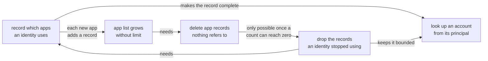

# Recording which apps an identity uses

## Summary

Internet Identity keeps no record of which apps an identity uses. The account a user gets
at an app is computed rather than stored, so signing in writes nothing at all, and only
accounts a user has explicitly named get a record. Almost nobody names one.

So a user cannot be shown where they are signed in, and nothing can go from a principal
back to the account behind it, which the revocable-sessions design needs in order to
authorise an app that never says who it is.

This design writes a small row the first time an identity uses an app, caps how many of
those an identity keeps, deletes app records nothing refers to any more, and indexes
accounts by the principal they derive to. Recording is cheap, and losing a row costs little: the account is computed, so it returns at
the identical principal the next time the user signs in there. What a dropped row does cost is
any session stored on it, which means a fresh sign-in rather than a lost account.

## Context

An Internet Identity is a number, called an identity. When a user signs in to an app with it, the app does not learn that number. Instead it receives a principal that is specific to the pair of that identity and that app, so the same user appears as a different principal at every site they visit. Two apps comparing what they see cannot work out that they are talking to the same person, which is the privacy property the whole system rests on.

II produces that principal by hashing three things together: the identity number, the app's origin, and a secret value held only inside the canister. The result is fully determined by those inputs, so II can compute it whenever it needs to and never has to store it.

We call the account a user gets this way their default account at that app. A user can also create a second account at the same app, with a name they choose, to keep two separate personas there. An account created with a name has to be stored, because the name has to be kept somewhere and because its principal is derived from an account number rather than from the identity and origin a default uses. Naming a default is the exception that matters later: it keeps the seed it already had, so it gains an account number without its principal changing.

So II holds records for the accounts users have named, and no record at all for the ones it computes on demand. Because naming an account is rare, this means II has no record of which apps an identity has used.

The hash runs one way only. II can compute the principal for a given identity and app, but it cannot start from a principal and work out which identity produced it.

II does keep one record per app origin it has ever encountered, shared by all identities, holding the origin string and two counts: how many accounts name it, and how many references point at it. The second is what can fall back to zero, so it is the one that decides when an app record can go. This is how an origin gets a short internal number instead of being stored as a string in every account.

## Problem

1. A user cannot be shown where they are signed in. There is no list to render, so a settings screen cannot answer "which apps have I used" or offer to sign the user out of one.

2. Recording use would make the app list grow without limit. Nothing in this part of storage has ever been deleted. There is no removal path for any of these records, and the per-app counts only ever increase. That is survivable today because only named accounts create records. If every first sign-in at a new app created one, each would stay for the lifetime of the canister.

3. Revocable app sessions cannot be built. The design in `revocable-app-sessions.md` needs the opposite direction of the hash: given the principal an app is calling with, which identity and account does it belong to? The session refresh path asks this on every call it authorises.

   The hash runs one way. Deriving a principal from an account is cheap, and a principal carries nothing that points back at the account it came from, so the answer has to be written down as it is produced or searched for at read time. Which of those, and what else was tried, is [approach 4](#4-keep-a-map-from-a-principal-back-to-the-account-it-belongs-to).

Two separate concerns run through this, and each is worth doing on its own terms.

**Knowing every app an identity has used** is what lets anything be attached to that pairing. A settings screen can only list apps it has records for, and the rule that follows is the one that decides the shape of the rest: data may only be attached to something the user can see and manage. An account the settings screen cannot list is an account that must not own data, so the tracking has to cover every account, including the default ones nobody named.

**Reaching an account from a principal quickly** is a different requirement with a different consumer. Any feature that starts from the principal an app is calling with, and needs to know whose account that is, has to go that way round: revocable sessions do it on every call they authorise, and an in-app profile would do it on every read. A hash only runs forwards, so the answer has to be recorded as it is produced. Computing it on demand would mean the enumeration the Problem describes.

The two are independent in motivation and entangled in delivery. Recording use is what makes the list grow; the cap is what bounds it; deleting an app record is only reachable because the cap lets a count fall; and the index is only affordable once the thing it indexes is bounded. All four read and write the same row, so they share one write path, which keeps the counts and the index consistent without every caller having to remember to update them.

## Out of scope

- **Moving an account between identities.**  
  The encoding this design introduces reserves the shape a move would need, and the constraints a future move feature must respect are noted in the specification, but no move path is designed here.
- **Showing the user their app list.**  
  This makes the data exist. The settings surface that renders it is separate work.
- **Per-app session listing.**  
  Covered by `revocable-app-sessions.md`, and deferred there too.

## Approach

Four changes, described here in terms of what is stored rather than in terms of the code.

### 1. Write a small record the first time an identity uses an app

Today a record only exists where a user named an account. We add one for the default account as well: the same kind of row, with no name attached, holding when it was last used. It is a few bytes, against a whole account record, and it turns that row into a complete list of the apps an identity has used.

The list could come from somewhere other than the canister. A browser could keep its own, which costs II nothing and answers the wrong question, because the user is asking where _they_ are signed in and a per-browser list cannot see the other devices. An app could declare itself, which makes the list depend on apps choosing to appear in a screen whose purpose is to catch the ones the user does not recognise. And usage could be appended to a log rather than folded into a row, which answers "which apps" by reading the whole log and grows with visits rather than with apps. A row per app is the answer already computed, and it is the only one of the four that a canister can render without trusting anybody.

### 2. Limit how many of those an identity can hold, and drop the ones it stopped using

Each identity gets a limit of 500 of these no-name rows. On reaching it, II deletes the ones used longest ago, down to 450 so that the work is spread across later sign-ins rather than repeated on every one.

Three other ways to bound it, none of which bounds it:

1. **Leave it unbounded**, which is today's behaviour and survivable only because nothing creates these rows. Once a first sign-in does, the growth is driven by how many origins someone visits, and visiting origins is free.
2. **Expire by age.** An identity that uses forty apps twice a year loses all of them, and one that visits five thousand origins in a week keeps every row. Age bounds how stale a record is, not how many there are, and storage is the thing under pressure.
3. **One global cap.** The identity that fills it evicts records belonging to identities that did nothing, so the cost of one user's behaviour lands on another's settings screen. A per-identity cap keeps the consequence where the cause is.

Dropping one costs the user almost nothing. The account was never stored, only computed, so signing in at that app again writes a fresh row and produces the identical principal it had before. What is lost is the record of having been there, and with it anything attached to that pairing. That is acceptable for the same reason the cap is: an app an identity stopped using for long enough to fall out of the last 450 is one whose per-app data has stopped mattering. A colour theme for an app the user has abandoned is not worth a permanent row.

Evicting rather than refusing is the choice here. Refusing at 500 would keep the oldest data and stop recording new use, which fails the concern above: the app the user is signing into right now is exactly the one a settings screen must be able to list.

Signing in stamps the row as used, and so does a refresh, so a row an application is actively calling from sits at the top of the order and is never the victim. What eviction reaches is idle rows, and recovery from a wrong guess is one sign-in.

One row is never dropped: one that also holds a named account, since that account cannot be recomputed. A row whose session is merely idle is not spared, and losing one signs that browser out of that app until the next sign-in. Sparing any row with a session attached would instead let an identity sit above its limit for as long as anything kept a stale one alive.

### 3. Delete an app record once no identity refers to it

With rows now able to disappear, an app's count of referring accounts can reach zero, and the record can be removed along with the entry that maps its origin string to its internal number.

This is the one table no per-identity cap reaches. Approach 2 bounds what an identity holds and says nothing about a table shared by every identity and keyed by origin. Origins are free to create, so without removal that table grows with every distinct origin anybody has ever signed in at, and nothing ever gives a row back. That is the growth this design would otherwise trade for the one it fixes.

Keeping app records forever was the alternative, and it means the table holds every origin any identity ever touched, including the ones visited once and the ones created to be visited once. The count is what makes removal reachable at all: without it, deciding whether an app is unreferenced means reading every identity's rows, where a count is maintained by the same write path that already has the row in hand.

That number is not handed out again, so a later sign-in at the same origin gets a new one. Reissuing it would be cheaper and is the kind of saving that ages badly, because anything later keyed on an application number could still hold entries under the retired one, and the new app would inherit them.

### 4. Keep a map from a principal back to the account it belongs to

For every account that has a row, II records which principal it derives to and which identity, app and account that principal means. This is the reverse direction the hash cannot narrow, bought once at write time instead of searched for at read time.

This one decision is shaped by a design that comes after it, and pretending otherwise makes it unreadable. Nothing in _this_ design reads the map. It exists for [revocable-app-sessions.md](revocable-app-sessions.md), so the argument below needs three facts from there, none of which this design decides:

- A **session** is a record II keeps when a user signs in to an app, and it is what the user can later end from settings.
- An app's calls are signed by that session, so a call arrives carrying the session's own principal and nothing else. To know which session is calling, II keeps a **session index**: a map whose key is that principal and whose value is the session.
- The value in that index has to say which account the session belongs to, because the delegation the session mints is for that account's principal.

That last point is the whole decision, and it is a decision about what goes in the session index's value. It can hold the account's principal, which the map here turns into an identity, app and account, or it can hold those three itself and need no map. Everything else follows from which.

Holding the principal is the choice, and not on storage. A session exists per browser per account, so most accounts have one or two, and one map entry per account against two fields saved in one or two session entries is roughly a wash. The reason is that the principal is needed on every mint regardless: the delegation a session mints is for the account's principal, so whatever the session index holds has to yield that principal on the hot path. Holding it outright yields it for free, and the map is consulted only for the identity, app and account, which the mint does not need. An opaque handle would need resolving twice, once for the principal and once for the rest. The map is bounded either way, since an entry exists only where a row does, so it is held down by whatever an identity can hold in rows.

#### How it arrived at a map

The answer went through three shapes. The first two were built.

It began with the caller carrying it. The app attached a canister-signed bundle to its call as `sender_info` and II read the account straight out of it, so nothing had to be resolved anywhere. That bundle held the identity number and the account number in cleartext, which meant an app learned both, and two apps holding bundles for the same person would see the same identity number. That is the correlation per-origin derivation exists to prevent, and it is the same wall the structured-principal idea below runs into.

So the bundle was narrowed to carry the account principal alone. That fixed the leak completely, because the principal is what the app is already calling with, so the bundle told it nothing it did not have. This version worked, and it carried a standing cost while it did: a signed bundle has to be issued, given an expiry, attached to every call and verified on arrival, and it makes an app's client library responsible for sending something. Nothing about that cost was fatal on its own.

What ended it was the session index. Once II keyed a map by a session's own principal, a caller was recognisable from its signature alone, so the bundle was carrying an answer a lookup already had, and its standing cost was being paid for nothing. What remained was turning the account principal that session holds into an identity, app and account, which is the map this approach adds.

That last step is also what puts this map on trial, and the trial is worth recording. With the bundle gone, resolving an account principal had exactly one caller left in production, and if the session index had held the identity, app and account in its value instead of a principal, it would have had none.

#### The alternative that is still arguable

Put the identity, app and account in the session index's value, instead of a principal that has to be resolved. It needs no second map, and on storage alone it is the cheaper option, because sessions per account are few.

It loses on the hot path. The mint needs the account's principal, which those three values do not contain, so every mint would have to derive it: hash the salt with the account number and the origin, encode the key. That is a derivation on every call where holding the principal is a field read, and it buys back only a map entry per account.

It also fixes something that moves. Naming a default account materialises it, which changes those three values and leaves its principal untouched, so every session-index entry for that account would have to be rewritten the moment the user picks a name. Rarity is no rescue, and the Summary does say naming is rare: the problem is not how often the rewrite runs but that there is nothing to run it with. The session index is keyed by session principal, so finding the entries that belong to one account means either a third index from accounts to sessions or a scan of the whole index. Holding the account principal puts the same change in one entry of this map and needs neither.

That is the flexibility being spent. One indirection leaves a single place to update when what an account is called internally changes, which is what makes naming a default cheap here and what keeps moving an account between identities possible later. The encoding this design introduces reserves the shape that move needs, and a session index holding the three values would be rewritten by it too.

#### Two that were never on the table

Computing the answer on demand has a real case for it. It stores nothing, so there is no second structure to keep consistent with the rows, no entry to remove when a row goes, no backfill for the accounts that already exist, and no derived state that can drift from the truth. The canister holds the salt, so checking a single candidate is a hash and a comparison, which is cheap.

It fails on the search, not on the arithmetic. A caller supplies a principal, and nothing in a principal points at the account it came from, so there is no way to narrow the candidates: not to one identity, because which identity is the question, and not to one origin, because the call does not carry one. What remains is every account in the canister paired with every origin it might have been used at. That does not fit in one message, so a question asked several times a minute per active session would be answered across several calls while the caller waits.

The worse property is what it couples. A scan makes the cost of resolving one user's caller grow with the number of accounts every other user has, so signing up unrelated identities slows down an existing one's refresh. An index keeps that cost flat, and flat is the property being bought.

A structured principal an app could decode would need no lookup anywhere, and would let anyone who sees a principal on chain read the identity out of it, so two apps could compare notes. That is the one thing the whole design exists to prevent, so it is not a trade to weigh.

The map is internal, and the salt is why that matters. Nobody outside the canister can derive these principals or check a guess at one, so the map holds an answer that is otherwise unobtainable rather than one that is merely inconvenient to compute. No method takes a principal and reports anything about it: offering one would hand out exactly what the salt protects, letting anyone look up any principal they see on chain and learn which identity it belongs to.

---

## Specification

Storage shapes, the write path, limits, counts, the deletion sequence and the requirement checklist are in [tracked-default-accounts-spec.md](tracked-default-accounts-spec.md).

## Implementation stages

Stages 1 to 3 change no behaviour and can be released in any order. Stage 4 is the one
that turns recording on, and it depends on all three. Stages 5 and 6 build the index, and
nothing may rely on a lookup succeeding until 6 reports done.

### Stage 1. Route every write through one function

Today several call sites update the rows, the per-app counts and the origin map separately. They are consolidated into a
single function that takes the new state of a row and works out the rest. The counts have to be
correct by construction before anything can rely on them reaching zero.

### Stage 2. Stop reusing internal app numbers

Numbers are currently handed out from the number of records that exist, which will collide once records can be deleted. They
come from a counter that only increases instead.

### Stage 3. Fix the read that treats an emptied row as absent

A row that has been emptied is not the same as a row that never existed, and today the read path conflates
them.

### Stage 4. Start recording use, with the limit and the cleanup

This is the behavioural change: first use of an app writes a row, the limit drops rows an identity stopped using,
and an app record with no remaining references is deleted.

### Stage 5. Maintain the principal map going forward

Every write to a row also records the principal the account derives to. From this point the map is correct for anything
written after it, and incomplete for what came before.

### Stage 6. Fill in the map for accounts that already exist

A background sweep walks existing rows in batches, on a timer the canister starts for itself, adding the entries stage 5 could not know
about. Until it finishes the map has gaps, so no feature may depend on a lookup
succeeding until it reports done.
