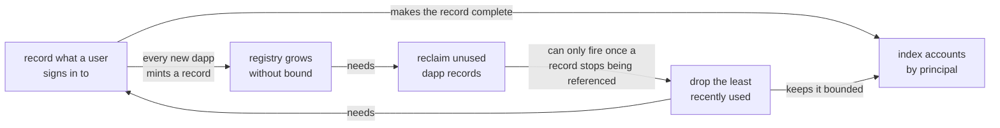
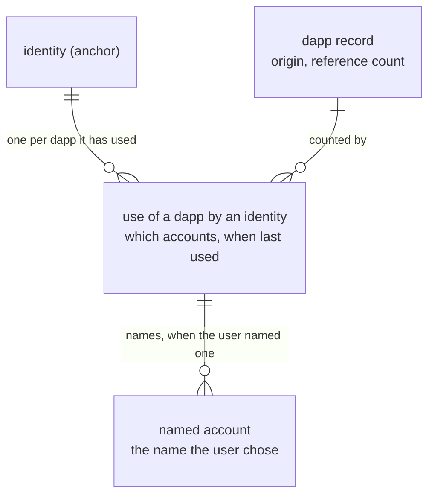

# Account tracking: defaults, reaping, and principal lookup

**Authors:** sea-snake — **Date:** Aug 20, 2026

**Target audience:** Engineers, Security Reviewers

**Status:** Implementation

## Summary

Internet Identity does not record which dapps an identity uses. The account a user gets at a dapp is derived on demand — II hashes the identity number, the dapp's origin and a secret salt, and the result is the principal — so signing in writes nothing at all. Only accounts a user has explicitly named get stored, and almost nobody names one.

That has three consequences. A user cannot be shown where they are signed in. The list of dapp origins II has seen only grows, because nothing in this part of storage has ever been deleted. And there is no way back from a principal to the account behind it, which the revocable-sessions design needs in order to authorise a caller that never says who it is.

This design records a row per (identity, dapp) the first time it is used, reclaims dapp records nothing refers to any more, and indexes accounts by the principal they derive to. The three have to land together, for reasons set out below.

Recording a used dapp costs one small row rather than a whole account, and dropping that row is harmless: the account is derived, so it comes back at the identical principal the next time the user signs in there.

## Context

Internet Identity gives a user a different principal at every dapp, so two dapps cannot tell they are talking to the same person.

Those principals are derived rather than stored. II hashes the identity number together with the dapp's origin and a salt only the canister holds, and the result is the principal. No record is needed for that, and none is kept: the account a user gets at a dapp by signing in exists only as a derivation.

A user can also create a named account at a dapp, to keep a second persona at the same site. Those do need a stored record, since the name has to be kept somewhere.

So II keeps records for accounts users named, and nothing for the ones it derives on demand. Since almost nobody names an account, II has no record of which dapps an identity has used.

The derivation is one-way, because the salt is hashed in. II can produce the principal for a given identity and dapp, but cannot start from a principal and say which identity produced it.

## Problem

Three things follow.

**A user cannot be shown where they are signed in.** There is nothing to list, so neither "which dapps have I used" nor "sign me out of that one" can be answered.

**The dapp registry only grows.** II stores one record per dapp origin it has ever seen, shared across all identities, and nothing has ever been deleted from it: there is no removal path anywhere in this part of storage, and the reference counts only ever rise. That is tolerable today because only named accounts create these records. Recording every sign-in would mean every new dapp mints a record nothing will ever reclaim.

**Revocable app sessions cannot be built.** `revocable-app-sessions.md` needs the reverse direction: given the principal an app is calling with, which identity and account is that? A one-way derivation cannot answer it, so the answer has to be recorded as it is produced. The session refresh path reads that index on every call it authorises.

These are not independent:

| Change                  | Alone it fails because                                             |
| ----------------------- | ------------------------------------------------------------------ |
| Recording sign-ins      | the registry then grows forever                                    |
| Reclaiming dapp records | nothing would ever make a reference count fall, so it is dead code |
| The principal index     | it needs the record to be both complete and bounded                |

---

## Out of scope

- **Moving an account between identities.** The encoding this design introduces reserves the shape a move would need, and the constraints a future move feature must respect are noted in the specification, but no move path is designed here.
- **Showing the user their dapp list.** This makes the data exist. The settings surface that renders it is separate work.
- **Per-dapp session listing.** Covered by `revocable-app-sessions.md`, and deferred there too.

## Approach

II keeps three kinds of record in this part of storage, and it is worth seeing them before the changes:

Today the middle row only exists where a user named an account. Everything else about a sign-in is derived and stored nowhere.

**Record the use.** The first time an identity signs in at a dapp, write the middle row with no account named. That is a few bytes, against a whole account record, and it makes the row a complete list of the dapps an identity has used.

**Bound it, and drop the least recently used.** Each identity gets a limit on how many of these no-name rows it can hold. At the limit, the one used longest ago is dropped. Dropping it costs the user nothing: the account was derived, so signing in there again recreates the row and derives the same principal it had before. A row holding a live session is not eligible, so this cannot take a session away.

**Reclaim dapp records nothing refers to.** Once rows can disappear, a dapp's reference count can reach zero, and the dapp record can go with it. Its number is retired rather than reissued.

**Index accounts by the principal they derive to.** With the list complete and bounded, II can afford a map from derived principal back to the account it belongs to. That map is what the session refresh path reads to turn a calling app into an account.

The four are one change, not four. Recording every use is what makes the dapp list grow; reclaiming is what bounds it; reclaiming only ever fires because rows are dropped; and the index is only affordable once the thing it indexes is bounded. All four maintain state derived from the same row, so they share one write path.

---

## Specification

Storage shapes, the write path, caps, counters, the reap sequence and the requirement checklist are in [tracked-default-accounts-spec.md](tracked-default-accounts-spec.md).

## Implementation stages

| PR    | Change                                                                                                                                                                                                                                                          |
| ----- | --------------------------------------------------------------------------------------------------------------------------------------------------------------------------------------------------------------------------------------------------------------- |
| #4232 | [One write path for the reference list](tracked-default-accounts-spec.md#one-write-path-for-the-reference-list)                                                                                                                                                 |
| #4233 | [Monotonic application numbers](tracked-default-accounts-spec.md#the-allocator-must-become-monotonic)                                                                                                                                                           |
| #4234 | [An empty list is not a default](tracked-default-accounts-spec.md#read_account-must-stop-special-casing-the-empty-list)                                                                                                                                         |
| #4235 | [Tracking](tracked-default-accounts-spec.md#tracking-default-accounts), [eviction](tracked-default-accounts-spec.md#eviction), [caps](tracked-default-accounts-spec.md#caps-and-counters), and [reaping](tracked-default-accounts-spec.md#reaping-applications) |
| #4238 | [Index accounts by derived principal](tracked-default-accounts-spec.md#the-principal-index)                                                                                                                                                                     |
| #4240 | [Backfill the index for existing accounts](tracked-default-accounts-spec.md#backfill)                                                                                                                                                                           |

Storage lands first and is inert until something writes a tracked default, so each stage is safe to merge on its own. Reaping ships with the tracking that makes it fire.
