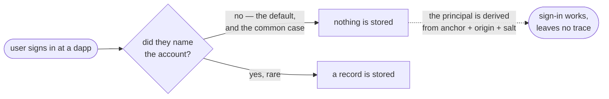
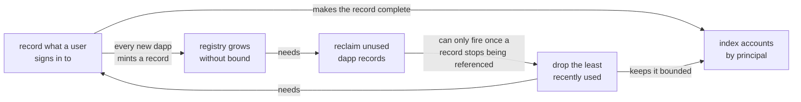

# Account tracking: defaults, reaping, and principal lookup

**Authors:** sea-snake — **Date:** Aug 20, 2026

**Target audience:** Engineers, Security Reviewers

**Status:** Implementation

## Summary

We propose that Internet Identity start recording which dapps an identity actually uses. Today it does not: the account a user gets at a dapp by default is derived on demand from the anchor number, the origin and a canister-held salt, so signing in writes nothing. Only accounts a user explicitly names get a record, and almost nobody names one.

Three things follow. A user cannot be shown where they are signed in. The registry of dapp origins II has seen only ever grows, because nothing in this subsystem has ever been deleted. And there is no way back from a principal to the account it belongs to, which the revocable-sessions design needs in order to authorise a caller that never says who it is.

This design adds all three, and they have to land together: recording every sign-in is what makes the registry grow, reclaiming unused dapp records is what bounds it, and the reverse index is only affordable once the record is bounded. Recording a default account costs one row rather than a whole account, and dropping that row is non-destructive — the account comes back at the identical principal the next time it is used.

## Context

Internet Identity hands a user a **different principal at every dapp**. Two dapps cannot tell they are talking to the same person, and that is the property the whole system exists to protect.

Those principals are *derived*, not stored. II hashes the identity's anchor number together with the dapp's origin and a salt only the canister holds, and the result is the principal. Nothing has to be written down for that to work, and nothing is: the account a user gets at a dapp simply by signing in exists purely as a derivation.

A user can also create a **named account** at a dapp — a second persona at the same site. Those do need a stored record, because a name has to live somewhere.

So II keeps records for accounts users named, and nothing at all for the ones it derives on demand. Since almost nobody names an account, the consequence is:

**II has no record of which dapps an identity has used.**

Because the salt is hashed in, the derivation is one-way: II can produce the principal for a given identity and dapp, but cannot take a principal and say which identity it came from.

## Problem

Three things follow from that, and they are the three this design addresses.

**1. A user cannot be shown where they are signed in.** Not "which dapps have I used", not "sign me out of that one" — II has nothing to list.

**2. The dapp registry only grows.** II already stores one record per dapp origin it has ever seen, and nothing has ever been deleted from it — no removal path exists anywhere in this subsystem, and no counter is ever decremented. Today that is tolerable because only named accounts create records. Start recording every sign-in and every new dapp mints a record that nothing will ever reclaim.

**3. Revocable app sessions cannot be built.** `revocable-app-sessions.md` needs the reverse direction: given the principal a dapp is calling with, which identity and account is that? The one-way derivation cannot answer it, so the answer has to be indexed as it is produced. That index is on the refresh path of the session design — it is what turns a caller into an account without the caller naming one.

And they cannot land separately:

| Change | Alone it fails because |
| ------ | ---------------------- |
| Recording sign-ins | the registry then grows forever |
| Reclaiming dapp records | nothing would ever make a reference count fall, so it is dead code |
| The principal index | it needs the record to be both complete and bounded |

---

## Out of scope

- **Moving an account between identities.** The encoding this design introduces reserves the shape a move would need, and the constraints a future move feature must respect are noted in the specification, but no move path is designed here.
- **Showing the user their dapp list.** This makes the data exist. The settings surface that renders it is separate work.
- **Per-dapp session listing.** Covered by `revocable-app-sessions.md`, and deferred there too.

## Approach

Record a default account as a reference row carrying no name — a **tracked default**. That makes the list a complete record of what an anchor uses, and costs one row rather than a whole account.

Bound it per anchor, resolving the cap by evicting the least recently used tracked default. **Eviction is non-destructive**, which is what makes a cap acceptable here: a default's principal is a pure function of `(anchor, origin)`, both permanent, so evicting drops a timestamp and the account comes back at the identical principal on next use.

With rows now able to disappear, reference counts can fall, so an application can be **reaped** once nothing references it. And with the list complete and bounded, accounts can be **indexed by derived principal**, giving II the reverse lookup that sessions need.

All three maintain state derived from the same structure, so they share a single write path.

---

---

## Specification

Storage shapes, the write path, caps, counters, the reap sequence and the requirement checklist are in [tracked-default-accounts-spec.md](tracked-default-accounts-spec.md).

## Implementation stages

| PR | Change |
| -- | ------ |
| #4232 | [One write path for the reference list](tracked-default-accounts-spec.md#one-write-path-for-the-reference-list) |
| #4233 | [Monotonic application numbers](tracked-default-accounts-spec.md#the-allocator-must-become-monotonic) |
| #4234 | [An empty list is not a default](tracked-default-accounts-spec.md#read_account-must-stop-special-casing-the-empty-list) |
| #4235 | [Tracking](tracked-default-accounts-spec.md#tracking-default-accounts), [eviction](tracked-default-accounts-spec.md#eviction), [caps](tracked-default-accounts-spec.md#caps-and-counters), and [reaping](tracked-default-accounts-spec.md#reaping-applications) |
| #4238 | [Index accounts by derived principal](tracked-default-accounts-spec.md#the-principal-index) |
| #4240 | [Backfill the index for existing accounts](tracked-default-accounts-spec.md#backfill) |

Storage lands first and is inert until something writes a tracked default, so each stage is safe to merge on its own. Reaping ships with the tracking that makes it fire.
