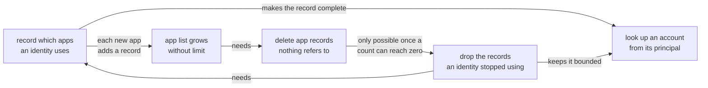

# Recording which apps an identity uses

## Summary

Internet Identity keeps no record of which apps an identity uses. The account a user gets
at an app is computed rather than stored, so signing in writes nothing at all, and only
accounts a user has explicitly named get a record. Almost nobody names one.

So a user cannot be shown where they are signed in, and nothing can go from a principal
back to the account behind it, which the revocable-sessions design needs in order to
authorise an app that never says who it is.

This design writes a small row the first time an identity uses an app, caps how many of
those an identity keeps, deletes app records nothing refers to any more, and indexes
accounts by the principal they derive to. Recording is cheap, and losing a row costs little: the account is computed, so it returns at
the identical principal the next time the user signs in there. What a dropped row does cost is
any session stored on it, which means a fresh sign-in rather than a lost account.

## Context

An Internet Identity is a number, called an identity. When a user signs in to an app with it, the app does not learn that number. Instead it receives a principal that is specific to the pair of that identity and that app, so the same user appears as a different principal at every site they visit. Two apps comparing what they see cannot work out that they are talking to the same person, which is the privacy property the whole system rests on.

II produces that principal by hashing three things together: the identity number, the app's origin, and a secret value held only inside the canister. The result is fully determined by those inputs, so II can compute it whenever it needs to and never has to store it.

We call the account a user gets this way their default account at that app. A user can also create a second account at the same app, with a name they choose, to keep two separate personas there. A named account does have to be stored, because the name has to be kept somewhere and because its principal is derived from an account number rather than from the identity and origin the default uses.

So II holds records for the accounts users have named, and no record at all for the ones it computes on demand. Because naming an account is rare, this means II has no record of which apps an identity has used.

The hash runs one way only. II can compute the principal for a given identity and app, but it cannot start from a principal and work out which identity produced it.

II does keep one record per app origin it has ever encountered, shared by all identities, holding the origin string and two counts: how many accounts name it, and how many references point at it. The second is what can fall back to zero, so it is the one that decides when an app record can go. This is how an origin gets a short internal number instead of being stored as a string in every account.

## Problem

1. A user cannot be shown where they are signed in. There is no list to render, so a settings screen cannot answer "which apps have I used" or offer to sign the user out of one.

2. Recording use would make the app list grow without limit. Nothing in this part of storage has ever been deleted. There is no removal path for any of these records, and the per-app counts only ever increase. That is survivable today because only named accounts create records. If every first sign-in at a new app created one, each would stay for the lifetime of the canister.

3. Revocable app sessions cannot be built. The design in `revocable-app-sessions.md` needs the opposite direction of the hash: given the principal an app is calling with, which identity and account does it belong to? The session refresh path asks this on every call it authorises.

   Inside the canister, deriving forwards is cheap, so a guess can be checked: the canister's salt, the account number and the origin hash to a seed, that seed encodes to a key, and the key gives a principal to compare. What the hash denies is a way to narrow the guessing. A caller arrives holding only the principal, and nothing in it points at the account it came from, so answering by computation means enumerating every account the canister holds against every origin it might have been used at until one matches. That is not a lookup with a bad constant factor. It is a scan of the whole canister for a question asked several times a minute across active sessions, and it does not fit in one message.

   Outside the canister the search is not slow, it is impossible, because the salt is secret and no guess can even be checked. That is the reason the answer is recorded rather than offered: a method that turns a principal into the account behind it would hand out precisely what the salt protects, which is the correlation this design refuses everywhere else.

Two separate concerns run through this, and each is worth doing on its own terms.

**Knowing every app an identity has used** is what lets anything be attached to that pairing. A settings screen can only list apps it has records for, and the rule that follows is the one that decides the shape of the rest: data may only be attached to something the user can see and manage. An account the settings screen cannot list is an account that must not own data, so the tracking has to cover every account, including the default ones nobody named.

**Reaching an account from a principal quickly** is a different requirement with a different consumer. Any feature that starts from the principal an app is calling with, and needs to know whose account that is, has to go that way round: revocable sessions do it on every call they authorise, and an in-app profile would do it on every read. A hash only runs forwards, so the answer has to be recorded as it is produced. Computing it on demand would mean the enumeration the Problem describes.

The two are independent in motivation and entangled in delivery. Recording use is what makes the list grow; the cap is what bounds it; deleting an app record is only reachable because the cap lets a count fall; and the index is only affordable once the thing it indexes is bounded. All four read and write the same row, so they share one write path, which keeps the counts and the index consistent without every caller having to remember to update them.

## Out of scope

- **Moving an account between identities.**  
  The encoding this design introduces reserves the shape a move would need, and the constraints a future move feature must respect are noted in the specification, but no move path is designed here.
- **Showing the user their app list.**  
  This makes the data exist. The settings surface that renders it is separate work.
- **Per-app session listing.**  
  Covered by `revocable-app-sessions.md`, and deferred there too.

## Approach

Four changes, described here in terms of what is stored rather than in terms of the code.

### 1. Write a small record the first time an identity uses an app

Today a record only exists where a user named an account. We add one for the default account as well: the same kind of row, with no name attached, holding when it was last used. It is a few bytes, against a whole account record, and it turns that row into a complete list of the apps an identity has used.

### 2. Limit how many of those an identity can hold, and drop the ones it stopped using

Each identity gets a limit of 500 of these no-name rows. On reaching it, II deletes the ones used longest ago, down to 450 so that the work is spread across later sign-ins rather than repeated on every one.

Dropping one costs the user almost nothing. The account was never stored, only computed, so signing in at that app again writes a fresh row and produces the identical principal it had before. What is lost is the record of having been there, and with it anything attached to that pairing. That is acceptable for the same reason the cap is: an app an identity stopped using for long enough to fall out of the last 450 is one whose per-app data has stopped mattering. A colour theme for an app the user has abandoned is not worth a permanent row.

Evicting rather than refusing is the choice here. Refusing at 500 would keep the oldest data and stop recording new use, which fails the concern above: the app the user is signing into right now is exactly the one a settings screen must be able to list.

One row is never dropped: one that also holds a named account, since that account cannot be recomputed. A row holding a live session is not spared, and losing one signs that browser out of that app until the next sign-in. Sparing them instead would let an identity sit above its limit for as long as something kept refreshing.

### 3. Delete an app record once no identity refers to it

With rows now able to disappear, an app's count of referring accounts can reach zero, and the record can be removed along with the entry that maps its origin string to its internal number. That number is not handed out again, so a later sign-in at the same origin gets a new one.

### 4. Keep a map from a principal back to the account it belongs to

For every account that has a row, II records which principal it derives to and which identity, app and account that principal means. This is the reverse direction the hash cannot narrow, bought once at write time instead of searched for at read time.

What is actually being decided here is narrower than it looks, and it needs one fact from the design that consumes this. Nothing in this design reads the map. Its consumer, `revocable-app-sessions.md`, records something per sign-in and has to find it again from a caller who carries nothing but a principal, so it keeps a record of its own, and that record has to say which account it belongs to. It can say so by naming the account's principal, which the map here turns into an identity, app and account, or by naming those three outright and needing no map.

Naming the principal is the choice, and the map is closer to a relocation than an addition. The three values then live once per account instead of being repeated in every record that refers to it, and what the referring record holds instead is a principal. The map is bounded by the same cap as the rows it indexes, so an entry exists only where a row does and it cannot outgrow 500 per identity.

Four other ways to answer the same question, and why this one:

1. **Let the caller carry the answer.**  
   Built, narrowed, then removed, which makes it the alternative most likely to be proposed again and the most informative of the four. The app attached a canister-signed bundle to its call as `sender_info`, and II read the account out of it instead of resolving anything.

   The first version put the identity number and the account number in the bundle in cleartext. An app learned both, and two apps holding bundles for the same person would see the same identity number, which is the correlation per-origin derivation exists to prevent. That is the wall alternative 4 hits from the other side.

   The second carried the account principal instead, and that fixed the leak: the principal is what the app is already calling with, so the bundle told it nothing new. The approach still lost, and not on secrecy. A signed bundle has to be issued for each thing it speaks for, given an expiry, attached to every call, verified on arrival and witnessed on the query, and it makes an app's agent responsible for carrying something. Once the caller can be recognised from its own signature, all of that is machinery around an answer that a lookup gives for free, so the third version removed the bundle and the app now names nothing and attaches nothing.

   One consequence is worth recording, because it decides whether this map earns its place at all. Once the bundle was gone, resolving a principal had exactly one caller left, and had the consumer's record named an account by the three values instead of by its principal, it would have had none. The map survives because that record names a principal, which is the same property alternative 2 gives up.

2. **Let the referring record name the three values directly.**  
   The closest alternative, and it looks cheaper because it needs no map at all. The saving does not survive contact: what the map costs is paid again in every record that refers to an account, and there is nothing left over to weigh against the flexibility it gives up.

   It makes the referring record the larger value. A principal is one field where an identity, an app and an account are three, and a stable map is sized for the largest value it may hold, so every referring record pays that where the map here is paid once per account.

   It also fixes something that moves. Naming a default account materialises it and changes those three values while leaving its principal untouched, so every record referring to that account would have to be found and rewritten the moment the user picks a name. Naming the principal puts the same change in one entry and touches nothing else.

   That is the flexibility being spent. One indirection leaves a single place to update when what an account is called internally changes, which is what makes naming a default cheap here and what keeps moving an account between identities possible later. The encoding this design introduces reserves the shape that move needs, and records naming the three values would have to be rewritten by it too.

3. **Compute it on demand.**  
   The enumeration described in the problem: a scan of every account against every origin, for a question asked several times a minute, and impossible from outside the canister because the salt is hashed in.
4. **Make the principal say what it is.**  
   A structured principal an app could decode would need no lookup anywhere. It also destroys the reason per-origin derivation exists, because anyone who sees a principal on chain could read the identity out of it, and two apps could compare notes. This is the one thing the whole design is built to prevent, so it is not a trade to weigh.

The map is internal. No method takes a principal and reports anything about it, because that would let anyone look up any principal they observe on chain and learn which identity it belongs to.

---

## Specification

Storage shapes, the write path, limits, counts, the deletion sequence and the requirement checklist are in [tracked-default-accounts-spec.md](tracked-default-accounts-spec.md).

## Implementation stages

Stages 1 to 3 change no behaviour and can be released in any order. Stage 4 is the one
that turns recording on, and it depends on all three. Stages 5 and 6 build the index, and
nothing may rely on a lookup succeeding until 6 reports done.

### Stage 1. Route every write through one function

Today several call sites update the rows, the per-app counts and the origin map separately. They are consolidated into a
single function that takes the new state of a row and works out the rest. The counts have to be
correct by construction before anything can rely on them reaching zero.

### Stage 2. Stop reusing internal app numbers

Numbers are currently handed out from the number of records that exist, which will collide once records can be deleted. They
come from a counter that only increases instead.

### Stage 3. Fix the read that treats an emptied row as absent

A row that has been emptied is not the same as a row that never existed, and today the read path conflates
them.

### Stage 4. Start recording use, with the limit and the cleanup

This is the behavioural change: first use of an app writes a row, the limit drops rows an identity stopped using,
and an app record with no remaining references is deleted.

### Stage 5. Maintain the principal map going forward

Every write to a row also records the principal the account derives to. From this point the map is correct for anything
written after it, and incomplete for what came before.

### Stage 6. Fill in the map for accounts that already exist

A background sweep walks existing rows in batches, on a timer the canister starts for itself, adding the entries stage 5 could not know
about. Until it finishes the map has gaps, so no feature may depend on a lookup
succeeding until it reports done.
