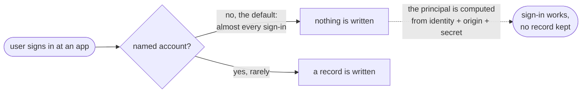
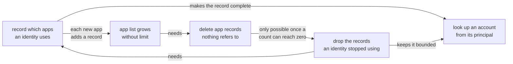

# Recording which apps an identity uses

**Authors:** sea-snake

**Date:** Aug 20, 2026

**Target audience:** Engineers, Security Reviewers

**Status:** Implementation

## Summary

Internet Identity does not record which apps an identity uses. The account a user gets at an app is computed on demand rather than stored: II hashes the identity number, the app's origin and a secret value, and the result is the principal. Signing in therefore writes nothing at all. Only accounts a user has explicitly named get stored, and almost nobody names one.

That has three consequences. A user cannot be shown where they are signed in. The list of app origins II has seen only grows, because nothing in this part of storage has ever been deleted. And there is no way back from a principal to the account behind it, which the revocable-sessions design needs in order to authorise a caller that never says who it is.

This design records a row per (identity, app) the first time it is used, reclaims app records nothing refers to any more, and indexes accounts by the principal they derive to. The three have to land together, for reasons set out below.

Recording a used app costs one small row rather than a whole account, and dropping that row is harmless: the account is derived, so it comes back at the identical principal the next time the user signs in there.

## Context

An Internet Identity is a number, called an identity. When a user signs in to an app with it, the app does not learn that number. Instead it receives a principal that is specific to the pair of that identity and that app, so the same user appears as a different principal at every site they visit. Two apps comparing what they see cannot work out that they are talking to the same person. This is the central privacy property of the system.

II produces that principal by hashing three things together: the identity number, the app's origin, and a secret value held only inside the canister. The result is fully determined by those inputs, so II can compute it whenever it needs to and never has to store it. Signing in at an app therefore writes nothing.

We call the account a user gets this way their default account at that app. A user can also create a second account at the same app, with a name they choose, to keep two separate personas there. A named account does have to be stored, because the name has to be kept somewhere and because its principal is derived from an account number rather than from the origin alone.

So II holds records for the accounts users have named, and no record at all for the ones it computes on demand. Because naming an account is rare, this means II has no record of which apps an identity has used.

Two further points matter for what follows.

The hash runs one way only. II can compute the principal for a given identity and app, but it cannot start from a principal and work out which identity produced it.

II does keep one record per app origin it has ever encountered, shared by all identities, holding the origin string and a count of how many accounts refer to it. This is how an origin gets a short internal number instead of being stored as a string in every account.

## Problem

Three problems follow from having no record of use.

**A user cannot be shown where they are signed in.** There is no list to render, so a settings screen cannot answer "which apps have I used" or offer to sign the user out of one.

**Recording use would make the app list grow without limit.** Nothing in this part of storage has ever been deleted. There is no removal path for any of these records, and the per-app counts only ever increase. That is survivable today because only named accounts create records. If every first sign-in at a new app created one, each would stay for the lifetime of the canister.

**Revocable app sessions cannot be built.** The design in `revocable-app-sessions.md` needs the opposite direction of the hash: given the principal an app is calling with, which identity and account does it belong to? A one-way hash cannot answer that, so the answer has to be written down as it is produced. The session refresh path reads it on every call it authorises.

None of the four can ship alone. Recording use is what makes the app list grow. Deleting unused app records is what bounds it, and that can only happen once a count can fall, which requires dropping records an identity no longer uses. And the lookup is only affordable once the thing it indexes has a bound.

## Out of scope

- **Moving an account between identities.** The encoding this design introduces reserves the shape a move would need, and the constraints a future move feature must respect are noted in the specification, but no move path is designed here.
- **Showing the user their app list.** This makes the data exist. The settings surface that renders it is separate work.
- **Per-app session listing.** Covered by `revocable-app-sessions.md`, and deferred there too.

## Approach

Four changes, described here in terms of what is stored rather than in terms of the code.

**1. Write a small record the first time an identity uses an app.**

Today a record only exists where a user named an account. We add one for the default account as well: the same kind of row, with no name attached, holding when it was last used. It is a few bytes, against a whole account record, and it turns that row into a complete list of the apps an identity has used.

**2. Limit how many of those an identity can hold, and drop the ones it stopped using.**

Each identity gets a limit of 500 of these no-name rows. On reaching it, II deletes the ones used longest ago, down to 450 so that the work is spread across later sign-ins rather than repeated on every one.

Dropping one costs the user nothing. The account was never stored, only computed, so signing in at that app again writes a fresh row and produces the identical principal it had before. The user sees no difference; only the record of having been there is lost.

Two rows are never dropped: one that also holds a named account, since that account cannot be recomputed, and one holding a session that has not expired, so cleaning up idle records can never take away a session the user is relying on.

**3. Delete an app record once no identity refers to it.**

With rows now able to disappear, an app's count of referring accounts can reach zero, and the record can be removed along with the entry that maps its origin string to its internal number. That number is not handed out again, so a later sign-in at the same origin gets a new one.

**4. Keep a map from a principal back to the account it belongs to.**

For every account that has a row, II records which principal it derives to and which identity, app and account that principal means. This is the reverse direction the one-way hash cannot give, and it is what the session refresh path reads.

The map is internal. No method takes a principal and reports anything about it, because that would let anyone look up any principal they observe on chain and learn which identity it belongs to.

### Why they ship together

The limit in change 2 is what makes change 1 safe to write, and change 3 is only reachable because change 2 lets a count fall. Change 4 is only affordable once 1 has made the record complete and 2 has bounded it. All four read and write the same row, so they share one write path, which keeps the counts and the map consistent by construction rather than by every caller remembering to update them.

---

## Specification

Storage shapes, the write path, limits, counts, the deletion sequence and the requirement checklist are in [tracked-default-accounts-spec.md](tracked-default-accounts-spec.md).

## Implementation stages

The work is ordered so that each stage is safe to release on its own, and so that
nothing starts writing new records before the limits that bound them exist.

**Stage 1. Route every write through one function.** Today several call sites update the
rows, the per-app counts and the origin map separately. They are consolidated into a
single function that takes the new state of a row and works out the rest. No behaviour
changes. This is a prerequisite for everything after it: the counts have to be correct by
construction before anything relies on them reaching zero.

**Stage 2. Stop reusing internal app numbers.** Numbers are currently handed out from
the number of records that exist, which will collide once records can be deleted. They
come from a counter that only increases instead. No behaviour changes yet, because
nothing deletes.

**Stage 3. Fix the read that treats an emptied row as absent.** A row that has been
emptied is not the same as a row that never existed, and today the read path conflates
them. Small correctness fix, independent of the rest.

**Stage 4. Start recording use, with the limit and the cleanup.** This is the behavioural
change: first use of an app writes a row, the limit drops rows an identity stopped using,
and an app record with no remaining references is deleted. Stages 1 to 3 make this safe
to turn on.

**Stage 5. Maintain the principal map going forward.** Every write to a row also records
the principal the account derives to. From this point the map is correct for anything
written after it, and incomplete for what came before.

**Stage 6. Fill in the map for accounts that already exist.** A background sweep walks
existing rows in batches after each upgrade, adding the entries stage 5 could not know
about. Until it finishes the map has gaps, so no feature may depend on a lookup
succeeding until it reports done.

Storage stages are inert until stage 4 turns on the writing, so releasing them early
carries no user-visible risk.
