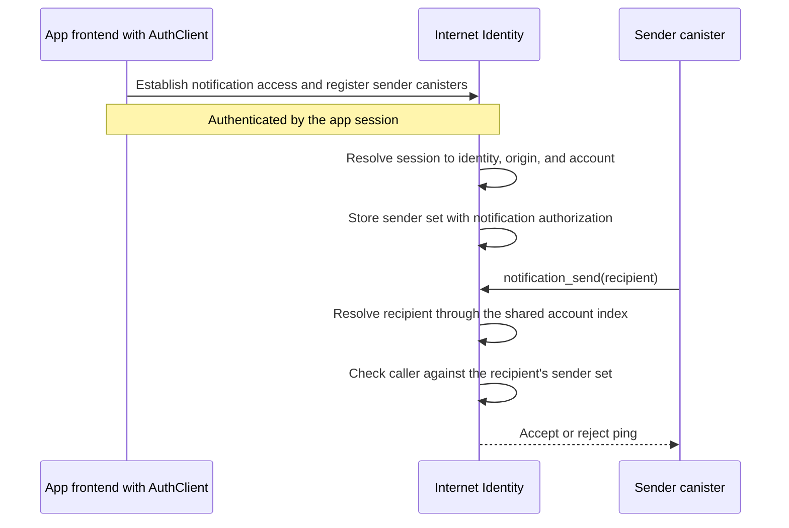

# dApp integration with II Web Push notifications

## Summary

A dApp integrates with II Web Push notifications as follows:

1. The app asks II to offer notification consent during sign-in by setting the
   `iiNotifications` option in its `AuthClient` request.
2. In the initial implementation, the app origin publishes a well-known
   document listing the canisters allowed to send notifications and serve their
   content. Once revocable app sessions are available, `AuthClient` registers
   those canisters with II through the authenticated app session instead.
3. The app backend includes the notification client and gives it a campaign: a
   list of recipient principals and the notification content for each one.
4. The client stores the content in the dApp canister, submits content-free
   pings to II, and takes care of batching, pacing, retries, partial acceptance,
   and recovery from II buffer resets.
5. II checks the user's consent and the origin's sender declaration, then sends
   a sealed ping to the user's subscribed devices.
6. The ping wakes the II service worker. It calls the pull endpoint provided by
   the client library in each sender canister, receives the current pending
   content for the user, and reconciles the notifications shown on the device.

The application owns the decision to create, update, or remove a notification.
The client library owns the durable campaign and pending-content state. II owns
consent, sender authorization, and delivery of the sealed, content-free ping.

This document describes that integration boundary. The trust model and the II
implementation are covered by [Web Push notifications](web-push-notifications.md).

> **Status:** The feature is not enabled in production and
> `internet-identity-notifications-client` has not been published. The
> interfaces below describe the intended integrator surface. Exact names may
> change before release.

The Rust and Motoko implementations live in
[internet-identity-notifications-client](https://github.com/dfinity/internet-identity-notifications-client).

## Context

II sends a content-free ping rather than the notification itself. When the ping
wakes a device, the II service worker returns to the dApp canister and fetches
the notification content as the user's per-app principal. This keeps the
content outside II, but it leaves two pieces of work on the dApp side:

1. Something has to retain the content until the device asks for it.
2. Something has to submit and, when necessary, resubmit the corresponding ping
   to II.

Making every application implement those pieces would expose the most subtle
parts of the protocol as application code. It would also give Motoko and Rust
applications different delivery behavior. The client library therefore owns
both pieces inside the dApp canister. The application supplies notification
intent, while the library turns that intent into the storage and calls required
by the protocol.

## Integration boundary

| Component           | Responsibility                                                                                                          |
| ------------------- | ----------------------------------------------------------------------------------------------------------------------- |
| App frontend        | Requests notification consent as part of the existing II sign-in request.                                               |
| App origin          | Publishes the canisters authorized to send and serve content for that origin.                                           |
| App backend         | Supplies campaigns and decides when their notifications are updated or no longer pending.                               |
| Notification client | Owns campaign progress, pending content, the service-worker query, batching, pacing, and retry.                         |
| II                  | Records consent, authorizes the sender and origin, and sends sealed content-free pings to subscribed devices.           |
| II service worker   | Pulls the current pending content from each authorized sender and reconciles it with notifications shown on the device. |

The application does not implement a push queue, the pending-notification
endpoint, or recovery from an II buffer reset. Those are part of the client
contract.

## Consent remains part of sign-in

The II authorization request gains an `iiNotifications` option:

```ts
const request = {
  kind: "authorize-client",
  sessionPublicKey,
  maxTimeToLive,
  derivationOrigin,
  iiNotifications: true,
};
```

When this option is present, II may offer notification consent for the origin
being used for sign-in. The delegated identity returned to the dApp is otherwise
unchanged. Its principal is also the recipient principal used in a notification
campaign.

Consent stays in the existing II ceremony. This design does not introduce a
second app-owned consent protocol. The option is implemented by the II window
transport today; general integration also requires it in the published
`AuthClient` API.

## Sender authorization

II has to connect the web origin that received consent to the canister that
later calls `notification_send`. The initial stack establishes this connection
through the origin. The intended design establishes it through the user's app
session.

### Initial implementation: declaration by the origin

An origin participating in notifications serves:

```text
/.well-known/ii-notification-senders
```

The document lists the canisters allowed to send and serve notification content
for that origin:

```json
{
  "senders": ["bkyz2-fmaaa-aaaaa-qaaaq-cai", "bd3sg-teaaa-aaaaa-qaaba-cai"]
}
```

II fetches the document when consent is granted and records the binding between
the origin and its senders. A later campaign is accepted only when its caller is
listed for its declared origin. On the pull side, the service worker queries
each listed canister, so list order assigns no special role to any sender.

The response is valid when it returns `200 OK`, contains valid JSON, and lists
at least one canister principal. II reads at most 20 senders. The full HTTP
response, including headers such as `IC-Certificate`, must fit within 64 KiB.
The origin must be publicly reachable over HTTPS, which excludes localhost from
this part of the flow.

Canister-hosted frontends serve this as a certified asset. The Motoko and Rust
clients provide helpers for producing the JSON body, so the application only
has to expose the resulting asset at the well-known path.

This is an interim mechanism. It lets sender authorization ship before II can
resolve an authenticated app call to its identity, origin, and account, but it
adds an HTTPS outcall to consent and an asset that every integrating origin has
to maintain.

### Intended design: registration through the app session

Revocable app sessions give an app frontend a direct authenticated path to II.
II can resolve the caller to the identity, origin, and account behind that
session, so the frontend can register the app's sender canisters without asking
II to discover them over HTTPS.

In that model, `AuthClient` is configured with the sender canister principals
and passes them to II while notification consent is established. II records the
sender set with that account's session-backed notification authorization. When
a canister sends a ping, II resolves the recipient through the shared account
index and accepts the caller only if it is registered for that account and app.
The canister no longer supplies an origin for II to trust, and the well-known
outcall is removed.



The registration is scoped per account rather than shared globally. A frontend
acting for one user can authorize a sender for that user's notification access;
it cannot establish that binding for other users. This repeats a small sender
set across participating accounts, but it preserves the trust boundary between
them.

The final API shape, sender limit, refresh period, and exact relationship
between registration and session revocation remain to be specified with the
revocable-session integration. The intended property is that sender authority
is derived from and bounded by the app session rather than becoming another
standing credential.

## The client is included in the dApp backend

Campaign and pending-notification state lives in the dApp's stable memory. Its
schema and lifecycle belong to the notification client rather than to
application code.

For Motoko, the proposed package follows the same pattern as
[`identity-attributes`](https://mops.one/identity-attributes). The package root
is a mixin included in the dApp's persistent actor:

```motoko
import Notifications "mo:ii-notification-client";
import Principal "mo:base/Principal";

persistent actor {
  include Notifications({
    iiCanisterId = Principal.fromText("rdmx6-jaaaa-aaaaa-aaadq-cai");
    origin = "https://app.example";
  });

  // Application methods and state.
};
```

The mixin injects the service-worker query and makes campaign operations
available to the containing actor. Campaign operations are not automatically
exposed as public Candid methods. The application decides which of its own
methods may create a campaign and applies its normal authorization rules there.

Rust has no equivalent to Motoko's `include`. Its client exposes the same state
and campaign abstraction, together with the minimal endpoint wiring required by
the application's canister framework. Storage and reconciliation semantics stay
the same across both implementations.

## The application supplies campaigns

A campaign has an application-defined ID and a list of notifications. Each
notification carries a stable ID, the recipient principal, the content to be
shown, and delivery options. The proposed Motoko surface is:

```motoko
await sendNotificationCampaign({
  campaignId = "weekly-summary";
  notifications = [
    {
      id = "summary-42";
      recipient = alice;
      title = "Your weekly summary";
      body = ?"Three new updates";
      urgency = ?#normal;
      expiresAt = null;
    },
    {
      id = "summary-43";
      recipient = bob;
      title = "Your weekly summary";
      body = ?"One new update";
      urgency = ?#normal;
      expiresAt = null;
    },
  ];
});
```

The exact method and field names are not final. The boundary is: the
application supplies the complete campaign, and the client owns its execution.
The `recipient` is the principal obtained from the user's II delegation for the
same app origin and account.

The campaign API is local to the containing canister. This avoids a second
Candid boundary between the application's notification logic and the library,
and it lets the application create campaigns directly from its existing state.

## Client-owned state and lifecycle

The client stores each recipient's content before asking II to send its ping.
This ordering is required because a device may wake and pull immediately after
II accepts the ping. Once the content exists, the client submits recipients to
`notification_send` in bounded batches.

II may accept part of a batch and return `retry_after_ms` for the rest. The
client records the accepted recipients, retains the unaccepted ones, and resumes
after the requested delay with jitter. A canister upgrade does not discard this
progress because the campaign and pending-content state is durable.

II's delivery buffer is transient. Each response carries a `resend_epoch`,
which changes if II loses that buffer during an upgrade. The client persists the
last epoch it observed and resubmits affected pings when the value changes.
Duplicate pings are harmless because the service worker reconciles the dApp's
current pending set by notification ID.

The client owns:

- Durable campaign state and per-recipient progress.
- Pending content indexed by recipient and notification ID.
- Storage of content before submission of its ping.
- Bounded batching, pacing, and retry using `retry_after_ms`.
- Partial acceptance and terminal recipient rejections.
- Persistence and handling of `resend_epoch`.
- Resumption of incomplete campaigns after a dApp canister upgrade.
- Update, removal, cancellation, and cleanup of pending notifications.
- The service-worker query and, for the initial implementation, well-known
  document helpers.

II still validates the sender, origin, consent, recipient, and device
subscription for every notification. The client coordinates a campaign; it
does not replace II's authorization checks.

## Content pull interface

The mixin injects the query used by the II service worker:

```candid
type PendingNotification = record {
  id : text;
  title : text;
  body : opt text;
};

service : {
  ii_pending_notifications : () -> (vec PendingNotification) query;
};
```

The service worker calls this query as the user's per-app principal. The client
uses `caller` to return that recipient's complete pending set. The application
does not implement or call this method itself.

Every sender listed by an origin may own notification content. The service
worker queries all of them and reconciles results independently per canister. A
failed query leaves that canister's previously displayed notifications alone;
a successful empty response closes them.

## Updating and removing notifications

The application remains the source of truth for whether a notification should
still exist. It expresses changes through the client library.

Replacing the content while retaining the same notification ID updates the
displayed notification after the next successful ping and pull. Removing the ID
from the recipient's pending set and sending a new ping causes reached devices
to close it after reconciliation.

This is set reconciliation rather than a stream of notification commands. A
device that misses intermediate pings still converges on the dApp's current
pending set the next time it wakes.

## Status semantics

II reports admission into its transient buffer, not delivery to a device. The
client therefore exposes campaign progress using admission states:

| State            | Meaning                                                 |
| ---------------- | ------------------------------------------------------- |
| `pending`        | The recipient has not yet been accepted by II.          |
| `sent`           | The ping was accepted into II's buffer.                 |
| `no_consent`     | II cannot notify the recipient for this origin.         |
| `not_subscribed` | Consent exists, but no device can currently be reached. |
| `invalid`        | The request or expiry is invalid.                       |

Neither II nor the client receives a device receipt, so the API does not expose
a `delivered` state.

## Resulting integrator surface

The design leaves four concepts visible to application code:

1. The `iiNotifications` sign-in option.
2. The sender canister configuration. The initial implementation exposes it as
   a well-known document; the intended design registers it through
   `AuthClient` and the app session.
3. The Motoko mixin or equivalent Rust client configured with the II canister
   and origin.
4. Campaigns containing recipient principals and notification content.

The Web Push subscription, VAPID credentials, payload encryption, II delivery
buffer, service-worker pull protocol, retry policy, and durable campaign schema
remain below that boundary.
