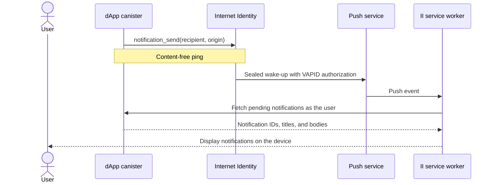
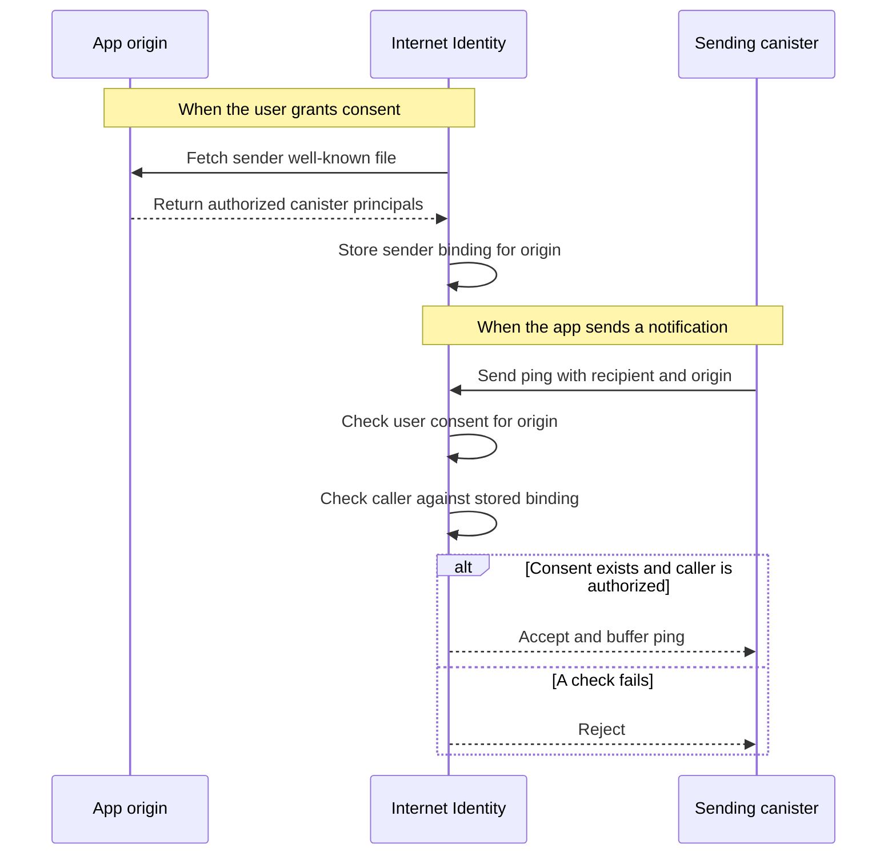

# Web Push notifications

**DApp integration design:** [dApp integration with II Web Push notifications](web-push-notifications-integration.md)

**PR-stack follow-ups:** [Web Push notification TODOs](web-push-notifications-todos.md)

## Summary

A dApp cannot reach a user once it has been closed. It can implement Web Push itself, but that means maintaining its own permission flow, service worker, VAPID keys, subscriptions, and delivery infrastructure. Every app must ask separately, and on iOS the app must first be installed on the Home Screen.

This design makes Internet Identity the shared push origin. A user grants notification permission to II once, subscribes each device once, and grants consent separately to each app. A consented app sends II a content-free ping addressed to the per-app principal it already knows. II wakes the user’s devices, and the II service worker fetches the notification content from the app as the user.

II never receives the notification title or body. It holds consent and delivery state, not messages.

The initial implementation has three pieces of interim plumbing. It keeps its own principal-to-anchor index until the shared account index lands. It discovers sender canisters through a well-known file until an app frontend can register them through a revocable session. It uses device-signed VAPID JWTs because the IC cannot currently create the required P-256 signatures. These can be replaced without changing the notification model.

Delivery is buffered and best-effort. The current dispatcher processes approximately 250 device deliveries every two seconds. Since one ping can fan out to several devices, the number of pings processed in each dispatch depends on the recipient device count. The batch size is a bound on delivery work, not a throughput guarantee.

## Context

Web Push is the browser mechanism for waking a service worker after its page has been closed. A browser subscription contains an endpoint at a browser push service, together with the key material needed to encrypt a payload for that browser.

Sending to the endpoint uses two separate protocols:

- RFC 8291 encrypts the payload so only the subscribed browser can read it.
- VAPID authenticates the sender to the push service using a P-256 public key and a signed JWT.

The JWT identifies the target push-service origin in its `aud` claim and carries a short expiry. The push service verifies the signature before accepting the request.



## Problem

1. **A closed app cannot reach its user.**  
   Building Web Push separately in each dApp creates enough infrastructure and permission friction that most apps do not implement it.

2. **Central delivery must preserve II’s privacy properties.**  
   II must not expose the identity behind a per-app principal. A sender authorized for one origin must not be able to use consent granted to another. II should neither read notification content nor keep a message history.

3. **Notification traffic must not interfere with sign-in.**  
   One ping can result in several HTTP outcalls, and a broadcast can create thousands of deliveries. The work must remain bounded and separate from II’s authorization path.

4. **VAPID requires a signature II cannot currently produce.**  
   Web Push services expect a P-256-signed JWT. The existing IC signing facilities do not provide that primitive in the form required by VAPID.

5. **Throughput is limited by the number of HTTP outcalls the subnet can support.**  
   Every device delivery currently requires a separate HTTP outcall. Notification throughput is therefore bounded by subnet outcall capacity rather than only by the dispatcher batch size.

## Out of scope

- An inbox, notification history, or read receipts.
- Exactly-once delivery.
- Supporting iOS Web Push outside an installed Home Screen PWA.
- Providing high-throughput broadcast guarantees in the first release.

## Approach

### 1. One browser permission, with consent per app

The user grants notification permission to II. Each browser installation then registers one Web Push subscription with II.

Browser permission and consent to a specific app are separate. Browser permission means II may display notifications on the device. App consent means a particular origin may reach the identity. Subscribing a device does not give every app permission to use it.

A user can mute an app without revoking consent, and can remove an individual device without changing which apps are allowed.

### 2. Resolve the recipient through an internal index

An app sends to the same per-app principal it already uses for the account. It never receives or passes an anchor number.

Since principal derivation cannot be reversed, granting consent currently writes an internal mapping from the recipient principal to the anchor. The send path uses this mapping to locate the identity and its subscribed devices.

#### What changes later

Tracked default accounts introduces a shared account-by-principal index. Once that index is available and its backfill has completed, the notification send path should use it and remove the notification-specific mapping.

### 3. Authorize sender canisters

The caller of `notification_send` is a canister principal, but the consent belongs to a web origin. II therefore needs proof that the caller is allowed to represent that origin.

#### Initial implementation: declaration by the origin

Each app serves:

```text
/.well-known/ii-notification-senders
```

The file lists the canisters allowed to send for the origin. II fetches it over HTTPS when consent is granted and records the binding. At send time, the caller declares the origin and is accepted only if the user consented to that origin and the recorded binding names the caller.

This gives both sides a role. The canister declares which origin it is sending for, and the origin declares which canisters may represent it.



An unauthenticated sender-registration method was considered and rejected. A canister principal does not prove control over a custom web origin. Accepting the origin as an unchecked parameter would let a canister claim another app's consent.

The response limit for the well-known outcall must include headers as well as the JSON body. In particular, the `IC-Certificate` header of a certified asset can be several kilobytes.

#### What changes with revocable app sessions

The well-known file is an interim mechanism. A revocable app session gives the app frontend an authenticated path to II from which II can resolve the identity, origin, and account. The frontend can then register its sender canister principals while notification consent is established.

II stores that sender set with the account's session-backed notification authorization. At send time it resolves the recipient through the shared account index and checks the calling canister against that recipient's registered set. The backend no longer declares an origin, and consent no longer performs an HTTP outcall.

The binding is scoped per account. A frontend acting through one user's session may authorize a sender for that user's notification access, but it cannot establish the same trust decision for another user. This costs a small sender set per participating account and avoids treating one user's declaration as trusted data for everyone.

The exact registration interface, limits, refresh rules, and migration from the well-known binding remain part of the revocable-session integration.

### 4. Send a ping and pull the content

The dApp does not pass notification content to `notification_send`. After II resolves and authorizes the request, the encrypted Web Push payload sent to the device contains only the app origin.

When the service worker receives the push event, it checks that the origin matches one for which consent and delivery state exist. It then authenticates to the dApp as the account that granted consent and fetches the full set of notifications currently pending for that principal.

Each notification has a stable ID chosen by the dApp. The service worker compares the returned set with the browser notifications already shown for that origin:

- New IDs are displayed.
- Existing IDs are updated in place.
- Notifications that are no longer returned by the dApp are closed.

The notification ID is also used as the browser notification tag, which prevents repeated pulls from stacking duplicate notifications.

Carrying the content through II was rejected because it would allow II to read every notification and would make storage grow with notification traffic. Pulling the content keeps the dApp as the source of truth and leaves II with no inbox to retain or leak.

### 5. Seal the Web Push payload when consent is established

Although the payload contains no user-visible content, Web Push still requires it to be encrypted separately for each browser subscription according to RFC 8291.

The payload identifies the app origin and does not change between sends. II therefore seals it when consent is granted or when the device subscription changes. Delivery can then reuse the prepared payload without performing encryption for every notification.

Doing this work on the send path would repeat the same cryptographic operations for every device in a broadcast. Sealing ahead of time keeps encryption out of the delivery path and prevents it from becoming another throughput bottleneck.

### 6. Use device-signed VAPID JWTs for the first version

Every Web Push request must carry VAPID authentication. The straightforward design would give II a VAPID private key and have it sign a short-lived JWT for each push-service origin. II cannot currently produce the required P-256 signature.

The first version moves this signing step to the device:

1. The frontend generates a P-256 VAPID key pair.
2. It creates one JWT signing input for each 24-hour validity window.
3. It signs each input locally.
4. It uploads the public key and the signature pool with the subscription.
5. At delivery time, II selects the signature for the current window and reconstructs the compact JWT.

The pool contains up to 30 signatures and covers approximately 30 days. The frontend checks the remaining coverage and refreshes the pool before it expires.

II stores the public key, issue time, and raw signatures. The JWT header and payload are reconstructed from a fixed template. That byte layout is a wire contract between the frontend and backend because a signature is valid only for the exact input the device signed.

This works without a canister-held private key, but it adds state and lifecycle management per device. A device with an exhausted pool cannot receive pushes until the pool is refreshed.

#### What changes later

The intended design is for II to manage the VAPID key and sign JWTs during delivery. This requires P-256 signing support and coordination with the node or core team.

Once that support is available, device subscriptions no longer need to upload signatures, the frontend no longer needs to refresh a pool, and II signs the JWT for the target push-service origin when it sends.

The dApp API and content-pull interface remain unchanged. Only the authentication between II and the push service changes.

### 7. Keep the delivery buffer transient and bounded

Accepted pings enter a bounded FIFO buffer in heap memory. The buffer is lost during an upgrade.

A durable queue was rejected because its size would follow notification traffic and it would introduce another persistent workload into the sign-in canister. A bounded transient buffer limits the work and storage a burst can create.

The send response includes a `resend_epoch`. The epoch changes when the buffer is lost, allowing a sender to detect that previously accepted work may need to be sent again.

An accepted response means the ping was queued. It does not mean the push service or device received it.

### 8. Deliver on a timer and remove dead devices

A recurring timer processes approximately 250 device deliveries every two seconds. A single ping can produce several deliveries, one for each usable subscribed device, so a batch can consume fewer than 250 pings.

A device is skipped if its subscription, sealed payload, or VAPID coverage is missing or expired. Each remaining delivery is sent through a non-replicated management-canister HTTP outcall, so one logical delivery produces one push rather than one push per subnet replica.

II makes one attempt per device and does not maintain its own retry queue. A `410 Gone` response means the subscription is dead, so II removes the subscription and its associated seals and JWT pool.

The fixed timer is sufficient for the first version. An event-driven kick when a ping is accepted can reduce latency later without changing the interface.

### 9. Treat throughput as an open capacity question

Processing approximately 250 deliveries every two seconds does not mean II can sustain 125 delivered notifications per second.

Every device delivery requires a separate HTTP outcall. Practical throughput depends on the number of devices per recipient, concurrent outcall limits, subnet capacity, push-service latency, and other HTTP outcall workloads in II.

The currently measured safe limit is approximately 65 concurrent deliveries per second without stalling the subnet. This is the initial operating limit for notification delivery, regardless of the dispatcher’s nominal batch rate.

The core team has indicated that the subnet limit could potentially be raised to approximately 1,000 to 2,000 HTTP outcalls per second, but reaching that range would require work on their side. Whether that work is needed depends on adoption and the delivery volume observed after rollout.

A broadcast can still be accepted faster than it is delivered, and a sustained burst can fill the bounded buffer.

The first rollout therefore needs metrics for:

- Accepted and rejected sends.
- Buffer occupancy and age.
- Pings that expire before delivery.
- Device deliveries produced per ping.
- HTTP outcall latency and status.
- Exhausted VAPID JWT pools.
- Dead subscriptions.
- Active devices and app consent.

The measurements determine the next step. The preferred direction is to increase HTTP outcall throughput with the core team. If the canister path cannot support the required volume, delivery could instead move to a Web2 dispatcher while consent and recipient authorization remain in II.

A Web2 dispatcher changes the operational and trust model, so it should be considered only after the canister path has been measured under representative traffic.

## Depends on work still in flight

### Revocable app sessions

The current implementation records standing consent against the per-app principal. That consent exists independently of the app session.

The intended model addresses and refreshes notifications through a revocable app session. The app frontend also registers its sender canisters through that authenticated session, replacing the well-known file and its consent-time HTTP outcall. Ending the session then prevents the app from continuing to refresh its notification access or sender authority, and the service worker fetches content using the account associated with that session.

Standing consent is an interim model that allows the notification path to be built and tested before sessions land. It should not become a separate permanent session mechanism.

### Tracked default accounts

The notification stack currently has its own principal-to-anchor index. Once the shared account-by-principal index is available and backfilled, the notification-specific index should be removed.

### P-256 signing

Replacing the device-signed JWT pool is independent of tracked accounts and sessions. It requires separate coordination with the node or core team.

### iOS opt-in

On iOS, Web Push is available only when II is installed on the Home Screen.

The current flow discovers this after the subscription attempt fails. Before rollout, II should detect iOS and standalone display mode first, explain the installation requirement, and resume the subscription flow when the user opens the installed PWA.
