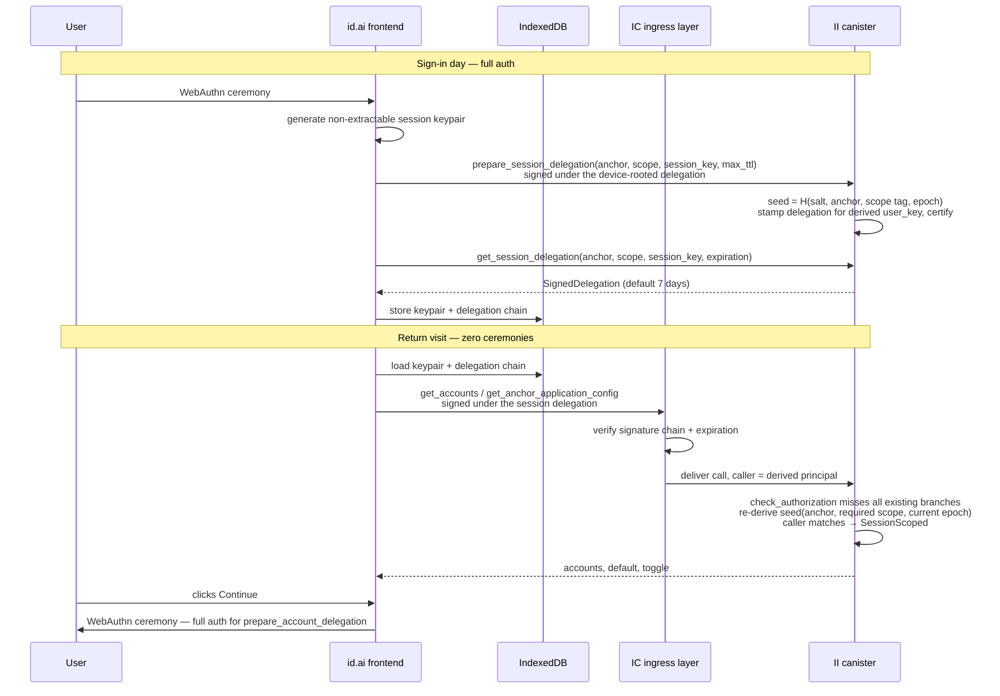

# Persist the "multiple accounts" toggle in the backend

**Date:** 2026-06-10
**Updated:** 2026-06-11 — added the [Scoped session delegations](#scoped-session-delegations-for-low-stakes-calls-addendum) addendum.

## TL;DR

The "Enable multiple accounts" toggle on the authorize screen is in-memory only and resets on every page load and every identity switch. I propose persisting it per `(anchor, application)` by extending the existing `AnchorApplicationConfig` stable structure on the backend (please see [why not on browser storage](#dont-persist-use-browser-localstorage) below). Marginal storage is a few bytes per row where the toggle is set, with zero overhead for users who never enable it. No new storage map, no migration.

**Addendum:** persisting the toggle backend-side makes its reads and writes canister calls, and today every canister call rides on a device-rooted delegation capped at ~30 minutes — so a returning user pays a full WebAuthn ceremony just to _render_ their persisted preference. The addendum designs **scoped session delegations**: longer-lived delegations on a canister-derived, scope-specific seed that authenticate low-stakes calls (the toggle and its neighbouring account reads) without a fresh passkey ceremony. The toggle is the first consumer.

## Context

### What "multiple accounts" is today

A toggle on the new-styling authorize flow (`src/frontend/src/routes/(new-styling)/authorize/views/ContinueView.svelte`). When the user enables it:

- The frontend calls `get_accounts` + `get_default_account` for the current origin.
- The user can create / rename / delete up to 5 named accounts per origin and pick a default.
- The toggle gates the UI — when off, the user sees the single-default-account view; when on, the per-app account list.

### What's already persisted

The accounts themselves and the default selection are fully persisted backend-side:

- `StorableAccount` — name + seed material (`src/internet_identity/src/storage/storable/account.rs`)
- `StorableAccountReferenceList` — which accounts belong to which `(anchor, application_number)`
- `AnchorApplicationConfig` — per-`(anchor, application)` config, today just `default_account_number`
- Candid surface: `get_accounts`, `create_account`, `update_account`, `set_default_account`, `get_default_account`

`AnchorApplicationConfig` is keyed by `(AnchorNumber, ApplicationNumber)`, the `application_number` being looked up from `origin` via `lookup_or_insert_application_number_with_origin`.

### What's not persisted

The toggle itself. `isMultipleAccountsEnabled` lives as Svelte `$state` in `ContinueView.svelte` (line 48). It is reset to `false` on identity switch (line 90, PR #3721) and lost on every reload, browser change, and device change. It is not in localStorage either.

## Problem

A user enables multiple accounts on dapp X, creates three named accounts, returns the next day:

- The accounts are still there on the canister.
- The toggle is off, so the UI shows the single-default-account view and hides them.
- The user has to re-enable the toggle to even see their own accounts.

The same happens on every device, every identity switch, every reload. This silently regresses the user's chosen account-management mode to the default each time.

## Goals

- Persist the toggle per `(anchor, origin)` so it survives reloads, identity switches, and device changes.
- Minimal storage and call-cost overhead.
- Forward-compatible: leave room for further per-app preferences without re-versioning Candid each time.

## Non-goals

- Persisting other UI chrome (theme, layout, etc.) — see "Where this data should live" below.
- Generalizing `AnchorApplicationConfig` into an open key-value map.
- Changing the existing account / default-account storage or APIs.

## Proposal

### Storage change

Extend `AnchorApplicationConfig` (`src/internet_identity/src/storage/storable/anchor_application_config.rs`) with one additive cbor field:

```rust
#[derive(Encode, Decode, Default, Clone, Ord, Eq, PartialEq, PartialOrd)]
#[cbor(map)]
pub struct AnchorApplicationConfig {
    #[n(0)]
    pub default_account_number: Option<StorableAccountNumber>,

    #[n(1)]
    pub multiple_accounts_enabled: Option<bool>,
}
```

Because the struct uses `#[cbor(map)]`, the new field is wire-compatible with already-written entries — old data decodes with `multiple_accounts_enabled = None`. No migration code.

### Storage convention

Match the existing "skip the empty state" convention:

| Row state                                                                  | Interpretation                  |
| -------------------------------------------------------------------------- | ------------------------------- |
| No row in the BTreeMap                                                     | Toggle off, default = synthetic |
| Row with `default_account_number: None`, `multiple_accounts_enabled: None` | Toggle off, default = synthetic |
| Row with `multiple_accounts_enabled: Some(true)`                           | Toggle on                       |
| Row with `multiple_accounts_enabled: Some(false)`                          | Toggle off, explicitly set      |

We **only write** a row when the user enables the toggle (`Some(true)`) — turning it off writes `Some(false)` if the row already exists for other reasons (a default is set), otherwise the row is left absent. We do not delete rows when the user turns the toggle off, matching today's behavior for `set_default_account(account_number = None)`.

The mapping from row state to user-visible state is wrapped in a single helper in `account_management.rs` so callers never have to reason about the distinction.

### Candid surface

Add two methods:

```candid
get_anchor_application_config :
    (IdentityNumber, FrontendHostname) ->
        (variant { Ok : AnchorApplicationConfigInfo;
                   Err : GetAnchorApplicationConfigError }) query;

set_anchor_application_config :
    (IdentityNumber, FrontendHostname, AnchorApplicationConfigInfo) ->
        (variant { Ok;
                   Err : SetAnchorApplicationConfigError });

type AnchorApplicationConfigInfo = record {
    default_account_number : opt AccountNumber;
    multiple_accounts_enabled : opt bool;
};
```

Rationale for a dedicated endpoint rather than bundling into `get_default_account`:

- `AccountInfo` is per-_account_; this is per-_application_. Conflating them confuses the model.
- A dedicated endpoint gives a natural home for future per-application preferences without churning the Candid surface again.

`set_default_account` and `get_default_account` remain unchanged. `set_anchor_application_config` is allowed to set or clear _either_ field; the two never need to be set atomically.

### Frontend wiring

In `ContinueView.svelte`:

1. On authentication for the current origin, call `get_anchor_application_config` (alongside the existing `get_default_account`), and bind the returned `multiple_accounts_enabled` to `isMultipleAccountsEnabled`.
2. When the user flips the toggle, call `set_anchor_application_config` with the new value. Fire-and-forget; failure is non-blocking (the local state still reflects the user gesture).
3. Drop the identity-switch reset on line 90. The new value will be loaded for the next identity instead.

## Storage cost

Per-row cost of the new field:

| Case                                                           | Extra bytes vs. today                                             |
| -------------------------------------------------------------- | ----------------------------------------------------------------- |
| Row exists, toggle never set (`None`)                          | 0 (field omitted in cbor map)                                     |
| Row exists, toggle set to `Some(true)` or `Some(false)`        | ~3 bytes                                                          |
| Row created solely because of the toggle (no default ever set) | ~50–70 bytes (16-byte key + small value + BTreeMap node overhead) |

Order-of-magnitude projection:

- Realistic (~5% of active anchors enable on ~1–2 dapps): **~5 MB total** across the canister.
- Pessimistic (every anchor enables on every dapp): **<1 GB**.

Against the canister's stable memory footprint, both numbers are negligible. The cbor-additive encoding means we pay nothing for users who never touch the toggle.

## Call costs

- **Reads** — one extra query call on the authorize page (`get_anchor_application_config`) — cycle-free, runs in parallel with `get_default_account` / `get_accounts`. Negligible.
- **Writes** — one update call per toggle flip. Toggle flips are rare user gestures; cost is comparable to `set_default_account`.
- **Storage growth** — additive cbor field, no migration write amplification at upgrade.

## Privacy and auth

- **Caller authorization**: `set_anchor_application_config` requires the caller to be authenticated as a device of the anchor, same model as `set_default_account`. _(Amended by the addendum: both new endpoints additionally accept a session-scoped caller carrying the `account_management` scope — see [Endpoint opt-in](#endpoint-opt-in-and-the-default-deny-rule).)_
- **New information leaked**: none. The `(anchor, application_number)` association already exists via `StorableAccountReferenceList` and `AnchorApplicationConfig.default_account_number`. The toggle adds one bit to a relation that's already on the canister.
- **Cross-origin**: the frontend always writes for the current origin, derived from the authorize request, not from caller input. Same surface as the existing account-management endpoints.

## Where this data should live

II is identity infrastructure, not a general-purpose preference store. The boundary we propose:

> **`AnchorApplicationConfig` holds preferences that change _identity behavior_ per application — not UI chrome.**

The multiple-accounts toggle qualifies because it determines:

- Which accounts a dapp sees in the response.
- Which auth path runs (single-default vs. account-picker).

`default_account_number` is already there for the same reason. The toggle is the next field in the same category.

UI chrome (theme, layout, animation prefs) does **not** qualify and should not be added to this struct. We explicitly document this in a doc-comment on `AnchorApplicationConfig` so future additions are deliberate. If the team later wants a generic per-anchor preference store, it should be a separate construct with its own design discussion — not a quiet drift in scope here.

The value proposition of persisting backend-side (rather than localStorage) is **cross-device sync**: a user who enables multiple accounts on their phone sees the same view on their laptop. That's the unique capability II offers as a central identity layer, and it's the reason this data belongs here rather than in the browser.

There is also a maintenance argument independent of cross-device sync: **related state for one feature should live in one place**. The accounts, their names, their seeds, and the default selection are all stored backend-side. Putting the toggle that gates the whole feature in browser storage would split the persistence layer for a single feature across two systems with different lifetimes, different failure modes, different test surfaces, and different debugging stories. Every future change to multi-accounts ("can a dapp clear all accounts?", "what happens when the user resets their browser?", "how do we expose this in stats?") would have to reason about both halves and keep them in sync. Concentrating the state in `AnchorApplicationConfig` keeps one code path, one storage contract, one place to look when something goes wrong.

## Alternatives considered

### Identity-level metadata (`MetadataMapV2`, `identity_metadata_replace`)

Stash the toggle under a key like `"account_settings:<origin>"` in the existing identity metadata bag.

Rejected because:

- Wrong scope — identity metadata is anchor-global, not per-application. We would re-implement origin keying inside an unstructured map.
- Loses type safety; everything becomes a string blob.
- Pollutes a shared map used for unrelated purposes.

### Side-table `StableBTreeMap<(AnchorNumber, ApplicationNumber), ()>`

A dedicated map of "(anchor, app) pairs where the toggle is on."

Rejected because:

- Same per-row overhead as adding a new row to `AnchorApplicationConfig`.
- Duplicates the BTreeMap that already exists for this exact key.
- Splits per-application config across two data structures, harming locality.

### Pack the toggle into `default_account_number`

Redefine the field as an enum `Default { Synthetic { multi_enabled: bool }, Numbered(AccountNumber) }`.

Rejected because:

- Saves ~3 bytes per row at the cost of conflating two unrelated concepts.
- Requires non-trivial migration code (the cbor representation of the field changes).
- Couples future toggles to this enum.

### Bundle the toggle into `get_default_account` / `AccountInfo`

Add `multiple_accounts_enabled` to whatever `get_default_account` already returns.

Rejected because:

- `AccountInfo` is per-account; the toggle is per-application. Mixing them is a category error and will look stranger as more per-application fields are added.
- A dedicated endpoint gives a clean extension point.

### Don't persist; use browser localStorage

Rejected because:

- Doesn't survive cache clear, profile change, or device switch.
- Loses the cross-device-sync value-prop that makes II a useful identity layer.
- **Splits the persistence layer for a single feature across two systems.** The accounts, names, seeds, and default selection already live in stable memory; the toggle would live in the browser. That means two storage contracts, two failure modes (canister upgrade vs. browser cache clear), two debugging stories, and two test surfaces — all for one feature. Every future change to multi-accounts would have to reason about both halves and keep them coherent (e.g., what does it mean for the toggle to be "on" in localStorage when the backend has no accounts for this origin?). The cost compounds with every subsequent change.
- **Diverges from the surrounding pattern.** `default_account_number` — the closest sibling to this toggle — is already persisted in `AnchorApplicationConfig`. Storing the toggle elsewhere creates an arbitrary split inside the same logical config object: half its fields backend-side, half browser-side. Any future per-application preference would face the same choice, with no principled answer.
- **Hurts observability.** Backend-side state can be counted and reported in `stats/event_stats/`. Browser-local state is invisible to the canister, so we lose the ability to answer basic product questions like "how many users have multi-accounts enabled" without bolt-on client telemetry.

## Migration and rollout

- **Migration**: none. The cbor `#[cbor(map)]` encoding makes `#[n(1)]` additive. Existing data decodes with `multiple_accounts_enabled = None`. New data with the field set encodes the extra ~3 bytes.
- **Rollout**: ship backend first (new candid + storage + tests), then frontend wiring. There is no flag to gate this — the frontend simply starts calling the new endpoint, which returns `None` for users who never enabled it (preserving today's behavior).
- **Rollback safety**: a previous II version can decode rows written by the new version because the extra cbor field is skipped on decode. Worst case is "the toggle field is ignored" for the duration of the rollback. No data loss.
- **Stable structures version**: unchanged. No new memory region, no new versioned schema.

## Testing

### Rust unit tests

- `account_management::get_anchor_application_config` returns defaults when no row exists.
- `set_anchor_application_config` + `get_*` round-trips both fields independently.
- Existing rows (with `default_account_number` only) decode correctly with the new struct definition — round-trip test: old-cbor bytes → decode → check `multiple_accounts_enabled = None` → re-encode → decode → unchanged.

### Playwright E2E

- Enable toggle, reload page, confirm toggle is still on and account list is shown.
- Sign out, sign back in with the same anchor, confirm toggle state.
- Sign in with a different anchor on the same dapp, confirm independent toggle state.

## Open questions

- **Do we want to evolve `get_default_account` later?** The new endpoint partly subsumes it. We can leave the old one in place forever, or deprecate it in a future cleanup. Out of scope for this change.
- **Should toggle-off delete the row when it would otherwise be empty?** Today's code doesn't compact empty rows; we mirror that here.

---

# Scoped session delegations for low-stakes calls (addendum)

**Date:** 2026-06-11

## TL;DR

Every canister call from `id.ai` rides on a device-rooted delegation capped at ~30 minutes (`DEFAULT_EXPIRATION_PERIOD_NS`), so a returning user pays a full WebAuthn ceremony just to _render_ the toggle and account list this document persists. The ceremony is the right price for `prepare_account_delegation` (it mints a principal the dapp will trust); it is the wrong price for reading a preference.

I propose **scoped session delegations**: II stamps a longer-lived delegation (default 7 days) for the browser's session keypair — not on the anchor's principal, but on a principal _derived_ from `(salt, anchor, scope, epoch)`. A new branch in the authorization path recognizes that derived principal by re-deriving it, exactly how email-recovery principals are recognized today (`check_authorization`, `src/internet_identity/src/authz_utils.rs`). Endpoints accept it only by explicitly opting into a named scope; the first and only POC scope is `account_management`, covering the toggle and its neighbouring reads.

**Zero new storage.** No new stable map, no per-key rows, no cascade machinery — issuance reuses the existing `signature_map` flow (`prepare_account_delegation` / `get_account_delegation` shape), expiry is enforced by the IC ingress layer, and revocation is one additive `session_delegation_epoch` field on the anchor: bumping it changes every derived principal, instantly invalidating all outstanding session delegations for that anchor.

## Terminology

Several words this design needs are overloaded in the codebase:

| Term                           | What it means in the code                                                                                                                                                                                                                                                                                             | Usage in this doc                                                                                        |
| ------------------------------ | --------------------------------------------------------------------------------------------------------------------------------------------------------------------------------------------------------------------------------------------------------------------------------------------------------------------- | -------------------------------------------------------------------------------------------------------- |
| **Identity / anchor**          | The numbered user record — one `nat64` per "Internet Identity" (e.g. `10042`). Three aliases across API generations: Candid `UserNumber` (legacy), Rust `AnchorNumber`, V2 API `IdentityNumber`. The backend `Anchor` struct is that record: it owns the devices, OpenID credentials, and email-recovery credentials. | "anchor" — what a session delegation acts for.                                                           |
| **Device**                     | An _auth-method entry_ on the anchor — a registered public key (`DeviceKey = PublicKey`), **not** a physical machine. `KeyType`: `Platform` / `CrossPlatform` (passkeys), `SeedPhrase` (recovery phrase), `BrowserStorageKey`. One iCloud-synced passkey is one device entry usable from many machines.               | "device" or "auth method".                                                                               |
| **`identity` (frontend code)** | An agent-js `SignIdentity` — a keypair object that signs requests (`ECDSAKeyIdentity`, `DelegationIdentity`). Unrelated to the user-facing "identity", except that `identityNumber` _is_ the anchor number.                                                                                                           | Avoided — the doc says "keypair" or "signing identity".                                                  |
| **Browser profile**            | Invisible to the backend; origin-scoped storage (localStorage / IndexedDB) plus the WebAuthn client.                                                                                                                                                                                                                  | The _holder_ of a session delegation + keypair.                                                          |
| **`SessionKey`** (Candid)      | `type SessionKey = PublicKey` — the ephemeral target key a frontend submits to `prepare_delegation` / `prepare_account_delegation`.                                                                                                                                                                                   | Same meaning here: the new endpoints take a `SessionKey` exactly like the existing delegation endpoints. |
| **Account**                    | A per-`(anchor, dapp origin)` sub-identity (Part 1).                                                                                                                                                                                                                                                                  | Unchanged.                                                                                               |

## Why not just hold a longer delegation?

The protocol already allows delegations up to 30 days (`MAX_EXPIRATION_PERIOD_NS`), and the frontend could stash one in IndexedDB. The contrast is the motivation for this design:

|                                | 30-day stored delegation                                                    | Scoped session delegation                                                   |
| ------------------------------ | --------------------------------------------------------------------------- | --------------------------------------------------------------------------- |
| Power if stolen                | **Full anchor control** — add/remove devices, mint delegations for any dapp | Five metadata endpoints (reads + two config writes)                         |
| Revocable                      | No — bearer instrument                                                      | Yes, collectively — epoch bump kills all of an anchor's session delegations |
| Dies with removed auth methods | No                                                                          | Yes — any auth-method removal bumps the epoch                               |

A delegation on the anchor's principal is full authority; a delegation on a scope-derived principal is authority over exactly the endpoints that opt into that scope, retractable in one write.

## Goals

- A returning user sees the authorize screen — accounts, default, toggle — with **zero WebAuthn ceremonies** while their session delegation is valid.
- A stolen session delegation can do strictly bounded, reversible damage and is revocable.
- Endpoints are full-auth-only **by default**; acceptance is per-endpoint opt-in with a named scope.
- Zero new stable-memory structures; additive Candid and cbor only; maximal reuse of the existing delegation machinery.

## Non-goals

- Replacing dapp-facing delegations: `prepare_account_delegation` / `get_account_delegation` / `prepare_delegation` remain device-rooted, always.
- Per-browser session management (list / revoke one). Revocation is per-anchor, all-or-nothing. If an "active sessions" UI ever becomes a product goal, see [the stored-rows alternative](#alternative-stored-registered-session-keys).
- Cross-device key sharing — cross-device continuity comes from the _data_ being backend-side (Part 1).

## How it works



### Seed derivation

```rust
/// Mirrors calculate_email_recovery_seed: H(salt ‖ length-prefixed
/// components). The scope tag is a fixed byte string per variant —
/// never derived from enum/display names, so renames can't silently
/// change principals.
fn session_delegation_seed(
    anchor_number: AnchorNumber,
    scope: SessionScope,        // tag: b"account_management"
    epoch: u32,
) -> Hash
```

One scope per delegation. A future second scope is a second derived principal and a second (cheap) prepare/get pair — no scope sets, no stored grants.

### Issuance

Two endpoints mirroring the `prepare_account_delegation` / `get_account_delegation` shape (`src/internet_identity/src/account_management.rs:299-384`): full `check_authorization`, TTL clamp (default 7 days, max 30 days), `add_delegation_signature` on the derived seed, `update_root_hash`; the query fetches the certified signature. Email-recovery-rooted callers are rejected at `prepare` — recovery sessions are transient by design and don't mint week-long credentials.

The delegation is stamped with `targets = None`, matching the account-delegation path; the derived principal carries no authority anywhere except this canister's authz branch.

### Authorization branch

`check_authorization` keeps its exact current shape and does **not** learn about session delegations — so every existing endpoint rejects session-scoped callers by construction. Opted-in endpoints call a new function:

```rust
pub enum CallerCapability {
    /// Device, OpenID, or email-recovery caller — full authority.
    FullAuth(Anchor, AuthorizationKey),
    /// Session-scoped caller — authority limited to the checked scope.
    SessionScoped(Anchor),
}

pub fn check_authorization_with_scope(
    anchor_number: AnchorNumber,
    required_scope: SessionScope,
) -> Result<CallerCapability, AuthorizationError>
```

1. Run the existing `check_authorization`. Success → `FullAuth`; full-auth callers pay nothing extra and are never downgraded.
2. Otherwise (salt-initialised guard, as in the email-recovery branch): derive `seed(anchor, required_scope, anchor.session_delegation_epoch())`, DER-encode the canister-sig key, compare `caller() == Principal::self_authenticating(public_key)`. Match → `SessionScoped`.
3. Otherwise → `AuthorizationError`, which endpoints map to their existing `Unauthorized` variants — no error-type churn.

Pure computation: one hash + DER encode against an anchor that's already loaded. **Expiry needs no canister logic at all** — the replica validates the delegation chain's expiration before the call ever reaches us. Scope isolation is principal isolation: the `account_management` principal grants nothing on any other scope, because other scopes derive other principals.

Session-scoped calls skip `activity_bookkeeping` entirely — no device `last_used` bumps, no DAU/MAU contribution (those metrics keep meaning "a person authenticated with a real auth method").

### Revocation: the epoch

One additive cbor field on `StorableAnchor`:

```rust
#[n(next)]
pub session_delegation_epoch: Option<u32>,   // None ⇒ 0
```

Bumping it changes every derived principal for the anchor; all outstanding session delegations fail authorization instantly (they remain replica-valid but match nothing). Bumps happen:

- **Automatically on any auth-method removal** — `remove`, `replace`, `openid_credential_remove`, email-recovery credential removal. Deliberately blunt: a user responding to "my device was stolen" by removing the device kills _all_ session delegations everywhere, which is the conservative outcome you want — and it's the entire cascade story, no per-root bookkeeping.
- **Explicitly** via `invalidate_session_delegations` (full auth, _including_ email-recovery — a recovering user must be able to kill sessions).

## Cardinality and issuance UX

- **Authorizes for the anchor; held per browser profile.** All browser profiles of an anchor share the same derived principal per scope — the canister cannot distinguish them (the price of storing nothing; see the alternative if that ever matters).
- **Issuance is automatic and silent**: a fire-and-forget side effect of every successful full authentication, replacing the previous chain in IndexedDB. Ceremonies re-mint, never stack. There is no extension — a stolen delegation cannot self-perpetuate; renewal always re-anchors at a real authenticator ceremony.
- **The user never selects a scope.** Scope is an API parameter chosen by the calling code, like `max_ttl` on `prepare_account_delegation`. The session delegation is strictly weaker than the device-rooted delegation the frontend holds at issuance time — the ceremony _is_ the consent. No picker, no prompt, no setting.

## Scoping

Scopes are named capability variants (a Candid/cbor enum), not numeric tiers (privilege creep by renumbering) and not per-method allowlists stored on grants (data that rots; policy belongs in code, where the set of call sites passing a scope _is_ the definition). The POC ships one variant.

**The scope rule:** a scope may contain only **non-destructive, non-allocating** operations. Reads and bounded config writes qualify; anything that creates rows, deletes anything, or mints authority does not — including future endpoints (if account deletion ever ships, it is full-auth by this rule, not by someone remembering).

### Endpoint opt-in and the default-deny rule

| Method                                                                      | Authz after                  | Session-scoped?                                                   |
| --------------------------------------------------------------------------- | ---------------------------- | ----------------------------------------------------------------- |
| `get_accounts`, `get_default_account`                                       | scoped, `account_management` | ✅                                                                |
| `get_anchor_application_config`, `set_anchor_application_config` _(Part 1)_ | scoped, `account_management` | ✅                                                                |
| `set_default_account`                                                       | scoped, `account_management` | ✅                                                                |
| `create_account`, `update_account`                                          | unchanged                    | ❌ (allocate account rows; always adjacent to a full-auth moment) |
| `prepare_account_delegation`, `get_account_delegation`                      | unchanged                    | ❌ (mint authority)                                               |
| everything else                                                             | unchanged                    | ❌ by construction                                                |

The two in-scope writes exist so the user can flip the toggle and pick a default _on the continue screen, before authenticating_ — exactly when no fresh delegation exists. Residual risk accepted: a stolen session delegation can repoint the default among the anchor's _existing_ accounts for an origin; the dapp-visible principal only changes at the next real sign-in, and the change is reversible.

## Candid surface

Additive only; reuses the existing `SessionKey`, `UserKey`, `Timestamp`, `SignedDelegation` types:

```candid
type SessionScope = variant { account_management };

type PreparedSessionDelegation = record {
    user_key : UserKey;
    expiration : Timestamp;
};

type SessionDelegationError = variant {
    Unauthorized : principal;
    NoSuchDelegation;
};

prepare_session_delegation : (IdentityNumber, SessionScope, SessionKey, opt nat64) ->
    (variant { Ok : PreparedSessionDelegation; Err : SessionDelegationError });

get_session_delegation : (IdentityNumber, SessionScope, SessionKey, Timestamp) ->
    (variant { Ok : SignedDelegation; Err : SessionDelegationError }) query;

invalidate_session_delegations : (IdentityNumber) ->
    (variant { Ok; Err : SessionDelegationError });
```

After the `.did` change: `npm run generate`.

## Frontend

- New util `src/frontend/src/lib/utils/authentication/sessionDelegation.ts` + store `src/frontend/src/lib/stores/session-delegation.store.ts`.
- Keypair: `ECDSAKeyIdentity.generate({ extractable: false })`; persist the `CryptoKeyPair` (structured-cloneable) plus the delegation chain (`DelegationChain.toJSON`) in IndexedDB via the existing `idb-keyval` dependency, one record per anchor: `{ identityNumber, keyPair, chainJson, scope, expiresAtMillis }`.
- `actorForScope(identityNumber)` resolution: (1) the `authenticationStore` actor while its device-rooted delegation is unexpired — full power, strictly better; (2) a cached actor over a second `HttpAgent` with `DelegationIdentity.fromDelegation(fromKeyPair(keyPair), chain)` if the stored chain is unexpired (local check with safety margin); (3) `undefined` — caller routes through the normal auth flow. A separate agent, not `replaceIdentity` on the shared one: the main agent's identity is load-bearing global state.
- **Mint** after every successful full auth (fire-and-forget; failure degrades to status quo). **Purge** on sign-out, identity removal, or any `Unauthorized` from a session-scoped call (epoch was bumped — whatever the reason, the chain is dead).

### `ContinueView.svelte` rewiring

1. `loadAccounts` (line 121–146) asks `actorForScope` instead of hard-requiring `$authenticationStore` — on a return visit the toggle, account list, and default render with zero ceremonies.
2. Toggle flips and default selection (lines 160–165, 213–218) go through the same resolved actor, so they work pre-auth.
3. _Continue_ (`prepare_account_delegation` via the ICRC-34 handler) and create/rename still route through `authLastUsedFlow.authenticate()` — the ceremony moves from "price of seeing the screen" to "price of signing in".
4. Part 1's identity-switch behavior is unchanged; the per-identity re-fetch just needs no ceremony when the switched-to anchor has its own stored chain.

## Failure modes

| Failure                                                   | Behaviour                                                                                 | Frontend recovery                                                                                                                |
| --------------------------------------------------------- | ----------------------------------------------------------------------------------------- | -------------------------------------------------------------------------------------------------------------------------------- |
| Chain expired                                             | Replica rejects the ingress message                                                       | FE pre-checks `expiresAtMillis` and routes to the auth flow instead of sending                                                   |
| Epoch bumped (invalidated, or an auth method was removed) | Endpoint returns its existing `Unauthorized`                                              | Purge IndexedDB record; retry with the device-rooted delegation if one is live; else defer the ceremony to the next user gesture |
| Epoch bumped between `prepare` and `get`                  | `NoSuchDelegation`                                                                        | Restart the prepare/get pair (still inside the full-auth moment)                                                                 |
| Out-of-scope endpoint called with session identity        | `Unauthorized` (default-deny)                                                             | FE wiring bug — log loudly, purge, full auth                                                                                     |
| Rollback to a pre-addendum canister                       | Scoped endpoints reject session callers; `prepare_session_delegation` is method-not-found | Feature-detect at mint time; stored chains go inert, resume on roll-forward                                                      |

What always requires a ceremony (exhaustive): signing in (`prepare_account_delegation` / `get_account_delegation`), `create_account` / `update_account`, minting a session delegation, every non-opted endpoint — whenever no live device-rooted delegation exists. Rendering the authorize screen never does.

## Security and privacy

- **Worst case with a stolen live session identity** (e.g. XSS on `id.ai`): read account names/defaults/toggle for the anchor's origins, flip the toggle, repoint defaults among existing accounts. Cannot mint delegations, touch auth methods, read `identity_info`, create accounts, or extend itself. Bounded, reversible, revocable.
- The keypair is non-extractable; the chain alone is useless without it. An XSS can drive requests while it runs in the page — the same power it has over the live UI session — but exfiltrate nothing durable.
- **Rollback caveat**: an older wasm re-encoding an anchor drops the unknown epoch field, so a bumped epoch can reset to 0 during a rollback window — _invalidated-but-unexpired_ session delegations would resurrect until re-bumped. Accepted for the POC: rollbacks are rare and short, the scope is low-stakes, and the alternative (a dedicated memory region for one u32) buys little. Called out so the acceptance is explicit.
- The canister stores no secrets and no new linkage — one optional integer per anchor.

## Costs

Zero new stable-memory structures; the epoch costs ~6 bytes on anchors that ever bump it. Per full authentication, one extra prepare/get pair — the same signature-map machinery every dapp login already runs, plus the certified-signature query. No new costs at rest, no pruning, no cascade bookkeeping.

## Rollout

1. Backend: seed function, epoch field + bump hooks in the removal paths, `check_authorization_with_scope`, three endpoints, scoped switch of the five opted-in handlers. Inert until a client mints.
2. `npm run generate`.
3. Frontend: util + store + mint hook + `ContinueView` rewiring. Kill switch is frontend-side (stop minting/using); outstanding chains age out within `MAX_TTL`.

Part 1's backend and this addendum are independent and can land in either order; the `ContinueView` rewiring wants both.

## Alternative: stored registered session keys

The richer variant we considered and deliberately deferred: the frontend registers a session _public key_ with the canister, stored as `(anchor, principal) → { scopes, expiry, rooting auth method, last_used }` in a new stable map, checked by lookup instead of derivation.

What the rows buy: **per-browser granularity** — list sessions ("Chrome on macOS, expires in 5 days"), revoke one, `last_used` timestamps, per-origin binding, and per-root cascade precision (removing one passkey kills only _its_ sessions instead of all). What they cost: a new memory region, per-row lifecycle code (cap, amortized pruning, cascade hooks on every removal path — including any future anchor deletion), registration/revocation/listing endpoints, and archive entries for register/revoke. Storage itself is a non-argument (~200 B/row ≈ ~$1/year at realistic scale) — the cost is the machinery.

Since the POC needs none of the granularity, the derived-seed design wins on every axis that currently matters. **Adopt the stored-rows variant if an active-sessions management UI becomes a product goal** — the migration is contained, because the opted-in endpoints' call sites don't change: only the recognition branch inside `check_authorization_with_scope` swaps from derivation to lookup.

Also rejected: generalizing `temp_keys` (heap state dies on weekly upgrades, and a temp key carries _device-equivalent_ power — the opposite of scoping down); canister-issued capability tokens passed as arguments (a second auth channel parallel to the caller-principal model, with bespoke replay semantics to get wrong).

## Testing

- **Unit**: seed stability fixtures (fixed inputs → fixed seed; scope tags and epochs produce distinct seeds); `check_authorization_with_scope` full-auth precedence, derived-principal match, epoch-bump miss; TTL clamp and default; email-recovery-rooted `prepare` rejected; removal paths bump the epoch.
- **PocketIC**: mint with a device-rooted caller → call `get_accounts` under the session identity → `Ok`; same identity against `create_account` → `Unauthorized`; remove a device → all session calls `Unauthorized`; `invalidate_session_delegations` ditto; upgrade with a live chain → still valid; time travel past expiration → replica rejects.
- **Playwright**: enable toggle, reload (in-memory delegation gone) → toggle and accounts render with no WebAuthn prompt, ceremony fires only on _Continue_; clear IndexedDB, reload → ceremony required to render; two anchors in one browser render independently ceremony-free.

## Open questions

- **Will we ever want per-browser session visibility/revocation?** That's the trigger to switch to the stored-rows alternative — worth a product answer before this hardens.
- Should session-scoped reads count toward any usage metric (separate from DAU/MAU)?
- Exact set of epoch-bump triggers: all auth-method removals is the proposal — confirm email-recovery credential removal belongs in the list.
- Per-origin scopes later (origin folded into the seed) if a finer blast radius is ever wanted.
