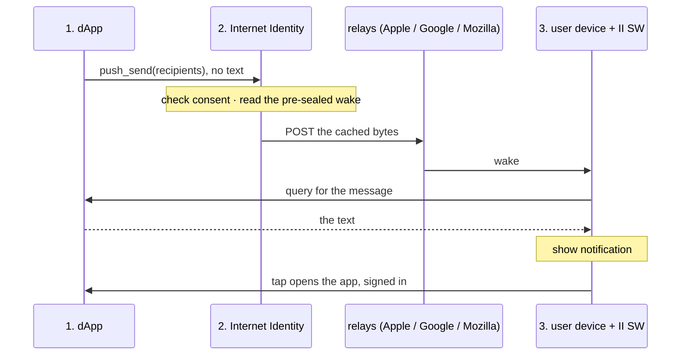
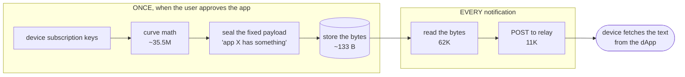
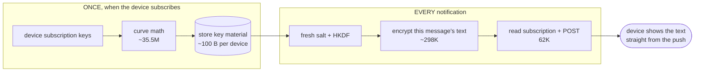

# Web Push Notifications for Internet Identity

## Introduction

II signs users into most dApps on the IC. But once the tab is closed, no dApp can reach the
user until they come back and sign in again. Push fixes that. An order fills, a margin call
hits, a message arrives, and the user sees it on their phone with the app closed.

Every dApp building this itself is a lot of duplicated work. Own keys, own encryption, own
service worker, own connections to Apple and Google, and its own permission prompt in the
browser. We do it once in II instead, and the user only ever grants notifications to II.

The notification itself carries no text. II just sends a small "app X has something for
you" ping, and the device goes and fetches the real message from the app. II never touches
the content, and sending gets almost free. Stage 2 has the details.

**Two things are still open**, both in Stage 2, and they're what this doc is really for:

1. **Do we run a web2 server for delivery, or not?** Once sealing is cached this is the only real limit left.
2. **Where does the VAPID signing key live?** On II, subnet-signed, or on that server if we end up running one.

Everything else is a proposal we're reasonably happy with. These two aren't.

## The flow



1. The **dApp** picks who to notify and calls II. The text stays with the dApp.
2. **II** checks the user agreed, and sends each device a pre-sealed ping naming the app.
3. The **device** wakes up, fetches the text from the app, shows the notification.

How II actually reaches the relays (Stage 2) isn't decided yet. Options are below.

## Stage 1: The dApp (sender)

### The send API: `push_send`

One call, one batch:

```
push_send(chunk_id, delivery, recipients)
```

- **`chunk_id`** - an id for the batch, so a retry doesn't send twice.
- **`delivery`** - relay headers (RFC 8030): `urgency`; `ttl` (how long the relay holds it if the device is offline); `topic` (a newer message with the same topic replaces an older, undelivered one).
- **`recipients`** - the target users. Nothing else, no text.

There's deliberately no field for content. If II can't be handed the text, it can't read it,
and we don't have to argue about whether it does. Personalization is free for us too, since
the dApp is the one serving each user their own text.

(The alternative design in Stage 2 does put the text in the push. That's a different design,
not a flag on this one: it needs a different cache and a different code path, so we'd pick
one and build one.)

The dApp splits its audience into chunks of ≤1000 and calls once per chunk, backing off
when II says it's busy. Either a client library handles that, or the dApp has to deal with
being throttled itself.

### Client library, or no library

Chunking, pacing and retrying is fiddly stuff. Two ways to hand it over:

- **Ship a library.** It owns the list, chunks, paces, retries, and personalizes text. *Pro:* easier to onboard dApps, and we know the tricky part is done right so nobody accidentally hammers us. *Con:* another thing we build and maintain, in some language (probably Motoko first, maybe a Rust crate).
- **No library.** dApps call `push_send` raw and do the chunking, pacing and retrying themselves. *Pro:* nothing for us to build. *Con:* everyone rebuilds the same thing, and a sloppy integration hammers us.

### Where the library runs

- **On the dApp's backend canister** - no real alternative.
- **Frontend variant** - we could offer this later for dApps that only want to notify the *current* user. Can't reach anyone else.

### Being a verified sender

II only accepts a send from the canister listed at the dApp's
`/.well-known/ii-push-senders`.

### Limitations & bottlenecks

- **The dApp is the source of truth.** II keeps no send list, so the dApp has to track who's done and who isn't, and pick up from there if its backend restarts.
- **An II upgrade drops in-flight pings.** Our queue is transient. II returns a version counter, and if it changed the dApp re-sends whatever it hadn't heard back on.
- **One dApp can only push so fast.** ≤1000 recipients per call, and the queue between canisters holds about 500 calls. So it has to pace itself rather than blast. II throttles too when it's busy.
- **The dApp now has to serve the text.** The notification doesn't carry it, so the dApp needs an endpoint the device can query, and it has to answer fast (under a second) or the user just gets a generic notification. This is real new work for the dApp, and it's the main cost of keeping II out of the content.

## Stage 2: Internet Identity

### Consent, subscriptions, sender registry

Per user, II stores which dApps they allowed (consent), which devices they subscribed (the
keys we seal with), and which canister is allowed to send for each origin.

### The buffer

II holds a queue of pending pings ("wake this device for this app") while it drains them to
the relays. The ping has no text in it, so the queue holds pointers rather than content. It
never grows with how much anyone writes.

- **Transient** - hold, send, forget. *Pro:* almost no storage. *Con:* no history, and an II upgrade wipes it so clients have to re-send.
- **Keep everything** - store every notification. Only matters if we take the alternative where II carries the text. *Pro:* history. *Con:* storage grows with volume.

### Sealing: the biggest cost

Every notification gets locked so only the target device can open it (RFC 8291). The key
comes from that device's subscription, so it's one lock per message per device. Can't be
batched, and only II can do it since only II has the key.

Right now that costs **~35.8M instructions per message** (measured), and almost all of it
is two P-256 curve multiplications. At a 20% slice of II's round that's about **28
messages/second**, roughly **100k/hour** across every dApp put together. That's the ceiling
on the whole feature.

Here's the thing though. The expensive bit, the curve math, only depends on the *device*.
Not on the message, not on who's sending it. So there's no reason to do it every time.

#### Proposal: cache the sealed blob, send routing only

If the payload is just "app X has something for you" then it never changes for that device
and app. So seal it **once, when the user approves the app**, and store the finished bytes
(~133 B). Sending is then just read the bytes and POST them. **No crypto at all.**

Measured at **~73K instructions per message**, and 62K of that is the storage read, not the
send. So **~490× cheaper** than today, somewhere around **13,000/second**.

The expensive part moves out of the send path entirely:



The device does the rest:

1. Ping arrives with no content, just "app X".
2. The service worker wakes up and reads a cached delegation from local storage.
3. It queries app X directly for the message text.
4. It shows the notification.

**II never sees the content.** The text goes straight from the dApp to the device. That's
end-to-end encryption for free, no vetKeys needed.

What it costs us:

- **Storage.** One blob per (device, app), so about 27 GB at 10M users × 2 devices × 10 apps. Against a ~500 GB limit that's fine, but it's 13× the alternative below.
- **A fast fetch.** The service worker has to show a notification almost immediately, so the query to the dApp has to land under a second. If it's slow, or the device is offline, we fall back to a generic "you have a notification".
- **Delegations.** The device needs a credential to query the dApp. Minted at approval, cached locally, renewed when it expires. That's a lifecycle to build and keep working.
- **The payload must never change.** Re-using a sealed blob is only safe because the plaintext is fixed. If someone later adds a message id or a counter without re-sealing, the encryption breaks badly. Needs a hard guard in the code.

#### Alternative: cache the key material, send the content

Instead of caching the finished blob, cache just the **key material**, which is the result
of the curve math (~100 B per device). Each message then gets encrypted fresh, so the
content can be whatever you like.

Measured at **~360K instructions per message**, about **2,800/second**. Slower than the
proposal but still ~100× better than today.

Same trick, but we stop one step earlier so each message can still be encrypted fresh:



The trade is basically the mirror image:

- **No fetch, no delegations.** The text is already in the push, so the notification shows instantly and there's no credential lifecycle to worry about.
- **Way less storage.** The key material is per *device*, not per (device, app), because the sender isn't part of the crypto at all. ~2 GB instead of ~27 GB.
- **But II sees the content.** No E2E unless the dApp encrypts it first itself.

#### Side by side

|  | Today | Cached blob + routing | Cached key + content |
| --- | --- | --- | --- |
| Per message | ~35.8M | **~73K** | ~360K |
| Throughput | ~28/s | ~13,000/s | ~2,800/s |
| Storage | n/a | ~27 GB | ~2 GB |
| Device fetch | no | **yes, must be fast** | no |
| II sees content | yes | **no** | yes |

Either way sealing stops being the bottleneck. After that the limit is how fast II can make
outbound HTTP calls, which is the next section.

#### Where the sealing runs

Either way there's a further choice:

- **Same canister as sign-in.** Take an adaptive slice of each round, always yielding to sign-in. Simplest.
- **Separate push canister or subnet.** Its own compute, so it can't slow sign-in down. More to run.

#### What we give up

Caching means we re-use II's ephemeral key for a device instead of making a fresh one per
message. The standard says to make a fresh one each time, and browsers don't check, so this
works fine. But it costs forward secrecy: if a device's cached key material ever leaks,
every message we ever sent to that device can be read, not just one.

### OPEN QUESTION: where does the VAPID key live?

**Not decided.** Every relay POST needs a VAPID signature, a token that says *who* is
sending. It isn't a content key, so this is independent of the sealing choice above and we
can pick either way.

Three places it could live, and we have no preference yet:

- **On II.** Generate it once and keep it in memory. Works today with no dependencies, but it's a stored secret and a node operator could read it out of state.
- **Subnet-signed.** The subnet signs it, so there's no stored secret at all. Needs the ES256 curve, which subnet signing doesn't support today. That's a question for the node team: can they add it?
- **On a web2 server.** If we end up running one for delivery, it signs. No key and no protocol change on II, but then every subscription is tied to that server's key, so rotating it forces everyone to re-subscribe.

Note the third option only exists if we answer the next question with "yes, a server". So
these two are linked and probably want deciding together.

### OPEN QUESTION: do we run a web2 server, or not?

**Not decided, and this is the bigger of the two.** Once sealing is cached, this is the
only thing left that limits us, so it deserves the most argument. Nothing below is a
recommendation.

A 10k-user send is ~13k relay POSTs. A subnet allows **3,000 HTTP calls in flight**
(`MAX_CANISTER_HTTP_REQUESTS_IN_FLIGHT`, subnet-wide, no per-canister limit).

That's a **buffer, not a rate**. What we get per second is `3000 ÷ round-trip time`, so it
comes down entirely to how fast the relays answer:

| relay round-trip | calls/second |
| --- | --- |
| 30 s (the adapter timeout) | 100 |
| 1 s | 3,000 |
| 300 ms | 10,000 |

The 3,000 was sized from exactly that. The IC comment says "100 req/s × 30 s worst-case
latency". **We don't know our real latency yet**, and it's worth measuring, because the
answer swings every number here by up to 30×.

Also, there's no fire-and-forget. A call holds its slot for the whole round trip whether we
wait for the response or not.

The options, roughly in order of how much we'd have to own:

- **Direct outcalls.** II POSTs each relay itself. Fully on-chain and the simplest thing to build, but ~13k calls can't be batched, so a big send drains the buffer the whole subnet shares.
- **Non-replicated outcalls.** Same thing, ~34× cheaper in cycles since only one node fetches. Doesn't change the in-flight limit at all, so it helps the bill and not the ceiling.
- **A web2 server.** II sends ~25 batched calls to a server we run and it fans out. Fits comfortably and it's cheap, but it's an off-chain piece we have to operate, and it's a single point of failure for every notification.
- **Shard across subnets.** Spread push across several subnets, each with its own buffer. Stays on-chain and raises the ceiling, but it's a lot to run.
- **Platform fan-out.** Ask the node team for a non-replicated outcall that fans out to many endpoints, so the batching lives in the platform and we run nothing ourselves. Possibly the nicest answer, but it depends on someone else building it.

Two things we'd want before picking: the real relay latency (which decides whether we even
have a problem), and whether the node team is open to the last option.

### Limitations & bottlenecks

- **Sealing, if we don't cache it.** ~35.8M instructions per message caps us at ~28/s. With caching it drops to ~73K (blob) or ~360K (key material) and stops mattering.
- **Outbound calls.** 3,000 in flight subnet-wide, shared with every other canister there. Rate is `3000 ÷ latency`, so anywhere from 100/s to 10,000/s depending on the relays. Unmeasured, and the biggest unknown in every number here.
- **Push always yields to sign-in.** Same round, same subnet, so push's slice shrinks under login load. Throughput drops exactly when II is busiest authenticating.
- **Storage.** Consent, subscriptions and the sender registry grow with users × apps, never with how many notifications get sent. Cached seals add ~2 GB (per device) or ~27 GB (per device × app) on top.
- **Which ceiling actually binds depends on relay latency.** At ~1s it's the outbound calls, at ~300ms it's sealing again. Can't say which until we measure.

## Stage 3: Relays and the user's device

### The subscription

When the user allows notifications, the browser makes a keypair for that device against
II's service worker and hands II the public half. Standard Web Push, and the encryption
scheme is fixed. Not ours to pick.

### The II service worker

A small new piece on II's frontend. It does most of the work in this design:

1. The ping arrives, the browser decrypts it, and the worker gets "app X has something".
2. The worker reads a **stored credential** for app X. It's a delegation kept in local storage, next to a key the browser won't let anything read out.
3. It queries app X directly for the text.
4. It shows the notification, named after the app. Tapping it opens the app, already signed in.

It also holds the enable screen and the off-switch.

**The credential.** Minted when the user approves the app, stored on the device, renewed
when it expires. It's deliberately weak: **read-only, and only for that one app's
canister**. If it ever leaked, all anyone gets is that user's notifications from that one
app.

**The deadline is the hard part.** The browser makes us show a notification almost
immediately, so step 3 has to come back well under a second. If it's slow, or the app is
down, or the credential expired, we show a generic "you have a notification" and the user
gets the real thing when they tap.

### Content levels

There's only one, because the API has no content field: **no text in the push**. The worker
gets "app X has something", fetches the text, and shows it. II never sees the content.

If we went with the alternative in Stage 2 instead, the text would ride along in the push
and the worker would just display it. Simpler and instant, but II reads it. One or the
other, not both.

### The relays

Apple, Google, Mozilla. The last hop. Not ours to build.

### Limitations & bottlenecks

- **iOS needs an installed PWA.** Web Push doesn't work in a Safari tab, only in a home-screen PWA. So on iOS the enable flow splits: consent in the tab, subscribe in the installed app ([flow](https://claude.ai/code/artifact/aae63f95-7c8f-4571-8ecc-6c5df964e909)). No way around it there.
- **No delivery receipt.** Web Push tells us the relay *accepted* the message, not that the device showed it. So we say "sent", never "delivered". Knowing it actually arrived would need the device to report back.
- **Relays throttle per app.** FCM, APNs and Mozilla all rate-limit by sender, so a big blast can get slowed or dropped at the relay and there's nothing we can do about it.
- **Shared permission, shared fate.** The one browser grant covers every dApp. Turn notifications off, or remove II from the home screen, and every dApp goes quiet at once. Per-app off-switches live inside II, but the OS-level switch is all or nothing.

## Interfaces

Two of them, and they're different kinds of thing. The first is II's candid, which we own.
The second is a contract dApps implement and we only specify, like the `.well-known` file.

Nothing a dApp touches mentions push, so it can't tell how the user actually gets notified
and can't influence it. The Web Push specifics sit in their own corner.

### dApp to II

```candid
type NotificationUrgency = variant { low; normal; high };

type NotificationHeaders = record {        // transport headers
  urgency      : opt NotificationUrgency;  // default normal
  expires_at   : opt nat64;                // ns. drop if still undelivered by then
  coalesce_key : opt text;                 // supersede an undelivered notification with the same key
};

type NotificationContent = record {        // only used by channels that can't fetch
  title : text;
  body  : text;
  url   : opt text;                        // deep link, same-origin as the sender
};

type NotificationRecipient = record {
  user : principal;                        // per-origin principal. no text, see the other interface
  // message : opt NotificationContent;    // reserved. web push ignores it; email/SMS use it instead of pulling
};

type NotificationRejection = variant {
  no_consent;                              // unknown user, not consented, or no devices. merged on purpose: same action for you, no leak
  invalid;                                 // malformed. sender bug
};

type NotificationSendResult = record {
  accepted       : nat32;                  // queued, not delivered. no receipts exist
  rejected       : vec record { index : nat32; reason : NotificationRejection };
                                           // index = position in the recipients array you sent
  retry_after_ms : opt nat32;              // if set, then II has no capacity to send now so wait until retry
  queue_id       : nat64;                  // different from your last call? new queue id on II cause of an upgrade, so re-send anything unconfirmed
};

// Caller must be the canister registered for the origin. ~1000 recipients max.
notification_send : (
  chunk_id   : blob,                       // idempotency. same id on retry = not sent twice
  headers    : NotificationHeaders,
  recipients : vec NotificationRecipient,
) -> (NotificationSendResult);

// Caller must be the registered sender. Lets a dApp filter its audience before
// sending. Learns nothing it wouldn't learn from `rejected`.
notification_consent_status : (vec principal) -> (vec bool) query;

// II verifies the origin really lists this canister at /.well-known/ii-notification-senders.
// Pass null as sender to deregister. II registers itself the same way, no special case.
notification_register_sender : (origin : text, sender : opt principal) -> (variant { ok; err : text });

// User consent management. Called by the user from II's own UI. NOT callable by a
// dApp: origin is a parameter, so a dApp could otherwise grant or revoke for another app.
notification_grant_consent     : (origin : text) -> (variant { ok; err : text });
notification_revoke_consent    : (origin : text) -> (variant { ok; err : text });
notification_consented_origins : () -> (vec text) query;   // from caller(), so nobody can enumerate others
```

`recipients` is a record with one field on purpose. Candid lets us add an `opt` field to a
record later, but `principal` to `record {...}` is a breaking change, so the wrapper is free
today and impossible to retrofit.

### The fetch (dApps implement this)

```candid
type Notification = record {
  id         : text;                       // the dApp's own id. the device dedups on this
  title      : text;
  body       : text;
  url        : opt text;                   // deep link, same-origin as the dApp
  created_at : nat64;                      // ns
};

ii_pending_notifications   : () -> (vec Notification) query;  // caller() is the user. must be a query, the SW is on a deadline
ii_notifications_delivered : (vec text) -> ();                // ids, after display. a query can't mutate, hence separate

// Later, for channels that can't fetch for themselves (email, SMS). II-only caller.
// Batched, so O(apps) not O(users), and inter-canister so it never touches the outcall cap.
ii_pending_notifications_batch : (vec principal) -> (vec record { principal; vec Notification }) query;
```

No arguments on the fetch: the caller *is* the identity, so there's nothing to leak in a
parameter and no token to pass around.

No version field either. If this shape ever changes we add `ii_pending_notifications_2`, try
it first, and fall back when the canister rejects with "method not found". That's how II
already evolves (`prepare_delegation` became `prepare_account_delegation`).

### The Web Push corner

Genuinely channel-specific, called by II's frontend only.

```candid
webpush_subscribe_device   : (endpoint : text, p256dh : blob, auth : blob) -> (variant { ok; err : text });
webpush_unsubscribe_device : (endpoint : text) -> (variant { ok; err : text });
webpush_vapid_public_key   : () -> (blob) query;
```

A second channel gets its own prefix next to this, and `notification_send` doesn't change.

### What's inside the sealed payload

Not candid, but it's part of the contract and it's frozen at approval time, so it belongs here.

```json
{"c":"4xhad-gd777-77775-aaacq-cai","o":"multidex.ai"}
```

`c` is the canister the service worker queries, `o` is the label on the notification. About
60 bytes, and both are stable for the life of the app, which is what makes the seal cacheable.

There's deliberately no callback URL. The method name is fixed by the spec, so the canister
id is the only variable. A URL would invalidate every device's seal on any path change, and
would mean a CORS'd web fetch instead of a canister query. The only thing that does
invalidate a seal is the app moving to a new canister id, which needs a re-registration
anyway, so we re-seal that app's devices then.

### The sender's loop

```
for each chunk of ≤1000 recipients:
    r = notification_send(chunk_id, headers, recipients)

    if r.queue_id != last_queue_id:        # II upgraded, queue lost
        re-send anything unconfirmed
        last_queue_id = r.queue_id

    no_consent -> give up on that user for good
    invalid    -> fix your code
    mark the rest sent

    if r.retry_after_ms is set:
        sleep(r.retry_after_ms + jitter)
```

Three failure modes, one per field. `rejected` is per-user and permanent, `retry_after_ms` is
pacing, `queue_id` means something was lost. Ignore the pacing and you hammer II; ignore
`queue_id` and you silently drop notifications after every upgrade.

## End-to-end encryption

Which option we pick decides whether this is free or a project of its own.

**With the proposal (routing only) we get it for free.** The push has no text in it, so
there's nothing for II to read. The message goes straight from the dApp to the device, and
II only ever knows that *some* notification went out. No vetKeys, no extra crypto, no
separate "E2E mode" to build. It just falls out of not putting the content in the push.

**With the alternative (content in the push) we'd have to build it.** II gets handed the
text, so by default it reads it. To hide it we'd need the dApp to encrypt first with a key
II never holds, and that means vetKeys: a key derivation per user, charged on every subnet,
and a DoS risk if anyone derives per message. Doable, but it's a whole subsystem, and it
has to be reasoned about on top of the transport encryption II is already doing.

So the proposal gets privacy by not having the data in the first place. The alternative gets
it by adding cryptography. The first is a lot less work.

Limits either way:

- **Metadata isn't hidden.** II still knows who got notified, when, and by which app. Only the text is private.
- **The dApp has to serve the text.** If it's down or slow the user gets a generic notification. We've moved a dependency from II onto each dApp.
- **It's all or nothing.** Since there's no content field, no dApp can opt into sending text through II. That's the point, but it does mean every dApp has to build the fetch endpoint, even ones that don't care about privacy.
