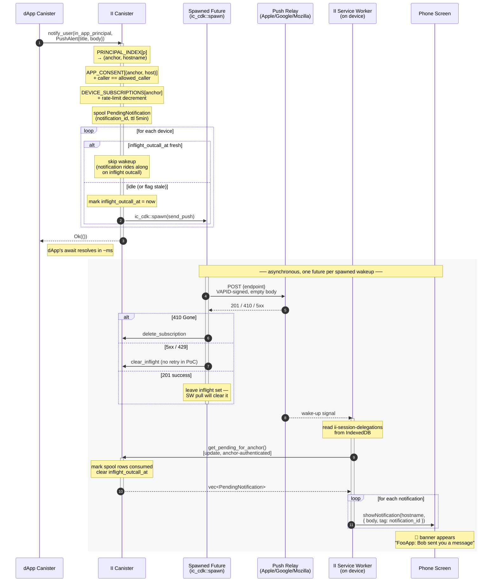

# II Push Notifications — PoC Design

**Status:** draft · PoC scope
**Authors:** Mario, Claude
**Last updated:** 2026-06-30 (rev: outcall via `ic_cdk::spawn` — dApp returns in ms, no queue, no timer)

## 1. Goal

Let a dApp deliver a notification to a user's device, addressed only by the
**in-app principal** the dApp already holds, even when the user is offline.
Internet Identity is the privacy boundary: the mapping
`in-app principal → device endpoint` lives inside II and is exposed to no
one else. The dApp passes a principal; everything else stays opaque.

## 2. Non-goals (for this PoC)

- Consent / opt-in UI. Assume the user has already enabled notifications
  for the relevant app.
- Opt-out, mute, quiet hours, categories.
- Cycle billing of the calling dApp. II eats outcall cycles for the PoC.
- Replacing FCM / APNs. We use standard Web Push and the relays the
  user's browser already chose.
- iOS < 16.4 (no Web Push at all).

## 3. The architectural choice: **II is the push origin**

Web Push requires three things on the device, all bound to one origin:

1. A registered **Service Worker**.
2. A **Push Subscription** the worker created via the browser's Push API.
3. **OS-level permission** granted on a past visit.

We have two options for whose origin owns the SW:

- **dApp origin** — the dApp could push the user directly without II.
  Defeats the privacy boundary. **Rejected.**
- **II origin** — the user installs II's PWA once, II's SW owns the push
  subscription, II is the only entity holding the endpoint URLs. The
  dApp's identity becomes payload content rendered by II's SW. **Chosen.**

Consequence: the user installs **II's** page on the device, not the dApp's.
One install per device covers notifications from every dApp the user signs
into.

## 4. High-level flow



Things to call out from the diagram:

- **`notify_user` returns `Ok` *before* any HTTPS traffic leaves the
  canister.** The outcall is detached via `ic_cdk::spawn`. dApp
  latency is in ms, every time.
- **The "for each device" alt block** is the §9 coalescing rule — if
  a wakeup is already in flight (and not stale by `INFLIGHT_TTL`), a
  new notification just rides along on it.
- **`410 Gone` deletes the subscription** — push-relay-driven cleanup,
  no presence tracking (§9, §14).
- **`get_pending_for_anchor` is an update, not a query** — it mutates
  spool + inflight state alongside returning the payload.
- **One push wakeup → one update → N notifications rendered.** That's
  the mechanic that collapses bursts to a single outcall per device.

Notification is rendered by II's SW with the dApp's name in the body
(e.g. `"FooApp: you have a new message"`). At the OS level the
notification is attributed to II (or to whatever brand II ships its PWA
under).

## 5. Data model — why each index exists

Three stable maps, each justified by a question the other two can't answer.

### `DEVICE_SUBSCRIPTIONS : anchor → Vec<DeviceSubscription>`

The actual push targets. Each device has its own endpoint (Chrome,
Firefox, Safari, each issuing a unique URL). Keyed by anchor because
**push subscriptions are per-device, not per-app** — the user installed
II once on this device; that one subscription serves every app the user
notifies through II.

```rust
struct DeviceSubscription {
    endpoint: String,    // RFC 8030 push endpoint
    p256dh:   [u8; 65],  // device public key (for future RFC 8291 encryption)
    auth:     [u8; 16],  // device auth secret (for future RFC 8291 encryption)
    added_at: u64,

    // Coalescing state — see §9.
    inflight_outcall_at: Option<u64>,  // Some(t) ⇒ a wakeup is in flight; new
                                       //          notifications just spool, no
                                       //          new outcall fired. Stale flags
                                       //          older than INFLIGHT_TTL count
                                       //          as idle (trap recovery).
}

const INFLIGHT_TTL_NS: u64 = 5 * 60 * 1_000_000_000;  // 5 min
```

The `p256dh` + `auth` fields are dead code in the PoC (we ship empty
push bodies, see §12). They're not auth material — the SW
authenticates to II via the existing **session delegation** mechanism
(see §13), not via a per-device key.

`inflight_outcall_at` is the coalescing lever (§9). The TTL exists
because the outcall is fired in an `ic_cdk::spawn`ed future (§10) — if
that future traps mid-`await`, the flag would otherwise stay set
forever. After `INFLIGHT_TTL` a stranded flag is ignored and a fresh
outcall can fire.

Liveness ("is this device still real?") is **not** tracked here — we
rely on the push relay's response codes (`410 Gone` → delete
subscription). This avoids turning the canister into a passive presence
tracker.

### `APP_CONSENT : (anchor, frontend_hostname) → AppConsent`

Per-(user, app) consent + caller authorization. Keyed this way because:

- **We need to know if this anchor opted into notifications from this
  specific app.** Per-anchor isn't enough (consent is per app) and
  per-principal isn't enough (we want anchor-scoped management).
- **We need to know which canister principal is allowed to call
  `notify_user` for this app.** The dApp registers this at consent time.

```rust
struct AppConsent {
    allowed_caller: Principal,
    consented_at:   u64,
}
```

### `PRINCIPAL_INDEX : in_app_principal → (anchor, frontend_hostname)`

A reverse index. `notify_user` arrives with only an in-app principal,
but consent lives at `(anchor, hostname)` and devices live at `anchor`.
Without this index we'd have to derive principals by iterating
`(anchor × hostname)` pairs — not viable.

This is the "we need X because we can't do Y" map: we can derive
principals from `(anchor, hostname)`, but we can't reverse the
derivation. So we store the reverse explicitly, and keep it in sync
with `APP_CONSENT` (insert/delete in the same call).

### `PENDING_NOTIFICATIONS : notification_id → PendingNotification`

Short-lived spool for the SW to pull from after a push wakes it up.

```rust
struct PendingNotification {
    anchor:     AnchorNumber,
    hostname:   FrontendHostname,  // shown in body as "FooApp"
    alert:      PushAlert,
    expires_at: u64,                // TTL ~5 min
}
```

There is **no** notification queue or timer state — wakeups are
detached via `ic_cdk::spawn` (§9, §10). `PENDING_NOTIFICATIONS` is the
only notification-bearing region.

## 6. Types

```candid
type PushAlert = record {
  title : text;
  body  : text;
};

type NotifyError = variant {
  NoConsent;          // (anchor, app) hasn't enabled push
  Unauthorized;       // caller isn't the registered allowed_caller
  NoDevices;          // anchor has no registered devices
  RateLimited;
  PayloadTooLarge;
};

service : {
  // The PoC surface.
  notify_user : (principal, PushAlert) -> (variant { Ok; Err : NotifyError });

  // Called by II's SW after a push wakes it.
  // Authenticated as an anchor via a session-delegation chain (see §13).
  // Update (not query) because it mutates state: marks the returned
  // notifications consumed and clears `inflight_outcall_at` on every
  // DeviceSubscription for this anchor (§9, §11). Cycle cost is
  // negligible compared to the outcall it just satisfied.
  get_pending_for_anchor : () -> (vec PendingNotification);

  // Out of PoC scope (controllers-only backdoor for tests):
  // - upsert_subscription(endpoint, p256dh, auth)   // caller() = anchor's session principal
  // - set_app_consent(hostname, allowed_caller)
};
```

Limits:

- `title` ≤ 64 bytes, `body` ≤ 256 bytes (UTF-8).
- `endpoint` ≤ 2 KB, `https://`, host IPv6-reachable.

## 7. Authorization model

Three options were on the table:

| Option | Who can call `notify_user` | PoC fit |
|---|---|---|
| **A. Open** | anyone with the principal | simplest, but principal leakage → spam |
| **B. Caller-bound** | only the canister owning the app's frontend origin | most correct, needs origin → canister registry |
| **C. Config-recorded caller** | `APP_CONSENT` carries `allowed_caller` | middle ground; one extra field |

**Choice: C.** Set at consent time; checked on every `notify_user`.

```rust
if caller() != consent.allowed_caller { return Err(Unauthorized); }
```

## 8. The `inspect_message` decision

`inspect_message` is an **admission gate**, not an execution context:

| Capability | `inspect_message` | `update` |
|---|---|---|
| Read state | ✅ | ✅ |
| Write state | ❌ | ✅ |
| Make HTTPS outcalls | ❌ | ✅ |
| Runs on inter-canister calls | ❌ (ingress only) | ✅ |
| Replicated execution | ❌ (single replica) | ✅ (consensus) |
| Cycles charged for "accept" | ❌ | ✅ |

Two consequences:

1. **The outcall must live in an update.** HTTPS outcalls require
   consensus on the response; only replicated mode provides it.

2. **`inspect_message` is silent for the primary caller.** dApp backend
   canisters call `notify_user` inter-canister; `inspect_message` does
   not fire. It's a DoS gate against direct ingress spam, nothing more.

We wire it up, but the authz check in the update handler is the real
gate.

### What `inspect_message` does

Cheap, read-only spam defense for the ingress edge:

```rust
#[ic_cdk::inspect_message]
fn inspect_message() {
    if method_name() != "notify_user" { return accept_message(); }

    let (p, alert): (Principal, PushAlert) =
        match decode_args() { Ok(v) => v, Err(_) => return };

    if alert.title.len() > MAX_TITLE || alert.body.len() > MAX_BODY { return; }
    if !storage::principal_known(p)                                { return; }
    if rate_limiter::peek(caller(), p) == 0                        { return; }

    accept_message();
}
```

Read-only peek — no decrement. The decrement happens in the update.

## 9. Cost model: spawn the outcall, coalesce per device

The single dominant cost is the HTTPS outcall — ~50 M cycles and
~2-5 s per call, replicated, irreducible for offline delivery. Every
other operation in this design is <1 % of that. So the only
optimization that matters is **reducing the number of outcalls**.

### What we cannot batch

- **Across devices.** Each device has its own push endpoint at its own
  vendor (Apple, Google, Mozilla). Web Push (RFC 8030) is one POST per
  push per endpoint. No multi-endpoint POST exists. **N devices ⇒
  N outcalls, minimum.**
- **Across anchors.** Each anchor's devices are distinct push
  subscriptions, even on the same physical hardware.

### What we *can* batch

- **Multiple notifications for the same device into one wakeup.** The
  push body is empty — it conveys nothing but "wake up". The SW comes
  back to II and pulls *all* pending notifications for the anchor in a
  single `get_pending_for_anchor` update. So whether II spooled 1 or
  50 notifications, one wakeup outcall suffices.

### The rule

> **At most one wakeup outcall in flight per device at any time,
> regardless of how many notifications are spooled.**

Implementation: `DeviceSubscription.inflight_outcall_at` is set when
the outcall begins and cleared when the SW calls
`get_pending_for_anchor`. While set (and not yet past `INFLIGHT_TTL`),
concurrent `notify_user` calls for the same device spool the payload
but do **not** start a second outcall.

### PoC architecture: outcall fires in `ic_cdk::spawn`

`notify_user` does the cheap state work (lookup, authz, spool, mark
inflight) and then **`ic_cdk::spawn`s the outcall as a detached
future**, returning `Ok(())` to the dApp before any HTTPS traffic
leaves the canister. The dApp's `await` resolves in **milliseconds**,
not seconds.

This is the same pattern `single_flight_cache` uses to detach its
fills — small, native to the IC, no queue or timer state.

Why this beats both alternatives we considered:

| | dApp latency | Stable-memory plumbing | Retry / backoff |
|---|---|---|---|
| Synchronous outcall (earlier draft) | 2-5 s | none | inline error → caller |
| Queue + timer (original draft) | ~ms | queue region + drain loop + `post_upgrade` re-arm | natural fit |
| **`ic_cdk::spawn`** (this design) | **~ms** | **none** | none in PoC; trap recovery via TTL |

### Trap recovery — why `inflight_outcall_at` has a TTL

A spawned future is fire-and-forget. If it traps mid-`await` (e.g.
between marking inflight and getting an outcall result), the flag
stays set. Without recovery, that device would be permanently
"locked" against future wakeups.

We solve this in the cheapest possible way: `inflight_outcall_at` is
treated as **stale after `INFLIGHT_TTL` (5 min)**. A `notify_user`
call sees a stale flag, ignores it, and fires fresh. The `post_upgrade`
hook also sweeps stale flags as belt-and-braces.

### Dead-device cleanup via push-relay response codes

The spawned future inspects the relay's response:

| Relay response | Action in the spawned future |
|---|---|
| `201 Created` / `202 Accepted` | success — leave `inflight_outcall_at` set; SW pull clears it |
| `410 Gone` / `404 Not Found` | **delete this `DeviceSubscription`** |
| `429 Too Many Requests` | log; clear `inflight_outcall_at`; no retry in PoC |
| `5xx` | log; clear `inflight_outcall_at`; no retry in PoC |

The first push to a dead device costs one wasted outcall. After that
the subscription is gone and we never try again. The PoC trades a
small amount of wasted cycles for storing zero presence state — see
§14 for the privacy rationale.

### Concrete cost math

Alice has 2 devices. FooApp sends 5 notifications in a 10 s burst.

| Strategy | Outcalls in the burst |
|---|---|
| Naive (1 outcall per notify_user per device) | 5 × 2 = **10** |
| `inflight_outcall_at` coalescing (this design) | **2** |
| Same, after Alice's laptop subscription was deleted on prior 410 | **1** |

Outcall count grows linearly with active devices and is independent of
notification volume within a burst. **Per-notification cycle cost
falls toward zero as burst size grows.**

## 10. The update handler

```rust
#[ic_cdk::update]
fn notify_user(p: Principal, alert: PushAlert) -> Result<(), NotifyError> {
    if alert.title.len() > MAX_TITLE || alert.body.len() > MAX_BODY {
        return Err(NotifyError::PayloadTooLarge);
    }

    let (anchor, hostname) = storage::lookup_principal(p)
        .ok_or(NotifyError::NoConsent)?;
    let consent = storage::get_consent(anchor, &hostname)
        .ok_or(NotifyError::NoConsent)?;

    if caller() != consent.allowed_caller {
        return Err(NotifyError::Unauthorized);
    }

    let devices = storage::devices_for(anchor);
    if devices.is_empty() { return Err(NotifyError::NoDevices); }

    if !rate_limiter::consume(caller(), p) {
        return Err(NotifyError::RateLimited);
    }

    // Always spool — even if no outcall fires (§9).
    let id = generate_notification_id();
    storage::spool(id, PendingNotification {
        anchor: anchor.clone(),
        hostname: hostname.clone(),
        alert,
        expires_at: time() + TTL_NS,
    });

    // Per-device coalescing (§9): at most one outcall in flight per device.
    // A flag older than INFLIGHT_TTL is treated as stale (trap recovery).
    let now = time();
    let to_wake: Vec<_> = devices
        .into_iter()
        .filter(|d| {
            d.inflight_outcall_at
                .map_or(true, |t| now.saturating_sub(t) > INFLIGHT_TTL_NS)
        })
        .collect();
    for d in &to_wake {
        storage::mark_inflight(&d.endpoint, now);
    }

    // Detach each wakeup into its own future. notify_user returns to the
    // dApp before any HTTPS traffic leaves the canister.
    for d in to_wake {
        ic_cdk::spawn(async move {
            match send_push(&d).await {
                Ok(_)                  => { /* SW pull clears inflight */ }
                Err(PushError::Gone)   => storage::delete_subscription(&d.endpoint),
                Err(_)                 => storage::clear_inflight(&d.endpoint),
            }
        });
    }
    Ok(())
}
```

`notify_user` does only cheap stable-map ops — no `await` on the
outcall. The dApp's call resolves in **milliseconds**, every time.
Each wakeup runs in its own spawned future; their outcomes settle
`inflight_outcall_at` and subscription liveness asynchronously.

The handler is no longer `async` — there is no point in the
function where we suspend. `ic_cdk::spawn` schedules the futures
without awaiting them here.

## 11. HTTPS outcall (in the spawned future)

Each `ic_cdk::spawn`ed future calls `send_push` once. Standard
RFC 8030 Web Push, **empty body** for the PoC:

```rust
async fn send_push(device: &DeviceSubscription) -> Result<(), PushError> {
    let vapid_jwt = vapid::sign(&device.endpoint).await?;  // ~10M cycles inline
    let req = CanisterHttpRequestArgument {
        url: device.endpoint.clone(),
        method: HttpMethod::POST,
        headers: vec![
            HttpHeader { name: "ttl".into(),           value: "60".into() },
            HttpHeader { name: "urgency".into(),       value: "normal".into() },
            HttpHeader { name: "authorization".into(), value: format!("vapid t={}, k={}",
                                                                       vapid_jwt, II_PUBLIC_KEY) },
            HttpHeader { name: "content-length".into(), value: "0".into() },
        ],
        body: None,
        max_response_bytes: Some(2 * 1024),
        transform: Some(strip_response_transform),
    };
    let cycles = http_request_required_cycles(&req);
    let response = http_request(req, cycles).await?;
    match response.status {
        201 | 202        => Ok(()),
        404 | 410        => Err(PushError::Gone),       // §9: caller deletes the subscription
        429              => Err(PushError::RateLimited),
        500..=599        => Err(PushError::Transient),
        other            => Err(PushError::Unexpected(other)),
    }
}
```

`inflight_outcall_at` clearing:

- **On `get_pending_for_anchor`** (the SW landed and picked up the
  notifications) — primary path.
- **On `5xx` / `RateLimited` from the relay** — the spawned future
  clears it before exiting so a future notification can try afresh.
- **On `INFLIGHT_TTL` expiry** (5 min) — the gate in `notify_user`
  treats stale flags as idle. Trap recovery for a spawned future that
  died mid-`await` without running its cleanup arm.
- **On `post_upgrade`** — sweep flags older than `INFLIGHT_TTL` as
  belt-and-braces.

**Why empty body?**
We don't want the push relay (FCM, Mozilla, Apple) to see the
notification content. Web Push requires the body to be either empty
or RFC 8291–encrypted under the device's `p256dh`/`auth` keys. The
PoC ships empty bodies; the SW pulls the actual payload from II.

A future production path would add RFC 8291 encryption so the payload
travels end-to-end encrypted through the push relay — but that's a
real chunk of canister-side crypto we don't want in the PoC.

`transform` drops non-deterministic headers (`Date`, `Server`, …) so
replicas agree.

### VAPID signing — inline today, cacheable later

`vapid::sign` is an async ECDSA signature over the management
canister's `sign_with_ecdsa` (~10 M cycles, ~2 s). The PoC signs
inline once per outcall. That's fine — the signature cost is a
rounding error against the 50 M-cycle outcall it precedes.

Production hardening: VAPID JWTs are valid for ≤24 h and reusable
across many pushes to the same push-relay origin (Apple / Google /
Mozilla — ~3 origins total). The clean home for that memoisation is
the in-tree [`single_flight_cache`](../src/internet_identity/src/single_flight_cache.rs)
— same shape as JWKS and DoH: `origin → JWT`, `fresh_for` ≈ 11 h,
single-flight dedup, backoff on signing failure. Pull it in once we
have signing volume to justify it.

## 12. The Service Worker side (II frontend) — reusing session delegations

The SW needs to authenticate to II on push wakeup with no user in the
loop. We **reuse the existing session-delegation mechanism** that
already powers persistence of the multiple-accounts toggle on
`/authorize`. No new key material, no new auth path.

### The existing mechanism, in brief

After ceremony auth on II, the frontend mints an anchor-scoped
delegation via `prepare_session_delegation` + `get_session_delegation`,
generating a fresh non-extractable `ECDSAKeyIdentity` as the session
key. It persists `{ keyPair, chainJson, expiresAtMillis }` in
IndexedDB at the `ii-session-delegations` store, keyed by anchor.

Later, `actorForIdentity(anchor)` rehydrates the identity and gives the
caller an authenticated actor — silently, with no UI. See
[`session-delegation.store.ts`](../src/frontend/src/lib/stores/session-delegation.store.ts)
and [`sessionDelegation.ts`](../src/frontend/src/lib/utils/authentication/sessionDelegation.ts).

### Why this ports to the SW

- **IndexedDB is shared between the main thread and the SW on the same
  origin.** The SW opens the same store with the same `idb-keyval`
  calls.
- **Non-extractable `ECDSAKeyIdentity` keypairs are usable for signing
  inside the origin.** The SW is the origin. `SubtleCrypto.sign` works.

### Pieces on II's frontend

1. **Manifest + install prompt.** II's PWA must be installable; on iOS
   the user *must* add to home screen for push to work.
2. **VAPID public key** (constant, baked into II's frontend).
3. **Service Worker** that:
   - on activation, subscribes to push via
     `registration.pushManager.subscribe({ userVisibleOnly: true,
     applicationServerKey: II_VAPID_PUBLIC_KEY })`,
   - sends `endpoint` + `p256dh` + `auth` to II via an authenticated
     update (`upsert_subscription`) — `caller()` is the anchor's
     session principal, so II knows which anchor to attach the
     subscription to,
   - on `push` event, walks the `ii-session-delegations` IDB store,
     rehydrates each unexpired record, calls `get_pending_for_anchor`
     as that anchor, then `showNotification` for each result.
4. **A page in the II web app** ("Notifications") where the user
   toggles per-app consent — out of PoC scope but the SW lifecycle
   has to exist for the PoC's test path to work.

### On-push pseudocode

```javascript
self.addEventListener('push', (event) => {
  event.waitUntil((async () => {
    const records = await loadAllSessionDelegations();           // ii-session-delegations
    const fresh   = records.filter(r => r.expiresAtMillis > Date.now() + MARGIN);
    let rendered = 0;

    for (const r of fresh) {
      try {
        const actor   = await actorFromSessionDelegation(r);
        const pending = await actor.get_pending_for_anchor();
        for (const n of pending) {
          await self.registration.showNotification(n.hostname, {
            body: n.alert.body,
            tag:  n.notification_id,
            data: { openUrl: n.alert.open_url },
          });
          rendered += 1;
        }
      } catch (_) { /* fall through to fallback */ }
    }

    if (rendered === 0) {
      await self.registration.showNotification('Internet Identity', {
        body: 'New activity', tag: 'fallback', silent: true,
      });
    }
  })());
});

self.addEventListener('notificationclick', (e) => {
  const url = e.notification.data?.openUrl ?? 'https://id.ai';
  e.waitUntil(self.clients.openWindow(url));
});
```

### Behavior when the session expires

If no anchor on the device has an unexpired session delegation, the SW
renders the generic `"New activity"` fallback. This is correct: the
specific notification content is gated behind the same crypto material
that gates every other authenticated call to II — once it expires, the
user re-auths and notifications resume full-fidelity. No separate
device key to manage.

## 13. Storage / upgrade safety

Four stable-memory regions, each behind its own `MemoryId`:

```rust
const MEMORY_ID_DEVICE_SUBSCRIPTIONS: MemoryId = MemoryId::new(N);
const MEMORY_ID_APP_CONSENT:          MemoryId = MemoryId::new(N + 1);
const MEMORY_ID_PRINCIPAL_INDEX:      MemoryId = MemoryId::new(N + 2);
const MEMORY_ID_PENDING_NOTIFS:       MemoryId = MemoryId::new(N + 3);
```

No notification queue region — the outcall fires inline in
`notify_user` (§9, §10).

Per the project rule, **stable-memory versioning is sacred**: bump the
storage version, add migrations only via additive new memory IDs, never
repurpose. Each value type carries a `version: u8` byte.

Invariant maintenance:

- `APP_CONSENT[(anchor, host)]` exists ⇔ `PRINCIPAL_INDEX[derive(anchor, host)]` exists.
- Anchor deletion sweeps both maps + `DEVICE_SUBSCRIPTIONS[anchor]` +
  any in-flight `PENDING_NOTIFS` for that anchor.
- `post_upgrade` sweeps `DeviceSubscription.inflight_outcall_at` flags
  older than `INFLIGHT_TTL` — belt-and-braces for a spawned future
  that trapped at `await` without running its cleanup arm. The
  in-handler `INFLIGHT_TTL` gate already handles this on the hot path;
  the sweep just keeps storage tidy.

`ic_cdk::spawn` futures themselves are **not** persisted across an
upgrade — a future in flight when the canister upgrades simply dies.
The TTL + sweep means a dropped wakeup costs us at most one
"missed notification until the next one arrives," not a permanently
locked device.

## 14. Privacy of the data

> "this should not be available to anyone except II"

Concretely:

- No public query exposes `DeviceSubscription` or `AppConsent`. The
  user's own listing uses an authenticated method that resolves via
  `anchor → …`.
- `get_pending_for_anchor` is an **authenticated** update — the SW
  must present an anchor-scoped session delegation (§13). There is no
  bearer-capability path keyed by `notification_id`, so an attacker
  spoofing a push wakeup cannot exfiltrate payloads.
- Endpoint URLs never echo back in errors. Error variants are opaque.
- `inspect_message` rejecting on "principal unknown" leaks the
  existence of a config. PoC accepts this; production should reject in
  constant work.

### Passive presence — what the design deliberately doesn't track

II already knows what its users do *actively*: auth ceremonies,
session-delegation mint times, every dApp's authenticated calls. None
of those reveal anything the user didn't choose to do.

Push notifications would, by default, add new **passive** observation
channels — signals about a user's device that the user did not
intentionally produce:

- An earlier draft of this design tracked `last_seen_at` on each
  device, bumped whenever the SW pulled a notification. Over months
  this builds a precise log of "this user's device was alive at
  04:13 on Tuesday" with no user action behind those timestamps.
  **Dropped.**
- Cold-device skipping (only push to devices we've recently seen)
  required `last_seen_at` to work. **Replaced** by reacting to the
  push relay's `410 Gone` response — a stateful, vendor-authoritative
  "subscription is dead" signal that doesn't require II to passively
  track activity.

The PoC therefore stores:

- The push endpoint URL (active, given to us at subscription time).
- The consent record (active, set by the user).
- The `inflight_outcall_at` flag (transient, cleared within seconds
  of being set — for outcall coordination, not presence).

…and **does not** record per-pull timestamps, per-notification
delivery timestamps, or any other "when was this device alive"
signal. The push relay's response codes give us all the liveness
information we need without II passively observing user behaviour.

### Side channels via error variants

A dApp can probe a user's state by observing which `NotifyError`
comes back:

- `NoConsent` → user hasn't enabled push for this app.
- `NoDevices` → user has no push-capable device registered at all.
- `RateLimited` → user is being heavily notified by *some* app.

For the PoC we accept this — dApps need debuggable errors. For
production this should probably collapse to a single opaque
`NotDelivered` variant on the public surface, with detail behind a
debug flag. See §18.

## 15. Rate limiting (PoC sketch)

Two layers, both ingress-facing (the per-device coalescing in §9
already shapes the *outcall* budget):

- **Per-(caller_canister, target_principal) token bucket** to bound
  individual app/user pairs. Heap-resident, resets on upgrade for the
  PoC. Budget e.g. 10 / hour, 50 / day.
- **Global outcall budget** capping total push outcalls per minute, to
  bound II's cycle exposure under a multi-app spike. With the §9
  coalescing already in place this should rarely bind, but it's the
  last-line backstop.

## 16. Platform reality

| Platform | What user must do |
|---|---|
| Android Chrome / Firefox / desktop browsers | Visit II's page once, grant permission. PWA install not required. SW persists. |
| **iOS 16.4+** | **Must add II's PWA to home screen.** Web Push for non-installed PWAs is not supported. Apple platform constraint, not ours to work around. |
| iOS < 16.4 | No Web Push, period. |

This is a **product** constraint, not just a technical one: any user
who wants push must perform a one-time install gesture on each device.
The II web app's UX needs to surface this clearly when consent is
requested.

## 17. End-to-end request walkthrough

The shape of the request from a dApp backend canister:

```rust
// dApp canister code
use ic_cdk::api::call::call;

let result: (Result<(), NotifyError>,) = call(
    INTERNET_IDENTITY_CANISTER_ID,
    "notify_user",
    (user_in_app_principal, PushAlert {
        title: "FooApp".to_string(),
        body:  "You have a new message".to_string(),
    }),
).await.expect("call to II failed");
```

What happens, step by step:

1. **Inter-canister call lands at II.** Caller is the dApp's canister
   principal. `inspect_message` doesn't fire (it's not ingress).
2. **II decodes the args**, runs the cheap shape check (sizes).
3. **`PRINCIPAL_INDEX[p]`** → `(anchor, hostname)` or `Err(NoConsent)`.
4. **`APP_CONSENT[(anchor, hostname)]`** → `AppConsent` or
   `Err(NoConsent)`.
5. **`caller() == consent.allowed_caller`** or `Err(Unauthorized)`.
6. **`DEVICE_SUBSCRIPTIONS[anchor]`** → `Vec<DeviceSubscription>` (size 1+).
7. **Rate-limit decrement** or `Err(RateLimited)`.
8. **Spool a `PendingNotification`** under a fresh `notification_id`.
9. **Per-device coalescing gate (§9):** keep only devices whose
   `inflight_outcall_at` is unset or older than `INFLIGHT_TTL`. Mark
   each kept device inflight. In a burst, this is where N
   notifications collapse to one outcall per device — the rest spool
   and ride along on the inflight wakeup.
10. **`ic_cdk::spawn` one wakeup future per kept device.** Each
    future signs a VAPID JWT and POSTs an empty body to that
    device's push endpoint. `notify_user` does **not** `await` them.
11. **Return `Ok(())`** to the dApp. Total wall time: **a few ms**,
    regardless of whether any outcalls are about to run.

Asynchronously, each spawned future:

12. **Signs the VAPID JWT inline** (~10 M cycles, ~2 s via
    management-canister ECDSA).
13. **POSTs to the push relay**, awaits the response.
14. **Applies the response code:**
    - `201/202` → leave `inflight_outcall_at` set (SW pull will clear).
    - `404/410` → delete the `DeviceSubscription`.
    - `5xx`/`429` → clear `inflight_outcall_at`; no retry in PoC.

Meanwhile, on the device:

15. **Push relay** forwards the wakeup to the device's OS push system.
16. **II's SW wakes up**, reads its session-delegation record from
    IndexedDB, calls II's `get_pending_for_anchor()` update.
17. **`get_pending_for_anchor` handler** marks spool rows consumed
    and clears `inflight_outcall_at` for every device of this anchor.
18. **SW renders** `self.registration.showNotification(title, { body })`
    for each pending notification.
19. **Phone screen lights up.**

## 18. Open questions

1. **Session-delegation TTL vs. notification longevity.** Session
   delegations expire (the project clamps at the max-TTL bound). Past
   expiry, the SW shows the generic fallback until the user re-auths.
   Is the current TTL long enough that this isn't a meaningful UX
   regression for low-frequency II users, or do we want a notification-
   scoped session that outlives the auth one?
2. **Encryption.** RFC 8291 is the standard answer — needed for
   production so the push relay never sees plaintext. Real
   implementation cost in canister code.
3. **Compromised `allowed_caller`.** A compromised dApp canister can
   spam until revoked. PoC has no kill switch; revocation lands with
   opt-out.
4. **VAPID key management.** II canister needs a stable VAPID key
   pair. Generate at first init, store the private half in stable
   memory, expose the public half via a query.
5. **Notification re-attribution.** OS shows "Internet Identity" as the
   sender. Acceptable, but worth knowing — and it's a privacy *feature*
   at the OS level (the device doesn't know which dApp pinged you).
6. **Error variant unification.** §14 notes that `NoConsent` /
   `NoDevices` / `RateLimited` let a dApp probe a user's subscription
   state. For production, collapse the public surface to a single
   opaque `NotDelivered` and keep granular errors behind a debug
   flag.

### Production hardening (deferred from the PoC, not "open")

These were live in earlier drafts and deliberately dropped to keep the
PoC small. They're not unknowns — they're hardening steps with a clear
shape for later:

- **Retry-with-backoff for transient relay failures.** Today a
  `5xx`/`429` just clears `inflight_outcall_at` and waits for the next
  notification. Production wants a bounded retry, which is the moment
  a queue + timer earns its complexity — we'd spool a retry job with
  exponential backoff. Until then, the next notification's wakeup
  effectively bundles any missed earlier one.
- **Explicit debounce windows.** Spawn-based coalescing only collapses
  notifications that arrive while an outcall is in flight (≈ seconds).
  A 30-second debounce window — "wait this long before firing the
  wakeup so we can bundle in more" — also wants a timer.
- **VAPID JWT caching** via the in-tree
  [`single_flight_cache`](../src/internet_identity/src/single_flight_cache.rs):
  key by push-relay origin, `fresh_for` ≈ 11 h, single-flight dedup,
  backoff on signing failure. Drops per-push signing cost from
  ~10 M cycles to amortised ~0. The spawned-future signing cost today
  is ~10 M × spawned_outcalls per burst; the cache amortises this.
- **RFC 8291 payload encryption** so the push relay never sees
  plaintext, removing the SW-pulls-from-spool latency on the device.

## 19. Minimal first slice (1-day spike)

1. Add the four stable regions + memory IDs.
2. Add `upsert_subscription` (anchor-authenticated) +
   controllers-only `set_app_consent` backdoor for tests.
3. Implement `notify_user`: validate → lookup → authz → rate limit →
   spool → per-device coalescing gate (skip if `inflight_outcall_at`
   is set and fresher than `INFLIGHT_TTL`) → `ic_cdk::spawn` one
   wakeup future per remaining device → return `Ok` immediately. The
   spawned future signs VAPID, POSTs, then handles `410 Gone` (delete
   subscription) / `5xx`/`429` (clear inflight). The per-device gate
   is the §9 mechanism — the difference between a 1× and an N× outcall
   cost.
4. Implement `get_pending_for_anchor` update (anchor-authenticated
   via session delegation). Marks spool rows consumed and clears
   `inflight_outcall_at` for every device of the caller's anchor.
5. Implement `inspect_message` gate.
6. Implement VAPID signing inline (no cache) + the empty-body POST
   helper. Test against a mock receiver in `test_app`.
7. `post_upgrade` sweep of stale `inflight_outcall_at` flags.
8. PocketIC test: mint a session delegation for a test anchor,
   `upsert_subscription`, set consent, call `notify_user` **five times
   in a row**, observe the mock receiver got **exactly one** POST
   (the §9 coalescing), then call `get_pending_for_anchor` under the
   session delegation and assert all five payloads come back in one
   update. Verify `notify_user` returned in <50 ms despite the
   ~2-5 s outcall (spawn semantics).

What's deliberately NOT in the spike: queue, timer, retry/backoff,
debounce window, VAPID cache, RFC 8291 encryption, error-variant
unification. See §18 "Production hardening" for the shape they'd
take.
