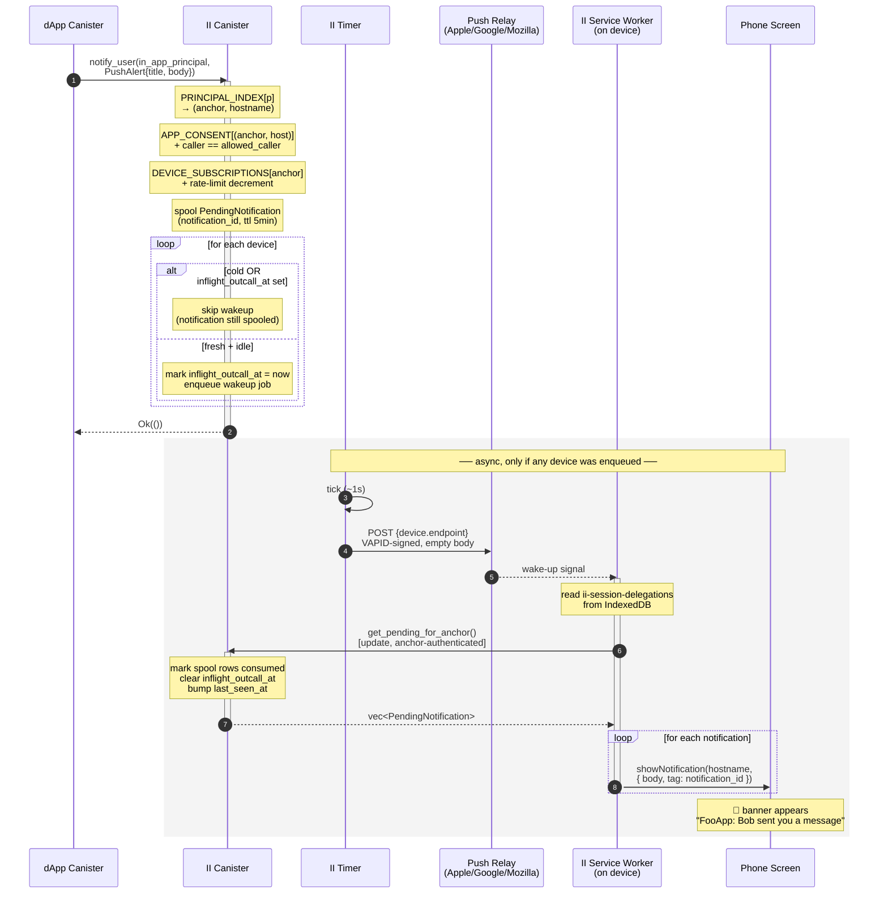

# II Push Notifications — PoC Design

**Status:** draft · PoC scope
**Authors:** Mario, Claude
**Last updated:** 2026-06-29 (rev: cost model + per-device coalescing)

## 1. Goal

Let a dApp deliver a notification to a user's device, addressed only by the
**in-app principal** the dApp already holds, even when the user is offline.
Internet Identity is the privacy boundary: the mapping
`in-app principal → device endpoint` lives inside II and is exposed to no
one else. The dApp passes a principal; everything else stays opaque.

## 2. Non-goals (for this PoC)

- Consent / opt-in UI. Assume the user has already enabled notifications
  for the relevant app.
- Opt-out, mute, quiet hours, categories.
- Cycle billing of the calling dApp. II eats outcall cycles for the PoC.
- Replacing FCM / APNs. We use standard Web Push and the relays the
  user's browser already chose.
- iOS < 16.4 (no Web Push at all).

## 3. The architectural choice: **II is the push origin**

Web Push requires three things on the device, all bound to one origin:

1. A registered **Service Worker**.
2. A **Push Subscription** the worker created via the browser's Push API.
3. **OS-level permission** granted on a past visit.

We have two options for whose origin owns the SW:

- **dApp origin** — the dApp could push the user directly without II.
  Defeats the privacy boundary. **Rejected.**
- **II origin** — the user installs II's PWA once, II's SW owns the push
  subscription, II is the only entity holding the endpoint URLs. The
  dApp's identity becomes payload content rendered by II's SW. **Chosen.**

Consequence: the user installs **II's** page on the device, not the dApp's.
One install per device covers notifications from every dApp the user signs
into.

## 4. High-level flow



Things to call out from the diagram:

- **Steps 1–9 are synchronous** in the dApp's `await`. Total wall time
  is tens of ms.
- **The "for each device" loop** is the §9 coalescing rule — it decides
  whether each device gets a wakeup outcall or just rides along on
  someone else's inflight one.
- **The grey async block only runs if at least one device was
  enqueued.** If every device was skipped (cold or already-inflight),
  the dApp's `Ok` still returns but no outcall fires.
- **`get_pending_for_anchor` is an update, not a query** — it mutates
  spool/inflight/last_seen state alongside returning the payload.
- **One push wakeup → one update → N notifications rendered.** That's
  the mechanic that collapses bursts to a single outcall per device.

Notification is rendered by II's SW with the dApp's name in the body
(e.g. `"FooApp: you have a new message"`). At the OS level the
notification is attributed to II (or to whatever brand II ships its PWA
under).

## 5. Data model — why each index exists

Three stable maps, each justified by a question the other two can't answer.

### `DEVICE_SUBSCRIPTIONS : anchor → Vec<DeviceSubscription>`

The actual push targets. Each device has its own endpoint (Chrome,
Firefox, Safari, each issuing a unique URL). Keyed by anchor because
**push subscriptions are per-device, not per-app** — the user installed
II once on this device; that one subscription serves every app the user
notifies through II.

```rust
struct DeviceSubscription {
    endpoint: String,    // RFC 8030 push endpoint
    p256dh:   [u8; 65],  // device public key (for future RFC 8291 encryption)
    auth:     [u8; 16],  // device auth secret (for future RFC 8291 encryption)
    added_at: u64,

    // Batching / coalescing state — see §9.
    inflight_outcall_at: Option<u64>,  // Some(t) ⇒ a wakeup is in flight; new
                                       //          notifications just spool, no
                                       //          new outcall fired.
    last_seen_at:        u64,          // updated whenever SW calls
                                       //   get_pending_for_anchor;
                                       //   stale device ⇒ skip outcalls (§9).
}
```

The `p256dh` + `auth` fields are dead code in the PoC (we ship empty
push bodies, see §12). They're not auth material — the SW
authenticates to II via the existing **session delegation** mechanism
(see §13), not via a per-device key.

`inflight_outcall_at` + `last_seen_at` exist purely to cut outcalls.
See §9 for the cost model they enable.

### `APP_CONSENT : (anchor, frontend_hostname) → AppConsent`

Per-(user, app) consent + caller authorization. Keyed this way because:

- **We need to know if this anchor opted into notifications from this
  specific app.** Per-anchor isn't enough (consent is per app) and
  per-principal isn't enough (we want anchor-scoped management).
- **We need to know which canister principal is allowed to call
  `notify_user` for this app.** The dApp registers this at consent time.

```rust
struct AppConsent {
    allowed_caller: Principal,
    consented_at:   u64,
}
```

### `PRINCIPAL_INDEX : in_app_principal → (anchor, frontend_hostname)`

A reverse index. `notify_user` arrives with only an in-app principal,
but consent lives at `(anchor, hostname)` and devices live at `anchor`.
Without this index we'd have to derive principals by iterating
`(anchor × hostname)` pairs — not viable.

This is the "we need X because we can't do Y" map: we can derive
principals from `(anchor, hostname)`, but we can't reverse the
derivation. So we store the reverse explicitly, and keep it in sync
with `APP_CONSENT` (insert/delete in the same call).

### `PENDING_NOTIFICATIONS : notification_id → PendingNotification`

Short-lived spool for the SW to pull from after a push wakes it up.

```rust
struct PendingNotification {
    anchor:     AnchorNumber,
    hostname:   FrontendHostname,  // shown in body as "FooApp"
    alert:      PushAlert,
    expires_at: u64,                // TTL ~5 min
}
```

(Plus a `NOTIFICATION_QUEUE` for the timer to drain, holding
`(notification_id, target device)` tuples.)

## 6. Types

```candid
type PushAlert = record {
  title : text;
  body  : text;
};

type NotifyError = variant {
  NoConsent;          // (anchor, app) hasn't enabled push
  Unauthorized;       // caller isn't the registered allowed_caller
  NoDevices;          // anchor has no registered devices
  RateLimited;
  PayloadTooLarge;
  QueueFull;
};

service : {
  // The PoC surface.
  notify_user : (principal, PushAlert) -> (variant { Ok; Err : NotifyError });

  // Called by II's SW after a push wakes it.
  // Authenticated as an anchor via a session-delegation chain (see §13).
  // Update (not query) because it mutates state: marks the returned
  // notifications consumed, clears `inflight_outcall_at` and bumps
  // `last_seen_at` on every DeviceSubscription for this anchor (§9, §11).
  // Cycle cost is negligible compared to the outcall it just satisfied.
  get_pending_for_anchor : () -> (vec PendingNotification);

  // Out of PoC scope (controllers-only backdoor for tests):
  // - upsert_subscription(endpoint, p256dh, auth)   // caller() = anchor's session principal
  // - set_app_consent(hostname, allowed_caller)
};
```

Limits:

- `title` ≤ 64 bytes, `body` ≤ 256 bytes (UTF-8).
- `endpoint` ≤ 2 KB, `https://`, host IPv6-reachable.

## 7. Authorization model

Three options were on the table:

| Option | Who can call `notify_user` | PoC fit |
|---|---|---|
| **A. Open** | anyone with the principal | simplest, but principal leakage → spam |
| **B. Caller-bound** | only the canister owning the app's frontend origin | most correct, needs origin → canister registry |
| **C. Config-recorded caller** | `APP_CONSENT` carries `allowed_caller` | middle ground; one extra field |

**Choice: C.** Set at consent time; checked on every `notify_user`.

```rust
if caller() != consent.allowed_caller { return Err(Unauthorized); }
```

## 8. The `inspect_message` decision

`inspect_message` is an **admission gate**, not an execution context:

| Capability | `inspect_message` | `update` |
|---|---|---|
| Read state | ✅ | ✅ |
| Write state | ❌ | ✅ |
| Make HTTPS outcalls | ❌ | ✅ |
| Runs on inter-canister calls | ❌ (ingress only) | ✅ |
| Replicated execution | ❌ (single replica) | ✅ (consensus) |
| Cycles charged for "accept" | ❌ | ✅ |

Two consequences:

1. **The outcall must live in an update.** HTTPS outcalls require
   consensus on the response; only replicated mode provides it.

2. **`inspect_message` is silent for the primary caller.** dApp backend
   canisters call `notify_user` inter-canister; `inspect_message` does
   not fire. It's a DoS gate against direct ingress spam, nothing more.

We wire it up, but the authz check in the update handler is the real
gate.

### What `inspect_message` does

Cheap, read-only spam defense for the ingress edge:

```rust
#[ic_cdk::inspect_message]
fn inspect_message() {
    if method_name() != "notify_user" { return accept_message(); }

    let (p, alert): (Principal, PushAlert) =
        match decode_args() { Ok(v) => v, Err(_) => return };

    if alert.title.len() > MAX_TITLE || alert.body.len() > MAX_BODY { return; }
    if !storage::principal_known(p)                                { return; }
    if rate_limiter::peek(caller(), p) == 0                        { return; }

    accept_message();
}
```

Read-only peek — no decrement. The decrement happens in the update.

## 9. Cost model: batching, not decoupling

The single dominant cost is the HTTPS outcall — ~50 M cycles and
~2-5 s per call, replicated, irreducible for offline delivery. Every
other operation in this design is <1 % of that. So the only
optimization that matters is **reducing the number of outcalls**, not
making the update path faster.

### What we cannot batch

- **Across devices.** Each device has its own push endpoint at its own
  vendor (Apple, Google, Mozilla). Web Push (RFC 8030) is one POST per
  push per endpoint. No multi-endpoint POST exists. **N devices ⇒
  N outcalls, minimum.**
- **Across anchors.** Each anchor's devices are distinct push
  subscriptions, even on the same physical hardware (different
  origins, different vendor relationships).

### What we *can* batch

- **Multiple notifications for the same device into one wakeup.** The
  push body is empty — it conveys nothing but "wake up". The SW comes
  back to II and pulls *all* pending notifications for the anchor in a
  single `get_pending_for_anchor` update. So whether II spooled 1 or
  50 notifications, one wakeup outcall suffices.

### The rule

> **At most one wakeup outcall in flight per device at any time,
> regardless of how many notifications are spooled.**

Implementation: `DeviceSubscription.inflight_outcall_at` is set when
we fire a wakeup and cleared when the SW pulls (via
`get_pending_for_anchor`) or after a watchdog timeout (e.g. 60 s).
While set, new spooled notifications for that device do **not**
trigger a fresh outcall.

### The cold-device skip

`DeviceSubscription.last_seen_at` is updated on every SW pull. If a
device hasn't pulled in N days (push subscriptions expire on the
vendor side anyway), spool the notification but **skip the outcall**.
The notification stays available until the SW does come back, at
which point we can deliver it and refresh `last_seen_at`.

For the PoC threshold, ~14 days is reasonable. Tune from data.

### Concrete cost math

Alice has 2 devices. FooApp sends 5 notifications in a 10 s burst.

| Strategy | Outcalls in the burst |
|---|---|
| Naive (1 outcall per notify_user per device) | 5 × 2 = **10** |
| One outcall per device per burst (this design) | **2** |
| Same, but Alice's laptop hasn't pulled in 20 d (cold) | **1** |

Outcall count grows linearly with active devices and is independent of
notification volume within a burst. **Per-notification cycle cost
falls toward zero as burst size grows.**

### The queue is for ordering, not for latency

The "queue + timer" plumbing still exists, but its job is now:

1. Carry the `(device, wakeup-needed)` work items to the timer
   without making `notify_user` block on the outcall.
2. Provide a place to schedule retries with backoff.
3. Allow batching across multiple `notify_user` calls — if two
   spool entries land for the same device within the same tick, the
   timer fires once.

The dApp's `notify_user` await is a side effect of moving the outcall
off-thread, not the goal.

## 10. The update handler

```rust
#[ic_cdk::update]
fn notify_user(p: Principal, alert: PushAlert) -> Result<(), NotifyError> {
    if alert.title.len() > MAX_TITLE || alert.body.len() > MAX_BODY {
        return Err(NotifyError::PayloadTooLarge);
    }

    let (anchor, hostname) = storage::lookup_principal(p)
        .ok_or(NotifyError::NoConsent)?;
    let consent = storage::get_consent(anchor, &hostname)
        .ok_or(NotifyError::NoConsent)?;

    if caller() != consent.allowed_caller {
        return Err(NotifyError::Unauthorized);
    }

    let devices = storage::devices_for(anchor);
    if devices.is_empty() { return Err(NotifyError::NoDevices); }

    if !rate_limiter::consume(caller(), p) {
        return Err(NotifyError::RateLimited);
    }

    // Always spool — even if no outcall fires (§9).
    let id = generate_notification_id();
    storage::spool(id, PendingNotification {
        anchor, hostname, alert, expires_at: time() + TTL_NS,
    });

    // Per-device gating (§9): one outcall in flight per device,
    // skip cold devices entirely.
    let now = time();
    for d in devices {
        if now.saturating_sub(d.last_seen_at) > COLD_DEVICE_THRESHOLD {
            continue;                       // cold — spooled but no wakeup
        }
        if d.inflight_outcall_at.is_some() {
            continue;                       // wakeup already inflight — SW
                                            // will pick this up when it pulls
        }
        storage::mark_inflight(d.id, now);
        queue::push(NotifJob { device: d })
            .map_err(|_| NotifyError::QueueFull)?;
    }
    Ok(())
}
```

Note the queue carries `device`, not `notification_id` — a single
queued wakeup covers every spooled notification for that device.

## 11. HTTPS outcall (timer-driven)

Standard RFC 8030 Web Push, **empty body** for the PoC:

```rust
async fn send_one(job: NotifJob) {
    let vapid_jwt = vapid::sign(&job.device.endpoint).await;  // II's VAPID key
    let req = CanisterHttpRequestArgument {
        url: job.device.endpoint.clone(),
        method: HttpMethod::POST,
        headers: vec![
            HttpHeader { name: "ttl".into(),           value: "60".into() },
            HttpHeader { name: "urgency".into(),       value: "normal".into() },
            HttpHeader { name: "authorization".into(), value: format!("vapid t={}, k={}",
                                                                       vapid_jwt, II_PUBLIC_KEY) },
            HttpHeader { name: "content-length".into(), value: "0".into() },
        ],
        body: None,
        max_response_bytes: Some(2 * 1024),
        transform: Some(strip_response_transform),
    };
    let cycles = http_request_required_cycles(&req);
    match http_request(req, cycles).await {
        Ok(_)  => { /* inflight cleared when SW pulls (§13) */ },
        Err(e) => backoff::requeue_or_drop(job, e),
    }
}
```

Note `inflight_outcall_at` is **not** cleared here. It stays set
until either:

- The SW lands a `get_pending_for_anchor` call → `last_seen_at`
  updates and `inflight_outcall_at` is cleared in the same query
  handler. The device is "served"; the next notification will fire a
  fresh wakeup.
- A watchdog (e.g. 60 s) clears it. The push didn't reach the device
  (offline, browser killed, expired subscription) — next notification
  fires a fresh wakeup, the cold-device skip kicks in if this keeps
  failing.

**Why empty body?**
We don't want the push relay (FCM, Mozilla, Apple) to see the
notification content. Web Push requires the body to be either empty
or RFC 8291–encrypted under the device's `p256dh`/`auth` keys. The
PoC ships empty bodies; the SW pulls the actual payload from II.

A future production path would add RFC 8291 encryption so the payload
travels end-to-end encrypted through the push relay — but that's a
real chunk of canister-side crypto we don't want in the PoC.

`transform` drops non-deterministic headers (`Date`, `Server`, …) so
replicas agree.

## 12. The Service Worker side (II frontend) — reusing session delegations

The SW needs to authenticate to II on push wakeup with no user in the
loop. We **reuse the existing session-delegation mechanism** that
already powers persistence of the multiple-accounts toggle on
`/authorize`. No new key material, no new auth path.

### The existing mechanism, in brief

After ceremony auth on II, the frontend mints an anchor-scoped
delegation via `prepare_session_delegation` + `get_session_delegation`,
generating a fresh non-extractable `ECDSAKeyIdentity` as the session
key. It persists `{ keyPair, chainJson, expiresAtMillis }` in
IndexedDB at the `ii-session-delegations` store, keyed by anchor.

Later, `actorForIdentity(anchor)` rehydrates the identity and gives the
caller an authenticated actor — silently, with no UI. See
[`session-delegation.store.ts`](../src/frontend/src/lib/stores/session-delegation.store.ts)
and [`sessionDelegation.ts`](../src/frontend/src/lib/utils/authentication/sessionDelegation.ts).

### Why this ports to the SW

- **IndexedDB is shared between the main thread and the SW on the same
  origin.** The SW opens the same store with the same `idb-keyval`
  calls.
- **Non-extractable `ECDSAKeyIdentity` keypairs are usable for signing
  inside the origin.** The SW is the origin. `SubtleCrypto.sign` works.

### Pieces on II's frontend

1. **Manifest + install prompt.** II's PWA must be installable; on iOS
   the user *must* add to home screen for push to work.
2. **VAPID public key** (constant, baked into II's frontend).
3. **Service Worker** that:
   - on activation, subscribes to push via
     `registration.pushManager.subscribe({ userVisibleOnly: true,
     applicationServerKey: II_VAPID_PUBLIC_KEY })`,
   - sends `endpoint` + `p256dh` + `auth` to II via an authenticated
     update (`upsert_subscription`) — `caller()` is the anchor's
     session principal, so II knows which anchor to attach the
     subscription to,
   - on `push` event, walks the `ii-session-delegations` IDB store,
     rehydrates each unexpired record, calls `get_pending_for_anchor`
     as that anchor, then `showNotification` for each result.
4. **A page in the II web app** ("Notifications") where the user
   toggles per-app consent — out of PoC scope but the SW lifecycle
   has to exist for the PoC's test path to work.

### On-push pseudocode

```javascript
self.addEventListener('push', (event) => {
  event.waitUntil((async () => {
    const records = await loadAllSessionDelegations();           // ii-session-delegations
    const fresh   = records.filter(r => r.expiresAtMillis > Date.now() + MARGIN);
    let rendered = 0;

    for (const r of fresh) {
      try {
        const actor   = await actorFromSessionDelegation(r);
        const pending = await actor.get_pending_for_anchor();
        for (const n of pending) {
          await self.registration.showNotification(n.hostname, {
            body: n.alert.body,
            tag:  n.notification_id,
            data: { openUrl: n.alert.open_url },
          });
          rendered += 1;
        }
      } catch (_) { /* fall through to fallback */ }
    }

    if (rendered === 0) {
      await self.registration.showNotification('Internet Identity', {
        body: 'New activity', tag: 'fallback', silent: true,
      });
    }
  })());
});

self.addEventListener('notificationclick', (e) => {
  const url = e.notification.data?.openUrl ?? 'https://id.ai';
  e.waitUntil(self.clients.openWindow(url));
});
```

### Behavior when the session expires

If no anchor on the device has an unexpired session delegation, the SW
renders the generic `"New activity"` fallback. This is correct: the
specific notification content is gated behind the same crypto material
that gates every other authenticated call to II — once it expires, the
user re-auths and notifications resume full-fidelity. No separate
device key to manage.

## 13. Storage / upgrade safety

Four stable-memory regions, each behind its own `MemoryId`:

```rust
const MEMORY_ID_DEVICE_SUBSCRIPTIONS: MemoryId = MemoryId::new(N);
const MEMORY_ID_APP_CONSENT:          MemoryId = MemoryId::new(N + 1);
const MEMORY_ID_PRINCIPAL_INDEX:      MemoryId = MemoryId::new(N + 2);
const MEMORY_ID_PENDING_NOTIFS:       MemoryId = MemoryId::new(N + 3);
// NOTIFICATION_QUEUE can live in heap for the PoC (jobs are
// re-derivable from PENDING_NOTIFS on upgrade).
```

Per the project rule, **stable-memory versioning is sacred**: bump the
storage version, add migrations only via additive new memory IDs, never
repurpose. Each value type carries a `version: u8` byte.

Invariant maintenance:

- `APP_CONSENT[(anchor, host)]` exists ⇔ `PRINCIPAL_INDEX[derive(anchor, host)]` exists.
- Anchor deletion sweeps both maps + `DEVICE_SUBSCRIPTIONS[anchor]` +
  any in-flight `PENDING_NOTIFS` for that anchor.
- `post_upgrade` re-arms the timer.

## 14. Privacy of the data

> "this should not be available to anyone except II"

Concretely:

- No public query exposes `DeviceSubscription` or `AppConsent`. The
  user's own listing uses an authenticated method that resolves via
  `anchor → …`.
- `get_pending_for_anchor` is an **authenticated** update — the SW
  must present an anchor-scoped session delegation (§13). There is no
  bearer-capability path keyed by `notification_id`, so an attacker
  spoofing a push wakeup cannot exfiltrate payloads.
- Endpoint URLs never echo back in errors. Error variants are opaque.
- `inspect_message` rejecting on "principal unknown" leaks the
  existence of a config. PoC accepts this; production should reject in
  constant work.

## 15. Rate limiting (PoC sketch)

Two layers, both ingress-facing (the per-device coalescing in §9
already shapes the *outcall* budget):

- **Per-(caller_canister, target_principal) token bucket** to bound
  individual app/user pairs. Heap-resident, resets on upgrade for the
  PoC. Budget e.g. 10 / hour, 50 / day.
- **Global outcall budget** capping total push outcalls per minute, to
  bound II's cycle exposure under a multi-app spike. With the §9
  coalescing already in place this should rarely bind, but it's the
  last-line backstop.

## 16. Platform reality

| Platform | What user must do |
|---|---|
| Android Chrome / Firefox / desktop browsers | Visit II's page once, grant permission. PWA install not required. SW persists. |
| **iOS 16.4+** | **Must add II's PWA to home screen.** Web Push for non-installed PWAs is not supported. Apple platform constraint, not ours to work around. |
| iOS < 16.4 | No Web Push, period. |

This is a **product** constraint, not just a technical one: any user
who wants push must perform a one-time install gesture on each device.
The II web app's UX needs to surface this clearly when consent is
requested.

## 17. End-to-end request walkthrough

The shape of the request from a dApp backend canister:

```rust
// dApp canister code
use ic_cdk::api::call::call;

let result: (Result<(), NotifyError>,) = call(
    INTERNET_IDENTITY_CANISTER_ID,
    "notify_user",
    (user_in_app_principal, PushAlert {
        title: "FooApp".to_string(),
        body:  "You have a new message".to_string(),
    }),
).await.expect("call to II failed");
```

What happens, step by step:

1. **Inter-canister call lands at II.** Caller is the dApp's canister
   principal. `inspect_message` doesn't fire (it's not ingress).
2. **II decodes the args**, runs the cheap shape check (sizes).
3. **`PRINCIPAL_INDEX[p]`** → `(anchor, hostname)` or `Err(NoConsent)`.
4. **`APP_CONSENT[(anchor, hostname)]`** → `AppConsent` or
   `Err(NoConsent)`.
5. **`caller() == consent.allowed_caller`** or `Err(Unauthorized)`.
6. **`DEVICE_SUBSCRIPTIONS[anchor]`** → `Vec<DeviceSubscription>` (size 1+).
7. **Rate-limit decrement** or `Err(RateLimited)`.
8. **Spool a `PendingNotification`** under a fresh `notification_id`.
9. **Per-device gate (§9):** for each device, skip if cold or if
    `inflight_outcall_at` is already set. Otherwise mark inflight and
    enqueue one wakeup job. **In a burst, this is where we collapse
    N notifications into 1 outcall per device.**
10. **Return `Ok(())`** to the dApp. The dApp's `await` resolves here —
    total wall time tens of milliseconds.

Then asynchronously, *only if any device wasn't skipped*:

11. **Timer fires.** Drains a bounded batch of wakeup jobs.
12. **For each job** → build VAPID-signed POST to the device's push
    endpoint, body empty.
13. **Push service** (FCM / Mozilla / Apple) forwards a wakeup to the
    device.
14. **II's SW on the device wakes up**, calls II's
    `get_pending_for_anchor()` update, receives every spooled
    notification for the anchor in one shot.
15. **`get_pending_for_anchor` handler** marks spool rows consumed,
    updates `last_seen_at`, and clears `inflight_outcall_at` for every
    device of this anchor that was inflight. Returns the notifications.
16. **SW renders** `self.registration.showNotification(title, { body })`
    for each pending notification.
17. **Phone screen lights up.**

## 18. Open questions

1. **Session-delegation TTL vs. notification longevity.** Session
   delegations expire (the project clamps at the max-TTL bound). Past
   expiry, the SW shows the generic fallback until the user re-auths.
   Is the current TTL long enough that this isn't a meaningful UX
   regression for low-frequency II users, or do we want a notification-
   scoped session that outlives the auth one?
2. **Encryption.** RFC 8291 is the standard answer — needed for
   production so the push relay never sees plaintext. Real
   implementation cost in canister code.
3. **Compromised `allowed_caller`.** A compromised dApp canister can
   spam until revoked. PoC has no kill switch; revocation lands with
   opt-out.
4. **VAPID key management.** II canister needs a stable VAPID key
   pair. Generate at first init, store the private half in stable
   memory, expose the public half via a query.
5. **Notification re-attribution.** OS shows "Internet Identity" as the
   sender. Acceptable, but worth knowing — and it's a privacy *feature*
   at the OS level (the device doesn't know which dApp pinged you).

## 19. Minimal first slice (1-day spike)

1. Add the four stable regions + memory IDs.
2. Add `upsert_subscription` (anchor-authenticated) +
   controllers-only `set_app_consent` backdoor for tests.
3. Implement `notify_user`: validate → lookup → authz → rate limit →
   spool → per-device gate (inflight + cold skip) → enqueue. The
   per-device gate is the §9 batching mechanism — it's the difference
   between a 1× and an N× outcall cost.
4. Implement `get_pending_for_anchor` update (anchor-authenticated via
   session delegation). On the way through, clear `inflight_outcall_at`
   and bump `last_seen_at` for every device of the caller's anchor.
5. Implement `inspect_message` gate.
6. Implement timer-driven drain + VAPID-signed empty-body POST to a
   mock receiver in `test_app`. Watchdog clears stuck
   `inflight_outcall_at` after 60 s.
7. PocketIC test: mint a session delegation for a test anchor,
   `upsert_subscription`, set consent, call `notify_user` **five times
   in a row**, observe the mock receiver got **exactly one** POST
   (the §9 coalescing), then call `get_pending_for_anchor` under the
   session delegation and assert all five payloads come back in one
   query.
