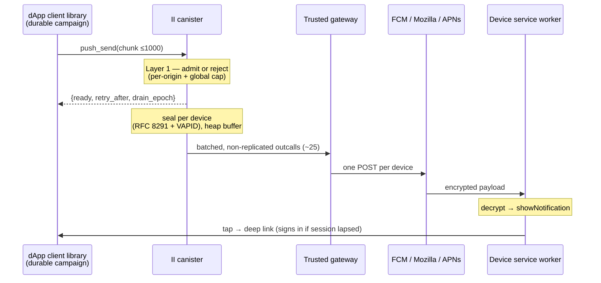
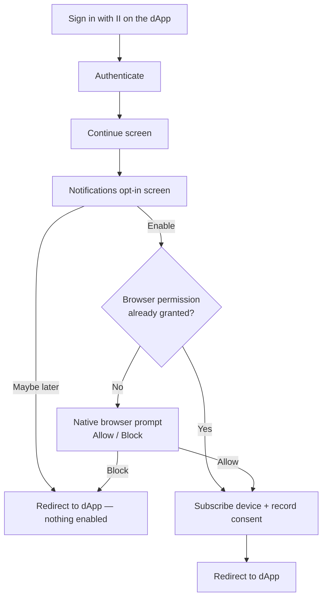
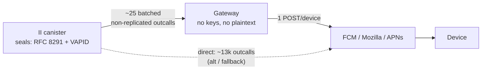
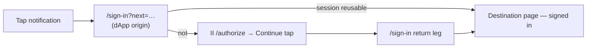
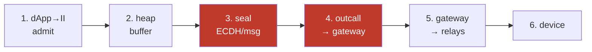
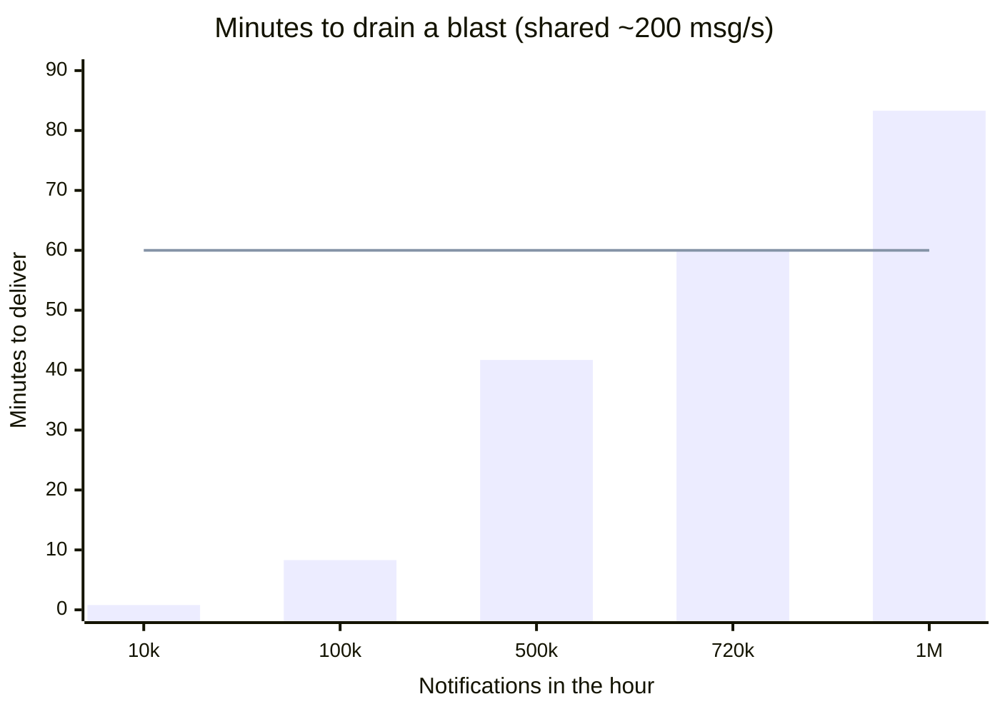

# Push notifications — design

**How to read this.** It is long because it covers two independent scaling paths
and a security model. If you only read one section, read
[How it works, in plain terms](#how-it-works-in-plain-terms). Then:

- **Reviewing the design?** [Goals and non-goals](#goals-and-non-goals) →
  [Architecture](#architecture) →
  [Alternatives considered](#alternatives-considered) →
  [Security model](#security-model) → [Open items](#open-items).
- **Implementing it on II?** [dApp → II](#dapp--ii) →
  [II's state model](#iis-state-model-stateless-for-campaigns) →
  [Delivering to devices](#delivering-to-devices) →
  [Push must never degrade authentication](#push-must-never-degrade-authentication).
- **Integrating a dApp?** Reference material lives in separate files:
  [push-api.md](push-api.md) (Candid + integration steps) and
  [push-client-library.md](push-client-library.md) (the client library).
- **Wondering what exists today?** [Status](#status), at the end.

## Context and scope

A dApp on the IC that wants to reach a user who is not currently looking at it
has no good option. Web Push is the browser-native answer, but doing it yourself
means prompting for your own notification permission, running your own service
worker, holding your own VAPID keypair, and storing your own subscription
endpoints — per dApp. Browsers increasingly bury that permission prompt, users
decline it more often the more times they see it, and on iOS Safari it requires
the site to be installed as a PWA at all. The result is that almost no dApp does
it, and users get nothing.

Internet Identity is already the one origin every user of these apps has a
relationship with, and already holds per-user state they have consented to. That
makes it the one place where the permission can be asked **once** and reused.

So: II hosts a single Web Push pipeline that any dApp can send through. The user
grants notification permission to `id.ai` once, subscribes per device, and
consents per dApp; a consented dApp then delivers through II rather than running
a push stack of its own. Installing II as a PWA stays **optional** on Android and
desktop, and is **required only on iOS Safari** — where "install one app, get
every dApp's notifications" is a better trade than installing each dApp.

This document covers the design of the two paths that decide whether it scales —
**dApp → II** and **II → device** — the security and privacy model, and the open
items. It is a design document, not an integration guide: the Candid interface
and the client-library internals are here to show the design is buildable, not to
serve as reference material.

## Goals and non-goals

### Goals

- **One permission, many apps.** A user allows notifications once, for their
  identity provider, and every consented dApp reaches them through it.
- **A dApp needs no push infrastructure.** No service worker, no VAPID keypair,
  no subscription storage, no relay accounts.
- **Consent is per dApp and per device, and revocable.** Revoking one dApp stops
  its notifications immediately and affects no other.
- **A 10k-user broadcast is a normal operation**, not an incident — with the
  explicit constraint that it must never degrade authentication, which is what
  this canister actually exists to do.
- **II's durable storage does not grow with volume.** Storage is user-scoped;
  sending more notifications must not make it larger.
- **A tap lands the user where the notification was about**, in the sending app,
  signed in.
- **End-to-end encryption is possible** for apps that can't let II see message
  text — a messenger shouldn't hand its message bodies to its identity provider.
  See [End-to-end-encrypted apps](#end-to-end-encrypted-apps).

### Non-goals

- **Not a messaging product.** No inbox, no history, no unread state, no
  read receipts. II forgets a notification once it is handed off.
- **Not exactly-once delivery.** Delivery is explicitly at-least-once, which is
  why device-side deduplication ships with it rather than after it.
- **Not guaranteed delivery.** The relays are best-effort and a device that never
  comes online never receives; no part of this promises otherwise.
- **Not per-notification billing, in v1.** Charging senders cycles is parked, not
  designed — which has consequences for abuse limits, covered below.
- **Not a way to reach "all II users".** There is no audience except users who
  consented to a specific dApp; a sender cannot discover or address anyone else.
- **Not universal browser support.** Web Push is browser-scoped. Browsers without
  it (some vendor forks ship none) are out of reach, and that is not something
  this design can fix.
- **Not a replacement for in-app notification UI.** This reaches users who are
  away; what an app shows a user who is present is the app's business.

## How it works, in plain terms

The whole design, in six bullets. Everything after this adds detail to one of
them.

- **A dApp never talks to phones directly.** It tells II "notify these users,"
  and II handles the actual delivery. The dApp only knows its users by an
  opaque per-app id, so it can't reach anyone it wasn't given.
- **II already knows how to reach each user.** When a user turns notifications
  on, their browser hands II the keys needed to deliver to that device; when
  they sign into a dApp and opt in, II records that the dApp is allowed. So II
  keeps two small per-user facts: _which devices_ and _which apps are allowed_.
- **II seals every message.** It encrypts the text with the device's own key
  (created when the device subscribed, using standard Web Push encryption) so
  only that device can read it — Google/Apple/Mozilla just forward the sealed
  bytes and the browser decrypts them. It also signs each request so those push
  services trust it really came from II (a VAPID token, cached per push service
  so II needn't re-sign every time).
- **Big sends are streamed, not dumped.** To notify 10,000 users, the dApp uses
  a small helper **library** that feeds II the list in bite-sized batches at a
  pace II can handle. II refuses more than it can take (so nobody can flood
  it), and the library slows down when asked. The big list lives with the
  dApp — **II stores almost nothing per send**.
- **How II sends the final messages.** II hands the sealed messages to a small
  **trusted helper server (the "gateway")** that makes the many little
  per-device sends on II's behalf over ordinary internet — far cheaper and
  faster than the canister making each call itself. (Having the canister call
  each push service directly is the documented fallback, but one network call
  per device gets expensive at scale, so it isn't the default.) Either way II
  does the sealing; the helper only forwards messages it can't read.
- **Tapping a notification** goes straight to the app's own deep link, which
  signs the user in on arrival if their session has lapsed. Only a notification
  without a deep link detours through II ("Opening \<app\>…"). Either way the
  destination is only ever the app that sent it.

Everything below is the same story with the exact mechanisms and edge cases.

## Architecture



Three limits shape everything and bind on every deployment:

| Limit | Consequence in this design |
| --- | --- |
| **In-flight outcalls** — 3000 subnet-wide, shared with II's own login paths | batch through the gateway (~25 outcalls, not ~13k) so a blast can't starve sign-in |
| **Stable storage** — 500 GiB/canister, must not grow with volume | durable campaign lives in the dApp's library; II keeps only user-scoped rows + a transient buffer |
| **Instructions/round** — this canister also serves every login | drain in bounded slices, never whole chunks |

Cycles are waived on canonical II (system subnet `uzr34…`) but fully charged on any self-hosted or forked deployment — so the design targets the **paying** case and treats the waiver as one deployment's property, not a premise.

## The user experience

### Turning notifications on (first time signing into a dApp)



Two grants, and only one repeats:

- **II's opt-in screen** shows once per dApp per device — consent is per origin,
  nothing is inherited.
- **The browser's permission prompt** is granted to `id.ai` once and never returns;
  every dApp delivers through that one origin.

No install needed on Android/desktop. iOS is a degraded path: Web Push works only
in an installed home-screen PWA, so consent is granted in the tab but the
subscription is created later from II's own installed app. A native II app on APNs
would be the real fix — out of scope here.

### What happens when a notification is sent

7. The dApp's backend tells II to notify the user. At any real scale this runs
   through the dApp's client library and the chunked `push_send` endpoint (see
   below); the PoC has a simpler one-shot `notify_user` for a single recipient.
8. The notification arrives on every device the user enabled — **even with the
   tab closed / browser not running** (on Android). It shows the dApp's origin
   as the source and the dApp's title/body as the text.
9. The user **taps** it. When the dApp supplied a deep link — the normal case —
   the service worker opens that URL directly and II is not visited at all. The
   dApp lands the user on the page the notification was about, signing them in
   on the way with the ICRC-167 top-level redirect if the session has lapsed,
   which is the usual state when a notification is what brought them back.
   Only a notification with no deep link falls back to II's `/notify` screen
   ("Opening `<dApp>`" with the app's logo), which resolves the sender's origin
   behind a consent gate and forwards to the dApp's home.

### Managing them, and turning them off

10. Either from the browser or from II.

    In **II → Settings**, the user sees **Notifications on this device**
    (a toggle to turn the whole device on/off) and **Allowed apps** — every
    dApp that can notify them, each with a remove button. Revoking an app
    stops its notifications immediately.

    The **browser's own site settings** can also block notifications for
    `id.ai`, which silences every dApp at once and cannot be overridden from
    inside II — the permission belongs to the browser, not to us. II can only
    observe the result: a blocked permission makes the opt-in screen
    unofferable, so it is skipped rather than shown as a button that cannot
    work. Re-enabling has to happen in the browser too; that is the one path
    II cannot offer a control for.

## dApp → II

### Sending to thousands: chunked send + two-layer flow control

A campaign is delivered as **bounded chunks** (≤~1000 targets, under the message
size ceiling) — II must never hold a whole campaign, that's the storage that scales
with volume. Two control layers, not to be confused:

- **Layer 1 — II admission (mandatory, adversarial).** Hard `recipients.len()`
  ceiling + per-origin token bucket + global buffer cap. Over capacity, `push_send`
  rejects (`ready=false`, `retry_after_ms`). **II never holds more than its bounded
  buffer, whatever the client does** — this is the anti-spam property.
- **Layer 2 — client pacing (cooperative, efficiency only).** The library reads the
  same signal and paces; skipping it just delivers slower. Never an anti-spam layer.

The rule: **II protects itself; the client optimizes itself.**

<details><summary>Two caveats on Layer 1</summary>

- The reject is O(1) but happens *after* the 2 MB chunk is decoded — cap accepted
  size well below 2 MB so the pre-decision cost is bounded.
- `inspect_message` **can't** help — it isn't invoked for inter-canister calls, and
  `push_send` is called by canisters. The ≤1000 bound is enforced server-side
  (2 MB of recipients ≈ 65k, whose per-recipient lookups would trap).

</details>

Broadcast and personalized share one `push_send`: a `default_alert` plus recipients
that may override it. Broadcast = default + empty overrides; personalized = per-
recipient alert (templated client-side, II holds no template).

### The Candid interface

The full interface — `push_send`, the alert and delivery types, the result and
rejection variants — is in [push-api.md](push-api.md#the-candid-interface). It is
reference material rather than design argument, so it lives beside the
integration guide. What matters here is the shape it implies, covered above and in
[II's state model](#iis-state-model-stateless-for-campaigns).

### How II knows which users to send to

The dApp only knows its users by their in-app principal (II's privacy model).
`PRINCIPAL_INDEX` resolves `principal → (anchor, origin_hash)`, and the index
entry **pins the origin** — a principal belonging to another dApp's consent
resolves to a different `origin_hash` and is rejected. dApp A physically
cannot target dApp B's users even with stolen principals. Audiences larger
than one chunk are split across paced `push_send` calls by the client library,
not by server-side routing.

### How II verifies the sender is really that dApp

Sends are authenticated at the **origin**, not per user. A dApp's only setup step
is to publish a file; II verifies it and shows its `name` as the notification
title (so no dApp can wear another's name).

```
https://myapp.com/.well-known/ii-push-senders
{ "senders": ["abcde-…-cai"], "name": "MULTI/DEX" }
```

II verifies on first consent (preferred) or on a send (returns `SenderUnverified`,
never blocking the call), storing `origin_hash → {principals, name}`. Every send
then requires `caller` to be a listed principal. Revoke by removing the file — II
drops the sender on its ~weekly re-check.

> **Self-serve verification is a launch blocker.** The PoC registers senders by
> hand (controller-only). "Any dApp can send through II" is false while onboarding
> means a DFINITY support ticket, so the `.well-known` check must ship in v1.

<details><summary>Verification detail</summary>

- **Fetch only for origins a user already consented to** — otherwise any canister
  could make II fetch an arbitrary URL (SSRF/DoS). Add per-origin negative caching
  and a concurrent-verification cap.
- **The proof needs both halves** — a published file *and* a canister it names — so
  an impersonator needs the origin's content and the canister.
- **`name` fallback** is the bare host, not the full URL. Cap length, reject
  control/RTL characters: a name is a homograph surface a host isn't.
- **`push_register_sender(origin)`** forces an immediate re-check after editing the
  file, bypassing the negative cache.
- Reuses the DoH/outcall machinery; a `_canister-id` DNS TXT record is a second
  proof path for custom domains.

</details>

### Admission control (Layer 1): stopping one dApp from flooding II

> _In short: II tracks how much each app is sending and simply says "not right
> now, try again in N ms" once an app goes over its share. This is what stops
> spam, and it works even if the sender ignores every hint._

The mandatory guard, assuming a hostile client. Enforced on every `push_send`,
independent of client behavior:

- **Hard `recipients.len()` ceiling** (~1000), checked before any per-recipient
  work, and a hard accepted-payload cap well below 2 MB.
- **Per-origin token bucket** denominated in **device-messages, not
  recipients** — a recipient with five devices costs five sealed messages and
  five outcall payloads, so counting recipients under-charges the real work.
  Denominated per notification rather than per call, so it can't be gamed by
  slicing a send into many small chunks.
- **Bucket by registered operator (eTLD+1), not by bare origin.** An origin is
  scheme+host+port and registration only requires serving a `.well-known`
  file, so `a1.evil.com … a1000.evil.com` would otherwise be 1000 origins with
  1000 full buckets. Per-origin buckets bound one _origin_, not one _operator_.
- **Global cap** on the in-flight buffer — protects II/the subnet as a whole —
  **with per-origin reservations underneath it**, so a large sender at its own
  limit cannot consume the entire global budget and starve small senders. A
  first-come-first-served global cap does not deliver the "can't starve others"
  property on its own.
- **A push-specific outcall budget** well below the subnet's 3000 in-flight cap,
  yielding to II's own authentication outcalls. See
  [Push must never degrade authentication](#push-must-never-degrade-authentication).
- **Reject** when over capacity (`ready = false` + `retry_after_ms`, jittered
  per caller so rejected clients don't retry in lockstep).

Because the queue lives on the client, the only II storage a sender can
pressure is the bounded in-flight buffer — which admission control caps
directly. That, plus the fast drain (below), is what lets II sustain high
throughput on a _small_ buffer.

### What this costs, and who pays

**Always scarce** (every deployment): outcall slots (3000 subnet-wide, shared with
login — why the gateway exists), storage (kept O(users × origins), never O(volume)),
instructions (bounded-slice drain).

**Cycles** are waived on canonical II, charged elsewhere. The per-byte fee carries
the `·n` replication factor, so non-replicated is where the money is — a 10k-user
blast on a paying subnet:

| Path | Outcalls | Cycles | ≈ USD |
| --- | --- | --- | --- |
| Direct, replicated | ~13k | ~2.8 T | ~$3.80 |
| Gateway, replicated | ~25 | ~0.7 T | ~$0.95 |
| **Gateway, non-replicated** | ~25 | ~0.02 T | ~$0.03 |

Batching cuts *count* ~500× but cycles only ~4× (per-byte fee is the same sealed
bytes); dropping replication cuts the payload by ~34×. Set `max_response_bytes`
tight — it's charged whether used or not. The gateway's real justification stays
**outcall slots**, which no pricing change touches.

**vetKD** (for [E2E](#end-to-end-encrypted-apps)) is charged everywhere: ~26.2 B
cycles/call — fine once per user, ruinous per message (~$357/10k blast). So derive
**once per `(user, origin)`**, cache in the SW, rate-limit per anchor; the bill
lands on **II** (ingress carries no cycles), so an uncached derive is a
user-triggerable drain.

**No sender charging in v1** — parked (accept/refund complexity). But a rate limit
× time is unbounded spend, so a paying deployment needs a **cycle budget +
circuit breaker** independent of the rate bucket.

## II's state model: stateless for campaigns

II holds **no campaign queue in stable memory** — it accepts a chunk into a
transient heap buffer, seals and sends it, then forgets it. The durable list lives
with the dApp, so II's storage doesn't grow with notification volume.

`push_send` is a cheap, no-await admission call: count check, authenticate sender,
dedup `chunk_id`, [Layer 1](#admission-control-layer-1-stopping-one-dapp-from-flooding-ii),
per-target consent-check, admit survivors, return
`{admitted, rejected, ready, retry_after_ms, drain_epoch}`. It can't send inline —
a whole chunk is ~1000 seals + outcalls against the 500-deep output queue and the
instruction budget.

A ~1s timer drains the buffer in **bounded slices** (target 100–300 device-msgs,
measured), each slice:

- **claims** its entries before the first `await` (non-reentrant), or two ticks
  double-send — `ic-cdk-timers` documents duplicate execution under load;
- resolves each anchor's devices **now** via a **prefix range scan** on
  `(anchor, endpoint_hash)` (never a full-map scan — that's O(all push users) and
  traps at scale), re-checks consent, forces sender-origin attribution;
- seals per device (RFC 8291) + attaches the cached VAPID JWT, assigns `msg_id`;
- **isolates per-entry failure** — a trap rolls back the tick and the poison row
  retries forever; needs a failure boundary, attempt counter, and a watchdog.

<details><summary>Sealing cost, and the two ceilings</summary>

The cost is RFC 8291's **ECDH** — a variable-base P-256 scalar mult per
device-message (HKDF/AES are noise; the VAPID signature is cached, per audience,
free). It can't be amortised: no encrypt-once mode. Two ceilings: the slice is a
*small fraction* of the round because this canister serves every login (bigger →
login latency); the per-message instruction limit is a *hard wall* above it, and
crossing it traps → rolls back → retries the same slice forever. So the slice must
come from a measured per-seal cost, not an estimate.

</details>

`PushDelivery` shapes the buffer: **topic** replaces an un-drained same-key entry
(collapses rapid updates); **ttl** skips the outcall once expired; **urgency** is
one drain-order input, never the sole key — it's sender-supplied and everyone sets
`High`, so origin fairness (round-robin) outranks it, with age/TTL preventing
starvation.

**Durability needs `drain_epoch`.** The buffer is heap, lost on upgrade; the client
re-sends unacknowledged chunks — but `admitted` means "buffered", returned before
an upgrade that would drop it, so today a client can't tell. A `drain_epoch`
counter (bumped in `post_upgrade`) + `push_chunk_status(chunk_id)` closes it,
making delivery explicitly **at-least-once** (hence `msg_id` ships with it). The
only new **stable** regions are the user-scoped, volume-independent sender/subscription/consent
maps; `chunk_id` dedup is a bounded heap set.

### Buffer size, and how many origins it serves at once

An entry is **per recipient** (~200 B + text; ~1 KB personalized vs one shared copy
for a broadcast — a reason to keep `default_alert` the common path). **Memory isn't
the constraint** (4 GiB heap; 100k recipients in flight ≈ 20–100 MB). **Drain rate
is**, and it's a *shared pie* — ~200 device-msg/s total across all origins:

| Work | Device-msgs | Drain time |
| --- | --- | --- |
| 1k-recipient chunk | ~2k | ~10 s |
| 10k blast | ~20k | ~100 s |
| 10 origins × 10k | ~200k | ~17 min |

So the buffer depth should be **drain rate × acceptable latency** (60 s → ~6 MB),
not what the heap allows — a memory-sized buffer accepts hours of backlog and
returns `admitted` for messages whose TTL expires first (a lying success). Express
admission in *seconds of backlog*, fair-shared `total_rate / active_origins`. All of
this scales off the unmeasured ~200/s — measure the per-seal cost first.

### The way to lift that ceiling is a separate canister

Note what the 200/s is actually a limit on. It is not the crypto and it is not the
platform — it is **co-tenancy with authentication**. The slice is small because
this canister serves every login on the network, so the only reason push cannot
spend its whole execution round sealing is that logins are sharing that round.

Which suggests the structural fix: run push in its **own canister**. It could then
spend a full round on sealing — plausibly the same order as the 10–20× headroom
between the self-imposed budget and the instruction limit — while keeping the
trust boundary exactly where it is today. Still an IC canister under the same
controllers, still no plaintext leaving the platform, so this buys throughput
without the concession that moving sealing to the gateway would demand. It also
turns [Push must never degrade authentication](#push-must-never-degrade-authentication)
from a discipline that has to be maintained into a property that holds by
construction.

The real cost is state ownership. Subscriptions and consent are anchor-scoped, so
a push canister has to **own** those maps rather than calling II per send —
otherwise the load just moved back, with inter-canister latency added. Then
`/authorize`'s opt-in becomes one inter-canister write at consent time, which is
rare and cheap, and the service worker still lives on II's origin because that is
where the notification permission is granted. What is genuinely new is
two-canister upgrade coordination, and deciding where the VAPID key lives.

Not proposed as the shipping path here, because it changes which canister holds
user-scoped state and that deserves its own review. But it is the honest answer to
"the throughput number looks low", and it is a better answer than moving crypto
off-platform.

## Delivering to devices

The relay API is one POST per subscription endpoint (RFC 8030) — there is no
multi-recipient send, so reaching N devices is fundamentally N sends. The
design routes those sends through a **trusted web2 gateway**. Doing them as
per-device outcalls straight from the canister ("direct") is the documented
**alternative** — kept for context and as a possible low-volume or
fully-on-chain fallback, but not the shipping path.

### The outcall to the gateway is non-replicated

**Decision:** II's batch handoff uses `is_replicated = false` (mainnet since
2025-08-04). One node makes the call — no 34× fan-out, no response consensus,
~2 orders of magnitude cheaper — which is why the gateway can stay stateless,
return real per-device status, and enable `410` cleanup.

Two caveats: the flag is **experimental**, so isolate it behind one call site that
can revert to replicated + transform; and a single node's reply isn't
consensus-verified, so returned status is evidence, not proof (no new concession —
a trusted gateway could always lie).

<details><summary>Why replicated outcalls don't work here</summary>

A replicated outcall runs on every node (34 on II's subnet), so the target sees 34
identical POSTs and responses must be byte-identical or consensus fails. That
breaks Web Push two ways:

- **Duplicate delivery** — RFC 8030 has no idempotency key, so 34 POSTs = up to 34
  banners. (`msg_id` + SW dedup is a v1 requirement regardless, as a belt-and-braces.)
- **Per-device status can't survive consensus** — the 34 POSTs legitimately get
  different answers (`201`, `429`, `410`), and a transform can only collapse them to
  one value. So `410`-driven [cleanup](#stale-subscription-cleanup) is impossible
  under replication.

</details>

### The delivery path: a trusted web2 gateway

II seals every message, then hands the ready-to-send bundles to a small trusted
helper that fans them out over ordinary internet:



**Why a gateway, not direct:** in-flight outcall slots, not cycles. A 10k-user
blast is ~13k direct outcalls against the subnet's 3000 shared slots — it would
starve login. The gateway needs ~25. This holds even on the fee-waived deployment,
which is why it's the real reason (cycles only differ ~4×).

**What stays on II:** all crypto. The gateway sees ciphertext, endpoints and timing
— never keys or plaintext. Sealing can't be offloaded: the ECDH that derives the
content key *is* the ability to decrypt, so the only movable part is the AES that
was already free.

<details><summary>Trust delta — the deliberate cost</summary>

The gateway can **drop, delay or replay**, and **forge sends**: each bundle carries
a VAPID token relays accept without validating the body, cached ≤12 h. A compromised
gateway can harvest `(endpoint, token)` pairs and POST junk that won't decrypt — the
browser then shows its generic "site updated" notice attributed to `id.ai`, burning
the [shared permission](#shared-fate-one-permission-for-every-dapp). Mitigations:
scope credentials per batch, cut the JWT cache to minutes. The token is also
extractable from canister state by node operators, so this isn't the operator's
alone. It's a **single point of failure** — see
[Operating it](#operating-it-controls-alerts-and-rollout).

</details>

### The alternative: direct per-device outcalls

One outcall per device, fully on-chain, nothing extra to trust — but ~13k outcalls
per blast against the 3000-slot cap **disqualifies it as the default**. Viable for
low volume or a deliberately all-on-chain deployment. With `is_replicated = false`
it becomes a genuine peer of the gateway on correctness (no fan-out, per-device
status restored), still bounded by in-flight slots.

## The dApp-side client library

A dApp does not call `push_send` in a loop; it drives II through a small client
library that owns pacing, retry and durable campaign state — which is what keeps
II's own storage flat. Its design, the send loop, the state it must keep and the
failure modes it owns are specified in
[push-client-library.md](push-client-library.md).

The one point that belongs in this document: the library is where the durable list
lives, which is what lets II stay stateless per send. See
[II's state model](#iis-state-model-stateless-for-campaigns).

## On the device: rendering and tap-through

- **Subscribe** (Settings, or the `/authorize` opt-in): request permission,
  `pushManager.subscribe` with II's VAPID public key, store
  `(anchor, endpoint_hash) → {endpoint, p256dh, auth}`. A browser allows one
  subscription per service worker, permanently bound to the key it was created
  with, so `subscribe` **refuses a different key**: an existing subscription is
  reused when its key still matches and replaced when it doesn't. Otherwise
  every browser that subscribed under a previous VAPID key could never
  re-enable. No
  PWA install is needed on Android or desktop — this works in a plain tab;
  iOS Safari is the exception (it only allows Web Push for an installed
  home-screen app). The optional install adds an app icon / standalone window
  and slightly better attribution.
- **Consent** (`/authorize`): `push_grant_consent(anchor, origin)`. Asked once
  per `(identity, origin)` **per device** — the answer is remembered locally,
  which matches what it commits to, since a subscription belongs to one browser.
  Consent itself is shared by all of the identity's devices, so on a second
  device only the subscription is missing and the screen says so ("Also notify
  you on this device?") rather than repeating the first-run ask.
- **Render**: the service worker branches on `content` — `Display` shows the
  supplied `title`/`body`; `Hidden` shows an II-controlled generic string
  keyed by `category` ("New message from `<origin>`"), never app-supplied text.
- **Click**: with a deep link, the service worker opens it **directly**. II
  validated at send time that `alert.url` is on the consented origin (see
  [the deep-link question](#where-a-notification-opens)),
  so there is nothing left to check on the device — and routing through II
  would add a second visit in the middle of a journey the user expects to be
  one step. Without a deep link it opens `/notify?origin=<sender>`, which
  resolves the sender's own origin, shows which app is opening, and fails
  closed if it cannot verify the sender.

  For `Hidden` (E2E) notifications this tap-through is also the content-reveal
  path: the app opens and decrypts the message in its own context.

### Shared devices and multiple identities

A browser has **one** physical push endpoint, but a person may sign into
several identities on it and devices get shared. The rule is: **enabling and
consent are per identity, never per device.** Turning notifications on for one
identity never implies anything for another that happens to share the same
browser — each identity must separately enable notifications and grant its own
per-origin consent. We do not infer consent from a shared endpoint.

What that means in practice:

- **One endpoint, independent rows.** The subscription is stored as `(anchor,
endpoint_hash) → {endpoint, p256dh, auth, created_at}` — the endpoint URL
  itself is part of the value, since it is the POST target — so the same
  physical endpoint can appear under several anchors as separate rows. II
  delivers to an anchor's row only if _that_ anchor enabled it; identity B's
  senders reach the device only after B itself opted in.
- **Isolation is at the consent layer, not the transport.** Once two identities
  on the device have both enabled, the device physically receives pushes for
  both — there is only one endpoint, so they cannot be separated in transit.
  The service worker renders by **sender origin**, not by which II identity, and
  never reveals that the two identities live on the same device.
- **Disabling is per identity.** Turning notifications off for one identity
  removes only that anchor's rows; the browser subscription stays alive for the
  others. The SW calls `pushManager.unsubscribe()` only when **no** identity on
  the device still wants notifications.
- **Rotation re-registers lazily.** When the endpoint rotates
  (`pushsubscriptionchange`), every anchor that held the old endpoint needs its
  row updated, but the SW can only act for the currently-signed-in identity —
  so each identity re-registers the next time it authenticates.

### Where a notification opens

The app may set `alert.url` to send the user to a specific page rather than the
origin root. **II validates it at send time** and refuses the send otherwise:

- **The target must be on the sender's own application.** The sender origin is
  II-derived, not a field on `PushAlert`: the backend forces it to this sender's
  consented origin, so a dApp cannot set or spoof it. A notification can
  deep-link anywhere within the sender's own site
  (`https://app.com/thread/42`) but never to another origin — not `evil.com`,
  and not another consented dApp.
- **Both sides are canonicalised** before comparing, because consent is recorded
  against the _effective_ origin (already remapped to the legacy boundary
  domain) while a dApp's links use whichever domain the user is browsing.
  Without that, every real deep link is refused. It stays safe rather than
  loose: only the same subdomain collapses, and that subdomain is the canister
  id, so two different canisters can never normalise to one origin.
- **Only `https`, or `http` on loopback** — the secure-context rule browsers
  use. `javascript:` and `data:` URLs report their origin as the string
  `"null"`, so without a scheme check two of them compare equal, pass an
  origin test, and reach a navigation.

Validating on the send side rather than on the device is what lets the service
worker open the link directly, removing a hop from the tap-through. It is also
simply the better place: this is the only party that knows authoritatively which
origin the user consented to, whereas the device-side check sat on a publicly
craftable URL and every future consumer of `alert.url` would have had to repeat
it.

No target → the tap opens `/notify?origin=<sender>`, which resolves the sender's
origin from the anchor's consent list and fails closed if it cannot.

### Landing the user already signed in

Yes, with **no II-side changes** — it composes out of the ICRC-167 redirect
transport II already supports.

**II cannot push a signed-in session.** A delegation targets a session key the
_dApp_ generates and II never sees, so the flow must *begin* on the dApp's origin —
a notification cannot bounce through `id.ai` and have II sign the user in from
there. This is the same property that stops II impersonating a user, so it's a
guarantee, not a limitation.



Notifications link straight at the sign-in route (not the app, which would boot,
find no session and bounce — a visible flash). The dApp provides `transport:
"redirect"`, a `/.well-known/ii-auth-callbacks` file declaring the exact callback
(protocol+host+path only — the destination rides in memoized flow state), and a
callback origin whose identity derivation matches the push-consent `effectiveOrigin`.

**This should be a library, not per-dApp code.** Building it by hand is ~70 lines
of ICRC-167 plumbing, ~15 of them app-specific and two security-relevant (narrowing
an attacker-supplied `next` to a same-origin fragment; landing in the app on
failure not stranding). It belongs in `@icp-sdk/auth` as one call —
`handleRedirectSignIn({ nextParam, reuseExistingSession, onArrive, onError })` —
with hooks for an app's own session policy. Until it exists, tap-through is the one
place "a dApp needs no push infrastructure" is false.

<details><summary>Lessons that shaped the helper's design</summary>

- **Its own route** — the flow journals state per route; on the app root it
  interleaves with boot and lands signed out.
- **Reuse needs the app's staleness rule, not just `isAuthenticated()`** — a
  delegation can be valid while the app considers the session dead (session ends on
  last-tab-close, exactly a notification's state). Stamp liveness first (arrival =
  presence), then reuse. An app that *deletes* its session on tab close always
  re-auths; it should exempt push-consenting users.
- **Only II's Continue tap is irreducible** — silent delegation issuance would let
  any site obtain one by redirect. The ugly signed-out path is a session-lifetime
  problem, not one to style away; don't add an II-side interstitial (only the dApp
  knows if it has a session).
- **Local dev:** a loopback callback needs II's `dev_csp` (the allow-list fetch is
  `connect-src`-bound to `https:`), and Chrome prompts for local-network access —
  both absent once both sides are public https.

</details>

### Apps with no URL routing (e.g. Caffeine)

**This is a hard prerequisite that some app platforms do not currently meet, and
it needs checking before we promise notifications to them.**

Everything above — deep-linking _and_ signed-in tap-through — assumes the app
has **addressable URLs**. Caffeine-built apps were, last time anyone checked,
fully stateful with no URL-based routing: there is no address to point a
notification at. If that is still true, two things break, and the first is worse
than the second:

- **Deep-linking breaks outright.** With nothing to put in `alert.url`, a
  notification can only ever open the app's root, so the context the
  notification was _about_ ("which message", "which order") is lost on arrival.
  A notification that cannot say where it goes is a much weaker product than one
  that can.
- **Signed-in landing breaks**, because the guarded-route pattern needs two real
  routes: the restricted page and the sign-in/callback page.

What such a platform has to add, in dependency order:

1. **Addressable destinations.** Either a real route per notifiable view, or —
   cheaper and probably the right fit for a stateful app — a **single entry route
   that takes an opaque state token** (`/open?s=<token>`) and restores the
   in-app state from it. Notifications then carry that token. This is the
   unavoidable one: without it, notifications are reduced to "something
   happened, open the app".
2. **A sign-in route in the project template.** A hardcoded page that constructs
   the redirect `AuthClient` at page load, memoizes the destination, calls
   `signIn()`, and forwards to the memoized destination on return. It is
   boilerplate, which is exactly why it belongs in the template rather than in
   each app.
3. **A guard on restricted views** calling `isAuthenticated()` and bouncing to
   that route.
4. **`/.well-known/ii-auth-callbacks`** served from the app's origin, listing the
   sign-in route exactly, with CORS.

One constraint that shapes the template: the callback URL must be **protocol +
host + path only** — no query string — so the destination cannot ride on the
callback and must live in memoized flow state. A template that tries
`callback=/sign-in?next=…` will be rejected by the transport.

Open questions to confirm rather than assume:

- Is routing still absent, or has it changed?
- Does the **builder sandbox** differ from a **published** app? URL routing
  inside a live-preview environment (possibly iframed) may be constrained in
  ways the published app is not, so both need checking — a design that works
  only when published is still workable, but it changes what can be
  demonstrated.

**Fallback if routing cannot be added:** notifications still function, but only
as "open the app" — no deep link, no authenticated landing. Worth stating plainly
to set expectations, and it pairs naturally with the `Hidden` content variant,
which also shows a generic message and reveals context only after the tap.

### Action buttons: navigate, never act

`actions` are extra buttons (`notificationclick` reports which); platforms show ~2,
**Safari/iOS none**, so they must degrade. Every action here can only **navigate** —
the SW is on II's origin and holds no dApp session, so "Add margin" opens the
add-margin screen, it can't add margin. It's just an extension of the deep link:

```candid
actions : opt vec record { id : text; title : text; url : text };   // ≤ 2, same-origin
```

**Cost of the hub:** silent actions. A dApp's own SW could Archive/Snooze via a
`fetch` with no window; the II-hosted worker can't. Listed in
[alternatives](#a1) as part of what the single permission buys.

**What it buys back: a sender-proof off-switch.** Because II composes every
notification it can attach an off-switch no sender can remove or relabel — a
guarantee no per-dApp design can make. It spends one of the two slots (worth it,
since a sender's own actions only navigate anyway). Three levels:

- **Turn off on this device** — free, silent, today. `subscription.unsubscribe()`
  needs no II call, works even if II's backend is down; endpoint then `410`s and
  [cleanup](#stale-subscription-cleanup) reclaims it. Device-wide, not per-app.
- **Stop this app** — `{ action: "ii-manage", title: "Manage" }` deep-links to
  `/manage/settings?app=<origin>` (revoke is anchor-authorized, so it navigates).
  **"Manage" not "Unsubscribe"**: Chrome already shows its own unsubscribe, and the
  button navigates rather than revoking. Lands on the app's row where every other
  grant is visible; the destination already exists in `PushNotificationsSection`.
- **Stop this app silently** — would need a sealed capability token; not worth one
  saved tap in v1.

II owns both labels — a sender able to rename them would defeat the point.

### Updating or dismissing### Updating or dismissing a notification already shown

Yes, via a dApp-chosen `notification_id`, which the service worker maps to the
Web Notification `tag`:

- **Update / replace** — send again with the same `notification_id`; the device
  replaces the shown notification in place rather than stacking a second (e.g.
  "Order shipped" → "Order delivered", or a live score ticking up).
- **Dismiss** — send `content = Dismiss` with that `notification_id`; the SW
  finds notifications with the matching tag and calls `.close()`, showing
  nothing new.

This is complementary to the `topic` delivery header, and the two act at
different stages: `topic` collapses _undelivered_ messages at the relay
(before they reach the device), while `notification_id` updates or dismisses an
_already-delivered_ one on the device.

Caveats:

- **`userVisibleOnly` fights a silent dismiss.** Browsers require every push to
  show _something_; a pure "close and show nothing" push can trigger the
  browser's generic "site updated in background" notification and, if abused, a
  permission penalty. So **update-with-a-new-state is the robust pattern**;
  pure dismiss is best-effort.
- It only works if the device is online to receive the follow-up and the
  notification is still present (the user may have dismissed it already).
- This is **explicit, opt-in** grouping the dApp controls — the opposite of the
  automatic hostname-collapse we rejected. Notifications without a
  `notification_id` never replace each other.

## Alternatives considered

| # | Decision | Rejected alternative | Why |
| --- | --- | --- | --- |
| 1 | [II hosts the pipeline](#a1) | Each dApp runs its own | The permission is the scarce resource, not the plumbing — a dApp can't win the *n*th prompt |
| 2 | [II hosts the service worker](#a2) | Each dApp hosts its own | Same decision as #1 — Web Push binds the subscription to the SW's origin |
| 3 | [Gateway delivery](#the-delivery-path-a-trusted-web2-gateway) | Direct per-device outcalls | 13k in-flight outcalls would starve login; gateway → ~25 |
| 4 | [Sealing stays on II](#action-buttons-navigate-never-act) | Gateway seals | Deriving the key = ability to decrypt; useless to move. Real lever is a [separate canister](#the-way-to-lift-that-ceiling-is-a-separate-canister) |
| 5 | [vetKeys-sealed E2E](#recommendation) | dApp holds the keys | See E2E section |

<h4 id="a1">1. II hosts the pipeline</h4>

The status quo — every dApp runs its own permission prompt, service worker, VAPID
keypair and subscriptions — has real merits (no shared fate, no gateway, content
never leaves the dApp). Rejected anyway: users decline repeat prompts, browsers
bury them, iOS needs a PWA install per site, so the per-dApp model almost never
happens in practice. One permission at the identity provider is the only version
users say yes to, and the one thing a dApp can't build itself.

Its price, paid throughout this doc:
[shared fate](#shared-fate-one-permission-for-every-dapp), II sees content absent
[E2E](#end-to-end-encrypted-apps), a delivery pipeline inside an auth canister
([must not degrade login](#push-must-never-degrade-authentication)), and
[action buttons can only navigate](#action-buttons-navigate-never-act).
In exchange it buys one thing no per-dApp design can:
[an off-switch no sender can remove](#action-buttons-navigate-never-act).

<h4 id="a2">2. II hosts the service worker</h4>

Web Push binds a subscription to the SW's origin, so a per-dApp SW would need a
per-dApp permission — making #1 impossible. Cost: notifications arrive attributed
to `id.ai`, which the UX fixes by naming the app and the security model defends by
forcing sender-origin attribution at send time.

## Security model

| Threat | Defence |
| --- | --- |
| **Cross-dApp targeting** | Origin pinning — a sender reaches only anchors that consented to *its* origin, even with leaked principals |
| **Spoofed attribution** | II derives and stamps the origin; a dApp can't wear another's name. Must also **canonicalize** origins (punycode/case/port, reject mixed-script) and strip bidi/whitespace from `title`/`body`, rendering attribution as a non-injectable element — this is the highest-credibility surface for a recovery-phrase phish |
| **Relay/gateway reads content** | RFC 8291 encrypted per device. Scope: *transport* only — II sees `Display` plaintext (it seals); `Hidden`/vetKeys keep it from II too |
| **Probing II state** | Rejections are coarse (`NoConsent` only); randomize `retry_after_ms` (it reflects aggregate load); reject reasons a fixed enum; endpoint URLs never logged |
| **`/notify` icon** | curated registry only + globe fallback — never fetch arbitrary/remote icons into II's chrome |

**The VAPID-key risk is larger than "spam".** The same stable memory holds the
VAPID key *and* every device's `p256dh`/`auth`, so an attacker reading it can forge
**fully-readable notifications to any device, attributed to any consented origin** —
whose tap-through then passes `/notify` and deep-links into the real dApp. That's
phishing capability, not spam, and there's currently **no detection or rotation
story**. Mitigate: per-device transport secrets (extracting one ≠ the other), a
signed per-endpoint counter so a SW can flag pushes II didn't send. Real fix:
[P-256 threshold ECDSA](#ic-capabilities-to-re-evaluate) removes the stored key
entirely.

**Key init must not race** — a lazy `await raw_rand` between check and write lets
two callers generate; the loser's subscribers become silently undeliverable.
Initialize eagerly behind a guard.

### Shared fate: one permission for every dApp

The value proposition — one notification permission covering every dApp — has a
structural consequence that is a security property, not a UX detail: **the
browser's permission belongs to `id.ai`, not to any dApp.** So the browser's
abuse heuristics and the user's own Block button both target `id.ai`.

A single hostile or careless consented sender can therefore end notifications
for **every other dApp on that device**: spam at volume, `Dismiss`-only pushes,
or malformed bodies each trip the browser's generic "site updated in background"
notification, and Chrome's abusive-notification heuristics respond by revoking or
quieting the origin. The user has no way to attribute which app caused it, and no
II-side re-enable UX can undo a browser-level block.

This is created by the single-permission design, so it has to be defended
II-side:

- A **per-origin budget on generic/contentless notifications**, not just on
  volume, with automatic suspension of an origin that exceeds it.
- **Attributable throttling** — surface "app X was rate-limited" in Settings so
  blame lands on the sender rather than on II.
- An **operator kill switch** per origin (see
  [Operating it](#operating-it-controls-alerts-and-rollout)).

### Which origin is authoritative

II lets one origin borrow another's identity derivation: a dApp served from
`https://beta.app.com` may pass `derivationOrigin: https://app.com`, and if
`https://app.com/.well-known/ii-alternative-origins` lists it, II derives the
user's principal from `app.com`. That is what lets a beta site, a custom domain
and a raw canister URL share one identity. It leaves two origins in play:

- **`effectiveOrigin`** — what the principal is derived from (`app.com`).
- **`displayOrigin`** — who the browser is actually talking to
  (`beta.app.com`).

**Decision: `effectiveOrigin` is authoritative for push** — consent rows,
sender registration, and attribution all key on it. This is forced by the
targeting model: the dApp addresses users by an in-app principal derived from
`effectiveOrigin`, and `PRINCIPAL_INDEX` resolves that principal back to
`(anchor, origin_hash)`, so consent must be keyed on the same origin or the
lookup simply does not resolve. It is also the right trust boundary: if
`app.com`'s `.well-known` is trusted enough to let those origins **share the
user's identity**, letting them share push rights is the same trust, not a wider
one.

Three obligations follow, and skipping them is where this becomes a security
problem:

- **The opt-in screen must disclose the origin being granted.** Showing
  "beta.app.com" while recording consent for `app.com` means the user consents to
  something they were never shown, and Settings → Allowed apps then lists an
  origin they don't recognize. When the two differ, show both.
- **`.well-known/ii-push-senders` must live on the `effectiveOrigin`.** A
  borrowing origin cannot register itself; the canonical origin must. Good
  property — state it.
- **Transitivity is intentional and must be documented.** One registration lets
  _every_ origin listed in that alternative-origins file send as `app.com`, with
  no separate opt-in.

### Consent lifecycle: it must not outlive the sender

Consent rows keyed only by `(anchor, origin_hash)` carry no reference to _which
sender_ was registered for that origin. That makes consent survive events it
should not:

- A dApp shuts down, its domain expires, someone else buys it, serves their own
  `.well-known/ii-push-senders`, and registers. **Every user who ever consented
  to that origin is immediately reachable** — attributed as the old brand, with
  tap-through deep-linking into the new owner's site.
- Sender deregistration and re-verification TTLs do not bound this, because they
  govern _sender verification_, not _consent validity_.

Fixes: stamp each consent row with the **sender registration epoch**; invalidate
consent when the registered principal set for an origin changes or the sender is
deregistered, requiring a fresh opt-in; expire consent after a long period with
no delivery; and surface "this app re-registered — re-confirm?" in Settings.

Relatedly, `.well-known` re-verification must not become a **deregistration
primitive**: a competitor who can cause a single 404 or timeout on a sender's
`.well-known` during one lazy re-verify would silently strip its notification
capability. Require K consecutive failures across a multi-day window, and never
deregister on a 5xx or timeout — only on a well-formed file that no longer lists
the sender.

## Privacy

The doc's confidentiality story is about _content_. Metadata is a separate
exposure and, for a notification hub, arguably the more sensitive one — `Hidden`
protects the message text and does nothing for any of this.

**What is genuinely new here.** II already stores which origins an anchor uses
(`StorableApplication`), so the anchor↔origin association is not new. What this
feature adds is the **temporal** dimension — _when_ each app notified each user,
continuously — and the **off-chain export** of a device-linkable identifier.

- **The gateway sees a join key.** Every bundle is
  `{endpoint, headers, authorization, body}`. Grouping by `endpoint` yields, per
  physical device: the set of sender origins notifying it, exact timestamps,
  message sizes, and `Urgency`/`Topic` in cleartext headers. Because one browser
  has one endpoint shared across a user's identities, that set links **a user's
  anchors to each other and their dApps to each other** — precisely the linkage
  per-origin principal derivation exists to prevent. No decryption required.
- **The relays get it too, and more easily than before.** All II-mediated push
  carries **one shared VAPID public key**, so FCM/APNs/Mozilla can isolate II
  traffic and count per-user dApp diversity trivially. Per-dApp VAPID keys — which
  this design frames as a burden it removes — were an unlinkability property.
- **Timing is content.** "Which dApp notified this user at 03:00" is sensitive
  even when the body is opaque.

Mitigations to evaluate: give the gateway per-batch pseudonymous endpoint handles
rather than raw endpoints; shuffle and pad batches so per-origin timing is not
directly readable; and consider per-origin VAPID subkeys to restore relay-side
unlinkability. At minimum, state plainly what the gateway, the relays and node
operators each learn.

## Delivery semantics: what is actually guaranteed

"Best-effort" is not a guarantee, and several features silently depend on which
one holds. Stated explicitly:

- **At-least-once, not at-most-once.** Retries and `drain_epoch` recovery both
  duplicate; the non-replicated handoff removes the *n*×-fan-out source but not
  these. `chunk_id` makes _chunk_ resends idempotent; `msg_id` + device dedup is
  what makes duplicates invisible to the user.
- **Unordered.** Nothing in the pipeline preserves order: per-relay queueing and
  urgency's contribution to drain order both reorder freely.
- **No delivery receipts.** The only per-target signal is `NoConsent`, returned
  at admission. `admitted` means "in II's buffer", never "on the device".

The ordering gap has teeth, because `notification_id` update/replace is defined
in terms of it: "Order delivered" can land before "Order shipped" and leave the
**stale** text on the lock screen permanently, and a `Dismiss` can arrive before
the notification it dismisses and then be a no-op forever. Fix: carry a
**monotonic sequence number per `(origin, anchor, notification_id)`** so the
service worker drops out-of-order updates rather than applying them.

## Duplicate and replay suppression (`msg_id`)

**Built.** Four independent mechanisms make duplicates the norm rather than the
exception, and the fourth is the one that showed up first in practice:

1. **Replicated outcalls** — 34 POSTs per push, no idempotency key in RFC 8030.
   The non-replicated handoff removes this one, which is why it is no longer the
   headline reason.
2. **Timer duplicate execution** — see
   [II's state model](#iis-state-model-stateless-for-campaigns), where the drain's
   claim-before-`await` step exists for exactly this.
3. **Client retries and `drain_epoch` recovery** — by design, per the client
   library.
4. **Accumulated subscription rows.** The fan-out sends one push per stored row,
   browsers rotate endpoints, and nothing removed a row — so one browser ended up
   behind two rows that both still delivered. This is what actually produced
   duplicate banners during testing, before any of the above did.

II assigns a `msg_id` **once per admitted message**, stable across delivery
retries, included in the JSON _before_ RFC 8291 encryption — so it is not a
Candid field, no dApp supplies it, and no relay or gateway can read or forge it.
The service worker keeps a bounded set of ids it has shown and drops repeats.

Two implementation notes that are easy to get wrong:

- **The seen-set cannot live in a variable.** A service worker is killed between
  pushes, so an in-memory set forgets exactly what it needs to remember. It is
  held in the Cache API, bounded and pruned oldest-first.
- **A payload with no id is always shown.** Failing open matters: dropping a
  real notification is worse than showing a duplicate, and it keeps an older
  canister working against a newer worker.

Cause as well as symptom: the drain now **removes a subscription when the relay
answers `404`/`410`**. That is the only signal a row is dead, and without it rows
only accumulate while every future send pays for a target that can never receive.
`pushsubscriptionchange` is still missing, so a rotated endpoint lingers until a
relay reports it gone — self-healing now rather than permanent.

**Still to harden: a monotonic window rather than a bounded recency set.** What
is built collapses accidental duplicates, which is what the symptom was. It does
not resist a deliberate replay: a bounded set means eviction, and the attacker
controls the pressure, so flooding a device with fresh notifications flushes the
set and a replayed capture then looks new (clearing site data does the same).
The hardened form keeps a per-origin high-water mark, rejects anything at or
below it, and binds `msg_id` to a short validity window so an old capture fails
on age alone.

Note `msg_id` is a **different thing** from the dApp-facing `notification_id`:
`msg_id` is II-generated and suppresses exact duplicates (show at most once);
`notification_id` is dApp-chosen and _replaces_ a shown notification. Similar
shape, opposite behavior — keep them separate fields.

## End-to-end-encrypted apps

Some apps (e.g. a chat using vetKeys) encrypt content so that only the
recipient can read it — the app backend cannot. Our `Display` path is **not**
E2E: II receives plaintext `title`/`body` and briefly holds it. The `Hidden`
variant lets these apps use II-hosted push without ever handing content to II.

**Correcting an earlier overstatement.** It is tempting to say II can _never_
show decrypted content. That is too strong. The honest constraint is about
_who_ decrypts and _where_, and it comes with a trust dial the user is already
turning:

- **II-the-service decrypts** — the canister and its node operators see
  plaintext. That is just `Display` relabeled: fine for non-sensitive content,
  not E2E.
- **II's service worker decrypts on the user's own device**, using a key it
  legitimately obtains and that II-the-service never sees in the clear. This
  **is** viable. It asks the user to trust II's _client code_ running as them
  on their device — which is only a small step past the trust they already
  place in II by signing in with it (and exactly the trust the `Display` path
  already assumes). This is the basis for showing real content in an
  E2E-friendly way.

So there is a spectrum, from no trust to full trust in II for content:

| Approach                     | Who decrypts           | In-notification         | Trust in II for content               |
| ---------------------------- | ---------------------- | ----------------------- | ------------------------------------- |
| `Hidden` (ships first)       | the app, after tap     | generic ("New message") | none — II never touches content       |
| Design A — vetKeys-sealed    | II's **SW**, on device | full, real text         | II's client code + IC vetKD threshold |
| Design B — dApp-fetch        | II's **SW**, on device | full, real text         | II's client code (+ the dApp)         |
| `Display`                    | II-the-service         | full                    | full — II reads it                    |
| App's own SW (not II-hosted) | the app's own SW       | full                    | none — II isn't in the loop           |

### Baseline that ships first: `Hidden` + tap-through

A content-hidden notification ("New message from `<origin>`") plus
**tap-through reveal** — the user taps, the app opens, the app decrypts and
shows the message in its own context. This is the industry-standard E2E
notification UX (Signal, iMessage with previews off), and the `/notify`
redirect we already have is exactly the reveal path. II never sees a byte of
content and stores no plaintext.

Framed honestly, `Hidden` is a **deliberate lesser experience that is what
enables E2E and push together at all.** The user gives up the lock-screen
preview (they see "New message," not the text) — a real downgrade versus
`Display`. But it needs zero extra trust in II and ships today, so it is the
right first step; the richer designs below are how the real text gets onto the
lock screen later.

### Design A — vetKeys-sealed content, decrypted in II's SW (preferred richer path)

II provides the encryption service so the app never hands plaintext to
II-the-service, yet the real text still reaches the lock screen:

- II derives a vetKeys (IBE) identity per `(user, origin)`. The dApp fetches
  II's master public key once and **encrypts the content to that identity
  offline** — no round-trip, recipient needn't be online. It sends only the
  _ciphertext_ to II via `push_send`, as opaque bytes II cannot read.
- II delivers as usual (RFC 8291 wraps the opaque bytes). On the device, II's
  SW authenticates **as the user** to II's canister and requests the vetKD
  decryption key. vetKD returns it **encrypted to the SW's transport key**, so
  no node operator sees the key in the clear; the SW decrypts the content and
  shows the **real text**.
- **What II-the-service sees:** in the honest flow, nothing — not the content,
  not the key in clear. Plaintext exists only inside the user's SW, and II
  stores none of it.
- **The trust that remains:** II's canister _controls the vetKD
  authorization_, so a malicious/compromised II could authorize itself to
  derive a user's key and decrypt. That is the same class of trust the user
  already extends to II for their delegations — not a new kind. No single node
  can derive the key (threshold); II's client code is assumed honest (if it
  weren't, the user's identity is already lost). A small, coherent increment
  over `Hidden`.
- **Availability:** vetKeys is **live on mainnet** (since mid-2025), not a
  future capability — `vetkd_public_key` / `vetkd_derive_key` on curve
  `bls12_381_g2`, with IBE supported. So this design is buildable today.
- **Cost — and this is the binding constraint.** Priced in
  [what this costs, and who pays](#what-this-costs-and-who-pays): a derive per
  notification render would be **~$357 per 10k blast**, roughly 400× the entire
  outcall cost of the same blast and the most expensive thing in the design, and
  II is the one billed.

  Therefore: derive **once per `(user, origin)`**, cache the key in the service
  worker, and rate-limit the derive endpoint per anchor. The per-`(user, origin)`
  identity scheme above already permits exactly this — the key is stable, so a
  single derive covers every future notification from that origin. Treat
  per-render derivation as a design error, not a tuning knob.

- **Latency:** the production vetKD key lives on a different subnet, so each
  derive is a cross-subnet round trip — seconds — inside a `push` event
  handler's limited lifetime. Another reason the cached-key path is the only
  viable one.
- No change to the send/admission model — II still just carries bytes it can't
  read.

### Design B — dApp keeps the keys, II's SW fetches + decrypts (alternative)

The push is a bare wake; on receipt II's SW calls an endpoint **on the dApp's
side** to obtain the content, then renders it. Genuinely E2E only if that
endpoint hands back _ciphertext_ the SW can decrypt — which forces one of two
uncomfortable choices:

- **Endpoint returns plaintext.** Then the dApp _backend_ can decrypt, so it is
  "trust the dApp backend," not strict E2E. Simple, no vetKeys; fine for apps
  that don't need backend-blind encryption.
- **Endpoint returns ciphertext + the SW holds the key.** The recipient's key
  lives in the dApp's client (cross-origin from II's SW), so the dApp must
  _provision a key into II's SW_ — now II's SW holds dApp secrets, a real added
  surface (II's code could exfiltrate them).

Either way it also needs a way for the SW to authenticate to the dApp as the
user (it has no delegation to the dApp) and a **fetch per notification**
(latency, dApp serving load, offline-delivery gaps). More moving parts and a
murkier trust story than A; documented as the fallback for apps that prefer to
own the crypto or are content with backend-readable content.

### Recommendation

- **Ship `Hidden` first** — zero extra trust, works today.
- **Plan for Design A (vetKeys)** as the way to put real content on the lock
  screen while keeping II-the-service blind to it — the trust increment is
  small and of a kind the user already accepts.
- **Design B** stays the documented alternative for backend-trusted apps or
  teams that don't want vetKeys.
- **App runs its own SW** remains the strict, II-uninvolved option for teams
  that want rich previews with II entirely out of the loop.

Forward-compat is already in the interface: an E2E sender picks `Hidden` today
and has no field to leak content through. Design A slots in later as an opaque
**ciphertext arm** of `PushContent` (II still just carries bytes it can't
read) plus a vetKD derive-and-decrypt branch in the SW render path — no change
to send, admission, or storage.

## Open items

**Blockers** (before any real deployment):

| Item | Why |
| --- | --- |
| `.well-known/ii-push-senders` verification | self-serve registration; controller-by-hand today makes "any dApp" false — see [verification](#how-ii-verifies-the-sender-is-really-that-dapp) |
| Endpoint host allowlist | endpoint is caller-supplied → SSRF/reflection. Allowlist known push hosts, re-validate at drain, **II validates not the gateway** |
| Per-anchor caps | 20 subscriptions / 100 consents, anti-griefing not a storage bound. Evict dead rows first for subs; **refuse** (never silently evict) a consent |
| Reserved outcall budget for auth | push must not spend login's slots — [detail](#push-must-never-degrade-authentication) |
| Drain isolation & non-reentrancy | per-entry failure boundary, attempt counter, watchdog, claim-before-await, or one poison row wedges the feature |
| `drain_epoch` ack signal | client durability doesn't work without it — [state model](#iis-state-model-stateless-for-campaigns) |
| <a id="stale-subscription-cleanup"></a>Stale-subscription cleanup | `404`/`410` removal; possible on the gateway path only via the non-replicated handoff. Treat `410` as evidence, retire opportunistically |
| Redirect-sign-in helper in `@icp-sdk/auth` | tap-through is the last place a dApp writes security-relevant code by hand — [shape](#landing-the-user-already-signed-in) |
| `pushsubscriptionchange` | SW must re-subscribe + re-register or delivery erodes over weeks |
| Sender deregistration & re-verification TTL | bound the window after a compromised sender / domain hand-off |
| Origin canonicalization | punycode, lowercase, strip port, reject mixed-script, at registration and consent |
| Input validation & caps | `title`≤64, `body`≤256, `topic`≤32, `url` bounded, `chunk_id` 16 B — validate, never trap; fixed error enum |
| Cycle budget + freezing guard | per-origin/global daily burn cap + circuit breaker; disable push before spend nears the freezing threshold (past it, **logins fail while the frontend still loads**) |
| Buffer sizing & drain fairness | round-robin across origins; urgency/age only within a slice |
| Observability | buffer depth, drain lag, per-origin reject/410 counts, and **auth-path p99** (the signal push is stealing from login) |

**Decisions (design, not code):**

- **Apps without URL routing** (Caffeine) — confirm whether a builder-sandbox app can address a destination; if not, tap-through degrades to "open the app" — [detail](#apps-with-no-url-routing-eg-caffeine).
- **iOS** — PWA install mandatory for Web Push, flakier and more throttled; a native app on APNs is the real fix, out of scope.

**Deferred:** replay layering (`chunk_id` for dApp→II, `msg_id` for relay→device); cleanup hooks on device/anchor removal; metadata-privacy mitigations ([Privacy](#privacy)).

**VAPID rotation — never as maintenance.** A planned migration to a subnet-held key needs no user-visible event (dual-key, let the fleet age over); only compromise recovery invalidates everything and needs the "re-enable" UX. End state: [subnet holds the key](#ic-capabilities-to-re-evaluate).

**Rejected:** per-origin `tag` collapsing (collapsing is opt-in via `topic`); reusing one RFC 8291 ephemeral key across a batch (halves cost but links recipients and makes one leaked key expose the batch).

## IC capabilities to re-evaluate

Platform features that would change decisions in this doc. Worth re-checking
before implementation, because two of them postdate the design:

- ~~**Non-replicated outcalls (`is_replicated = false`)**~~ — **adopted**: the
  batch handoff to the gateway uses it, which is what makes `410` cleanup
  possible there and drops the payload cost by the full factor of *n*. Still
  marked experimental, so what remains to watch is the API changing under us —
  keep it behind one call site that can revert to replicated plus a transform.
  Field-tested outside II: multidex's price oracle has run on it since
  2025-08-04, which is where the ~*n*× figure was measured.
- **Per-node outcall results.** A management-canister API returning per-node
  responses would give per-device status back on a *replicated* path, which is now
  only interesting as a way to stop depending on an experimental flag. Unverified
  whether it is enabled on mainnet — settle by calling it or checking release
  notes.
- **P-256 (secp256r1) threshold ECDSA** — **the end state this design wants.** It
  moves the VAPID key out of storage entirely via `sign_with_ecdsa`: the subnet
  signs, there is no stored secret to extract, and the custody caveat that runs
  through the security model goes away rather than being mitigated. Requested
  since 2024 with **no public roadmap item or timeline**, so treat it as "if it
  ever ships", not "when" — which is why the stored key is the design and not a
  placeholder. Migrating changes the public key, but does **not** require a
  fleet-wide re-enable: run both keys and let old subscriptions age out, per
  [VAPID rotation](#open-items).
- **vetKeys** — already live; see
  [Design A](#design-a--vetkeys-sealed-content-decrypted-in-iis-sw-preferred-richer-path).
  Client libraries are still pre-1.0 and the JS package was renamed, so pin
  deliberately.

## Push must never degrade authentication

The invariant, stated separately because it is the one that makes this feature
unshippable if violated: **no volume of push traffic may reduce the availability
of sign-in.**

II is not a dedicated push canister. It authenticates every user of the network,
and push shares three resources with that job:

- **The in-flight outcall budget** (3000, subnet-wide). II's own auth paths spend
  from it: DoH for email recovery, JWKS and discovery for OIDC. Push must hold a
  quota well below the cap and **fail closed** — return `ready = false` — rather
  than compete. Note the queue to the management canister is also 500-deep per
  canister pair, so a burst can exhaust the queue and make II's _own_ auth
  outcalls fail synchronously.
- **Instructions per round.** A drain slice must be a small fraction of a round,
  never a whole chunk.
- **Cycles** (on paying deployments), because the freezing threshold is shared:
  push spend must never be able to push II toward the state where updates stop
  and only queries serve.

Concretely: a semaphore with a push-only quota, a drain slice sized from
measurement, a cycle floor, and **authentication p99 latency as a monitored
signal** with push throttling as the automatic response.

## Operating it: controls, alerts and rollout

Metrics alone are not operability. Missing today:

- **A per-origin kill switch.** `push_deregister_sender` is authenticated by the
  _dApp_, so there is no operator-side way to silence an abusive sender. Needs an
  operator-gated `push_set_origin_enabled(origin, bool)` plus a **global feature
  flag** in persistent state to disable push entirely without an upgrade.
- **Alert thresholds and ownership** — on buffer depth (stuck-timer canary),
  drain lag, per-origin reject rate, and auth-path p99. Define who is paged.
- **Gateway operations** — who runs it, how many independent instances (≥2 with
  distinct operators), health probes, automatic switchover, and what happens to
  batches already handed over when one dies. Since the gateway is the shipping
  path and the direct path is a degraded fallback, **gateway down = push down**;
  that needs to be an explicit, accepted statement rather than an implication.
- **Rollout and rollback.** Rollback is an upgrade, which discards the in-flight
  buffer — so a rollback silently drops in-flight campaigns unless `drain_epoch`
  is in place first.
- **A load test.** Every throughput and cost number in this doc is derived, not
  measured. Before deployment: run a 10k-recipient campaign against a local
  replica while measuring authentication latency, and measure the real
  instruction cost of one seal with `performance_counter` (II already runs
  P-256 in `dnssec/`, so this is a short exercise).

## dApp developer integration

What a dApp must do to send its first notification — register as a sender for its
origin, serve the callback allow-list, shape its deep links — is in
[push-api.md](push-api.md#dapp-developer-integration).

## Scaling

Two questions: **how fast can II push**, and **can II store the data**. The honest
answer to the first is per-stage — a send crosses six stages and only two actually
bound scale.

### Where the bottleneck is, stage by stage



| Stage | Hard limit | Elastic? | Push it → |
| --- | --- | --- | --- |
| 1. Admit (`push_send`) | Layer-1 per-origin + global bucket | client-paced | bigger bucket = weaker flood protection |
| 2. Heap buffer | 4 GiB heap | not the limit | oversizing accepts backlog whose TTL expires — a lying success |
| **3. Seal** | instructions/round, **shared with every login** | **no** | bigger slice → login latency |
| **4. Outcall → gateway** | 3000 in-flight subnet-wide, 500-deep queue | **no** | more in flight → starves II's own auth outcalls |
| 5. Gateway → relays | web2, horizontally scalable | yes | relay per-app rate limits (FCM etc.) |
| 6. Storage | 537 GB/canister | O(users × origins) | [see below](#storage-can-ii-store-the-data) |

**The binding constraint is stages 3–4 — II's own execution round, shared with
every sign-in on the network.** It sets a single global ceiling:

> **≈ 200 device-messages/second — ≈ 720k/hour — ≈ 17M/day — across every dApp
> combined.** (Estimated; see the caveat below.)

So:

- **Total users isn't the limit** — a large consented base costs storage, not throughput.
- **Simultaneous blasts are** — N origins each blasting 10k serialise through one
  drain; [Layer 1](#admission-control-layer-1-stopping-one-dapp-from-flooding-ii)
  divides the shared rate rather than letting one starve the rest.
- The [separate-canister split](#the-way-to-lift-that-ceiling-is-a-separate-canister)
  is the one move that lifts stages 3–4, by not sharing the round with login.

At the estimated ~200 device-msg/s shared drain, delivery time is linear in blast
size — and because the rate is shared, the line is the **total across all dApps**.
It crosses the one-hour budget at ~720k messages: beyond that, some notifications
outlive their TTL before they are sent.



The flat line is the 60-minute budget; where the bars cross it is the ceiling. Two
origins blasting at once share the same bars — the ceiling is not per-dApp.

> The ~200 msg/s is this design's **estimate**, not a measurement. One RFC 8291
> seal is dominated by a P-256 ECDH; measure it before trusting any figure — every
> number here scales off it.

Gateway vs direct, per 10k-user blast:

| | Gateway (chosen) | Direct (alt) |
| --- | --- | --- |
| Outcalls | ~25 | ~13k |
| Per-device `410` status | yes (non-replicated) | no under replication |
| Latency | tens of seconds | minutes |
| Cycles (paying subnet) | ~0.02 T (~$0.03) | ~2.8 T (~$3.80) |

### Storage: can II store the data

Storage is **O(users × origins)** — flat with notification *volume*, but it grows
with users and the apps they consent to.

| Row | Key | Size | Grows with |
| --- | --- | --- | --- |
| Subscription | `(anchor, endpoint_hash)` | ~300 B (~1.1 KB worst) | users × devices |
| Consent | `(anchor, origin_hash)` | ~60 B | users × dApps |
| Principal index | `principal` | ~80 B | users × dApps |
| Sender registry | `origin_hash` | ~100 B | registered dApps |

**At 10M users × 2 devices × 10 dApps ≈ 20 GB** (~2 KB/anchor) against a 537 GB
per-canister limit. The two 100M-row maps dominate — every consent costs a
principal-index row too, so consents are the expensive axis, not devices. This is
before dead rows, which is why [stale-subscription cleanup](#stale-subscription-cleanup)
is a must-fix. The 2 GiB stable-memory-per-upgrade ceiling bounds how large the maps
can get before upgrades become a problem.

## Stable memory regions

New regions must claim an unused `MemoryId`. Because nothing in the code forces
this check, record allocations here and verify against `storage.rs` before
adding one — a duplicate index silently interleaves two `StableBTreeMap`s into
the same virtual memory and corrupts both.

| Index | Region               | Key → value                                                       |
| ----- | -------------------- | ----------------------------------------------------------------- |
| …     | (existing regions)   | see `storage.rs`                                                  |
| 31    | MCP registration     | —                                                                 |
| 32    | SSO stable-id index  | —                                                                 |
| 33    | push subscriptions   | `(anchor, endpoint_sha256)` → `{endpoint, p256dh, auth, created}` |
| 34    | push consent         | `(anchor, origin_sha256)` → `{granted_at, origin}`                |
| 35    | push principal index | `in_app_principal` → `anchor`                                     |
| 36    | push sender registry | `origin_sha256` → registered sender canister                      |

What each is for, since the names alone do not say:

- **Subscriptions** hold exactly what RFC 8291 needs to seal for one device — the
  relay `endpoint` plus that device's `p256dh` public key and `auth` secret. One row
  per _endpoint_, which is not quite one per browser: resubscribing with the same
  endpoint overwrites in place, but a rotated endpoint is a new row and leaves the
  old one behind until cleanup. The endpoint URL is what makes this the largest row.
- **Consent** is presence-as-grant: the key existing means this user allowed this
  dApp on this identity, and revoking deletes it.
- **The principal index** is the reverse lookup `notify_user` cannot work without.
  A dApp knows the user only by its per-origin `in_app_principal`, never the
  anchor, so this resolves one to the other before the two maps above can be read.
  Written on grant, cleared on revoke — and the reason a consent costs ~140 B
  rather than ~60 B.
- **The sender registry** records which canister may send as a given origin.
  Controller-written only, because `.well-known` verification does not exist yet.

This is not hypothetical. An earlier revision of the PoC claimed 32, which `main`
had meanwhile taken for the SSO stable-id index; the two `StableBTreeMap`s
interleaved and the canister trapped inside the B-tree on the first read. A test
asserting all indices are distinct is cheap and worth having.

## Future exploration

Deliberately out of v1, kept here so the door stays open:

- **Cycles-based charging.** Attach cycles per notification (canister senders
  only — ingress calls can't carry cycles), or a prepaid per-origin balance
  (which would also let off-chain senders pay). Dropped from v1 because the
  design already controls the real costs (storage via the stateless model,
  outcalls via the gateway) and admission control bounds abuse — so billing
  adds complexity without solving an immediate problem. Worth revisiting at
  scale to make senders pay for the outcalls/storage they drive, or as an extra
  fairness/abuse lever. Retrofitting payment later is possible (the endpoint
  would check attached cycles or a prepaid balance) but easier to design in
  than bolt on, so keep the option visible.
- **Off-chain senders** (a web2 backend calling via ingress) — needs a
  self-auth challenge flow for sender identity and, if paid, the prepaid
  balance above.
- **Delivery receipts / analytics** — Web Push has none; any per-user delivery
  signal would have to come from the app itself, and per-origin aggregates are
  the most II can offer without a per-user tracking surface.
## Status

### Built today (PoC on `feat/push-notifications-poc`)

An inventory, not an explanation — each line links to the section that covers
it. The last four exist because building the PoC proved they had to.

- **Per-device subscribe/unsubscribe, `/authorize` opt-in, per-dApp consent** —
  [the user flow](#turning-notifications-on-first-time-signing-into-a-dapp),
  [consent lifecycle](#consent-lifecycle-it-must-not-outlive-the-sender).
- **`notify_user(principal, alert)`** — one recipient per call. It does **not**
  answer scale, and everything in this doc about throughput, cost and delivery
  assumes the chunked `push_send` that supersedes it:
  [chunked send and flow control](#sending-to-thousands-of-users-chunked-send--two-layer-flow-control).
- **RFC 8291 payload encryption and RFC 8292 VAPID signing, both in-canister** —
  [delivering to devices](#delivering-to-devices).
- **VAPID key generated with `raw_rand`, held in stable memory** — not the
  custody model we would choose. Web Push mandates P-256, the IC's threshold
  ECDSA is secp256k1 only, so the subnet cannot hold the key for us:
  [what that risks](#security-model),
  [what changes if P-256 lands](#ic-capabilities-to-re-evaluate).
- **Tap opens the dApp's deep link directly**, falling back to the consent-gated
  `/notify` redirect when the sender supplied no target —
  [where a notification opens](#where-a-notification-opens),
  [landing signed in](#landing-the-user-already-signed-in).
- **Sender authorization by origin** — a registry keyed by origin hash. The
  original `caller() == in_app_principal` rule could never match an
  inter-canister call, so it admitted only self-sends:
  [how II verifies a sender](#how-ii-verifies-the-sender-is-really-that-dapp).
- **Send-time `alert.url` validation** — what makes opening the deep link
  directly safe:
  [where a notification opens](#where-a-notification-opens).
- **`msg_id` dedup in the service worker, and `410`/`404` row cleanup** —
  [duplicate and replay suppression](#duplicate-and-replay-suppression-msg_id).
- **VAPID key rotation in the browser** — a subscription bound to a superseded
  key is resubscribed rather than failing forever.

### Not built, so the PoC isn't mistaken for a shippable subset

- No `push_send`, so no batching, no chunking, and no client library — a send is
  one `notify_user` per recipient.
- No rate limiting or admission control of any kind — `notify_user` is unmetered.
- No `.well-known/ii-push-senders` verification: senders are registered by an
  operator, so nothing yet proves a canister owns the origin it sends as.
- `Display` content only — no `Hidden`, which is the variant the design
  recommends shipping first for E2E apps.
- Integration and E2E test coverage is thin (unit tests only).

Everything else the PoC lacks is a work item rather than a design gap, and is
listed once in [Open items](#open-items) — endpoint allowlist, per-anchor caps,
`drain_epoch`, drain isolation, `pushsubscriptionchange`, the reserved outcall
budget for authentication. This section deliberately does not restate them.

The rest of this document is the proposal, so there is no separate list of it.

