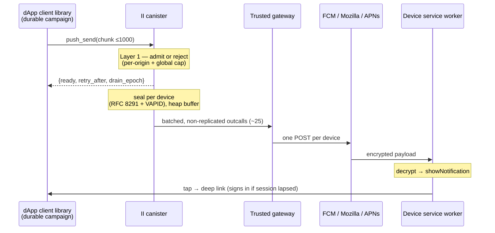
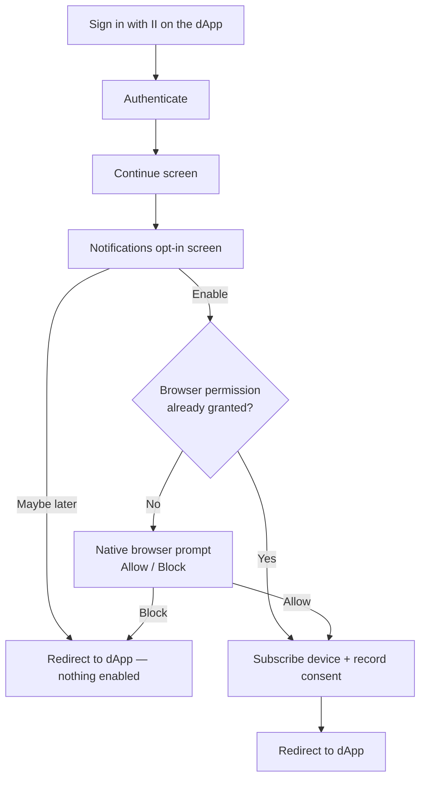
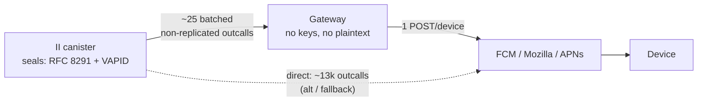
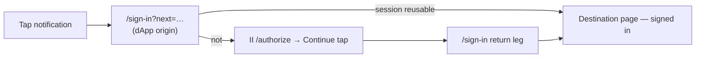
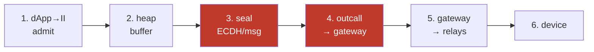
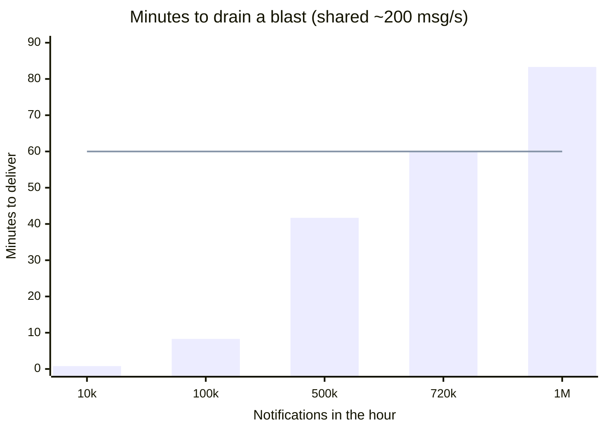

# Push notifications — design

**How to read this.** It is long because it covers two independent scaling paths
and a security model. If you only read one section, read
[How it works, in plain terms](#how-it-works-in-plain-terms). Then:

- **Reviewing the design?** [Goals and non-goals](#goals-and-non-goals) →
  [Architecture](#architecture) →
  [Alternatives considered](#alternatives-considered) →
  [Security model](#security-model) → [Open items](#open-items).
- **Implementing it on II?** [dApp → II](#dapp--ii) →
  [II's state model](#iis-state-model-stateless-for-campaigns) →
  [Delivering to devices](#delivering-to-devices) →
  [Push must never degrade authentication](#push-must-never-degrade-authentication).
- **Integrating a dApp?** Reference material lives in separate files:
  [push-api.md](push-api.md) (Candid + integration steps) and
  [push-client-library.md](push-client-library.md) (the client library).
- **Wondering what exists today?** [Status](#status), at the end.

## Context and scope

A dApp on the IC that wants to reach a user who is not currently looking at it
has no good option. Web Push is the browser-native answer, but doing it yourself
means prompting for your own notification permission, running your own service
worker, holding your own VAPID keypair, and storing your own subscription
endpoints — per dApp. Browsers increasingly bury that permission prompt, users
decline it more often the more times they see it, and on iOS Safari it requires
the site to be installed as a PWA at all. The result is that almost no dApp does
it, and users get nothing.

Internet Identity is already the one origin every user of these apps has a
relationship with, and already holds per-user state they have consented to. That
makes it the one place where the permission can be asked **once** and reused.

So: II hosts a single Web Push pipeline that any dApp can send through. The user
grants notification permission to `id.ai` once, subscribes per device, and
consents per dApp; a consented dApp then delivers through II rather than running
a push stack of its own. Installing II as a PWA stays **optional** on Android and
desktop, and is **required only on iOS Safari** — where "install one app, get
every dApp's notifications" is a better trade than installing each dApp.

This document covers the design of the two paths that decide whether it scales —
**dApp → II** and **II → device** — the security and privacy model, and the open
items. It is a design document, not an integration guide: the Candid interface
and the client-library internals are here to show the design is buildable, not to
serve as reference material.

## Goals and non-goals

### Goals

- **One permission, many apps.** A user allows notifications once, for their
  identity provider, and every consented dApp reaches them through it.
- **A dApp needs no push infrastructure.** No service worker, no VAPID keypair,
  no subscription storage, no relay accounts.
- **Consent is per dApp and per device, and revocable.** Revoking one dApp stops
  its notifications immediately and affects no other.
- **A 10k-user broadcast is a normal operation**, not an incident — with the
  explicit constraint that it must never degrade authentication, which is what
  this canister actually exists to do.
- **II's durable storage does not grow with volume.** Storage is user-scoped;
  sending more notifications must not make it larger.
- **A tap lands the user where the notification was about**, in the sending app,
  signed in.
- **End-to-end encryption is possible** for apps that can't let II see message
  text — a messenger shouldn't hand its message bodies to its identity provider.
  See [End-to-end-encrypted apps](#end-to-end-encrypted-apps).

### Non-goals

- **Not a messaging product.** No inbox, no history, no unread state, no
  read receipts. II forgets a notification once it is handed off.
- **Not exactly-once delivery.** Delivery is explicitly at-least-once, which is
  why device-side deduplication ships with it rather than after it.
- **Not guaranteed delivery.** The relays are best-effort and a device that never
  comes online never receives; no part of this promises otherwise.
- **Not per-notification billing, in v1.** Charging senders cycles is parked, not
  designed — which has consequences for abuse limits, covered below.
- **Not a way to reach "all II users".** There is no audience except users who
  consented to a specific dApp; a sender cannot discover or address anyone else.
- **Not universal browser support.** Web Push is browser-scoped. Browsers without
  it (some vendor forks ship none) are out of reach, and that is not something
  this design can fix.
- **Not a replacement for in-app notification UI.** This reaches users who are
  away; what an app shows a user who is present is the app's business.

## How it works, in plain terms

The whole design in six points; everything after adds detail.

1. **A dApp never talks to phones.** It tells II "notify these users" (by opaque
   per-app id — it can't reach anyone it wasn't given); II delivers.
2. **II already knows how to reach each user** — the browser hands it device keys on
   enable, and it records which apps are allowed. Two per-user facts: devices, and
   allowed apps.
3. **II seals every message** with the device's own Web Push key (only that device
   decrypts; relays just forward) and signs it (VAPID, cached).
4. **Big sends are streamed**: a client library feeds II bite-sized batches; II
   refuses more than it can take. The list lives with the dApp — II stores almost
   nothing per send.
5. **II hands the sealed messages to a trusted gateway** that does the many
   per-device sends over ordinary internet (direct-from-canister is the fallback).
   The gateway only forwards bytes it can't read.
6. **A tap goes straight to the app's deep link**, signing the user in on arrival if
   their session lapsed; only a link-less notification detours through II.

## Architecture



Three limits shape everything and bind on every deployment:

| Limit | Consequence in this design |
| --- | --- |
| **In-flight outcalls** — 3000 subnet-wide, shared with II's own login paths | batch through the gateway (~25 outcalls, not ~13k) so a blast can't starve sign-in |
| **Stable storage** — 500 GiB/canister, must not grow with volume | durable campaign lives in the dApp's library; II keeps only user-scoped rows + a transient buffer |
| **Instructions/round** — this canister also serves every login | drain in bounded slices, never whole chunks |

Cycles are waived on canonical II (system subnet `uzr34…`) but fully charged on any self-hosted or forked deployment — so the design targets the **paying** case and treats the waiver as one deployment's property, not a premise.

## The user experience

### Turning notifications on (first time signing into a dApp)



Two grants, and only one repeats:

- **II's opt-in screen** shows once per dApp per device — consent is per origin,
  nothing is inherited.
- **The browser's permission prompt** is granted to `id.ai` once and never returns;
  every dApp delivers through that one origin.

No install needed on Android/desktop. iOS is a degraded path: Web Push works only
in an installed home-screen PWA, so consent is granted in the tab but the
subscription is created later from II's own installed app. A native II app on APNs
would be the real fix — out of scope here.

### What happens when a notification is sent

7. The dApp's backend tells II to notify the user. At any real scale this runs
   through the dApp's client library and the chunked `push_send` endpoint (see
   below); the PoC has a simpler one-shot `notify_user` for a single recipient.
8. The notification arrives on every device the user enabled — **even with the
   tab closed / browser not running** (on Android). It shows the dApp's origin
   as the source and the dApp's title/body as the text.
9. The user **taps** it. When the dApp supplied a deep link — the normal case —
   the service worker opens that URL directly and II is not visited at all. The
   dApp lands the user on the page the notification was about, signing them in
   on the way with the ICRC-167 top-level redirect if the session has lapsed,
   which is the usual state when a notification is what brought them back.
   Only a notification with no deep link falls back to II's `/notify` screen
   ("Opening `<dApp>`" with the app's logo), which resolves the sender's origin
   behind a consent gate and forwards to the dApp's home.

### Managing them, and turning them off

10. Either from the browser or from II.

    In **II → Settings**, the user sees **Notifications on this device**
    (a toggle to turn the whole device on/off) and **Allowed apps** — every
    dApp that can notify them, each with a remove button. Revoking an app
    stops its notifications immediately.

    The **browser's own site settings** can also block notifications for
    `id.ai`, which silences every dApp at once and cannot be overridden from
    inside II — the permission belongs to the browser, not to us. II can only
    observe the result: a blocked permission makes the opt-in screen
    unofferable, so it is skipped rather than shown as a button that cannot
    work. Re-enabling has to happen in the browser too; that is the one path
    II cannot offer a control for.

## dApp → II

### Sending to thousands: chunked send + two-layer flow control

A campaign is delivered as **bounded chunks** (≤~1000 targets, under the message
size ceiling) — II must never hold a whole campaign, that's the storage that scales
with volume. Two control layers, not to be confused:

- **Layer 1 — II admission (mandatory, adversarial).** Hard `recipients.len()`
  ceiling + per-origin token bucket + global buffer cap. Over capacity, `push_send`
  rejects (`ready=false`, `retry_after_ms`). **II never holds more than its bounded
  buffer, whatever the client does** — this is the anti-spam property.
- **Layer 2 — client pacing (cooperative, efficiency only).** The library reads the
  same signal and paces; skipping it just delivers slower. Never an anti-spam layer.

The rule: **II protects itself; the client optimizes itself.**

<details><summary>Two caveats on Layer 1</summary>

- The reject is O(1) but happens *after* the 2 MB chunk is decoded — cap accepted
  size well below 2 MB so the pre-decision cost is bounded.
- `inspect_message` **can't** help — it isn't invoked for inter-canister calls, and
  `push_send` is called by canisters. The ≤1000 bound is enforced server-side
  (2 MB of recipients ≈ 65k, whose per-recipient lookups would trap).

</details>

Broadcast and personalized share one `push_send`: a `default_alert` plus recipients
that may override it. Broadcast = default + empty overrides; personalized = per-
recipient alert (templated client-side, II holds no template).

### The Candid interface

The full interface — `push_send`, the alert and delivery types, the result and
rejection variants — is in [push-api.md](push-api.md#the-candid-interface). It is
reference material rather than design argument, so it lives beside the
integration guide. What matters here is the shape it implies, covered above and in
[II's state model](#iis-state-model-stateless-for-campaigns).

### How II knows which users to send to

The dApp only knows its users by their in-app principal (II's privacy model).
`PRINCIPAL_INDEX` resolves `principal → (anchor, origin_hash)`, and the index
entry **pins the origin** — a principal belonging to another dApp's consent
resolves to a different `origin_hash` and is rejected. dApp A physically
cannot target dApp B's users even with stolen principals. Audiences larger
than one chunk are split across paced `push_send` calls by the client library,
not by server-side routing.

### How II verifies the sender is really that dApp

Sends are authenticated at the **origin**, not per user. A dApp's only setup step
is to publish a file; II verifies it and shows its `name` as the notification
title (so no dApp can wear another's name).

```
https://myapp.com/.well-known/ii-push-senders
{ "senders": ["abcde-…-cai"], "name": "MULTI/DEX" }
```

II verifies on first consent (preferred) or on a send (returns `SenderUnverified`,
never blocking the call), storing `origin_hash → {principals, name}`. Every send
then requires `caller` to be a listed principal. Revoke by removing the file — II
drops the sender on its ~weekly re-check.

> **Self-serve verification is a launch blocker.** The PoC registers senders by
> hand (controller-only). "Any dApp can send through II" is false while onboarding
> means a DFINITY support ticket, so the `.well-known` check must ship in v1.

<details><summary>Verification detail</summary>

- **Fetch only for origins a user already consented to** — otherwise any canister
  could make II fetch an arbitrary URL (SSRF/DoS). Add per-origin negative caching
  and a concurrent-verification cap.
- **The proof needs both halves** — a published file *and* a canister it names — so
  an impersonator needs the origin's content and the canister.
- **`name` fallback** is the bare host, not the full URL. Cap length, reject
  control/RTL characters: a name is a homograph surface a host isn't.
- **`push_register_sender(origin)`** forces an immediate re-check after editing the
  file, bypassing the negative cache.
- Reuses the DoH/outcall machinery; a `_canister-id` DNS TXT record is a second
  proof path for custom domains.

</details>

### Admission control (Layer 1): stopping one dApp from flooding II

The mandatory guard on every `push_send`, assuming a hostile client:

- **Hard `recipients.len()` ceiling** (~1000) + accepted-payload cap well below 2 MB.
- **Per-operator token bucket** in **device-messages** (a 5-device recipient costs 5),
  bucketed by **eTLD+1 not bare origin** (else `a1…a1000.evil.com` = 1000 buckets).
- **Global buffer cap with per-origin reservations** underneath — a large sender at
  its limit can't starve small ones (a plain FCFS cap wouldn't guarantee that).
- **A push outcall budget** well below the 3000 cap, yielding to auth outcalls.
- **Reject** over capacity (`ready=false` + jittered `retry_after_ms`).

The only II storage a sender can pressure is the bounded buffer, which this caps
directly.

### What this costs, and who pays

**Always scarce** (every deployment): outcall slots (3000 subnet-wide, shared with
login — why the gateway exists), storage (kept O(users × origins), never O(volume)),
instructions (bounded-slice drain).

**Cycles** are waived on canonical II, charged elsewhere. The per-byte fee carries
the `·n` replication factor, so non-replicated is where the money is — a 10k-user
blast on a paying subnet:

| Path | Outcalls | Cycles | ≈ USD |
| --- | --- | --- | --- |
| Direct, replicated | ~13k | ~2.8 T | ~$3.80 |
| Gateway, replicated | ~25 | ~0.7 T | ~$0.95 |
| **Gateway, non-replicated** | ~25 | ~0.02 T | ~$0.03 |

Batching cuts *count* ~500× but cycles only ~4× (per-byte fee is the same sealed
bytes); dropping replication cuts the payload by ~34×. Set `max_response_bytes`
tight — it's charged whether used or not. The gateway's real justification stays
**outcall slots**, which no pricing change touches.

**vetKD** (for [E2E](#end-to-end-encrypted-apps)) is charged everywhere: ~26.2 B
cycles/call — fine once per user, ruinous per message (~$357/10k blast). So derive
**once per `(user, origin)`**, cache in the SW, rate-limit per anchor; the bill
lands on **II** (ingress carries no cycles), so an uncached derive is a
user-triggerable drain.

**No sender charging in v1** — parked (accept/refund complexity). But a rate limit
× time is unbounded spend, so a paying deployment needs a **cycle budget +
circuit breaker** independent of the rate bucket.

## II's state model: stateless for campaigns

II holds **no campaign queue in stable memory** — it accepts a chunk into a
transient heap buffer, seals and sends it, then forgets it. The durable list lives
with the dApp, so II's storage doesn't grow with notification volume.

`push_send` is a cheap, no-await admission call: count check, authenticate sender,
dedup `chunk_id`, [Layer 1](#admission-control-layer-1-stopping-one-dapp-from-flooding-ii),
per-target consent-check, admit survivors, return
`{admitted, rejected, ready, retry_after_ms, drain_epoch}`. It can't send inline —
a whole chunk is ~1000 seals + outcalls against the 500-deep output queue and the
instruction budget.

A ~1s timer drains the buffer in **bounded slices** (target 100–300 device-msgs,
measured), each slice:

- **claims** its entries before the first `await` (non-reentrant), or two ticks
  double-send — `ic-cdk-timers` documents duplicate execution under load;
- resolves each anchor's devices **now** via a **prefix range scan** on
  `(anchor, endpoint_hash)` (never a full-map scan — that's O(all push users) and
  traps at scale), re-checks consent, forces sender-origin attribution;
- seals per device (RFC 8291) + attaches the cached VAPID JWT, assigns `msg_id`;
- **isolates per-entry failure** — a trap rolls back the tick and the poison row
  retries forever; needs a failure boundary, attempt counter, and a watchdog.

<details><summary>Sealing cost, and the two ceilings</summary>

The cost is RFC 8291's **ECDH** — a variable-base P-256 scalar mult per
device-message (HKDF/AES are noise; the VAPID signature is cached, per audience,
free). It can't be amortised: no encrypt-once mode. Two ceilings: the slice is a
*small fraction* of the round because this canister serves every login (bigger →
login latency); the per-message instruction limit is a *hard wall* above it, and
crossing it traps → rolls back → retries the same slice forever. So the slice must
come from a measured per-seal cost, not an estimate.

</details>

`PushDelivery` shapes the buffer: **topic** replaces an un-drained same-key entry
(collapses rapid updates); **ttl** skips the outcall once expired; **urgency** is
one drain-order input, never the sole key — it's sender-supplied and everyone sets
`High`, so origin fairness (round-robin) outranks it, with age/TTL preventing
starvation.

**Durability needs `drain_epoch`.** The buffer is heap, lost on upgrade; the client
re-sends unacknowledged chunks — but `admitted` means "buffered", returned before
an upgrade that would drop it, so today a client can't tell. A `drain_epoch`
counter (bumped in `post_upgrade`) + `push_chunk_status(chunk_id)` closes it,
making delivery explicitly **at-least-once** (hence `msg_id` ships with it). The
only new **stable** regions are the user-scoped, volume-independent sender/subscription/consent
maps; `chunk_id` dedup is a bounded heap set.

### Buffer size, and how many origins it serves at once

An entry is **per recipient** (~200 B + text; ~1 KB personalized vs one shared copy
for a broadcast — a reason to keep `default_alert` the common path). **Memory isn't
the constraint** (4 GiB heap; 100k recipients in flight ≈ 20–100 MB). **Drain rate
is**, and it's a *shared pie* — ~200 device-msg/s total across all origins:

| Work | Device-msgs | Drain time |
| --- | --- | --- |
| 1k-recipient chunk | ~2k | ~10 s |
| 10k blast | ~20k | ~100 s |
| 10 origins × 10k | ~200k | ~17 min |

So the buffer depth should be **drain rate × acceptable latency** (60 s → ~6 MB),
not what the heap allows — a memory-sized buffer accepts hours of backlog and
returns `admitted` for messages whose TTL expires first (a lying success). Express
admission in *seconds of backlog*, fair-shared `total_rate / active_origins`. All of
this scales off the unmeasured ~200/s — measure the per-seal cost first.

### The way to lift that ceiling is a separate canister

Note what the 200/s is actually a limit on. It is not the crypto and it is not the
platform — it is **co-tenancy with authentication**. The slice is small because
this canister serves every login on the network, so the only reason push cannot
spend its whole execution round sealing is that logins are sharing that round.

Which suggests the structural fix: run push in its **own canister**. It could then
spend a full round on sealing — plausibly the same order as the 10–20× headroom
between the self-imposed budget and the instruction limit — while keeping the
trust boundary exactly where it is today. Still an IC canister under the same
controllers, still no plaintext leaving the platform, so this buys throughput
without the concession that moving sealing to the gateway would demand. It also
turns [Push must never degrade authentication](#push-must-never-degrade-authentication)
from a discipline that has to be maintained into a property that holds by
construction.

The real cost is state ownership. Subscriptions and consent are anchor-scoped, so
a push canister has to **own** those maps rather than calling II per send —
otherwise the load just moved back, with inter-canister latency added. Then
`/authorize`'s opt-in becomes one inter-canister write at consent time, which is
rare and cheap, and the service worker still lives on II's origin because that is
where the notification permission is granted. What is genuinely new is
two-canister upgrade coordination, and deciding where the VAPID key lives.

Not proposed as the shipping path here, because it changes which canister holds
user-scoped state and that deserves its own review. But it is the honest answer to
"the throughput number looks low", and it is a better answer than moving crypto
off-platform.

## Delivering to devices

The relay API is one POST per subscription endpoint (RFC 8030) — there is no
multi-recipient send, so reaching N devices is fundamentally N sends. The
design routes those sends through a **trusted web2 gateway**. Doing them as
per-device outcalls straight from the canister ("direct") is the documented
**alternative** — kept for context and as a possible low-volume or
fully-on-chain fallback, but not the shipping path.

### The outcall to the gateway is non-replicated

**Decision:** II's batch handoff uses `is_replicated = false` (mainnet since
2025-08-04). One node makes the call — no 34× fan-out, no response consensus,
~2 orders of magnitude cheaper — which is why the gateway can stay stateless,
return real per-device status, and enable `410` cleanup.

Two caveats: the flag is **experimental**, so isolate it behind one call site that
can revert to replicated + transform; and a single node's reply isn't
consensus-verified, so returned status is evidence, not proof (no new concession —
a trusted gateway could always lie).

<details><summary>Why replicated outcalls don't work here</summary>

A replicated outcall runs on every node (34 on II's subnet), so the target sees 34
identical POSTs and responses must be byte-identical or consensus fails. That
breaks Web Push two ways:

- **Duplicate delivery** — RFC 8030 has no idempotency key, so 34 POSTs = up to 34
  banners. (`msg_id` + SW dedup is a v1 requirement regardless, as a belt-and-braces.)
- **Per-device status can't survive consensus** — the 34 POSTs legitimately get
  different answers (`201`, `429`, `410`), and a transform can only collapse them to
  one value. So `410`-driven [cleanup](#stale-subscription-cleanup) is impossible
  under replication.

</details>

### The delivery path: a trusted web2 gateway

II seals every message, then hands the ready-to-send bundles to a small trusted
helper that fans them out over ordinary internet:



**Why a gateway, not direct:** in-flight outcall slots, not cycles. A 10k-user
blast is ~13k direct outcalls against the subnet's 3000 shared slots — it would
starve login. The gateway needs ~25. This holds even on the fee-waived deployment,
which is why it's the real reason (cycles only differ ~4×).

**What stays on II:** all crypto. The gateway sees ciphertext, endpoints and timing
— never keys or plaintext. Sealing can't be offloaded: the ECDH that derives the
content key *is* the ability to decrypt, so the only movable part is the AES that
was already free.

<details><summary>Trust delta — the deliberate cost</summary>

The gateway can **drop, delay or replay**, and **forge sends**: each bundle carries
a VAPID token relays accept without validating the body, cached ≤12 h. A compromised
gateway can harvest `(endpoint, token)` pairs and POST junk that won't decrypt — the
browser then shows its generic "site updated" notice attributed to `id.ai`, burning
the [shared permission](#shared-fate-one-permission-for-every-dapp). Mitigations:
scope credentials per batch, cut the JWT cache to minutes. The token is also
extractable from canister state by node operators, so this isn't the operator's
alone. It's a **single point of failure** — see
[Operating it](#operating-it-controls-alerts-and-rollout).

</details>

### The alternative: direct per-device outcalls

One outcall per device, fully on-chain, nothing extra to trust — but ~13k outcalls
per blast against the 3000-slot cap **disqualifies it as the default**. Viable for
low volume or a deliberately all-on-chain deployment. With `is_replicated = false`
it becomes a genuine peer of the gateway on correctness (no fan-out, per-device
status restored), still bounded by in-flight slots.

## The dApp-side client library

A dApp does not call `push_send` in a loop; it drives II through a small client
library that owns pacing, retry and durable campaign state — which is what keeps
II's own storage flat. Its design, the send loop, the state it must keep and the
failure modes it owns are specified in
[push-client-library.md](push-client-library.md).

The one point that belongs in this document: the library is where the durable list
lives, which is what lets II stay stateless per send. See
[II's state model](#iis-state-model-stateless-for-campaigns).

## On the device: rendering and tap-through

- **Subscribe** (Settings or `/authorize` opt-in): request permission,
  `pushManager.subscribe` with II's VAPID key, store `(anchor, endpoint_hash)`. A
  browser binds one subscription per SW to one key, so `subscribe` refuses a
  different key — reuse when it matches, replace when it doesn't (or subscribers
  under an old key can never re-enable). No install on Android/desktop; iOS Safari
  only allows Web Push for an installed home-screen app.
- **Consent** (`push_grant_consent`): once per `(identity, origin)` per device.
  Consent is shared across the identity's devices, so a second device is missing
  only the subscription ("Also notify you on this device?").
- **Render**: `Display` shows the supplied text; `Hidden` shows an II-controlled
  generic string by `category`.
- **Click**: with a deep link the SW opens it directly (II validated `alert.url`
  is on the consented origin at send time); without one, `/notify?origin=` resolves
  the sender and fails closed. For `Hidden`, the tap is the content-reveal.

### Shared devices and multiple identities

One browser has one endpoint, but several identities may share it. **Enabling and
consent are per identity, never per device** — no consent is inferred from a shared
endpoint. So:

- The same endpoint appears under several anchors as **independent rows**; II
  delivers to an anchor's row only if that anchor enabled it.
- Isolation is at the **consent layer**, not transport — once two identities enable,
  the device physically receives both; the SW renders by **sender origin**, never
  revealing they share a device.
- Disabling removes only that anchor's rows; `unsubscribe()` fires only when no
  identity still wants notifications.
- On rotation, each identity re-registers next time it authenticates.

### Where a notification opens### Where a notification opens

The app may set `alert.url` to send the user to a specific page rather than the
origin root. **II validates it at send time** and refuses the send otherwise:

- **The target must be on the sender's own application.** The sender origin is
  II-derived, not a field on `PushAlert`: the backend forces it to this sender's
  consented origin, so a dApp cannot set or spoof it. A notification can
  deep-link anywhere within the sender's own site
  (`https://app.com/thread/42`) but never to another origin — not `evil.com`,
  and not another consented dApp.
- **Both sides are canonicalised** before comparing, because consent is recorded
  against the _effective_ origin (already remapped to the legacy boundary
  domain) while a dApp's links use whichever domain the user is browsing.
  Without that, every real deep link is refused. It stays safe rather than
  loose: only the same subdomain collapses, and that subdomain is the canister
  id, so two different canisters can never normalise to one origin.
- **Only `https`, or `http` on loopback** — the secure-context rule browsers
  use. `javascript:` and `data:` URLs report their origin as the string
  `"null"`, so without a scheme check two of them compare equal, pass an
  origin test, and reach a navigation.

Validating on the send side rather than on the device is what lets the service
worker open the link directly, removing a hop from the tap-through. It is also
simply the better place: this is the only party that knows authoritatively which
origin the user consented to, whereas the device-side check sat on a publicly
craftable URL and every future consumer of `alert.url` would have had to repeat
it.

No target → the tap opens `/notify?origin=<sender>`, which resolves the sender's
origin from the anchor's consent list and fails closed if it cannot.

### Landing the user already signed in

Yes, with **no II-side changes** — it composes out of the ICRC-167 redirect
transport II already supports.

**II cannot push a signed-in session.** A delegation targets a session key the
_dApp_ generates and II never sees, so the flow must *begin* on the dApp's origin —
a notification cannot bounce through `id.ai` and have II sign the user in from
there. This is the same property that stops II impersonating a user, so it's a
guarantee, not a limitation.



Notifications link straight at the sign-in route (not the app, which would boot,
find no session and bounce — a visible flash). The dApp provides `transport:
"redirect"`, a `/.well-known/ii-auth-callbacks` file declaring the exact callback
(protocol+host+path only — the destination rides in memoized flow state), and a
callback origin whose identity derivation matches the push-consent `effectiveOrigin`.

**This should be a library, not per-dApp code.** Building it by hand is ~70 lines
of ICRC-167 plumbing, ~15 of them app-specific and two security-relevant (narrowing
an attacker-supplied `next` to a same-origin fragment; landing in the app on
failure not stranding). It belongs in `@icp-sdk/auth` as one call —
`handleRedirectSignIn({ nextParam, reuseExistingSession, onArrive, onError })` —
with hooks for an app's own session policy. Until it exists, tap-through is the one
place "a dApp needs no push infrastructure" is false.

<details><summary>Lessons that shaped the helper's design</summary>

- **Its own route** — the flow journals state per route; on the app root it
  interleaves with boot and lands signed out.
- **Reuse needs the app's staleness rule, not just `isAuthenticated()`** — a
  delegation can be valid while the app considers the session dead (session ends on
  last-tab-close, exactly a notification's state). Stamp liveness first (arrival =
  presence), then reuse. An app that *deletes* its session on tab close always
  re-auths; it should exempt push-consenting users.
- **Only II's Continue tap is irreducible** — silent delegation issuance would let
  any site obtain one by redirect. The ugly signed-out path is a session-lifetime
  problem, not one to style away; don't add an II-side interstitial (only the dApp
  knows if it has a session).
- **Local dev:** a loopback callback needs II's `dev_csp` (the allow-list fetch is
  `connect-src`-bound to `https:`), and Chrome prompts for local-network access —
  both absent once both sides are public https.

</details>

### Apps with no URL routing (e.g. Caffeine)

Deep-linking and signed-in tap-through both assume **addressable URLs**.
Caffeine-built apps were last seen fully stateful with no routing — so there's no
address to point a notification at. **Confirm this before promising notifications
there** (and check the builder sandbox separately from published apps).

If routing is absent, such a platform needs: (1) an addressable destination — a
single `/open?s=<token>` entry route restoring in-app state is the cheap fit; (2) a
sign-in route in the project template; (3) an `isAuthenticated()` guard; (4)
`/.well-known/ii-auth-callbacks`. The callback must be protocol+host+path only, so
the destination rides in memoized flow state.

**Fallback:** notifications still work as "open the app" — no deep link, no
authenticated landing. Pairs naturally with `Hidden` content.

### Action buttons: navigate, never act

`actions` are extra buttons (`notificationclick` reports which); platforms show ~2,
**Safari/iOS none**, so they must degrade. Every action here can only **navigate** —
the SW is on II's origin and holds no dApp session, so "Add margin" opens the
add-margin screen, it can't add margin. It's just an extension of the deep link:

```candid
actions : opt vec record { id : text; title : text; url : text };   // ≤ 2, same-origin
```

**Cost of the hub:** silent actions. A dApp's own SW could Archive/Snooze via a
`fetch` with no window; the II-hosted worker can't. Listed in
[alternatives](#a1) as part of what the single permission buys.

**What it buys back: a sender-proof off-switch.** Because II composes every
notification it can attach an off-switch no sender can remove or relabel — a
guarantee no per-dApp design can make. It spends one of the two slots (worth it,
since a sender's own actions only navigate anyway). Three levels:

- **Turn off on this device** — free, silent, today. `subscription.unsubscribe()`
  needs no II call, works even if II's backend is down; endpoint then `410`s and
  [cleanup](#stale-subscription-cleanup) reclaims it. Device-wide, not per-app.
- **Stop this app** — `{ action: "ii-manage", title: "Manage" }` deep-links to
  `/manage/settings?app=<origin>` (revoke is anchor-authorized, so it navigates).
  **"Manage" not "Unsubscribe"**: Chrome already shows its own unsubscribe, and the
  button navigates rather than revoking. Lands on the app's row where every other
  grant is visible; the destination already exists in `PushNotificationsSection`.
- **Stop this app silently** — would need a sealed capability token; not worth one
  saved tap in v1.

II owns both labels — a sender able to rename them would defeat the point.

### Updating or dismissing a notification already shown

Yes, via a dApp-chosen `notification_id`, which the service worker maps to the
Web Notification `tag`:

- **Update / replace** — send again with the same `notification_id`; the device
  replaces the shown notification in place rather than stacking a second (e.g.
  "Order shipped" → "Order delivered", or a live score ticking up).
- **Dismiss** — send `content = Dismiss` with that `notification_id`; the SW
  finds notifications with the matching tag and calls `.close()`, showing
  nothing new.

This is complementary to the `topic` delivery header, and the two act at
different stages: `topic` collapses _undelivered_ messages at the relay
(before they reach the device), while `notification_id` updates or dismisses an
_already-delivered_ one on the device.

Caveats:

- **`userVisibleOnly` fights a silent dismiss.** Browsers require every push to
  show _something_; a pure "close and show nothing" push can trigger the
  browser's generic "site updated in background" notification and, if abused, a
  permission penalty. So **update-with-a-new-state is the robust pattern**;
  pure dismiss is best-effort.
- It only works if the device is online to receive the follow-up and the
  notification is still present (the user may have dismissed it already).
- This is **explicit, opt-in** grouping the dApp controls — the opposite of the
  automatic hostname-collapse we rejected. Notifications without a
  `notification_id` never replace each other.

## Alternatives considered

| # | Decision | Rejected alternative | Why |
| --- | --- | --- | --- |
| 1 | [II hosts the pipeline](#a1) | Each dApp runs its own | The permission is the scarce resource, not the plumbing — a dApp can't win the *n*th prompt |
| 2 | [II hosts the service worker](#a2) | Each dApp hosts its own | Same decision as #1 — Web Push binds the subscription to the SW's origin |
| 3 | [Gateway delivery](#the-delivery-path-a-trusted-web2-gateway) | Direct per-device outcalls | 13k in-flight outcalls would starve login; gateway → ~25 |
| 4 | [Sealing stays on II](#action-buttons-navigate-never-act) | Gateway seals | Deriving the key = ability to decrypt; useless to move. Real lever is a [separate canister](#the-way-to-lift-that-ceiling-is-a-separate-canister) |
| 5 | [vetKeys-sealed E2E](#end-to-end-encrypted-apps) | dApp holds the keys | See E2E section |

<h4 id="a1">1. II hosts the pipeline</h4>

The status quo — every dApp runs its own permission prompt, service worker, VAPID
keypair and subscriptions — has real merits (no shared fate, no gateway, content
never leaves the dApp). Rejected anyway: users decline repeat prompts, browsers
bury them, iOS needs a PWA install per site, so the per-dApp model almost never
happens in practice. One permission at the identity provider is the only version
users say yes to, and the one thing a dApp can't build itself.

Its price, paid throughout this doc:
[shared fate](#shared-fate-one-permission-for-every-dapp), II sees content absent
[E2E](#end-to-end-encrypted-apps), a delivery pipeline inside an auth canister
([must not degrade login](#push-must-never-degrade-authentication)), and
[action buttons can only navigate](#action-buttons-navigate-never-act).
In exchange it buys one thing no per-dApp design can:
[an off-switch no sender can remove](#action-buttons-navigate-never-act).

<h4 id="a2">2. II hosts the service worker</h4>

Web Push binds a subscription to the SW's origin, so a per-dApp SW would need a
per-dApp permission — making #1 impossible. Cost: notifications arrive attributed
to `id.ai`, which the UX fixes by naming the app and the security model defends by
forcing sender-origin attribution at send time.

## Security model

| Threat | Defence |
| --- | --- |
| **Cross-dApp targeting** | Origin pinning — a sender reaches only anchors that consented to *its* origin, even with leaked principals |
| **Spoofed attribution** | II derives and stamps the origin; a dApp can't wear another's name. Must also **canonicalize** origins (punycode/case/port, reject mixed-script) and strip bidi/whitespace from `title`/`body`, rendering attribution as a non-injectable element — this is the highest-credibility surface for a recovery-phrase phish |
| **Relay/gateway reads content** | RFC 8291 encrypted per device. Scope: *transport* only — II sees `Display` plaintext (it seals); `Hidden`/vetKeys keep it from II too |
| **Probing II state** | Rejections are coarse (`NoConsent` only); randomize `retry_after_ms` (it reflects aggregate load); reject reasons a fixed enum; endpoint URLs never logged |
| **`/notify` icon** | curated registry only + globe fallback — never fetch arbitrary/remote icons into II's chrome |

**The VAPID-key risk is larger than "spam".** The same stable memory holds the
VAPID key *and* every device's `p256dh`/`auth`, so an attacker reading it can forge
**fully-readable notifications to any device, attributed to any consented origin** —
whose tap-through then passes `/notify` and deep-links into the real dApp. That's
phishing capability, not spam, and there's currently **no detection or rotation
story**. Mitigate: per-device transport secrets (extracting one ≠ the other), a
signed per-endpoint counter so a SW can flag pushes II didn't send. Real fix:
[P-256 threshold ECDSA](#ic-capabilities-to-re-evaluate) removes the stored key
entirely.

**Key init must not race** — a lazy `await raw_rand` between check and write lets
two callers generate; the loser's subscribers become silently undeliverable.
Initialize eagerly behind a guard.

### Shared fate: one permission for every dApp

The value proposition — one notification permission covering every dApp — has a
structural consequence that is a security property, not a UX detail: **the
browser's permission belongs to `id.ai`, not to any dApp.** So the browser's
abuse heuristics and the user's own Block button both target `id.ai`.

A single hostile or careless consented sender can therefore end notifications
for **every other dApp on that device**: spam at volume, `Dismiss`-only pushes,
or malformed bodies each trip the browser's generic "site updated in background"
notification, and Chrome's abusive-notification heuristics respond by revoking or
quieting the origin. The user has no way to attribute which app caused it, and no
II-side re-enable UX can undo a browser-level block.

This is created by the single-permission design, so it has to be defended
II-side:

- A **per-origin budget on generic/contentless notifications**, not just on
  volume, with automatic suspension of an origin that exceeds it.
- **Attributable throttling** — surface "app X was rate-limited" in Settings so
  blame lands on the sender rather than on II.
- An **operator kill switch** per origin (see
  [Operating it](#operating-it-controls-alerts-and-rollout)).

### Which origin is authoritative

With `derivationOrigin`, a dApp on `beta.app.com` can derive its principal from
`app.com` (letting beta/custom-domain/canister-URL share one identity), leaving
`effectiveOrigin` (`app.com`, what the principal derives from) and `displayOrigin`
(`beta.app.com`, what the browser talks to) in play.

**Decision: `effectiveOrigin` is authoritative** — consent, registration and
attribution all key on it. Forced by targeting (the in-app principal derives from
it, so consent must match or the lookup fails) and the right trust boundary
(sharing identity already implies sharing push). Three obligations: the opt-in must
**disclose the origin granted** (show both when they differ); `.well-known` lives on
the `effectiveOrigin`; and one registration lets **every** alternative origin send
as `app.com` — intentional, document it.

### Consent lifecycle: it must not outlive the sender

Consent rows keyed only by `(anchor, origin_hash)` carry no reference to _which
sender_ was registered for that origin. That makes consent survive events it
should not:

- A dApp shuts down, its domain expires, someone else buys it, serves their own
  `.well-known/ii-push-senders`, and registers. **Every user who ever consented
  to that origin is immediately reachable** — attributed as the old brand, with
  tap-through deep-linking into the new owner's site.
- Sender deregistration and re-verification TTLs do not bound this, because they
  govern _sender verification_, not _consent validity_.

Fixes: stamp each consent row with the **sender registration epoch**; invalidate
consent when the registered principal set for an origin changes or the sender is
deregistered, requiring a fresh opt-in; expire consent after a long period with
no delivery; and surface "this app re-registered — re-confirm?" in Settings.

Relatedly, `.well-known` re-verification must not become a **deregistration
primitive**: a competitor who can cause a single 404 or timeout on a sender's
`.well-known` during one lazy re-verify would silently strip its notification
capability. Require K consecutive failures across a multi-day window, and never
deregister on a 5xx or timeout — only on a well-formed file that no longer lists
the sender.

## Privacy

The doc's confidentiality story is about _content_. Metadata is a separate
exposure and, for a notification hub, arguably the more sensitive one — `Hidden`
protects the message text and does nothing for any of this.

**What is genuinely new here.** II already stores which origins an anchor uses
(`StorableApplication`), so the anchor↔origin association is not new. What this
feature adds is the **temporal** dimension — _when_ each app notified each user,
continuously — and the **off-chain export** of a device-linkable identifier.

- **The gateway sees a join key.** Every bundle is
  `{endpoint, headers, authorization, body}`. Grouping by `endpoint` yields, per
  physical device: the set of sender origins notifying it, exact timestamps,
  message sizes, and `Urgency`/`Topic` in cleartext headers. Because one browser
  has one endpoint shared across a user's identities, that set links **a user's
  anchors to each other and their dApps to each other** — precisely the linkage
  per-origin principal derivation exists to prevent. No decryption required.
- **The relays get it too, and more easily than before.** All II-mediated push
  carries **one shared VAPID public key**, so FCM/APNs/Mozilla can isolate II
  traffic and count per-user dApp diversity trivially. Per-dApp VAPID keys — which
  this design frames as a burden it removes — were an unlinkability property.
- **Timing is content.** "Which dApp notified this user at 03:00" is sensitive
  even when the body is opaque.

Mitigations to evaluate: give the gateway per-batch pseudonymous endpoint handles
rather than raw endpoints; shuffle and pad batches so per-origin timing is not
directly readable; and consider per-origin VAPID subkeys to restore relay-side
unlinkability. At minimum, state plainly what the gateway, the relays and node
operators each learn.

## Delivery semantics: what is actually guaranteed

"Best-effort" is not a guarantee, and several features silently depend on which
one holds. Stated explicitly:

- **At-least-once, not at-most-once.** Retries and `drain_epoch` recovery both
  duplicate; the non-replicated handoff removes the *n*×-fan-out source but not
  these. `chunk_id` makes _chunk_ resends idempotent; `msg_id` + device dedup is
  what makes duplicates invisible to the user.
- **Unordered.** Nothing in the pipeline preserves order: per-relay queueing and
  urgency's contribution to drain order both reorder freely.
- **No delivery receipts.** The only per-target signal is `NoConsent`, returned
  at admission. `admitted` means "in II's buffer", never "on the device".

The ordering gap has teeth, because `notification_id` update/replace is defined
in terms of it: "Order delivered" can land before "Order shipped" and leave the
**stale** text on the lock screen permanently, and a `Dismiss` can arrive before
the notification it dismisses and then be a no-op forever. Fix: carry a
**monotonic sequence number per `(origin, anchor, notification_id)`** so the
service worker drops out-of-order updates rather than applying them.

## Duplicate and replay suppression (`msg_id`)

**Built.** Duplicates are the norm from four sources: replicated outcalls (removed
by the non-replicated handoff), timer duplicate execution (claim-before-`await`),
client retries + `drain_epoch`, and **accumulated subscription rows** — the one
that actually produced duplicate banners in testing, when a rotated endpoint left
two live rows for one browser.

II assigns a `msg_id` **once per admitted message**, inside the payload *before*
RFC 8291 encryption — so no dApp supplies it and no relay can read or forge it. The
SW keeps a bounded seen-set (**in the Cache API**, since the worker is killed
between pushes) and drops repeats; a payload with **no id is always shown**
(failing open beats dropping a real notification). The drain now **removes a row on
`404`/`410`**, the only signal a row is dead.

**To harden:** a bounded recency set can be flushed by flooding, so a replayed
capture looks new — replace with a per-origin high-water mark + a short `msg_id`
validity window. Note `msg_id` (II-generated, suppress duplicates) differs from
`notification_id` (dApp-chosen, *replaces* a shown notification).

## End-to-end-encrypted apps

The `Display` path is **not** E2E — II sees plaintext. For apps that can't allow
that (a messenger), the axis is *who decrypts and where*:

| Approach | Who decrypts | In-notification | Trust in II for content |
| --- | --- | --- | --- |
| **`Hidden`** (ships first) | the app, after tap | generic ("New message") | none |
| **Design A** — vetKeys | II's SW, on device | real text | II client code + vetKD threshold |
| **Design B** — dApp-fetch | II's SW, on device | real text | II client code (+ dApp) |
| `Display` | II service | full | full |
| App's own SW | app's SW | full | none (II not in loop) |

Key correction: "II can never show decrypted content" is too strong. II's *service
worker* decrypting on the user's own device — with a key II-the-service never sees
in clear — is viable, and only a small step past the trust of signing in with II.

**Ship `Hidden` first** — content-hidden notification + tap-through reveal (the
industry-standard E2E UX; `/notify` is the reveal path). Zero extra trust, today.
It's a deliberate lesser experience (no lock-screen preview) that's what makes E2E
+ push work at all.

<details><summary>Design A — vetKeys-sealed (preferred richer path)</summary>

II derives a vetKeys (IBE) identity per `(user, origin)`; the dApp encrypts to it
offline and sends only ciphertext via `push_send`. On the device, II's SW
authenticates as the user, gets the vetKD key (returned encrypted to the SW's
transport key — no node sees it clear), decrypts, shows real text. II-the-service
sees nothing; the residual trust is that II's canister controls the vetKD
authorization — same class as delegations. vetKeys is **live on mainnet**.

**Binding constraint: cost.** A derive per render is ~$357/10k blast (~400× the
outcall cost), billed to II. So derive **once per `(user, origin)`**, cache in the
SW, rate-limit per anchor — per-render derivation is a design error. Cross-subnet
derive latency (seconds) is a second reason the cached path is the only viable one.
Slots into `PushContent` later as an opaque ciphertext arm — no send/storage change.

</details>

<details><summary>Design B — dApp keeps the keys (alternative)</summary>

Push is a bare wake; II's SW fetches content from the dApp. E2E only if the endpoint
returns *ciphertext* — which forces either plaintext-from-backend (not strict E2E)
or provisioning a dApp key into II's SW (added surface). Needs SW→dApp auth and a
fetch per notification. Murkier than A; the fallback for backend-trusted apps.

</details>

## Open items

**Blockers** (before any real deployment):

| Item | Why |
| --- | --- |
| `.well-known/ii-push-senders` verification | self-serve registration; controller-by-hand today makes "any dApp" false — see [verification](#how-ii-verifies-the-sender-is-really-that-dapp) |
| Endpoint host allowlist | endpoint is caller-supplied → SSRF/reflection. Allowlist known push hosts, re-validate at drain, **II validates not the gateway** |
| Per-anchor caps | 20 subscriptions / 100 consents, anti-griefing not a storage bound. Evict dead rows first for subs; **refuse** (never silently evict) a consent |
| Reserved outcall budget for auth | push must not spend login's slots — [detail](#push-must-never-degrade-authentication) |
| Drain isolation & non-reentrancy | per-entry failure boundary, attempt counter, watchdog, claim-before-await, or one poison row wedges the feature |
| `drain_epoch` ack signal | client durability doesn't work without it — [state model](#iis-state-model-stateless-for-campaigns) |
| <a id="stale-subscription-cleanup"></a>Stale-subscription cleanup | `404`/`410` removal; possible on the gateway path only via the non-replicated handoff. Treat `410` as evidence, retire opportunistically |
| Redirect-sign-in helper in `@icp-sdk/auth` | tap-through is the last place a dApp writes security-relevant code by hand — [shape](#landing-the-user-already-signed-in) |
| `pushsubscriptionchange` | SW must re-subscribe + re-register or delivery erodes over weeks |
| Sender deregistration & re-verification TTL | bound the window after a compromised sender / domain hand-off |
| Origin canonicalization | punycode, lowercase, strip port, reject mixed-script, at registration and consent |
| Input validation & caps | `title`≤64, `body`≤256, `topic`≤32, `url` bounded, `chunk_id` 16 B — validate, never trap; fixed error enum |
| Cycle budget + freezing guard | per-origin/global daily burn cap + circuit breaker; disable push before spend nears the freezing threshold (past it, **logins fail while the frontend still loads**) |
| Buffer sizing & drain fairness | round-robin across origins; urgency/age only within a slice |
| Observability | buffer depth, drain lag, per-origin reject/410 counts, and **auth-path p99** (the signal push is stealing from login) |

**Decisions (design, not code):**

- **Apps without URL routing** (Caffeine) — confirm whether a builder-sandbox app can address a destination; if not, tap-through degrades to "open the app" — [detail](#apps-with-no-url-routing-eg-caffeine).
- **iOS** — PWA install mandatory for Web Push, flakier and more throttled; a native app on APNs is the real fix, out of scope.

**Deferred:** replay layering (`chunk_id` for dApp→II, `msg_id` for relay→device); cleanup hooks on device/anchor removal; metadata-privacy mitigations ([Privacy](#privacy)).

**VAPID rotation — never as maintenance.** A planned migration to a subnet-held key needs no user-visible event (dual-key, let the fleet age over); only compromise recovery invalidates everything and needs the "re-enable" UX. End state: [subnet holds the key](#ic-capabilities-to-re-evaluate).

**Rejected:** per-origin `tag` collapsing (collapsing is opt-in via `topic`); reusing one RFC 8291 ephemeral key across a batch (halves cost but links recipients and makes one leaked key expose the batch).

## IC capabilities to re-evaluate

Platform features that would change decisions in this doc. Worth re-checking
before implementation, because two of them postdate the design:

- ~~**Non-replicated outcalls (`is_replicated = false`)**~~ — **adopted**: the
  batch handoff to the gateway uses it, which is what makes `410` cleanup
  possible there and drops the payload cost by the full factor of *n*. Still
  marked experimental, so what remains to watch is the API changing under us —
  keep it behind one call site that can revert to replicated plus a transform.
  Field-tested outside II: multidex's price oracle has run on it since
  2025-08-04, which is where the ~*n*× figure was measured.
- **Per-node outcall results.** A management-canister API returning per-node
  responses would give per-device status back on a *replicated* path, which is now
  only interesting as a way to stop depending on an experimental flag. Unverified
  whether it is enabled on mainnet — settle by calling it or checking release
  notes.
- **P-256 (secp256r1) threshold ECDSA** — **the end state this design wants.** It
  moves the VAPID key out of storage entirely via `sign_with_ecdsa`: the subnet
  signs, there is no stored secret to extract, and the custody caveat that runs
  through the security model goes away rather than being mitigated. Requested
  since 2024 with **no public roadmap item or timeline**, so treat it as "if it
  ever ships", not "when" — which is why the stored key is the design and not a
  placeholder. Migrating changes the public key, but does **not** require a
  fleet-wide re-enable: run both keys and let old subscriptions age out, per
  [VAPID rotation](#open-items).
- **vetKeys** — already live; see
  [Design A](#end-to-end-encrypted-apps).
  Client libraries are still pre-1.0 and the JS package was renamed, so pin
  deliberately.

## Push must never degrade authentication

The invariant, stated separately because it is the one that makes this feature
unshippable if violated: **no volume of push traffic may reduce the availability
of sign-in.**

II is not a dedicated push canister. It authenticates every user of the network,
and push shares three resources with that job:

- **The in-flight outcall budget** (3000, subnet-wide). II's own auth paths spend
  from it: DoH for email recovery, JWKS and discovery for OIDC. Push must hold a
  quota well below the cap and **fail closed** — return `ready = false` — rather
  than compete. Note the queue to the management canister is also 500-deep per
  canister pair, so a burst can exhaust the queue and make II's _own_ auth
  outcalls fail synchronously.
- **Instructions per round.** A drain slice must be a small fraction of a round,
  never a whole chunk.
- **Cycles** (on paying deployments), because the freezing threshold is shared:
  push spend must never be able to push II toward the state where updates stop
  and only queries serve.

Concretely: a semaphore with a push-only quota, a drain slice sized from
measurement, a cycle floor, and **authentication p99 latency as a monitored
signal** with push throttling as the automatic response.

## Operating it: controls, alerts and rollout

Metrics alone are not operability. Missing today:

- **A per-origin kill switch.** `push_deregister_sender` is authenticated by the
  _dApp_, so there is no operator-side way to silence an abusive sender. Needs an
  operator-gated `push_set_origin_enabled(origin, bool)` plus a **global feature
  flag** in persistent state to disable push entirely without an upgrade.
- **Alert thresholds and ownership** — on buffer depth (stuck-timer canary),
  drain lag, per-origin reject rate, and auth-path p99. Define who is paged.
- **Gateway operations** — who runs it, how many independent instances (≥2 with
  distinct operators), health probes, automatic switchover, and what happens to
  batches already handed over when one dies. Since the gateway is the shipping
  path and the direct path is a degraded fallback, **gateway down = push down**;
  that needs to be an explicit, accepted statement rather than an implication.
- **Rollout and rollback.** Rollback is an upgrade, which discards the in-flight
  buffer — so a rollback silently drops in-flight campaigns unless `drain_epoch`
  is in place first.
- **A load test.** Every throughput and cost number in this doc is derived, not
  measured. Before deployment: run a 10k-recipient campaign against a local
  replica while measuring authentication latency, and measure the real
  instruction cost of one seal with `performance_counter` (II already runs
  P-256 in `dnssec/`, so this is a short exercise).

## dApp developer integration

What a dApp must do to send its first notification — register as a sender for its
origin, serve the callback allow-list, shape its deep links — is in
[push-api.md](push-api.md#dapp-developer-integration).

## Scaling

Two questions: **how fast can II push**, and **can II store the data**. The honest
answer to the first is per-stage — a send crosses six stages and only two actually
bound scale.

### Where the bottleneck is, stage by stage



| Stage | Hard limit | Elastic? | Push it → |
| --- | --- | --- | --- |
| 1. Admit | Layer-1 bucket | client-paced | bigger bucket = weaker flood protection |
| 2. Heap buffer | 4 GiB | not the limit | oversizing accepts backlog whose TTL expires |
| **3. Seal** | instructions/round, **shared with login** | **no** | bigger slice → login latency |
| **4. Outcall** | 3000 in-flight, 500-deep queue | **no** | more in flight → starves auth outcalls |
| 5. → relays | web2 | yes | relay per-app rate limits |
| 6. Storage | 537 GB | O(users×origins) | [below](#storage-can-ii-store-the-data) |

**Stages 3–4 bind — II's execution round, shared with every login. The single
global ceiling:**

> **≈ 200 device-msg/s ≈ 720k/hour ≈ 17M/day, across every dApp combined.**
> (Estimate — one RFC 8291 seal is dominated by a P-256 ECDH; measure it, every
> number scales off it.)

- **Users aren't the limit** — a large base costs storage, not throughput.
- **Simultaneous blasts are** — N origins serialise through one drain;
  [Layer 1](#admission-control-layer-1-stopping-one-dapp-from-flooding-ii) divides
  the shared rate. The [separate-canister split](#the-way-to-lift-that-ceiling-is-a-separate-canister)
  is the one move that lifts 3–4.

Delivery time is linear in blast size and shared across dApps — it crosses the
one-hour budget at ~720k messages, beyond which some notifications outlive their TTL:



### Storage: can II store the data

Storage is **O(users × origins)** — flat with notification *volume*, but it grows
with users and the apps they consent to.

| Row | Key | Size | Grows with |
| --- | --- | --- | --- |
| Subscription | `(anchor, endpoint_hash)` | ~300 B (~1.1 KB worst) | users × devices |
| Consent | `(anchor, origin_hash)` | ~60 B | users × dApps |
| Principal index | `principal` | ~80 B | users × dApps |
| Sender registry | `origin_hash` | ~100 B | registered dApps |

**At 10M users × 2 devices × 10 dApps ≈ 20 GB** (~2 KB/anchor) against a 537 GB
per-canister limit. The two 100M-row maps dominate — every consent costs a
principal-index row too, so consents are the expensive axis, not devices. This is
before dead rows, which is why [stale-subscription cleanup](#stale-subscription-cleanup)
is a must-fix. The 2 GiB stable-memory-per-upgrade ceiling bounds how large the maps
can get before upgrades become a problem.

## Stable memory regions

New regions must claim an unused `MemoryId` — a duplicate index silently interleaves
two `StableBTreeMap`s and corrupts both. (This happened: a PoC revision claimed 32,
already taken by SSO, and the canister trapped on first read. A distinctness test is
cheap.)

| Index | Region | Key → value |
| --- | --- | --- |
| 33 | push subscriptions | `(anchor, endpoint_sha256)` → `{endpoint, p256dh, auth}` — RFC 8291 seal inputs, one row per endpoint (rotations leave stale rows) |
| 34 | push consent | `(anchor, origin_sha256)` → `{granted_at, origin}` — presence = grant |
| 35 | push principal index | `in_app_principal` → `anchor` — reverse lookup `notify_user` needs; why a consent costs ~140 B |
| 36 | push sender registry | `origin_sha256` → sender canister — controller-written until `.well-known` verification |

## Future exploration

Deliberately out of v1, kept here so the door stays open:

- **Cycles-based charging.** Attach cycles per notification (canister senders
  only — ingress calls can't carry cycles), or a prepaid per-origin balance
  (which would also let off-chain senders pay). Dropped from v1 because the
  design already controls the real costs (storage via the stateless model,
  outcalls via the gateway) and admission control bounds abuse — so billing
  adds complexity without solving an immediate problem. Worth revisiting at
  scale to make senders pay for the outcalls/storage they drive, or as an extra
  fairness/abuse lever. Retrofitting payment later is possible (the endpoint
  would check attached cycles or a prepaid balance) but easier to design in
  than bolt on, so keep the option visible.
- **Off-chain senders** (a web2 backend calling via ingress) — needs a
  self-auth challenge flow for sender identity and, if paid, the prepaid
  balance above.
- **Delivery receipts / analytics** — Web Push has none; any per-user delivery
  signal would have to come from the app itself, and per-origin aggregates are
  the most II can offer without a per-user tracking surface.
## Status

### Built today (PoC on `feat/push-notifications-poc`)

Each line links to the section covering it; the last group exists because building
the PoC proved it necessary.

- Per-device subscribe/unsubscribe, `/authorize` opt-in, per-dApp consent
- `notify_user(principal, alert)` — one recipient (superseded by chunked
  [`push_send`](#sending-to-thousands-chunked-send--two-layer-flow-control))
- RFC 8291 encryption + RFC 8292 VAPID signing, in-canister
- VAPID key via `raw_rand` in stable memory ([risk](#security-model))
- Tap → deep link directly, `/notify` fallback
- **Sender authorization by origin** — the `caller() == in_app_principal` rule
  never matched inter-canister calls
- **`msg_id` dedup + `410`/`404` cleanup**, **`alert.url` validation**, **browser
  VAPID-key resubscribe**

### Not built, so the PoC isn't mistaken for a shippable subset

- No `push_send`, so no batching, no chunking, and no client library — a send is
  one `notify_user` per recipient.
- No rate limiting or admission control of any kind — `notify_user` is unmetered.
- No `.well-known/ii-push-senders` verification: senders are registered by an
  operator, so nothing yet proves a canister owns the origin it sends as.
- `Display` content only — no `Hidden`, which is the variant the design
  recommends shipping first for E2E apps.
- Integration and E2E test coverage is thin (unit tests only).

Everything else the PoC lacks is a work item rather than a design gap, and is
listed once in [Open items](#open-items) — endpoint allowlist, per-anchor caps,
`drain_epoch`, drain isolation, `pushsubscriptionchange`, the reserved outcall
budget for authentication. This section deliberately does not restate them.

The rest of this document is the proposal, so there is no separate list of it.

