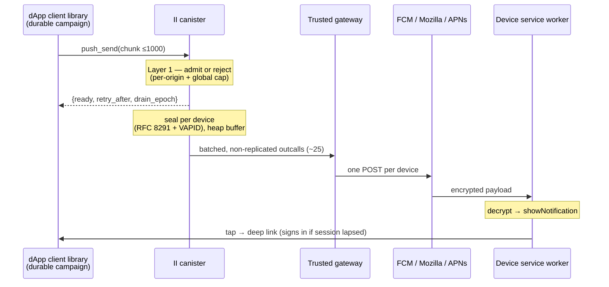
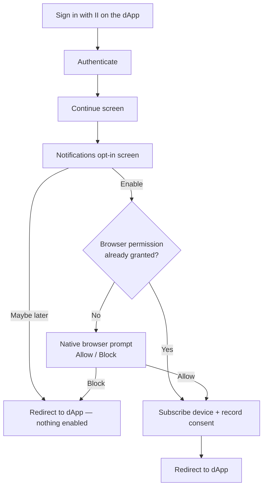
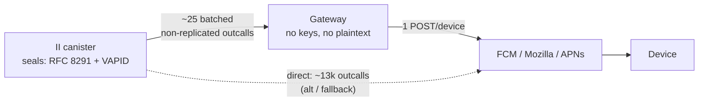
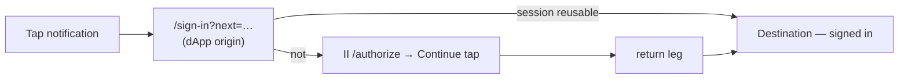
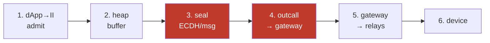
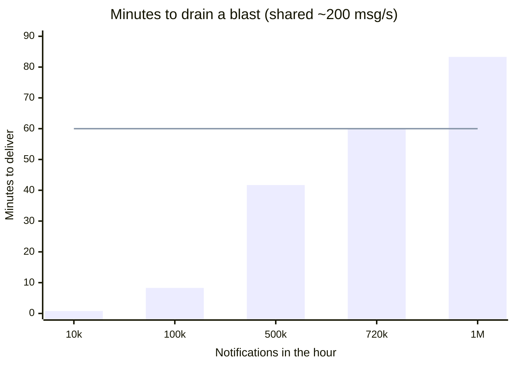

# Push notifications — design

Start with [How it works, in plain terms](#how-it-works-in-plain-terms). **Reviewing:**
[Goals](#goals-and-non-goals) · [Architecture](#architecture) · [Alternatives](#alternatives-considered) · [Security](#security-model) · [Open items](#open-items). **Implementing:** [dApp → II](#dapp--ii) · [state model](#iis-state-model-stateless-for-campaigns) · [delivery](#delivering-to-devices) · [Scaling](#scaling). **Integrating:** [push-api.md](push-api.md) · [push-client-library.md](push-client-library.md).

## Context and scope

A dApp that wants to reach a user who isn't looking at it has no good option: doing
Web Push yourself means your own permission prompt, service worker, VAPID keypair and
subscription storage — **per dApp**. Browsers bury repeat prompts, users decline them,
and iOS needs a PWA install. So almost no dApp does it.

II is already the one origin every user of these apps has a relationship with. So it
hosts a single Web Push pipeline: grant permission to `id.ai` **once**, subscribe per
device, consent per dApp. PWA install stays optional except on iOS Safari.

This doc covers the two scaling paths (**dApp → II**, **II → device**), the
security/privacy model, and open items. Design doc, not an integration guide — the Candid surface and library internals live in [separate files](push-api.md).

## Goals and non-goals

**Goals:** one permission across all consented dApps; a dApp needs **no push
infrastructure**; consent per dApp + per device, revocable; a 10k-user broadcast is
normal (and must never degrade auth); II's durable storage doesn't grow with volume;
a tap lands where the notification was about, signed in; **E2E possible** for apps
that can't let II read content ([E2E](#end-to-end-encrypted-apps)).

**Non-goals:** not a messaging product (no inbox/history/receipts); not exactly-once
(at-least-once + device dedup); not guaranteed delivery (relays are best-effort); no
per-notification billing in v1; no "reach all II users" (only consenters); not
universal (Web Push is browser-scoped); not a replacement for in-app UI.

## How it works, in plain terms

1. **A dApp never talks to phones.** It tells II "notify these users" (by opaque
   per-app id — it can't reach anyone it wasn't given); II delivers.
2. **II already knows how to reach each user** — the browser hands it device keys on
   enable, and it records which apps are allowed. Two per-user facts: devices, and
   allowed apps.
3. **II seals every message** with the device's own Web Push key (only that device
   decrypts; relays just forward) and signs it (VAPID, cached).
4. **Big sends are streamed**: a client library feeds II bite-sized batches; II
   refuses more than it can take. The list lives with the dApp — II stores almost
   nothing per send.
5. **II hands the sealed messages to a trusted gateway** that does the many
   per-device sends over ordinary internet (direct-from-canister is the fallback).
   The gateway only forwards bytes it can't read.
6. **A tap goes straight to the app's deep link**, signing the user in on arrival if
   their session lapsed; only a link-less notification detours through II.

## Architecture



Three limits bind on every deployment:

| Limit | Consequence in this design |
| --- | --- |
| **In-flight outcalls** — 3000 subnet-wide, shared with II's own login paths | batch through the gateway (~25 outcalls, not ~13k) so a blast can't starve sign-in |
| **Stable storage** — 500 GiB/canister, must not grow with volume | durable campaign lives in the dApp's library; II keeps only user-scoped rows + a transient buffer |
| **Instructions/round** — this canister also serves every login | drain in bounded slices, never whole chunks |

Cycles are waived on canonical II (system subnet `uzr34…`) but fully charged on any self-hosted or forked deployment — so the design targets the **paying** case and treats the waiver as one deployment's property, not a premise.

## The user experience

### Turning notifications on (first time signing into a dApp)



Two grants, and only one repeats:

- **II's opt-in screen** shows once per dApp per device — consent is per origin,
  nothing is inherited.
- **The browser's permission prompt** is granted to `id.ai` once and never returns;
  every dApp delivers through that one origin.

No install needed on Android/desktop. iOS is a degraded path: Web Push works only
in an installed home-screen PWA, so consent is granted in the tab but the
subscription is created later from II's own installed app. A native II app on APNs
would be the real fix — out of scope here.

### What happens when a notification is sent

7. The dApp's backend tells II to notify the user. At any real scale this runs
   through the dApp's client library and the chunked `push_send` endpoint (see
   below); the PoC has a simpler one-shot `notify_user` for a single recipient.
8. The notification arrives on every device the user enabled — **even with the
   tab closed / browser not running** (on Android). It shows the dApp's origin
   as the source and the dApp's title/body as the text.
9. The user **taps** it. With a deep link (the normal case) the service worker opens
   that URL directly — II isn't visited — landing them on the page it was about and
   signing them in via the ICRC-167 redirect if their session lapsed. A link-less
   notification instead detours through II's `/notify` screen, which resolves the
   sender behind a consent gate and forwards to the dApp's home.

### Managing them, and turning them off

10. From either the browser or II. In **II → Settings**, a device toggle plus an
    **Allowed apps** list, each with a remove button that stops that app immediately.
    The **browser's own site settings** can also block `id.ai` — which silences every
    dApp at once and can't be overridden from inside II, since the permission belongs
    to the browser. II only observes the result: a blocked permission makes the opt-in
    unofferable, so it's skipped rather than shown as a dead button.

## dApp → II

### Sending to thousands: chunked send + two-layer flow control

A campaign is delivered as a stream of bounded chunks (up to ~1000 targets each,
within the message-size limit). II never holds the whole campaign, because that is
exactly the storage that would scale with volume. Two control layers keep this safe,
and it's important not to confuse them:

- **Layer 1 is II's own admission control** — mandatory, and it assumes a hostile
  client. It enforces a hard recipient ceiling, a per-origin token bucket, and a
  global cap on its buffer; over capacity, `push_send` simply rejects the chunk
  (`ready = false`, plus a `retry_after_ms` hint). The guarantee is that II never
  holds more than its bounded buffer no matter what the client does. This is the
  anti-spam property, and it lives entirely on II.
- **Layer 2 is the client library pacing itself** — cooperative, and only about
  efficiency. It reads the same `ready` signal and avoids wasting calls that would
  be rejected. A client that skips it just delivers more slowly; nothing breaks for
  II.

The short version: II protects itself, the client optimises itself — never rely on
client pacing to prevent spam.

A single `push_send` covers both broadcast and personalised sends: it takes a shared
`default_alert` plus a list of recipients, each of which may override it. A broadcast
sets the default and leaves the overrides empty; a personalised send gives each
recipient its own alert, templated on the client side so II never holds a template.

<details><summary>Two caveats on Layer 1</summary>

The reject is O(1), but it happens *after* the 2 MB chunk has been decoded, so cap
the accepted size well below 2 MB to bound even the cost of refusing a flood. And
`inspect_message` can't help here — it isn't invoked for inter-canister calls, and
`push_send` is called by canisters. The ~1000 ceiling is enforced server-side, since
2 MB of recipients is roughly 65,000, whose per-recipient lookups would trap.

</details>

### The Candid interface

The full interface — `push_send`, the alert and delivery types, the result and
rejection variants — is in [push-api.md](push-api.md#the-candid-interface). It is
reference material rather than design argument, so it lives beside the
integration guide. What matters here is the shape it implies, covered above and in
[II's state model](#iis-state-model-stateless-for-campaigns).

### How II knows which users to send to

The dApp only knows its users by their in-app principal (II's privacy model).
`PRINCIPAL_INDEX` resolves `principal → (anchor, origin_hash)`, and the index
entry **pins the origin** — a principal belonging to another dApp's consent
resolves to a different `origin_hash` and is rejected. dApp A physically
cannot target dApp B's users even with stolen principals. Audiences larger
than one chunk are split across paced `push_send` calls by the client library,
not by server-side routing.

### How II verifies the sender is really that dApp

Sends are authenticated at the **origin**, not per user. A dApp's only setup step
is to publish a file; II verifies it and shows its `name` as the notification
title (so no dApp can wear another's name).

```
https://myapp.com/.well-known/ii-push-senders
{ "senders": ["abcde-…-cai"], "name": "MULTI/DEX" }
```

II verifies on first consent (preferred) or on a send (returns `SenderUnverified`,
never blocking the call), storing `origin_hash → {principals, name}`. Every send
then requires `caller` to be a listed principal. Revoke by removing the file — II
drops the sender on its ~weekly re-check.

> **Self-serve verification is a launch blocker.** The PoC registers senders by
> hand (controller-only). "Any dApp can send through II" is false while onboarding
> means a DFINITY support ticket, so the `.well-known` check must ship in v1.

<details><summary>Verification detail</summary>

- **Fetch only for origins a user already consented to** — otherwise any canister
  could make II fetch an arbitrary URL (SSRF/DoS). Add per-origin negative caching
  and a concurrent-verification cap.
- **The proof needs both halves** — a published file *and* a canister it names — so
  an impersonator needs the origin's content and the canister.
- **`name` fallback** is the bare host, not the full URL. Cap length, reject
  control/RTL characters: a name is a homograph surface a host isn't.
- **`push_register_sender(origin)`** forces an immediate re-check after editing the
  file, bypassing the negative cache.
- Reuses the DoH/outcall machinery; a `_canister-id` DNS TXT record is a second
  proof path for custom domains.

</details>

### Admission control (Layer 1): stopping one dApp from flooding II

The mandatory guard on every `push_send`, assuming a hostile client:

- **Hard `recipients.len()` ceiling** (~1000) + accepted-payload cap well below 2 MB.
- **Per-operator token bucket** in **device-messages** (a 5-device recipient costs 5),
  bucketed by **eTLD+1 not bare origin** (else `a1…a1000.evil.com` = 1000 buckets).
- **Global buffer cap with per-origin reservations** underneath — a large sender at
  its limit can't starve small ones (a plain FCFS cap wouldn't guarantee that).
- **A push outcall budget** well below the 3000 cap, yielding to auth outcalls.
- **Reject** over capacity (`ready=false` + jittered `retry_after_ms`).

The only II storage a sender can pressure is the bounded buffer, which this caps
directly.

### What this costs, and who pays

Three things are scarce on every deployment: outcall slots (3000 subnet-wide, shared
with login — the reason the gateway exists), storage (kept O(users × origins), never
O(volume)), and instructions (which force the bounded-slice drain).

Cycles are the fourth cost, but only where they're charged — waived on canonical II,
real everywhere else. The per-byte fee carries the `·n` replication factor, so
non-replicated delivery is where the money is. For a 10k-user blast on a paying subnet:

| Path | Outcalls | Cycles | ≈ USD |
| --- | --- | --- | --- |
| Direct, replicated | ~13k | ~2.8 T | ~$3.80 |
| Gateway, replicated | ~25 | ~0.7 T | ~$0.95 |
| **Gateway, non-replicated** | ~25 | ~0.02 T | ~$0.03 |

Batching cuts *count* ~500× but cycles only ~4× (per-byte fee is the same sealed
bytes); dropping replication cuts the payload by ~34×. Set `max_response_bytes`
tight — it's charged whether used or not. The gateway's real justification stays
**outcall slots**, which no pricing change touches.

**vetKD** (for [E2E](#end-to-end-encrypted-apps)) is charged everywhere: ~26.2 B
cycles/call — fine once per user, ruinous per message (~$357/10k blast). Derive
**once per `(user, origin)`** and cache in the SW. (It's also a DoS vector — the
bill lands on II — see [Security](#security-model).)

**No sender charging in v1** — parked (accept/refund complexity). But a rate limit
× time is unbounded spend, so a paying deployment needs a **cycle budget +
circuit breaker** independent of the rate bucket.

## II's state model: stateless for campaigns

II holds **no campaign queue in stable memory** — it accepts a chunk into a
transient heap buffer, seals and sends it, then forgets it. The durable list lives
with the dApp, so II's storage doesn't grow with notification volume.

`push_send` is a cheap, no-await admission call: count check, authenticate sender,
dedup `chunk_id`, [Layer 1](#admission-control-layer-1-stopping-one-dapp-from-flooding-ii),
per-target consent-check, admit survivors, return
`{admitted, rejected, ready, retry_after_ms, drain_epoch}`. It can't send inline —
a whole chunk is ~1000 seals + outcalls against the 500-deep output queue and the
instruction budget.

A ~1s timer drains the buffer in **bounded slices** (target 100–300 device-msgs,
measured), each slice:

- **claims** its entries before the first `await` (non-reentrant), or two ticks
  double-send — `ic-cdk-timers` documents duplicate execution under load;
- resolves each anchor's devices **now** via a **prefix range scan** on
  `(anchor, endpoint_hash)` (never a full-map scan — that's O(all push users) and
  traps at scale), re-checks consent, forces sender-origin attribution;
- seals per device (RFC 8291) + attaches the cached VAPID JWT, assigns `msg_id`;
- **isolates per-entry failure** — a trap rolls back the tick and the poison row
  retries forever; needs a failure boundary, attempt counter, and a watchdog.

<details><summary>Sealing cost, and the two ceilings</summary>

The cost is RFC 8291's **ECDH** — a variable-base P-256 scalar mult per
device-message (HKDF/AES are noise; the VAPID signature is cached, per audience,
free). It can't be amortised: no encrypt-once mode. Two ceilings: the slice is a
*small fraction* of the round because this canister serves every login (bigger →
login latency); the per-message instruction limit is a *hard wall* above it, and
crossing it traps → rolls back → retries the same slice forever. So the slice must
come from a measured per-seal cost, not an estimate.

</details>

`PushDelivery` shapes the buffer: **topic** replaces an un-drained same-key entry
(collapses rapid updates); **ttl** skips the outcall once expired; **urgency** is
one drain-order input, never the sole key — it's sender-supplied and everyone sets
`High`, so origin fairness (round-robin) outranks it, with age/TTL preventing
starvation.

**Durability needs `drain_epoch`.** The buffer is heap, lost on upgrade; the client
re-sends unacknowledged chunks — but `admitted` means "buffered", returned before
an upgrade that would drop it, so today a client can't tell. A `drain_epoch`
counter (bumped in `post_upgrade`) + `push_chunk_status(chunk_id)` closes it,
making delivery explicitly **at-least-once** (hence `msg_id` ships with it). The
only new **stable** regions are the user-scoped, volume-independent sender/subscription/consent
maps; `chunk_id` dedup is a bounded heap set.

### Buffer size, and how many origins it serves at once

An entry is **per recipient** (~200 B + text; ~1 KB personalized vs one shared copy
for a broadcast — a reason to keep `default_alert` the common path). **Memory isn't
the constraint** (4 GiB heap; 100k recipients in flight ≈ 20–100 MB). **Drain rate
is**, and it's a *shared pie* — ~200 device-msg/s total across all origins:

| Work | Device-msgs | Drain time |
| --- | --- | --- |
| 1k-recipient chunk | ~2k | ~10 s |
| 10k blast | ~20k | ~100 s |
| 10 origins × 10k | ~200k | ~17 min |

So the buffer depth should be **drain rate × acceptable latency** (60 s → ~6 MB),
not what the heap allows — a memory-sized buffer accepts hours of backlog and
returns `admitted` for messages whose TTL expires first (a lying success). Express
admission in *seconds of backlog*, fair-shared `total_rate / active_origins`. All of
this scales off the unmeasured ~200/s — measure the per-seal cost first.

### The way to lift that ceiling is a separate canister

The 200/s limit is **co-tenancy with authentication** — the slice is small only
because this canister serves every login. So run push in its **own canister**: it
could spend a full round sealing (the ~10–20× headroom), keeping the trust boundary
(same controllers, no plaintext off-platform) and turning "must not degrade login"
into a property that holds by construction.

Cost: state ownership. The push canister must **own** the subscription/consent maps
(else the load just moves back with added latency), making `/authorize` opt-in one
inter-canister write. New: two-canister upgrade coordination, and where the VAPID
key lives. Not the shipping path — it deserves its own review — but the honest
answer to "the throughput looks low", better than moving crypto off-platform.

## Delivering to devices

The relay API is one POST per endpoint (RFC 8030) — reaching N devices is N sends.
The design routes them through a **trusted gateway**; per-device outcalls straight
from the canister ("direct") are the documented low-volume/on-chain **alternative**.

### The outcall to the gateway is non-replicated

**Decision:** the batch handoff uses `is_replicated = false` (mainnet since
2025-08-04). One node calls — no 34× fan-out, no response consensus, ~2 orders
cheaper — which is what lets the gateway stay stateless, return per-device status,
and enable `410` cleanup. Caveats: **experimental** (isolate behind one revertible
call site), and a single node's reply isn't consensus-verified (status is evidence,
not proof — no new concession).

<details><summary>Why replicated outcalls don't work here</summary>

Replicated = every node POSTs (34×), responses must be byte-identical or consensus
fails. That gives **duplicate delivery** (RFC 8030 has no idempotency key) and makes
**per-device status unrecoverable** (the 34 answers differ; a transform collapses
them to one) — so `410` [cleanup](#stale-subscription-cleanup) is impossible.

</details>

### The delivery path: a trusted web2 gateway



**Why a gateway, not direct:** in-flight outcall slots, not cycles. A 10k-user
blast is ~13k direct outcalls against the subnet's 3000 shared slots — it would
starve login. The gateway needs ~25. This holds even on the fee-waived deployment,
which is why it's the real reason (cycles only differ ~4×).

**What stays on II:** all crypto. The gateway sees ciphertext, endpoints and timing
— never keys or plaintext. Sealing can't be offloaded: the ECDH that derives the
content key *is* the ability to decrypt.

<details><summary>Trust delta — the deliberate cost</summary>

The gateway can **drop, delay, replay**, and **forge sends** (the VAPID token, cached
≤12 h, is accepted without body validation) — a compromised one can POST junk that
won't decrypt, triggering the browser's "site updated" notice attributed to `id.ai`
and burning the [shared permission](#shared-fate-one-permission-for-every-dapp).
Mitigate: per-batch credentials, minutes-long JWT cache. The token is also
node-operator-extractable from canister state. **Gateway = single point of failure**
([Operating it](#operating-it-controls-alerts-and-rollout)).

</details>

### The alternative: direct per-device outcalls

One outcall per device, fully on-chain, nothing extra to trust — but ~13k outcalls
per blast against the 3000-slot cap **disqualifies it as the default**. Viable for
low volume or a deliberately all-on-chain deployment. With `is_replicated = false`
it becomes a genuine peer of the gateway on correctness (no fan-out, per-device
status restored), still bounded by in-flight slots.

## The dApp-side client library

A dApp does not call `push_send` in a loop; it drives II through a small client
library that owns pacing, retry and durable campaign state — which is what keeps
II's own storage flat. Its design, the send loop, the state it must keep and the
failure modes it owns are specified in
[push-client-library.md](push-client-library.md).

The one point that belongs in this document: the library is where the durable list
lives, which is what lets II stay stateless per send. See
[II's state model](#iis-state-model-stateless-for-campaigns).

## On the device: rendering and tap-through

- **Subscribe** (Settings or `/authorize` opt-in): request permission,
  `pushManager.subscribe` with II's VAPID key, store `(anchor, endpoint_hash)`. A
  browser binds one subscription per SW to one key, so `subscribe` refuses a
  different key — reuse when it matches, replace when it doesn't (or subscribers
  under an old key can never re-enable). No install on Android/desktop; iOS Safari
  only allows Web Push for an installed home-screen app.
- **Consent** (`push_grant_consent`): once per `(identity, origin)` per device.
  Consent is shared across the identity's devices, so a second device is missing
  only the subscription ("Also notify you on this device?").
- **Render**: `Display` shows the supplied text; `Hidden` shows an II-controlled
  generic string by `category`.
- **Click**: with a deep link the SW opens it directly (II validated `alert.url`
  is on the consented origin at send time); without one, `/notify?origin=` resolves
  the sender and fails closed. For `Hidden`, the tap is the content-reveal.

### Shared devices and multiple identities

One browser has one endpoint, but several identities may share it. **Enabling and
consent are per identity, never per device** — no consent is inferred from a shared
endpoint. So:

- The same endpoint appears under several anchors as **independent rows**; II
  delivers to an anchor's row only if that anchor enabled it.
- Isolation is at the **consent layer**, not transport — once two identities enable,
  the device physically receives both; the SW renders by **sender origin**, never
  revealing they share a device.
- Disabling removes only that anchor's rows; `unsubscribe()` fires only when no
  identity still wants notifications.
- On rotation, each identity re-registers next time it authenticates.

### Where a notification opens

`alert.url` deep-links within the sender's own app; **II validates it at send time**
and refuses otherwise:

- **Same-origin only.** The sender origin is II-derived (not a `PushAlert` field), so
  a link can go anywhere on `app.com` but never to `evil.com` or another consented
  dApp.
- **Both sides canonicalised** — consent keys the *effective* origin, links use
  whichever domain is browsed; without this every real deep link is refused. Safe:
  only the same canister-id subdomain collapses.
- **`https`, or `http` on loopback** only — `javascript:`/`data:` report origin
  `"null"` and would compare equal without a scheme check.

Validating on send (not device) removes a tap-through hop and puts the check on the
only party that authoritatively knows the consented origin. No target → `/notify?origin=`
resolves the sender and fails closed.

### Landing the user already signed in

Yes, **no II-side changes** — it composes out of the ICRC-167 redirect transport.
**II cannot push a signed-in session** (the delegation targets a key the dApp
generates and II never sees), so the flow must *begin* on the dApp's origin — a
notification can't bounce through `id.ai` and be signed in from there. Same property
that stops II impersonating a user.



Notifications link at the sign-in route (not the app, which would boot, find no
session and flash). The dApp provides `transport: "redirect"`, a
`/.well-known/ii-auth-callbacks` (callback is protocol+host+path only; destination
rides in memoized state), and a callback origin whose derivation matches the
consent `effectiveOrigin`.

**This should be a library.** By hand it's ~70 lines of ICRC-167 plumbing, two of
them security-relevant (narrow an attacker-supplied `next` to a same-origin
fragment; land in the app on failure). Belongs in `@icp-sdk/auth` as
`handleRedirectSignIn({ nextParam, reuseExistingSession, onArrive, onError })`.
Until then, tap-through is the one place "a dApp needs no push infrastructure" is false.

<details><summary>Lessons that shaped it</summary>

- **Own route** — the flow journals state per route; on the app root it lands signed out.
- **Reuse needs the app's staleness rule, not `isAuthenticated()`** — a delegation
  can be valid while the app considers the session dead (last-tab-close). Stamp
  liveness first (arrival = presence). An app that *deletes* its session on tab close
  should exempt push-consenting users.
- **Only II's Continue tap is irreducible** — silent issuance would let any site get
  a delegation by redirect. Don't add an II-side interstitial (only the dApp knows if
  it has a session).
- **Local dev:** loopback callback needs `dev_csp`; Chrome prompts for local-network
  access — both gone once public https.

</details>

### Apps with no URL routing (e.g. Caffeine)

Deep-linking and signed-in tap-through both assume **addressable URLs**.
Caffeine-built apps were last seen fully stateful with no routing — so there's no
address to point a notification at. **Confirm this before promising notifications
there** (and check the builder sandbox separately from published apps).

If routing is absent, such a platform needs: (1) an addressable destination — a
single `/open?s=<token>` entry route restoring in-app state is the cheap fit; (2) a
sign-in route in the project template; (3) an `isAuthenticated()` guard; (4)
`/.well-known/ii-auth-callbacks`. The callback must be protocol+host+path only, so
the destination rides in memoized flow state.

**Fallback:** notifications still work as "open the app" — no deep link, no
authenticated landing. Pairs naturally with `Hidden` content.

### Action buttons: navigate, never act

A notification can carry up to about two action buttons (Safari and iOS show none,
so anything built on them has to degrade gracefully). Here, every button can only
navigate — never act. The service worker runs on II's origin and has no session for
the dApp, so an "Add margin" button can open the add-margin screen, but it cannot
actually add margin. In other words, an action is just another deep link:

```candid
actions : opt vec record { id : text; title : text; url : text };   // ≤ 2, same-origin
```

Losing silent actions is a genuine cost of centralising on II. A dApp that ran its
own service worker could Archive or Snooze with a background fetch and no window
opened; because our worker lives on II's origin instead, it can't. This is one of
the trade-offs the single permission buys, alongside the others in
[alternatives](#a1).

In return, II can do something no per-dApp design can: put an off-switch on every
notification that the sender is unable to remove or relabel, because II composes the
notification itself. It costs one of the two button slots, which is a good trade
given a sender's own actions could only navigate anyway. There are three levels:

- **Turn off on this device.** Free and immediate: `subscription.unsubscribe()`
  needs no call to II and works even if II's backend is down. The endpoint then
  returns `410` and [cleanup](#stale-subscription-cleanup) reclaims the row. This is
  device-wide, though, not per-app.
- **Stop a single app.** Revoking consent is authorised by the anchor, which the
  worker can't do itself, so the button navigates:
  `{ action: "ii-manage", title: "Manage" }` opens `/manage/settings?app=<origin>`.
  We call it "Manage" rather than "Unsubscribe" for two reasons — Chrome already
  shows its own unsubscribe control, and the button navigates rather than revoking,
  so a stronger word would overpromise. It lands the user on that app's row, where
  they can see everything else they've granted; the page already exists.
- **Stop a single app silently** would need a sealed capability token in the
  payload, which isn't worth the one saved tap for now.

Either way II owns the labels — a sender that could rename "Manage" or "Turn off"
would defeat the whole point.

### Updating or dismissing a notification already shown

Via a dApp-chosen `notification_id` mapped to the Web Notification `tag`: send again
with the same id to **replace** in place ("Order shipped"→"delivered"); send
`content = Dismiss` to **close** it. Complementary to `topic` (which collapses
*undelivered* messages at the relay) — this acts on *delivered* ones.

Caveats: `userVisibleOnly` means a pure silent dismiss can trigger the browser's
"site updated" notice, so **update-with-new-state is robust, pure dismiss
best-effort**; only works if the device is online and the notification still present.
Explicit opt-in — no `notification_id` means notifications never replace each other.

## Alternatives considered

| # | Decision | Rejected alternative | Why |
| --- | --- | --- | --- |
| 1 | [II hosts the pipeline](#a1) | Each dApp runs its own | The permission is the scarce resource, not the plumbing — a dApp can't win the *n*th prompt |
| 2 | [II hosts the service worker](#a2) | Each dApp hosts its own | Same decision as #1 — Web Push binds the subscription to the SW's origin |
| 3 | [Gateway delivery](#the-delivery-path-a-trusted-web2-gateway) | Direct per-device outcalls | 13k in-flight outcalls would starve login; gateway → ~25 |
| 4 | [Sealing stays on II](#action-buttons-navigate-never-act) | Gateway seals | Deriving the key = ability to decrypt; useless to move. Real lever is a [separate canister](#the-way-to-lift-that-ceiling-is-a-separate-canister) |
| 5 | [vetKeys-sealed E2E](#end-to-end-encrypted-apps) | dApp holds the keys | See E2E section |

<h4 id="a1">1. II hosts the pipeline</h4>

The status quo — every dApp runs its own permission prompt, service worker, VAPID
keypair and subscriptions — has real merits (no shared fate, no gateway, content
never leaves the dApp). Rejected anyway: users decline repeat prompts, browsers
bury them, iOS needs a PWA install per site, so the per-dApp model almost never
happens in practice. One permission at the identity provider is the only version
users say yes to, and the one thing a dApp can't build itself.

Its price, paid throughout this doc:
[shared fate](#shared-fate-one-permission-for-every-dapp), II sees content absent
[E2E](#end-to-end-encrypted-apps), a delivery pipeline inside an auth canister
([must not degrade login](#push-must-never-degrade-authentication)), and
[action buttons can only navigate](#action-buttons-navigate-never-act).
In exchange it buys one thing no per-dApp design can:
[an off-switch no sender can remove](#action-buttons-navigate-never-act).

<h4 id="a2">2. II hosts the service worker</h4>

Web Push binds a subscription to the SW's origin, so a per-dApp SW would need a
per-dApp permission — making #1 impossible. Cost: notifications arrive attributed
to `id.ai`, which the UX fixes by naming the app and the security model defends by
forcing sender-origin attribution at send time.

## Security model

| Threat | Defence |
| --- | --- |
| **Cross-dApp targeting** | Origin pinning — a sender reaches only anchors that consented to *its* origin, even with leaked principals |
| **Spoofed attribution** | II derives and stamps the origin; a dApp can't wear another's name. Must also **canonicalize** origins (punycode/case/port, reject mixed-script) and strip bidi/whitespace from `title`/`body`, rendering attribution as a non-injectable element — this is the highest-credibility surface for a recovery-phrase phish |
| **Relay/gateway reads content** | RFC 8291 encrypted per device. Scope: *transport* only — II sees `Display` plaintext (it seals); `Hidden`/vetKeys keep it from II too |
| **Probing II state** | Rejections are coarse (`NoConsent` only); randomize `retry_after_ms` (it reflects aggregate load); reject reasons a fixed enum; endpoint URLs never logged |
| **`/notify` icon** | curated registry only + globe fallback — never fetch arbitrary/remote icons into II's chrome |
| **vetKD derive drain** | the SW triggers a derive over ingress (no cycles attached), so the bill lands on II — an uncached derive is a user-triggerable cycle drain. Derive once per `(user, origin)`, cache in the SW, rate-limit per anchor |

**The VAPID-key risk is larger than "spam".** The same stable memory holds the VAPID
key and every device's `p256dh`/`auth` secrets, so an attacker who reads it can forge
fully-readable notifications to any device, attributed to any origin the user actually
consented to. The tap-through then passes `/notify` and deep-links into the real dApp,
which makes this a phishing capability rather than spam — and there is no detection or
rotation story today. The mitigations worth doing regardless of custody are per-device
transport secrets, so that extracting one doesn't yield the other, and a signed
per-endpoint counter so a service worker can flag pushes II never sent. The real fix is
[P-256 threshold ECDSA](#ic-capabilities-to-re-evaluate), which removes the stored key
entirely.

One subtle bug to avoid: if the key is generated lazily, the `await raw_rand` between
checking "is it set?" and writing it lets two concurrent first-callers both generate,
and whichever loses leaves its subscribers silently undeliverable. Generate it eagerly,
behind a guard.

### Shared fate: one permission for every dApp

The value proposition — one notification permission covering every dApp — has a
structural consequence that is a security property, not a UX detail: **the
browser's permission belongs to `id.ai`, not to any dApp.** So the browser's
abuse heuristics and the user's own Block button both target `id.ai`.

A single hostile or careless consented sender can therefore end notifications
for **every other dApp on that device**: spam at volume, `Dismiss`-only pushes,
or malformed bodies each trip the browser's generic "site updated in background"
notification, and Chrome's abusive-notification heuristics respond by revoking or
quieting the origin. The user has no way to attribute which app caused it, and no
II-side re-enable UX can undo a browser-level block.

This is created by the single-permission design, so it has to be defended
II-side:

- A **per-origin budget on generic/contentless notifications**, not just on
  volume, with automatic suspension of an origin that exceeds it.
- **Attributable throttling** — surface "app X was rate-limited" in Settings so
  blame lands on the sender rather than on II.
- An **operator kill switch** per origin (see
  [Operating it](#operating-it-controls-alerts-and-rollout)).

### Which origin is authoritative

With `derivationOrigin`, a dApp on `beta.app.com` can derive its principal from
`app.com` (letting beta/custom-domain/canister-URL share one identity), leaving
`effectiveOrigin` (`app.com`, what the principal derives from) and `displayOrigin`
(`beta.app.com`, what the browser talks to) in play.

**Decision: `effectiveOrigin` is authoritative** — consent, registration and
attribution all key on it. Forced by targeting (the in-app principal derives from
it, so consent must match or the lookup fails) and the right trust boundary
(sharing identity already implies sharing push). Three obligations: the opt-in must
**disclose the origin granted** (show both when they differ); `.well-known` lives on
the `effectiveOrigin`; and one registration lets **every** alternative origin send
as `app.com` — intentional, document it.

### Consent lifecycle: it must not outlive the sender

Consent keyed only by `(anchor, origin_hash)` carries no sender reference, so it
survives events it shouldn't: a domain expires, someone buys it, serves their own
`.well-known`, registers — and **every prior consenter is reachable**, attributed as
the old brand. Fix: stamp consent with the **sender registration epoch**;
invalidate when the registered principals change or the sender deregisters; expire
after long no-delivery; surface "this app re-registered — re-confirm?".

Also: re-verification must not be a **deregistration primitive** — a single induced
404 shouldn't strip capability. Require K failures over days, never deregister on
5xx/timeout, only on a well-formed file that no longer lists the sender.

## Privacy

Confidentiality covers *content*; **metadata is the bigger exposure for a
notification hub, and `Hidden` does nothing for it.** New here isn't the
anchor↔origin link (II already stores that) but the **temporal** dimension and an
**off-chain, device-linkable** identifier:

- **The gateway sees a join key.** Grouping bundles by `endpoint` reveals, per
  device: which origins notify it, when, sizes, and cleartext `Urgency`/`Topic`.
  Since one browser = one endpoint across identities, this **links a user's anchors
  and dApps** — the exact linkage per-origin derivation prevents. No decryption.
- **Relays too:** one shared VAPID key lets FCM/APNs isolate II traffic and count
  per-user dApp diversity. Per-dApp keys were an unlinkability property this design
  removes.

Mitigations to evaluate: per-batch pseudonymous endpoint handles, batch
shuffling/padding, per-origin VAPID subkeys. At minimum, state what the gateway,
relays and node operators each learn.

## Delivery semantics: what is actually guaranteed

- **At-least-once** — retries and `drain_epoch` duplicate; `chunk_id` makes chunk
  resends idempotent, `msg_id` + device dedup hides the rest.
- **Unordered** — per-relay queueing and urgency reorder freely.
- **No receipts** — the only per-target signal is `NoConsent` at admission;
  `admitted` ≠ "on the device".

The ordering gap has teeth: `notification_id` replace is order-dependent, so "Order
delivered" can land before "shipped" and leave stale text forever, and a `Dismiss`
can precede its notification. Fix: a **monotonic sequence per `(origin, anchor,
notification_id)`** so the SW drops out-of-order updates.

## Duplicate and replay suppression (`msg_id`)

**Built.** Duplicates are the norm from four sources: replicated outcalls (removed
by the non-replicated handoff), timer duplicate execution (claim-before-`await`),
client retries + `drain_epoch`, and **accumulated subscription rows** — the one
that actually produced duplicate banners in testing, when a rotated endpoint left
two live rows for one browser.

II assigns a `msg_id` **once per admitted message**, inside the payload *before*
RFC 8291 encryption — so no dApp supplies it and no relay can read or forge it. The
SW keeps a bounded seen-set (**in the Cache API**, since the worker is killed
between pushes) and drops repeats; a payload with **no id is always shown**
(failing open beats dropping a real notification). The drain now **removes a row on
`404`/`410`**, the only signal a row is dead.

**To harden:** a bounded recency set can be flushed by flooding, so a replayed
capture looks new — replace with a per-origin high-water mark + a short `msg_id`
validity window. Note `msg_id` (II-generated, suppress duplicates) differs from
`notification_id` (dApp-chosen, *replaces* a shown notification).

## End-to-end-encrypted apps

The `Display` path is **not** E2E — II sees plaintext. For apps that can't allow
that (a messenger), the axis is *who decrypts and where*:

| Approach | Who decrypts | In-notification | Trust in II for content |
| --- | --- | --- | --- |
| **`Hidden`** (ships first) | the app, after tap | generic ("New message") | none |
| **Design A** — vetKeys | II's SW, on device | real text | II client code + vetKD threshold |
| **Design B** — dApp-fetch | II's SW, on device | real text | II client code (+ dApp) |
| `Display` | II service | full | full |
| App's own SW | app's SW | full | none (II not in loop) |

**Ship `Hidden` first** — content-hidden notification + tap-through reveal (the
industry-standard E2E UX; `/notify` is the reveal path). Zero extra trust, today.
It's a deliberate lesser experience (no lock-screen preview) that's what makes E2E
+ push work at all.

<details><summary>Design A — vetKeys-sealed (preferred richer path)</summary>

II derives a vetKeys (IBE) identity per `(user, origin)`; the dApp encrypts to it
offline and sends only ciphertext via `push_send`. On the device, II's SW
authenticates as the user, gets the vetKD key (returned encrypted to the SW's
transport key — no node sees it clear), decrypts, shows real text. II-the-service
sees nothing; the residual trust is that II's canister controls the vetKD
authorization — same class as delegations. vetKeys is **live on mainnet**.

**Binding constraint: cost.** A derive per render is ~$357/10k blast (~400× the
outcall cost), billed to II. So derive **once per `(user, origin)`**, cache in the
SW, rate-limit per anchor — per-render derivation is a design error. Cross-subnet
derive latency (seconds) is a second reason the cached path is the only viable one.
Slots into `PushContent` later as an opaque ciphertext arm — no send/storage change.

</details>

<details><summary>Design B — dApp keeps the keys (alternative)</summary>

Push is a bare wake; II's SW fetches content from the dApp. E2E only if the endpoint
returns *ciphertext* — which forces either plaintext-from-backend (not strict E2E)
or provisioning a dApp key into II's SW (added surface). Needs SW→dApp auth and a
fetch per notification. Murkier than A; the fallback for backend-trusted apps.

</details>

## Open items

**Blockers** (before any real deployment):

| Item | Why |
| --- | --- |
| `.well-known/ii-push-senders` verification | self-serve registration; controller-by-hand today makes "any dApp" false — see [verification](#how-ii-verifies-the-sender-is-really-that-dapp) |
| Endpoint host allowlist | endpoint is caller-supplied → SSRF/reflection. Allowlist known push hosts, re-validate at drain, **II validates not the gateway** |
| Per-anchor caps | 20 subscriptions / 100 consents, anti-griefing not a storage bound. Evict dead rows first for subs; **refuse** (never silently evict) a consent |
| Reserved outcall budget for auth | push must not spend login's slots — [detail](#push-must-never-degrade-authentication) |
| Drain isolation & non-reentrancy | per-entry failure boundary, attempt counter, watchdog, claim-before-await, or one poison row wedges the feature |
| `drain_epoch` ack signal | client durability doesn't work without it — [state model](#iis-state-model-stateless-for-campaigns) |
| <a id="stale-subscription-cleanup"></a>Stale-subscription cleanup | `404`/`410` removal; possible on the gateway path only via the non-replicated handoff. Treat `410` as evidence, retire opportunistically |
| Redirect-sign-in helper in `@icp-sdk/auth` | tap-through is the last place a dApp writes security-relevant code by hand — [shape](#landing-the-user-already-signed-in) |
| `pushsubscriptionchange` | SW must re-subscribe + re-register or delivery erodes over weeks |
| Sender deregistration & re-verification TTL | bound the window after a compromised sender / domain hand-off |
| Origin canonicalization | punycode, lowercase, strip port, reject mixed-script, at registration and consent |
| Input validation & caps | `title`≤64, `body`≤256, `topic`≤32, `url` bounded, `chunk_id` 16 B — validate, never trap; fixed error enum |
| Cycle budget + freezing guard | per-origin/global daily burn cap + circuit breaker; disable push before spend nears the freezing threshold (past it, **logins fail while the frontend still loads**) |
| Buffer sizing & drain fairness | round-robin across origins; urgency/age only within a slice |
| Observability | buffer depth, drain lag, per-origin reject/410 counts, and **auth-path p99** (the signal push is stealing from login) |

**Decisions (design, not code):**

- **Apps without URL routing** (Caffeine) — confirm whether a builder-sandbox app can address a destination; if not, tap-through degrades to "open the app" — [detail](#apps-with-no-url-routing-eg-caffeine).
- **iOS** — PWA install mandatory for Web Push, flakier and more throttled; a native app on APNs is the real fix, out of scope.

**Deferred:** replay layering (`chunk_id` for dApp→II, `msg_id` for relay→device); cleanup hooks on device/anchor removal; metadata-privacy mitigations ([Privacy](#privacy)).

**VAPID rotation — never as maintenance.** A planned migration to a subnet-held key needs no user-visible event (dual-key, let the fleet age over); only compromise recovery invalidates everything and needs the "re-enable" UX. End state: [subnet holds the key](#ic-capabilities-to-re-evaluate).

**Rejected:** per-origin `tag` collapsing (collapsing is opt-in via `topic`); reusing one RFC 8291 ephemeral key across a batch (halves cost but links recipients and makes one leaked key expose the batch).

## IC capabilities to re-evaluate

- ~~**Non-replicated outcalls**~~ — **adopted** (batch handoff); still experimental,
  so keep it behind one revertible call site. Field-tested on multidex's oracle.
- **Per-node outcall results** — would give per-device status on a *replicated* path;
  only interesting to stop depending on the experimental flag. Verify on mainnet.
- **P-256 threshold ECDSA** — **the end state.** Moves the VAPID key out of storage
  (subnet signs, no stored secret), deleting the custody caveat rather than mitigating
  it. No roadmap, so the stored key is the design, not a placeholder. Migration is
  dual-key, no fleet re-enable.
- **vetKeys** — live; [Design A](#end-to-end-encrypted-apps). Pin the pre-1.0 client.

## Push must never degrade authentication

The unshippable-if-violated invariant: **no volume of push may reduce sign-in
availability.** II authenticates every user, and push shares three resources with
that job — the in-flight outcall budget (push holds a quota well below 3000 and
**fails closed**, not competing; the 500-deep queue can otherwise fail II's *own*
auth outcalls synchronously), instructions/round (small drain slice), and cycles
(push spend must never approach the freezing threshold). Enforce with a push-only
semaphore, a measured slice, a cycle floor, and **auth p99 as a monitored signal**
that auto-throttles push.

## Operating it: controls, alerts and rollout

Missing today:

- **Per-origin kill switch** — `push_deregister_sender` is dApp-authenticated, so
  there's no operator way to silence an abusive sender. Need operator-gated
  `push_set_origin_enabled` + a global feature flag to disable push without an upgrade.
- **Alerts + ownership** on buffer depth, drain lag, per-origin reject rate, auth p99.
- **Gateway ops** — who runs it, ≥2 independent instances, health/switchover.
  **Gateway down = push down** (direct is a degraded fallback) — state it explicitly.
- **Rollback discards the buffer** — silently drops in-flight campaigns unless
  `drain_epoch` lands first.
- **A load test** — every throughput/cost number here is derived. Run a 10k campaign
  against a local replica measuring auth latency, and measure one seal's real cost
  with `performance_counter`.

## dApp developer integration

What a dApp must do to send its first notification — register as a sender for its
origin, serve the callback allow-list, shape its deep links — is in
[push-api.md](push-api.md#dapp-developer-integration).

## Scaling

Two questions: **how fast can II push** (per-stage — six stages, two bind), and
**can II store the data**.

### Where the bottleneck is, stage by stage



| Stage | Hard limit | Elastic? | Push it → |
| --- | --- | --- | --- |
| 1. Admit | Layer-1 bucket | client-paced | bigger bucket = weaker flood protection |
| 2. Heap buffer | 4 GiB | not the limit | oversizing accepts backlog whose TTL expires |
| **3. Seal** | instructions/round, **shared with login** | **no** | bigger slice → login latency |
| **4. Outcall** | 3000 in-flight, 500-deep queue | **no** | more in flight → starves auth outcalls |
| 5. → relays | web2 | yes | relay per-app rate limits |
| 6. Storage | 537 GB | O(users×origins) | [below](#storage-can-ii-store-the-data) |

**Stages 3–4 bind — II's execution round, shared with every login. The single
global ceiling:**

> **≈ 200 device-msg/s ≈ 720k/hour ≈ 17M/day, across every dApp combined.**
> (Estimate — one RFC 8291 seal is dominated by a P-256 ECDH; measure it, every
> number scales off it.)

- **Users aren't the limit** — a large base costs storage, not throughput.
- **Simultaneous blasts are** — N origins serialise through one drain;
  [Layer 1](#admission-control-layer-1-stopping-one-dapp-from-flooding-ii) divides
  the shared rate. The [separate-canister split](#the-way-to-lift-that-ceiling-is-a-separate-canister)
  is the one move that lifts 3–4.

Delivery time is linear in blast size and shared across dApps, crossing the one-hour
budget at ~720k messages:



### Storage: can II store the data

Storage is **O(users × origins)** — flat with notification *volume*, grows with
users × consented apps.

| Row | Key | Size | Grows with |
| --- | --- | --- | --- |
| Subscription | `(anchor, endpoint_hash)` | ~300 B (~1.1 KB worst) | users × devices |
| Consent | `(anchor, origin_hash)` | ~60 B | users × dApps |
| Principal index | `principal` | ~80 B | users × dApps |
| Sender registry | `origin_hash` | ~100 B | registered dApps |

**At 10M users × 2 devices × 10 dApps ≈ 20 GB** (~2 KB/anchor) against a 537 GB
per-canister limit. The two 100M-row maps dominate — every consent costs a
principal-index row too, so consents are the expensive axis, not devices. This is
before dead rows, which is why [stale-subscription cleanup](#stale-subscription-cleanup)
is a must-fix. The 2 GiB stable-memory-per-upgrade ceiling bounds how large the maps
can get before upgrades become a problem.

## Stable memory regions

New regions must claim an unused `MemoryId` — a duplicate index silently interleaves
two `StableBTreeMap`s and corrupts both. (This happened: a PoC revision claimed 32,
already taken by SSO, and the canister trapped on first read. A distinctness test is
cheap.)

| Index | Region | Key → value |
| --- | --- | --- |
| 33 | push subscriptions | `(anchor, endpoint_sha256)` → `{endpoint, p256dh, auth}` — RFC 8291 seal inputs, one row per endpoint (rotations leave stale rows) |
| 34 | push consent | `(anchor, origin_sha256)` → `{granted_at, origin}` — presence = grant |
| 35 | push principal index | `in_app_principal` → `anchor` — reverse lookup `notify_user` needs; why a consent costs ~140 B |
| 36 | push sender registry | `origin_sha256` → sender canister — controller-written until `.well-known` verification |

## Future exploration

- **Cycles-based charging** — per-notification cycles (canister senders) or a prepaid
  per-origin balance (also lets off-chain senders pay). Out of v1: the design already
  controls storage and outcalls and admission bounds abuse, so billing adds complexity
  without solving a present problem. Retrofittable, kept visible.
- **Off-chain senders** (web2 via ingress) — needs a self-auth challenge and, if paid,
  the prepaid balance.
- **Delivery receipts** — Web Push has none; per-origin aggregates are the most II can
  offer without per-user tracking.

## Status

### Built today (PoC on `feat/push-notifications-poc`)

Each line links to the section covering it; the last group exists because building
the PoC proved it necessary.

- Per-device subscribe/unsubscribe, `/authorize` opt-in, per-dApp consent
- `notify_user(principal, alert)` — one recipient (superseded by chunked
  [`push_send`](#sending-to-thousands-chunked-send--two-layer-flow-control))
- RFC 8291 encryption + RFC 8292 VAPID signing, in-canister
- VAPID key via `raw_rand` in stable memory ([risk](#security-model))
- Tap → deep link directly, `/notify` fallback
- **Sender authorization by origin** — the `caller() == in_app_principal` rule
  never matched inter-canister calls
- **`msg_id` dedup + `410`/`404` cleanup**, **`alert.url` validation**, **browser
  VAPID-key resubscribe**

### Not built (so the PoC isn't mistaken for shippable)

No `push_send` (one `notify_user` per recipient), no rate limiting, no `.well-known`
verification (operator-registered), `Display` only (no `Hidden`), thin test coverage.
Everything else is a work item listed once in [Open items](#open-items).
