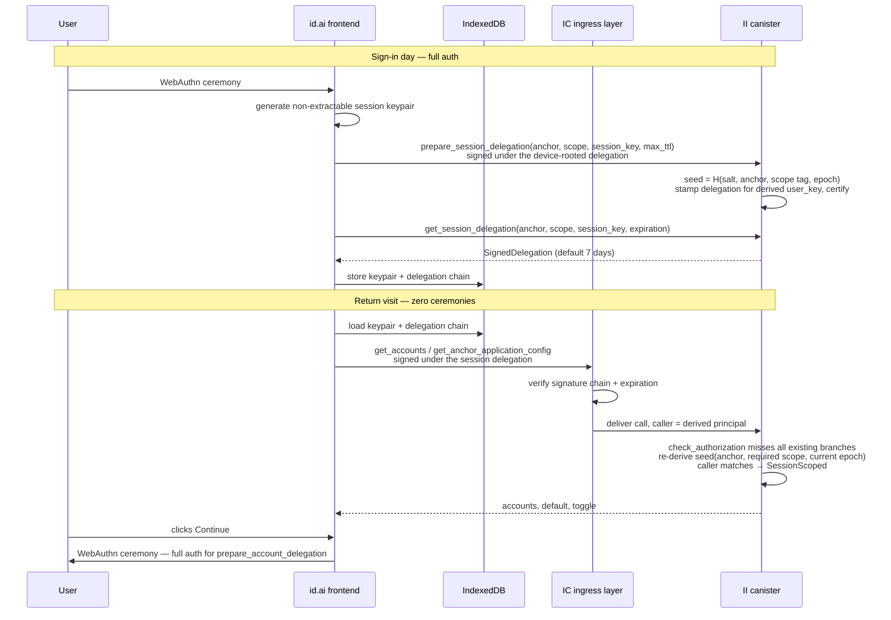

# Scoped session delegations for low-stakes II calls

**Date:** 2026-06-11

## TL;DR

Every canister call from `id.ai` rides on a device-rooted delegation capped at ~30 minutes (`DEFAULT_EXPIRATION_PERIOD_NS`), so a returning user pays a full WebAuthn ceremony just to _render_ low-stakes views — their accounts, their default, their preferences. The ceremony is the right price for `prepare_account_delegation` (it mints a principal a dapp will trust); it is the wrong price for reading a preference.

I propose **scoped session delegations**: II stamps a longer-lived delegation (default 7 days) for the browser's session keypair — not on the anchor's principal, but on a principal _derived_ from `(salt, anchor, scope, epoch)`. A new branch in the authorization path recognizes that derived principal by re-deriving it, exactly how email-recovery principals are recognized today (`check_authorization`, `src/internet_identity/src/authz_utils.rs`). Endpoints accept it only by explicitly opting into a named scope; the POC ships one scope (`account_management`) covering account reads, default selection, and the [multi-accounts toggle](./persist-multiple-accounts-toggle.md) — the first concrete consumer.

**Zero new storage.** No new stable map, no per-key rows, no cascade machinery — issuance reuses the existing `signature_map` flow (`prepare_account_delegation` / `get_account_delegation` shape), expiry is enforced by the IC ingress layer, and revocation is one additive `session_delegation_epoch` field on the anchor: bumping it changes every derived principal, instantly invalidating all outstanding session delegations for that anchor.

## Terminology

Several words this design needs are overloaded in the codebase:

| Term                           | What it means in the code                                                                                                                                                                                                                                                                                             | Usage in this doc                                                                                        |
| ------------------------------ | --------------------------------------------------------------------------------------------------------------------------------------------------------------------------------------------------------------------------------------------------------------------------------------------------------------------- | -------------------------------------------------------------------------------------------------------- |
| **Identity / anchor**          | The numbered user record — one `nat64` per "Internet Identity" (e.g. `10042`). Three aliases across API generations: Candid `UserNumber` (legacy), Rust `AnchorNumber`, V2 API `IdentityNumber`. The backend `Anchor` struct is that record: it owns the devices, OpenID credentials, and email-recovery credentials. | "anchor" — what a session delegation acts for.                                                           |
| **Device**                     | An _auth-method entry_ on the anchor — a registered public key (`DeviceKey = PublicKey`), **not** a physical machine. `KeyType`: `Platform` / `CrossPlatform` (passkeys), `SeedPhrase` (recovery phrase), `BrowserStorageKey`. One iCloud-synced passkey is one device entry usable from many machines.               | "device" or "auth method".                                                                               |
| **`identity` (frontend code)** | An agent-js `SignIdentity` — a keypair object that signs requests (`ECDSAKeyIdentity`, `DelegationIdentity`). Unrelated to the user-facing "identity", except that `identityNumber` _is_ the anchor number.                                                                                                           | Avoided — the doc says "keypair" or "signing identity".                                                  |
| **Browser profile**            | Invisible to the backend; origin-scoped storage (localStorage / IndexedDB) plus the WebAuthn client.                                                                                                                                                                                                                  | The _holder_ of a session delegation + keypair.                                                          |
| **`SessionKey`** (Candid)      | `type SessionKey = PublicKey` — the ephemeral target key a frontend submits to `prepare_delegation` / `prepare_account_delegation`.                                                                                                                                                                                   | Same meaning here: the new endpoints take a `SessionKey` exactly like the existing delegation endpoints. |
| **Account**                    | A per-`(anchor, dapp origin)` sub-identity (see the [multi-accounts toggle doc](./persist-multiple-accounts-toggle.md)).                                                                                                                                                                                              | Unchanged.                                                                                               |

## Why not just hold a longer delegation?

The protocol already allows delegations up to 30 days (`MAX_EXPIRATION_PERIOD_NS`), and the frontend could stash one in IndexedDB. The contrast is the motivation for this design:

|                                | 30-day stored delegation                                                    | Scoped session delegation                                                   |
| ------------------------------ | --------------------------------------------------------------------------- | --------------------------------------------------------------------------- |
| Power if stolen                | **Full anchor control** — add/remove devices, mint delegations for any dapp | Five metadata endpoints (reads + two config writes)                         |
| Revocable                      | No — bearer instrument                                                      | Yes, collectively — epoch bump kills all of an anchor's session delegations |
| Dies with removed auth methods | No                                                                          | Yes — any auth-method removal bumps the epoch                               |

A delegation on the anchor's principal is full authority; a delegation on a scope-derived principal is authority over exactly the endpoints that opt into that scope, retractable in one write.

## Goals

- A returning user sees the authorize screen — accounts, default, toggle — with **zero WebAuthn ceremonies** while their session delegation is valid.
- A stolen session delegation can do strictly bounded, reversible damage and is revocable.
- Endpoints are full-auth-only **by default**; acceptance is per-endpoint opt-in with a named scope.
- Zero new stable-memory structures; additive Candid and cbor only; maximal reuse of the existing delegation machinery.

## Non-goals

- Replacing dapp-facing delegations: `prepare_account_delegation` / `get_account_delegation` / `prepare_delegation` remain device-rooted, always.
- Per-browser session management (list / revoke one). Revocation is per-anchor, all-or-nothing. If an "active sessions" UI ever becomes a product goal, see [the stored-rows alternative](#alternative-stored-registered-session-keys).
- Cross-device key sharing — cross-device continuity comes from the _data_ being backend-side (per-anchor config and account state).

## How it works



### Seed derivation

```rust
/// Mirrors calculate_email_recovery_seed: H(salt ‖ length-prefixed
/// components). The scope tag is a fixed byte string per variant —
/// never derived from enum/display names, so renames can't silently
/// change principals.
fn session_delegation_seed(
    anchor_number: AnchorNumber,
    scope: SessionScope,        // tag: b"account_management"
    epoch: u32,
) -> Hash
```

One scope per delegation. A future second scope is a second derived principal and a second (cheap) prepare/get pair — no scope sets, no stored grants.

### Issuance

Two endpoints mirroring the `prepare_account_delegation` / `get_account_delegation` shape (`src/internet_identity/src/account_management.rs:299-384`): full `check_authorization`, TTL clamp (default 7 days, max 30 days), `add_delegation_signature` on the derived seed, `update_root_hash`; the query fetches the certified signature. Email-recovery-rooted callers are rejected at `prepare` — recovery sessions are transient by design and don't mint week-long credentials.

The delegation is stamped with `targets = None`, matching the account-delegation path; the derived principal carries no authority anywhere except this canister's authz branch.

### Authorization branch

`check_authorization` keeps its exact current shape and does **not** learn about session delegations — so every existing endpoint rejects session-scoped callers by construction. Opted-in endpoints call a new function:

```rust
pub enum CallerCapability {
    /// Device, OpenID, or email-recovery caller — full authority.
    FullAuth(Anchor, AuthorizationKey),
    /// Session-scoped caller — authority limited to the checked scope.
    SessionScoped(Anchor),
}

pub fn check_authorization_with_scope(
    anchor_number: AnchorNumber,
    required_scope: SessionScope,
) -> Result<CallerCapability, AuthorizationError>
```

1. Run the existing `check_authorization`. Success → `FullAuth`; full-auth callers pay nothing extra and are never downgraded.
2. Otherwise (salt-initialised guard, as in the email-recovery branch): derive `seed(anchor, required_scope, anchor.session_delegation_epoch())`, DER-encode the canister-sig key, compare `caller() == Principal::self_authenticating(public_key)`. Match → `SessionScoped`.
3. Otherwise → `AuthorizationError`, which endpoints map to their existing `Unauthorized` variants — no error-type churn.

Pure computation: one hash + DER encode against an anchor that's already loaded. **Expiry needs no canister logic at all** — the replica validates the delegation chain's expiration before the call ever reaches us. Scope isolation is principal isolation: the `account_management` principal grants nothing on any other scope, because other scopes derive other principals.

Session-scoped calls skip `activity_bookkeeping` entirely — no device `last_used` bumps, no DAU/MAU contribution (those metrics keep meaning "a person authenticated with a real auth method").

### Revocation: the epoch

One additive cbor field on `StorableAnchor`:

```rust
#[n(next)]
pub session_delegation_epoch: Option<u32>,   // None ⇒ 0
```

Bumping it changes every derived principal for the anchor; all outstanding session delegations fail authorization instantly (they remain replica-valid but match nothing). Bumps happen:

- **Automatically on any auth-method removal** — `remove`, `replace`, `openid_credential_remove`, email-recovery credential removal. Deliberately blunt: a user responding to "my device was stolen" by removing the device kills _all_ session delegations everywhere, which is the conservative outcome you want — and it's the entire cascade story, no per-root bookkeeping.
- **Explicitly** via `invalidate_session_delegations` (full auth, _including_ email-recovery — a recovering user must be able to kill sessions).

## Cardinality and issuance UX

- **Authorizes for the anchor; held per browser profile.** All browser profiles of an anchor share the same derived principal per scope — the canister cannot distinguish them (the price of storing nothing; see the alternative if that ever matters).
- **Issuance is automatic and silent**: a fire-and-forget side effect of every successful full authentication, replacing the previous chain in IndexedDB. Ceremonies re-mint, never stack. There is no extension — a stolen delegation cannot self-perpetuate; renewal always re-anchors at a real authenticator ceremony.
- **The user never selects a scope.** Scope is an API parameter chosen by the calling code, like `max_ttl` on `prepare_account_delegation`. The session delegation is strictly weaker than the device-rooted delegation the frontend holds at issuance time — the ceremony _is_ the consent. No picker, no prompt, no setting.

## Scoping

Scopes are named capability variants (a Candid/cbor enum), not numeric tiers (privilege creep by renumbering) and not per-method allowlists stored on grants (data that rots; policy belongs in code, where the set of call sites passing a scope _is_ the definition). The POC ships one variant.

**The scope rule:** a scope may contain only **non-destructive, non-allocating** operations. Reads and bounded config writes qualify; anything that creates rows, deletes anything, or mints authority does not — including future endpoints (if account deletion ever ships, it is full-auth by this rule, not by someone remembering).

### Endpoint opt-in and the default-deny rule

| Method                                                                                                                               | Authz after                  | Session-scoped?                                                   |
| ------------------------------------------------------------------------------------------------------------------------------------ | ---------------------------- | ----------------------------------------------------------------- |
| `get_accounts`, `get_default_account`                                                                                                | scoped, `account_management` | ✅                                                                |
| `get_anchor_application_config`, `set_anchor_application_config` _(see [multi-accounts doc](./persist-multiple-accounts-toggle.md))_ | scoped, `account_management` | ✅                                                                |
| `set_default_account`                                                                                                                | scoped, `account_management` | ✅                                                                |
| `create_account`, `update_account`                                                                                                   | unchanged                    | ❌ (allocate account rows; always adjacent to a full-auth moment) |
| `prepare_account_delegation`, `get_account_delegation`                                                                               | unchanged                    | ❌ (mint authority)                                               |
| everything else                                                                                                                      | unchanged                    | ❌ by construction                                                |

The two in-scope writes exist so the user can flip the toggle and pick a default _on the continue screen, before authenticating_ — exactly when no fresh delegation exists. Residual risk accepted: a stolen session delegation can repoint the default among the anchor's _existing_ accounts for an origin; the dapp-visible principal only changes at the next real sign-in, and the change is reversible.

## Candid surface

Additive only; reuses the existing `SessionKey`, `UserKey`, `Timestamp`, `SignedDelegation` types:

```candid
type SessionScope = variant { account_management };

type PreparedSessionDelegation = record {
    user_key : UserKey;
    expiration : Timestamp;
};

type SessionDelegationError = variant {
    Unauthorized : principal;
    NoSuchDelegation;
};

prepare_session_delegation : (IdentityNumber, SessionScope, SessionKey, opt nat64) ->
    (variant { Ok : PreparedSessionDelegation; Err : SessionDelegationError });

get_session_delegation : (IdentityNumber, SessionScope, SessionKey, Timestamp) ->
    (variant { Ok : SignedDelegation; Err : SessionDelegationError }) query;

invalidate_session_delegations : (IdentityNumber) ->
    (variant { Ok; Err : SessionDelegationError });
```

After the `.did` change: `npm run generate`.

## Frontend

- New util `src/frontend/src/lib/utils/authentication/sessionDelegation.ts` + store `src/frontend/src/lib/stores/session-delegation.store.ts`.
- Keypair: `ECDSAKeyIdentity.generate({ extractable: false })`; persist the `CryptoKeyPair` (structured-cloneable) plus the delegation chain (`DelegationChain.toJSON`) in IndexedDB via the existing `idb-keyval` dependency, one record per anchor: `{ identityNumber, keyPair, chainJson, scope, expiresAtMillis }`.
- `actorForScope(identityNumber)` resolution: (1) the `authenticationStore` actor while its device-rooted delegation is unexpired — full power, strictly better; (2) a cached actor over a second `HttpAgent` with `DelegationIdentity.fromDelegation(fromKeyPair(keyPair), chain)` if the stored chain is unexpired (local check with safety margin); (3) `undefined` — caller routes through the normal auth flow. A separate agent, not `replaceIdentity` on the shared one: the main agent's identity is load-bearing global state.
- **Mint** after every successful full auth (fire-and-forget; failure degrades to status quo). **Purge** on sign-out, identity removal, or any `Unauthorized` from a session-scoped call (epoch was bumped — whatever the reason, the chain is dead).

### `ContinueView.svelte` rewiring

1. `loadAccounts` (line 121–146) asks `actorForScope` instead of hard-requiring `$authenticationStore` — on a return visit the toggle, account list, and default render with zero ceremonies.
2. Toggle flips and default selection (lines 160–165, 213–218) go through the same resolved actor, so they work pre-auth.
3. _Continue_ (`prepare_account_delegation` via the ICRC-34 handler) and create/rename still route through `authLastUsedFlow.authenticate()` — the ceremony moves from "price of seeing the screen" to "price of signing in".
4. The [multi-accounts](./persist-multiple-accounts-toggle.md) identity-switch behavior is unchanged; the per-identity re-fetch just needs no ceremony when the switched-to anchor has its own stored chain.

## Failure modes

| Failure                                                   | Behaviour                                                                                 | Frontend recovery                                                                                                                |
| --------------------------------------------------------- | ----------------------------------------------------------------------------------------- | -------------------------------------------------------------------------------------------------------------------------------- |
| Chain expired                                             | Replica rejects the ingress message                                                       | FE pre-checks `expiresAtMillis` and routes to the auth flow instead of sending                                                   |
| Epoch bumped (invalidated, or an auth method was removed) | Endpoint returns its existing `Unauthorized`                                              | Purge IndexedDB record; retry with the device-rooted delegation if one is live; else defer the ceremony to the next user gesture |
| Epoch bumped between `prepare` and `get`                  | `NoSuchDelegation`                                                                        | Restart the prepare/get pair (still inside the full-auth moment)                                                                 |
| Out-of-scope endpoint called with session identity        | `Unauthorized` (default-deny)                                                             | FE wiring bug — log loudly, purge, full auth                                                                                     |
| Rollback to a pre-feature canister                        | Scoped endpoints reject session callers; `prepare_session_delegation` is method-not-found | Feature-detect at mint time; stored chains go inert, resume on roll-forward                                                      |

What always requires a ceremony (exhaustive): signing in (`prepare_account_delegation` / `get_account_delegation`), `create_account` / `update_account`, minting a session delegation, every non-opted endpoint — whenever no live device-rooted delegation exists. Rendering the authorize screen never does.

## Security and privacy

- **Worst case with a stolen live session identity** (e.g. XSS on `id.ai`): read account names/defaults/toggle for the anchor's origins, flip the toggle, repoint defaults among existing accounts. Cannot mint delegations, touch auth methods, read `identity_info`, create accounts, or extend itself. Bounded, reversible, revocable.
- The keypair is non-extractable; the chain alone is useless without it. An XSS can drive requests while it runs in the page — the same power it has over the live UI session — but exfiltrate nothing durable.
- **Rollback caveat**: an older wasm re-encoding an anchor drops the unknown epoch field, so a bumped epoch can reset to 0 during a rollback window — _invalidated-but-unexpired_ session delegations would resurrect until re-bumped. Accepted for the POC: rollbacks are rare and short, the scope is low-stakes, and the alternative (a dedicated memory region for one u32) buys little. Called out so the acceptance is explicit.
- The canister stores no secrets and no new linkage — one optional integer per anchor.

## Costs

Zero new stable-memory structures; the epoch costs ~6 bytes on anchors that ever bump it. Per full authentication, one extra prepare/get pair — the same signature-map machinery every dapp login already runs, plus the certified-signature query. No new costs at rest, no pruning, no cascade bookkeeping.

## Rollout

1. Backend: seed function, epoch field + bump hooks in the removal paths, `check_authorization_with_scope`, three endpoints, scoped switch of the five opted-in handlers. Inert until a client mints.
2. `npm run generate`.
3. Frontend: util + store + mint hook + `ContinueView` rewiring. Kill switch is frontend-side (stop minting/using); outstanding chains age out within `MAX_TTL`.

Lands ahead of (or alongside) [the multi-accounts toggle persistence](./persist-multiple-accounts-toggle.md) — that design depends on the `account_management` scope existing so its reads can be ceremony-free; without it, persisting the toggle is a UX regression.

## Future use cases and choosing the implementation

The first consumer of this primitive is the [multi-accounts toggle persistence](./persist-multiple-accounts-toggle.md), but the primitive is general. The set of features it unlocks splits cleanly along one axis: **does the feature need the canister to distinguish one browser from another?** The chosen derived-seed design handles everything that doesn't; the [stored-rows alternative](#alternative-stored-registered-session-keys) is what's needed for everything that does.

This section enumerates plausible future use cases on both sides of that line so the team can decide whether the chosen design is enough — and ship now — or whether the alternative's per-browser machinery is worth pulling forward.

### Use cases the chosen derived-seed design enables

These only need to read or write per-anchor state. The canister doesn't need to know which browser is asking — the session delegation just removes the fingerprint friction; the data is the same regardless of who's holding the weak paper.

| Use case                                                             | Why the chosen design is enough                                               |
| -------------------------------------------------------------------- | ----------------------------------------------------------------------------- |
| **Hide an account from a specific dapp**                             | Per-`(anchor, app)` config write, same shape as the multi-accounts toggle     |
| **Pinned / favorited dapps**                                         | Per-anchor list, capped                                                       |
| **Display-only account labels on id.ai**                             | Per-account string field; doesn't change seed/principal                       |
| **Notification-channel toggles**                                     | Per-anchor bits                                                               |
| **Per-anchor theme / language / accessibility**                      | Second scope (`user_prefs`) → second derived principal → zero extra storage   |
| **Cross-dapp account aggregator**                                    | Reads `get_accounts` / `get_default_account` across origins for the anchor    |
| **Recovery health check**                                            | Reads anchor metadata (device count, last passkey added)                      |
| **VC browsing**                                                      | Read-only over the anchor's issued credentials                                |
| **Pre-flight "what will this dapp see"** screen                      | Pure computation off anchor state                                             |
| **PWA / Service Worker background sync**                             | Each browser already has its own keypair locally; canister can stay oblivious |
| **Native mobile app "always signed in" feel**                        | Phone gets its own stored chain, looks like any other browser to II           |
| **Quick anchor switching**                                           | One IndexedDB record per anchor; chosen design supports many in parallel      |
| **Step-up auth pattern** (low-stakes browse vs. high-stakes sign-in) | This is the primitive itself                                                  |

### Use cases that work with both, but are richer under the alternative

| Use case                                                     | Chosen-design coverage                                                       | What the alternative additionally gives                      |
| ------------------------------------------------------------ | ---------------------------------------------------------------------------- | ------------------------------------------------------------ |
| **Activity log**                                             | Sign-in events (passkey-rooted, already tracked)                             | Per-session view counts, "last viewed by Chrome on macOS"    |
| **Third-party scopes for dapps**                             | Functionally complete — dapps can opt their endpoints into low-stakes scopes | Dapps gain a "your active sessions on opcoin.io" UI for free |
| **Security-event notifications** ("alert me on new sign-in") | Fires on passkey ceremonies                                                  | Fires on first session use from a new browser too            |

### Use cases that require the stored-rows alternative

These all need the canister to enumerate, distinguish, or surgically operate on individual sessions. None of them are possible by re-derivation alone — the canister has to know about each session.

| Use case                                                                                   | Why the chosen design can't do it                                                  |
| ------------------------------------------------------------------------------------------ | ---------------------------------------------------------------------------------- |
| **"Manage your sessions" UI** (list active browsers)                                       | Canister stores no list to render                                                  |
| **"Sign out this Chrome only"**                                                            | Revocation is per-anchor; epoch bump kills everything                              |
| **"Sign out everywhere _except_ this device"**                                             | No way to preserve one                                                             |
| **"Last used 3 hours ago from Safari on iPhone"**                                          | No `last_used`, no per-session metadata                                            |
| **Surgical cascade on passkey removal** (kill only sessions minted by the removed passkey) | Chosen design's cascade is blunt — every removal kills every session of the anchor |
| **Per-browser binding** ("this session locked to its User-Agent")                          | No metadata to bind against                                                        |
| **Push-notification subscriptions per browser**                                            | Subscription endpoint is per-browser — needs a row to attach to                    |
| **Trusted-devices list** (the Apple / Google staple)                                       | Same shape as the session list                                                     |

### How to read the split

The chosen design covers the **settings & dashboards** category — most of the user-facing parity gap with mainstream identity providers (Google / Apple / Microsoft). The features that fall on the wrong side of the line are specifically the **device-management** category: a coherent product wave that needs its own data model.

The recommendation embedded in this doc is **ship the chosen design now**, because:

1. It unlocks the categories with the most immediate user value, at essentially zero storage cost.
2. The migration to the alternative is contained — only the recognition branch in `check_authorization_with_scope` swaps from `derive → lookup`; call sites and the Candid surface don't change.
3. The alternative can land later, when device-management UX has a product owner asking for it.

If the team instead prefers to pay the storage and lifecycle cost upfront to unlock the device-management features sooner, that's the explicit call to make in this discussion. The two options are not "this design or no session delegations" — they are "ship the cheap one now and migrate later" vs. "do the richer one up front."

## Alternative: stored registered session keys

The richer variant we considered: the frontend registers a session _public key_ with the canister, stored as `(anchor, principal) → { scopes, expiry, rooting auth method, last_used }` in a new stable map, checked by lookup instead of derivation.

What the rows buy: **per-browser granularity** — list sessions ("Chrome on macOS, expires in 5 days"), revoke one, `last_used` timestamps, per-origin binding, and per-root cascade precision (removing one passkey kills only _its_ sessions instead of all). What they cost: a new memory region, per-row lifecycle code (cap, amortized pruning, cascade hooks on every removal path — including any future anchor deletion), registration/revocation/listing endpoints, and archive entries for register/revoke. Storage itself is a non-argument (~200 B/row ≈ ~$1/year at realistic scale) — the cost is the machinery.

Since the POC needs none of the granularity, the derived-seed design wins on every axis that currently matters. **Adopt the stored-rows variant if an active-sessions management UI becomes a product goal** — the migration is contained, because the opted-in endpoints' call sites don't change: only the recognition branch inside `check_authorization_with_scope` swaps from derivation to lookup.

Also rejected: generalizing `temp_keys` (heap state dies on weekly upgrades, and a temp key carries _device-equivalent_ power — the opposite of scoping down); canister-issued capability tokens passed as arguments (a second auth channel parallel to the caller-principal model, with bespoke replay semantics to get wrong).

## Testing

- **Unit**: seed stability fixtures (fixed inputs → fixed seed; scope tags and epochs produce distinct seeds); `check_authorization_with_scope` full-auth precedence, derived-principal match, epoch-bump miss; TTL clamp and default; email-recovery-rooted `prepare` rejected; removal paths bump the epoch.
- **PocketIC**: mint with a device-rooted caller → call `get_accounts` under the session identity → `Ok`; same identity against `create_account` → `Unauthorized`; remove a device → all session calls `Unauthorized`; `invalidate_session_delegations` ditto; upgrade with a live chain → still valid; time travel past expiration → replica rejects.
- **Playwright**: enable toggle, reload (in-memory delegation gone) → toggle and accounts render with no WebAuthn prompt, ceremony fires only on _Continue_; clear IndexedDB, reload → ceremony required to render; two anchors in one browser render independently ceremony-free.

## Open questions

- **Will we ever want per-browser session visibility / revocation?** That's the trigger to switch to the stored-rows alternative — worth a product answer before this hardens.
- Should session-scoped reads count toward any usage metric (separate from DAU/MAU)?
- Exact set of epoch-bump triggers: all auth-method removals is the proposal — confirm email-recovery credential removal belongs in the list.
- Per-origin scopes later (origin folded into the seed) if a finer blast radius is ever wanted.
